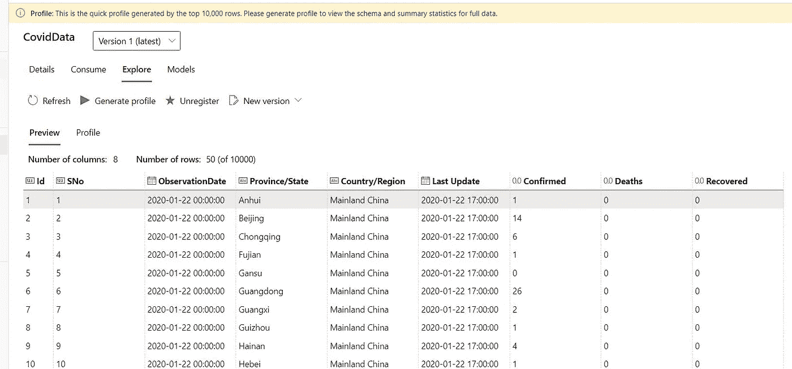
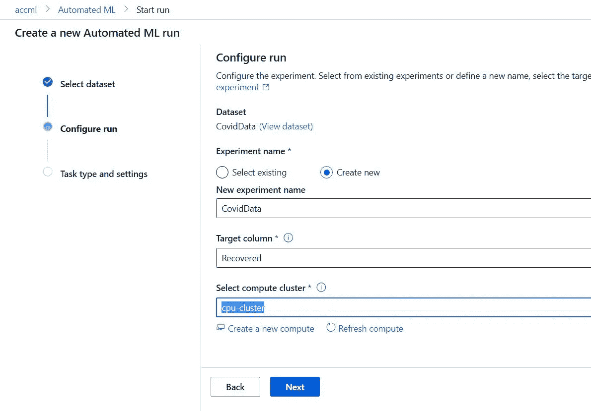
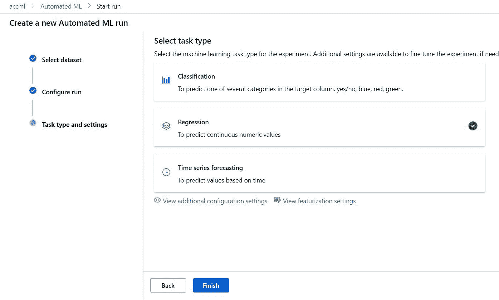
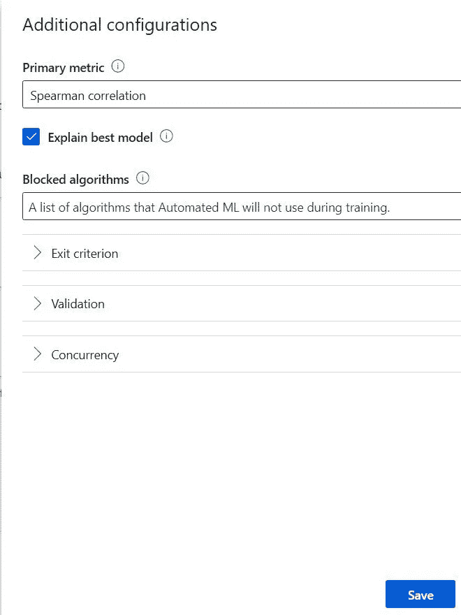
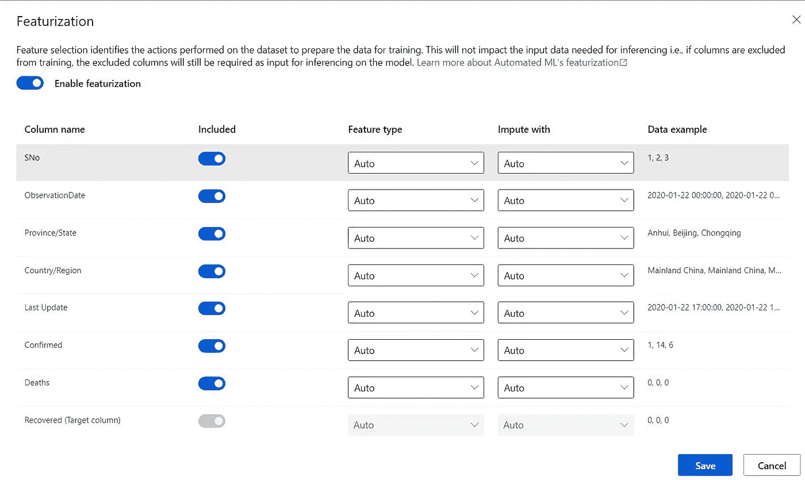
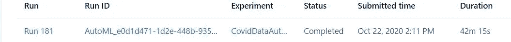
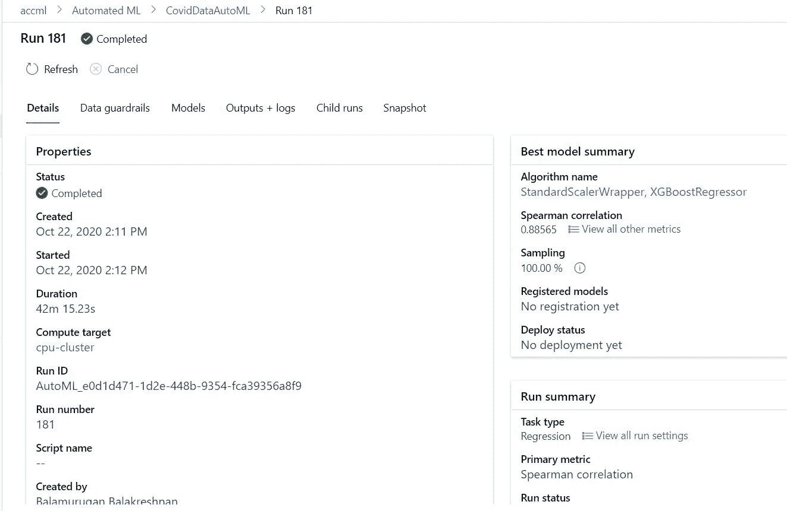
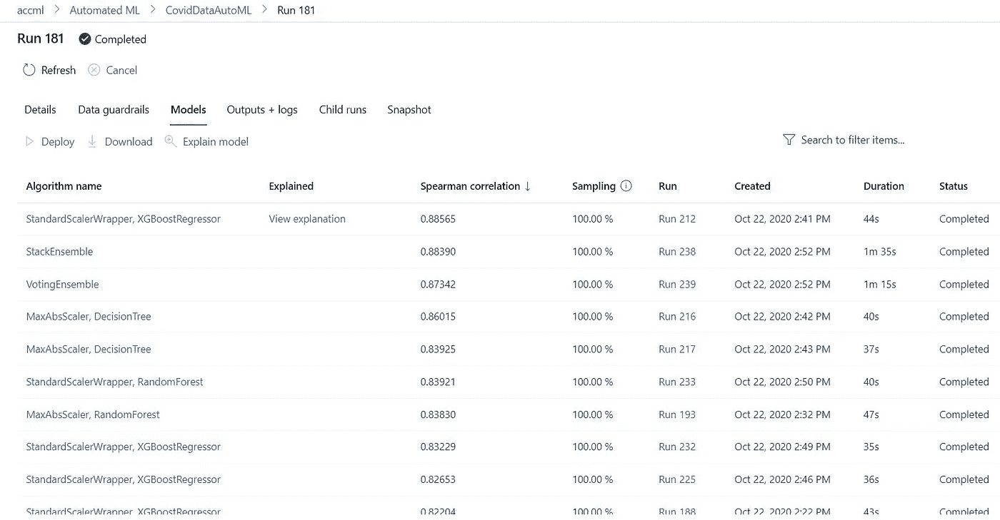
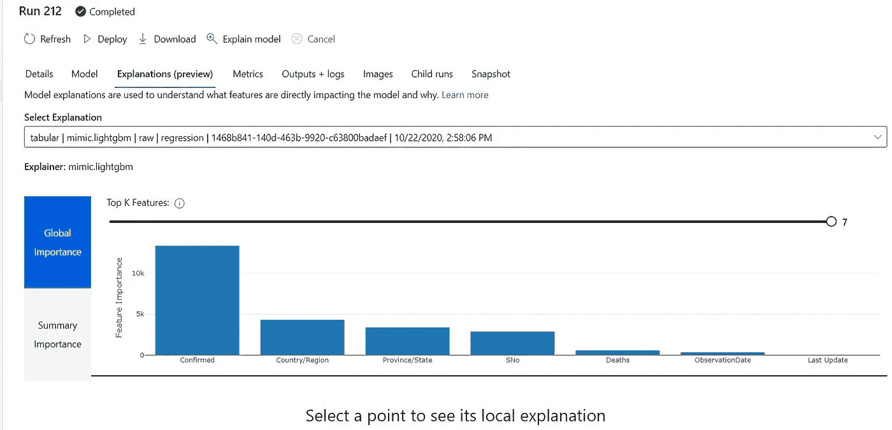
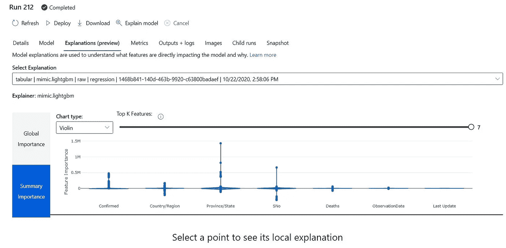

# 使用自动化 ML 的 Covid 19 数据科学

> 原文：<https://medium.com/analytics-vidhya/covid-19-data-science-using-automated-ml-9320a9786e6a?source=collection_archive---------35----------------------->

# 用例

使用 Azure 自动机器学习预测回收率的能力。我们的想法是提高数据科学的生产力，使其能够计算出哪种算法能产生最好的结果。

先决条件

*   Azure 订阅
*   创建资源组
*   创建 Azure 机器学习服务
*   创建计算集群
*   从 Kaggle 网站找到数据集
*   以下是数据集链接—[https://www . ka ggle . com/sudalairajkumar/novel-corona-virus-2019-dataset？select=covid_19_data.csv](https://www.kaggle.com/sudalairajkumar/novel-corona-virus-2019-dataset?select=covid_19_data.csv)
*   如果你很难找到我上传到这个回购样本的数据
*   [https://github . com/balakreshnan/mlops/blob/master/automl/covid _ 19 _ data . CSV](https://github.com/balakreshnan/mlops/blob/master/automl/covid_19_data.csv)
*   从本地数据存储创建新数据集，并上传到 azure 机器学习服务
*   一旦上传应该可以探索和看到下面

# 模型建立过程

*   转到左侧屏幕中的自动 ML
*   创造新的实验

*   创建一个新实验，名称为“CovidData”
*   选择目标列为“已恢复”
*   选择一个计算群集或创建一个新的计算群集来使用
*   我选择了——标准 DS14 V2(16 个内核，112 GB 内存，224 GB 磁盘)
*   单击下一步
*   在此选择回归。因为我们预测的是一个连续变量，所以我选择回归

*   将其他设置保留为默认设置
*   查看其他配置设置

*   配置有助于配置模型运行、验证和退出标准
*   计算特征影响的特征化
*   现在点击完成
*   通常用 8MB 的数据集运行这个模型需要很长时间

*   转到实验并等待实验运行
*   实验将运行 Scikit 库中的大部分算法
*   完成后，进入运行配置

*   正如你可以看到它运行的模型列表，它的准确性和所用的时间
*   该页面只显示几页，请随意点击下一页查看其他页面
*   每次算法运行都有自己的运行
*   单击运行以查看该模型的输出/日志
*   对于最佳模型，您应该查看视图说明
*   点击查看解释
*   查看功能及其影响

*   以上是基于它所执行的模型
*   如果您对模型性能满意，那么您可以部署
*   如果需要更多解释，请单击解释模型并让它运行
*   要部署模型，请单击 deploy，并按照流程在 AKS 中部署为 API 端点
*   系统将创建模型映像并将模型部署为 rest api。
*   还会有更多

【https://github.com】最初发表于**。**