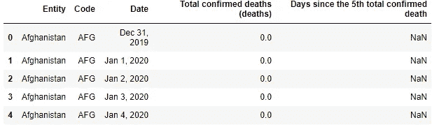
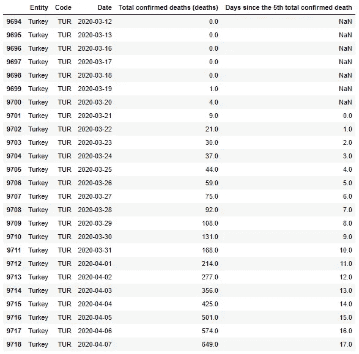

# 新冠肺炎死亡计数动画

> 原文：<https://medium.com/analytics-vidhya/covid-19-death-count-animation-d3e19c16e332?source=collection_archive---------24----------------------->

这本书指导你使用 Python 库制作每日冠状病毒死亡人数的动画。

我们使用的数据集可以从下面的链接下载:

[https://ourworldindata . org/grapher/covid-confirmed-deaths-since-5-death](https://ourworldindata.org/grapher/covid-confirmed-deaths-since-5th-death)

```
import pandas as pd
import numpy as np
import matplotlib.pyplot as plt
import seaborn as sns
sns.set(style="darkgrid",palette="tab10")
# plt.style.use("seaborn-pastel")
import warnings
warnings.filterwarnings("ignore")%matplotlib widget
```

数据表在。逗号分隔值（csv）文件格式

```
df=pd.read_csv("covid-confirmed-deaths-since-5th-death.csv")
df.head()
```



行数将每天增加，截至今天(2020 年 4 月 8 日)已有 10，803 行。该表有 5 列:

*   **实体**:国家名称
*   **代码**:国家代码
*   **日期**:日
*   **总确认死亡人数**:总死亡人数
*   **自第 5 例总确诊死亡后的天数**:该特定国家自第 5 例死亡后经过的天数

```
df.Date **=** pd.to_datetime(df.Date)df.info()<class 'pandas.core.frame.DataFrame'>
RangeIndex: 10803 entries, 0 to 10802
Data columns (total 5 columns):
 #   Column                                    Non-Null Count  Dtype         
---  ------                                    --------------  -----         
 0   Entity                                    10803 non-null  object        
 1   Code                                      9346 non-null   object        
 2   Date                                      10803 non-null  datetime64[ns]
 3   Total confirmed deaths (deaths)           10795 non-null  float64       
 4   Days since the 5th total confirmed death  2159 non-null   float64       
dtypes: datetime64[ns](1), float64(2), object(2)
memory usage: 422.1+ KB
```

让我们检索一个国家的数据，看看它是什么样子:

```
df[df.Entity **==** "Turkey"]
```



# 动画

让我们制作一个动画，它输出一个 **gif** 文件，该文件也显示了笔记本内的动画。首先，我们需要从数据中剔除非国家条目。数据集不仅有国家，还有地区，如“亚洲”、“欧洲”等。

```
import pycountrydata_all =  pd.pivot_table(values="Total confirmed deaths (deaths)",index="Date",columns="Entity", data=df)is_country = dict()
for cd in data_all:
    try:
        is_country[cd] = pycountry.countries.get(name=cd).alpha_3
    except:
        data_all.drop(cd,axis=1,inplace=True)
```

选择要绘制的前 10 个死亡人数国家(默认，下面最后一行)，或列出要制作动画的国家

```
# selected = ['Italy', 'Spain', 'United States', 'France', 'United Kingdom', 'China']
# selected = ['France','Belgium', 'Germany', 'Turkey']
selected = data_all.iloc[-1,:].sort_values(ascending=False)[:10].index
```

基于选择修剪数据。我们还将在日期之间插入数据点，以获得平滑的动画。插值数据将是每小时**计数(使用线性插值)**

```
data = data_all[selected].round()
data = data[data.sum(axis=1)>0]
data.replace(0,np.nan,inplace=True)#interpolation
data = data.resample("1H").interpolate(method="linear")
```

导入创建动画和保存动画所需的包，并启动情节及其元素(线、条、文本等)。)

```
from matplotlib.animation import FuncAnimation, FFMpegWriterfig,(ax,ax2) = plt.subplots(1,2,figsize=(15,7))
fig.subplots_adjust(wspace=0.3,bottom=0.2)
no_of_frames = data.shape[0] #Number of frames#initiate the barplot with the first rows of the dataframe
#BARPLOT
bars = sns.barplot(y=data.columns,x=data.iloc[0,:],orient="h",ax=ax)
ax.set_xlim(0,30000)
txts = [ax.text(0,i,0,va="center") for i in range(data.shape[1])]
title_txt = ax.text(10000,-1,"Date: ")
ax.set_xlabel("Death Count")
ax.set_ylabel(None)#LINEPLOT
lines = ax2.plot(data.iloc[:1,:])
xdata,ydata = [],[]
ax2.set_ylabel("Death Count (log)")
ax2.set_yscale("log")
ax2.set_ylim(-0.1,30000) #ylim has to be declared after defining log scale
ax2.set_xlim(data.index[0].date(),data.index[-1].date())#LINEPLOT texts
txts_line = [ax2.text(0,0,data.columns[i],va="center") for i in range(data.shape[1])]
```

定义生成每一帧时将被调用的动画函数

```
def animate(i):
    ax2.set_xticklabels(ax2.get_xticklabels(),rotation=45)

    #get i'th row of data 
    y = data.iloc[i,:]

    #update title of the barplot axis
    title_txt.set_text(f"Date: {str(data.index[i].date())}")

    #update elements in both plots
    for j, b, in enumerate(bars.patches):
        #update each bar's height
        b.set_width(y[j])

        #update text for each bar (optional)
        txts[j].set_text((y[j].astype(int)))
        txts[j].set_x(y[j])

        #update lines
        lines[j].set_ydata(data.iloc[:i,j])
        lines[j].set_xdata(data.index[:i])

        #update line texts
        txts_line[j].set_text(data.columns[j])
        txts_line[j].set_x(data.index[i])
        txts_line[j].set_y(y[j])
```

以所需的帧数和延迟(单位为毫秒)运行动画功能

```
anim=FuncAnimation(fig,animate,repeat=False,frames=no_of_frames,interval=1,blit=False)
plt.show()
```

最后保存动画，有很多选项可以选择比如 mp4，gif 等。

```
import time
import warnings
warnings.filterwarnings("ignore")
t1 = time.time()
print("Rendering started...")#save the animation with desired frames per second 
# smoothness of the video depends on the number of datapoints and fps, the interval parameter above does not affect the video
anim.save('covid_movie.mp4',writer=FFMpegWriter(fps=35))# #save the animation in gif format
# anim.save("covid_gif.gif",writer="pillow",bitrate=5)print(f"Saving of {no_of_frames} frames Took {time.time()-t1} seconds")
```

或者，你可以用**赛璐珞**包制作动画。它有一个非常简单的 API，易于实现；但是，制作动画和创建输出文件需要更长的时间

```
from celluloid import Camera
fig = plt.figure(figsize=(12,5))
fig.subplots_adjust(wspace=0.4,bottom=0.2)
ax = fig.add_subplot(121)
ax.set_yscale("log")
ax.set_ylabel("Death Count")
ax2 = fig.add_subplot(122)
ax2.set_xlabel("Death Count")camera = Camera(fig)
for j,day in enumerate(data.index):
    print("{0}".format(day),end="\r")
    sns.barplot(x=data.iloc[j,:].values,y=data.columns,orient="h",ax=ax2)
    for i,coun in enumerate(data.columns):
        data[coun].loc[:day].plot(ax=ax,legend=False)
        ax.text(day,data[coun].loc[day],coun,va="center")
        try:
            count = int(data[coun][day])
        except:
            count = data[coun][day]  
        ax2.text(count+1,i,count,va="center")
    ax2.set_ylabel(None)
    ax2.text(0.35,1.03,f"Date: {day.date()}",fontsize=12,transform=ax2.transAxes)
    camera.snap()anim = camera.animate(interval=50)
anim.save("Death Count per Country.gif",writer="pillow")
```