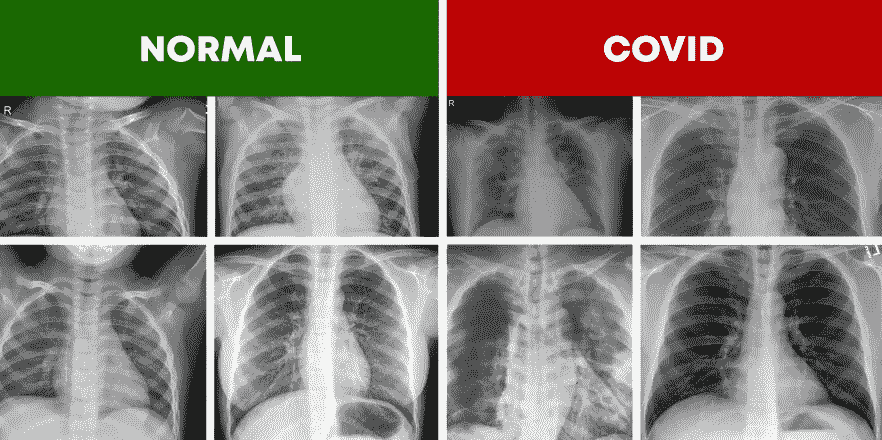
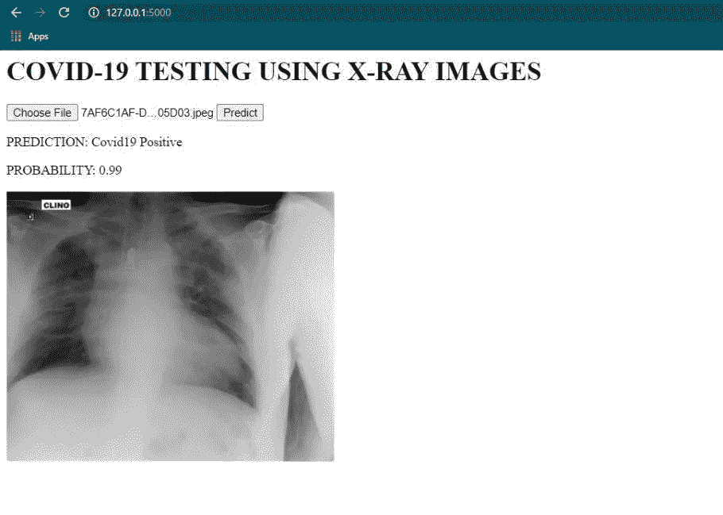
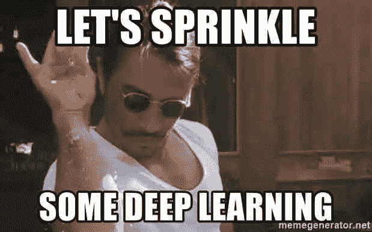
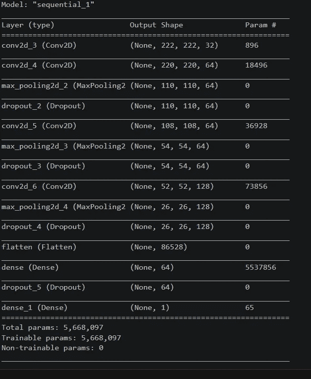
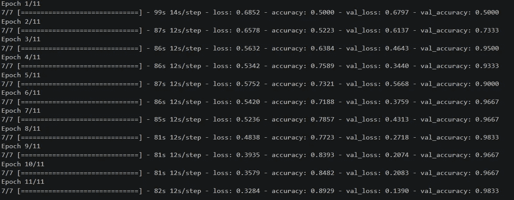

# 使用 Keras 和深度学习从胸部 X 射线图像中获取新冠肺炎探测器烧瓶应用程序

> 原文：<https://medium.com/analytics-vidhya/covid-19-detector-flask-app-from-chest-x-ray-images-with-keras-and-deep-learning-fea33baaefdf?source=collection_archive---------7----------------------->



# 在这篇博客中，您将学习如何使用 Keras、TensorFlow 和深度学习在手工创建的 X 射线图像数据集中**检测新冠肺炎**，并使用我们自己的 Flask 制作相同的 web 应用程序！

这是您的 web 应用程序的外观…



带有 Flask 的新冠肺炎探测器 web 应用程序的屏幕截图

## 在今天的博客中，我们将学习如何:

1.  **为**检测阳性**和**正常**的患者 **X 射线图像**下载**开源数据集**新冠肺炎**(链接会提到)
2.  **预处理**并创建一个单独的“数据集”文件夹，其中包含过滤出的“正常”和“Covid”X 射线图像，以备将来使用。
3.  **构建 CNN** 通过我们创建的数据集自动检测 X 射线图像中的新冠肺炎。
4.  **训练**我们的 CNN，看**测试/验证数据**上的**精度**。
5.  创建 Flask Web 应用程序。

> **注**:本博客及提供的相关资源仅用于教育目的，并不声称任何真实的诊断性能。所以，如果你想从教育的角度来阅读，请继续阅读！

# 好吧！所以让我们开始吧！

## 步骤 1-从以下链接下载数据集:

*   包含 Covid19 阳性 X 射线图像的数据集

[](https://github.com/ieee8023/covid-chestxray-dataset) [## IEEE 8023/covid-chest Xray-dataset

### 🛑注意:请不要声称没有临床研究的模型的诊断性能！这不是一个 kaggle…

github.com](https://github.com/ieee8023/covid-chestxray-dataset) 

*   包含 Covid19 负 X 射线图像的数据集

[](https://www.kaggle.com/paultimothymooney/chest-xray-pneumonia) [## 胸部 x 光图像(肺炎)

### 5，863 张图片，2 个类别

www.kaggle.com](https://www.kaggle.com/paultimothymooney/chest-xray-pneumonia) 

## 第 2 步-数据预处理:

现在，我们已经下载了所需的数据集，我们需要预处理我们的数据，以过滤出“Covid”和“正常”情况，放入我们新的预处理“数据集”文件夹中。

导入必要的库并为 covid 阳性数据集的文件和图像添加明确的路径-

```
**import** pandas **as** pd
**import** os
**import** shutil*# create a data for the covid +ve samples (ieee real world dataset)*

FILE_PATH **=** "covid-chestxray-dataset-master/metadata.csv"
IMAGES_PATH **=** "covid-chestxray-dataset-master/images"
```

加载数据集并检查其形状-

```
df **=** pd**.**read_csv(FILE_PATH)
print(df**.**shape)#o/p - (930, 29)
```

创建目标目录“数据集”以过滤出并存储 covid 阳性图像数据为“Covid”

```
TARGET_DIR **=** "Dataset/Covid"

**if** **not** os**.**path**.**exists(TARGET_DIR):
    os**.**mkdir(TARGET_DIR)
    print("Covid folder created")
```

将所有新冠肺炎阳性图像从下载的数据集中复制到我们自己的目标目录“数据集”的“covid”文件夹中-

```
cnt **=** 0

**for** (i,row) **in** df**.**iterrows(): 
    **if** row["finding"] **==** "COVID-19" **and** row["view"]**==**"PA":
        filename **=** row["filename"]
        image_path **=** os**.**path**.**join(IMAGES_PATH,filename)
        image_copy_path **=** os**.**path**.**join(TARGET_DIR)
        shutil**.**copy2(image_path,image_copy_path)
        print('Moving image', cnt)

        cnt **+=** 1
print(cnt)
```

Kaggle 正常/ Covid19 阴性数据集的图像采样-

```
*# sampling of images from the kaggle dataset (normal and pneumonia patients)*

**import** random
KAGGLE_FILE_PATH **=** "chest_xray/train/NORMAL"
TARGET_NORMAL_DIR **=** "Dataset/Normal"
```

将下载的 Kaggle 数据集中的所有新冠肺炎阴性(正常)图像复制到我们自己的目标目录“正常”文件夹下的“数据集”中-

```
**for** i **in** range(180):

    image_name **=** image_names[i]
    image_path **=** os**.**path**.**join(KAGGLE_FILE_PATH,image_name)

    target_path **=** os**.**path**.**join(TARGET_NORMAL_DIR, image_name)

    shutil**.**copy2(image_path, target_path)

    print("Copying image ",i)image_names **=** os**.**listdir(KAGGLE_FILE_PATH)
```

# 耶！

我们已经完成了数据预处理任务，现在您已经有了一个“数据集”文件夹，其中包含所有经过过滤的“Covid”和“正常”图像数据！

## 步骤 3-使用 Keras 构建 CNN 模型，通过我们创建的数据集自动检测 X 射线图像中的新冠肺炎:



首先，我们将把各自的路径分配给我们的训练和验证集(已经由 Kaggle 提供),并导入必要的模型

```
TRAIN_PATH **=** "CovidDataset/Train"
VAL_PATH **=** "CovidDataset/Val"**import** numpy **as** np
**import** matplotlib.pyplot **as** plt
**import** keras
**from**  keras.layers **import** *****
**from** keras.models **import** *****
**from** keras.preprocessing **import** image
```

(在这里，我创建了一个单独的‘covid dataset’文件夹，在其中复制了 Train 和 Val 集合，以便于区分和调用。)

现在，我们将使用 Keras 构建我们的模型。我们将建立一个卷积神经网络来解决我们的目的-

```
*# Building the Convolutional Neural Network with Keras*
model **=** Sequential()
model**.**add(Conv2D(32,kernel_size**=**(3,3),activation**=**'relu',input_shape **=**(224,224,3)))

model**.**add(Conv2D(64,(3,3), activation **=** 'relu'))
model**.**add(MaxPooling2D(pool_size**=**(2,2)))
model**.**add(Dropout(0.25))

model**.**add(Conv2D(64,(3,3),activation **=** 'relu'))
model**.**add(MaxPooling2D(pool_size**=**(2,2)))
model**.**add(Dropout(0.25))

model**.**add(Conv2D(128,(3,3), activation**=**'relu'))
model**.**add(MaxPooling2D(pool_size**=**(2,2)))
model**.**add(Dropout(0.25))

model**.**add(Flatten())
model**.**add(Dense(64, activation**=**'relu'))
model**.**add(Dropout(0.5))
model**.**add(Dense(1,activation**=**'sigmoid'))

model**.**compile(loss **=** keras**.**losses**.**binary_crossentropy, optimizer**=**'adam',metrics **=** ['accuracy'])
```

现在，我们将打印出模型的摘要报告，或者基本上是模型架构摘要-

```
*#print out the architectural summary of the model*
model**.**summary()
```



> 万岁！我们的 CNN 模特已经准备好接受训练了！

## 步骤 4-训练 CNN 模型

```
*# Let's do the training !*
train_data_gen **=** image**.**ImageDataGenerator(

    rescale **=** 1.**/**255,
    shear_range **=** 0.2,
    zoom_range **=** 0.2,
    horizontal_flip **=** **True**,
)

test_dataset **=** image**.**ImageDataGenerator(rescale**=**1.**/**255)train_generator **=** train_data_gen**.**flow_from_directory(
    'CovidDataset/CovidDataset/Train',
    target_size **=** (224,224),
    batch_size **=** 32,
    class_mode **=** 'binary')validation_generator **=** test_dataset**.**flow_from_directory(
    'CovidDataset/CovidDataset/Val',
    target_size **=** (224,224),
    batch_size **=** 32,
    class_mode **=** 'binary'
)hist **=** model**.**fit_generator(
    train_generator,
    steps_per_epoch **=** 7,
    epochs **=** 11,
    validation_data **=** validation_generator,
    validation_steps **=** 2
)
```

在我成功执行这个之后，我在第 11 个纪元得到了 98.33% 的**测试精度。**



听起来很棒，对吧？！

## 耶！

## 现在让我们专注于创建我们的 Flask 应用程序！

对于 Flask web 应用程序，创建一个名为“Webapp”的单独目录，并创建以下内容

1.  一个“**模板**文件夹，其中将包含 index.html 文件。
2.  一个“**模特**文件夹，里面会有你训练过的 CNN 模特。
3.  一个' **app.py** ' (python)文件将包含我们的 web 应用程序的 flask 代码。

## 步骤 5- Flask Web 应用程序代码和 index.html 文件

您的新冠肺炎检测器 WEB 应用程序已经准备好了！！

完整的代码可以在我的 GitHub repo 上找到。:)

希望你喜欢这篇博文并从中得到乐趣！

> 免责声明- **请记住，本博客中涉及的新冠肺炎探测器仅用于*教育目的。*** 我的目标是激励深度学习的实践者，比如我自己，你，并睁开你的眼睛，看看深度学习和计算机视觉如何能够对世界产生*大影响*。

快乐深度学习！

直到下次..！