# 来自对数变换的新冠肺炎早期信号

> 原文：<https://medium.com/analytics-vidhya/covid-19-early-signals-c2f40ad48c6f?source=collection_archive---------31----------------------->

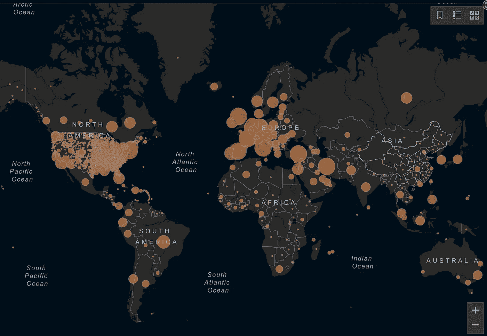

[https://coronavirus.jhu.edu/map.html](https://coronavirus.jhu.edu/map.html)**更新时间:2020 年 4 月 6 日** **下午 4:31:08**

整个世界都在与一个共同的敌人作战。我们都知道我在说什么。最初病例的痕迹可以追溯到 2019 年 11 月，然而，在那段时间里，世界照常忙于业务，而不知道我们今天面临的是什么。

截至今天(2020 年 4 月 6 日)，已有**~ 128 万**确诊电晕病例，同时已观察到 **~69** 千例死亡，而世界上几乎每个国家都有感染病例。(来源:[约翰·霍普斯金科伦病毒资源中心](https://coronavirus.jhu.edu/map.html))

 [## 新冠肺炎地图

### 约翰霍普金斯大学系统科学与工程中心(CSSE)的冠状病毒新冠肺炎全球病例…

coronavirus.jhu.edu](https://coronavirus.jhu.edu/map.html) 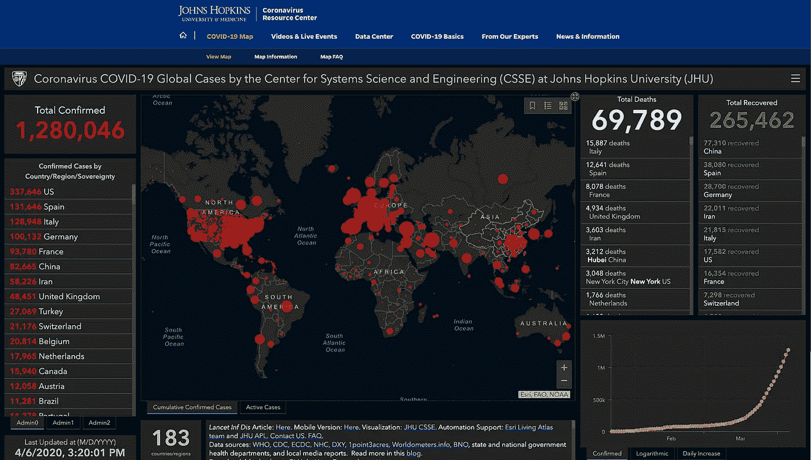

(来源:[https://coronavirus.jhu.edu/map.html](https://coronavirus.jhu.edu/map.html))

通过分析 ka ggle([https://www.kaggle.com/covid19](https://www.kaggle.com/covid19))上分享的数据，我提出了一些早期预警，这些预警来自已经感染的国家。尽管像印度、新加坡这样的国家采取了严格而快速的行动，甚至更早的基于像意大利、西班牙这样的国家发出的信号的行动，今天可能会呈现出更加可控的局面。

# **确诊病例和死亡病例**

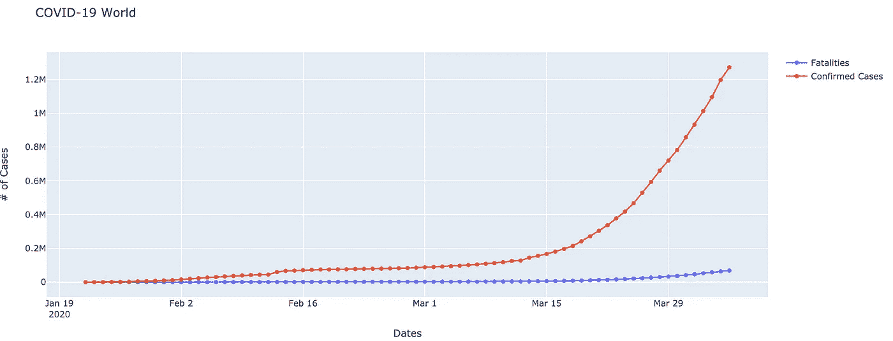

世界电晕案例

我们大多数人都在某个地方见过这个情节。如果我们看看其他国家的确诊病例和死亡人数，它们看起来都很相似。

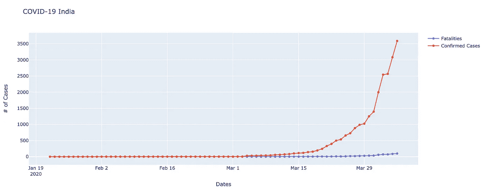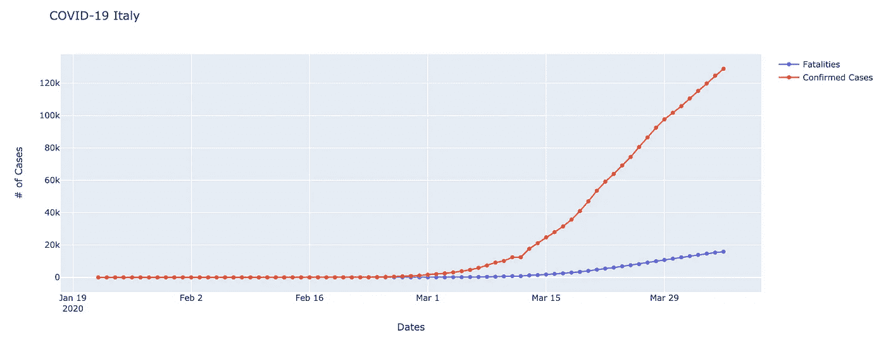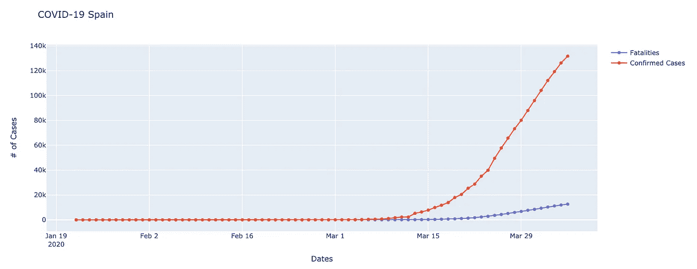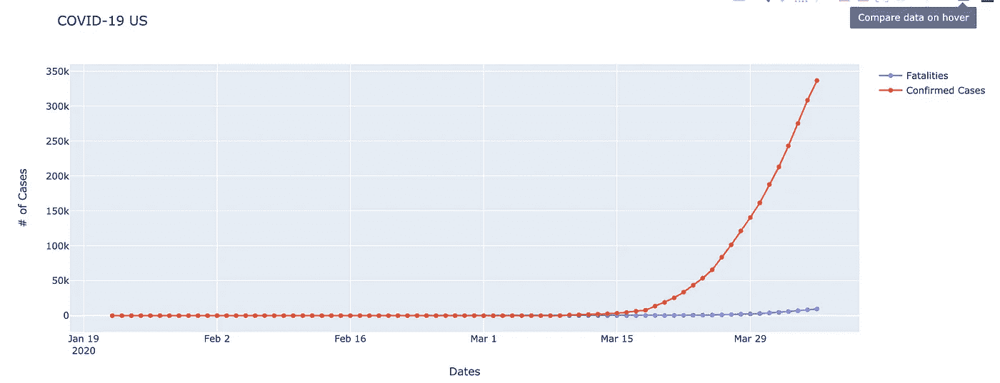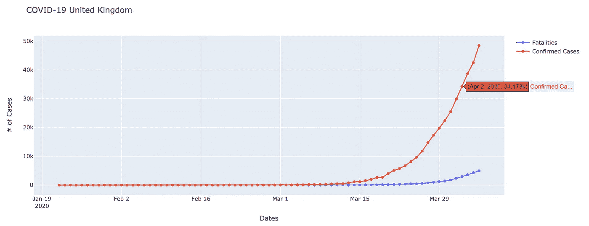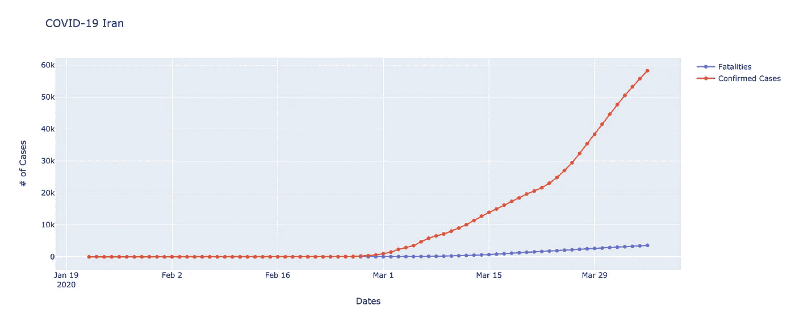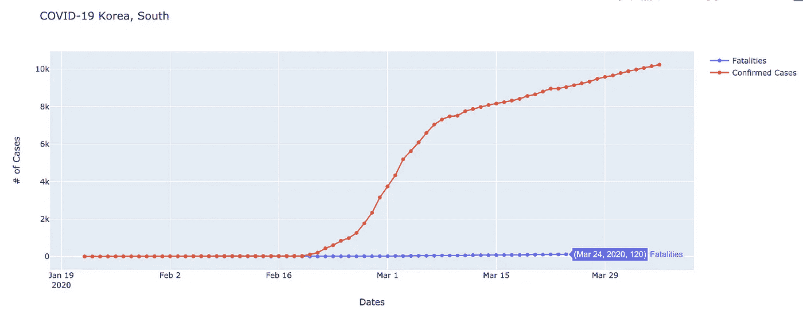

这些图表显示了每个国家感染人数的指数增长。让我们看看数据的对数转换

# **对数变换**

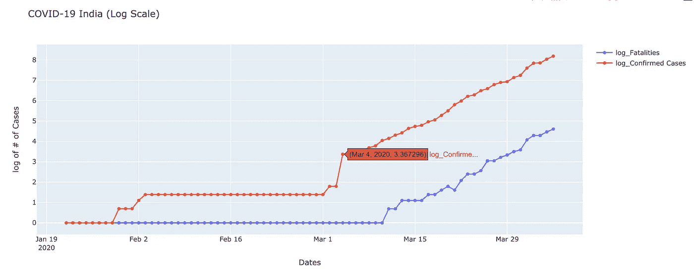

看以上情节，我建议印度早在 2020 年 3 月 4 日就该行动了。3 月 4 日之后我们可以看到一个线性上升的曲线。显然，有人可能会说，在 3 月 4 日，谁知道未来会发生什么。为了获得信号，让我们看看在印度开始之前，疫情开始的其他国家的类似情况。

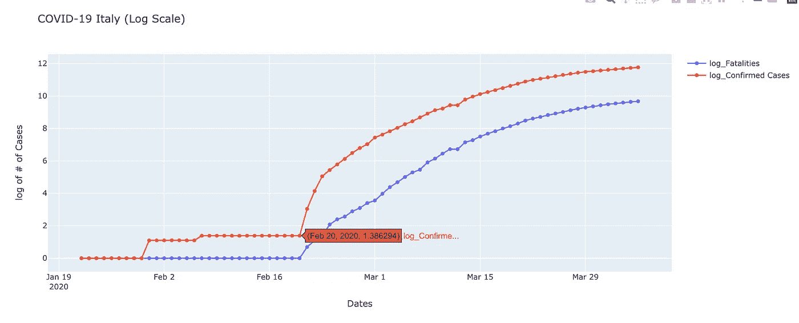

意大利

上面的对数转换图描绘了与印度目前观察到的模式相似的模式。2 月 20 日之后，意大利发现感染病例呈指数增长。不仅是意大利，几乎每个国家(除了中国)都观察到同样的模式，在第二次削减后，病例数呈指数增长。(指数增长在对数标度中显示线性)。

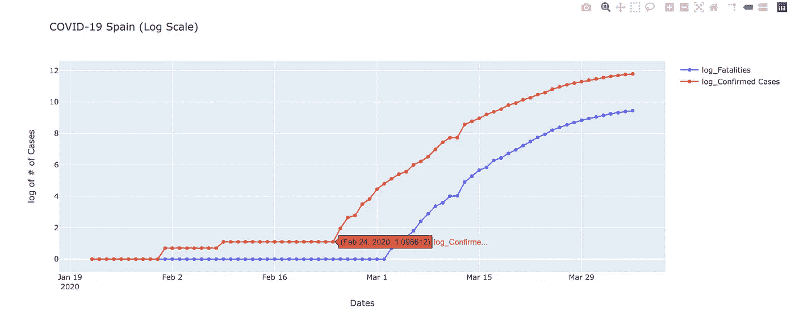

西班牙(2 月 24 日)

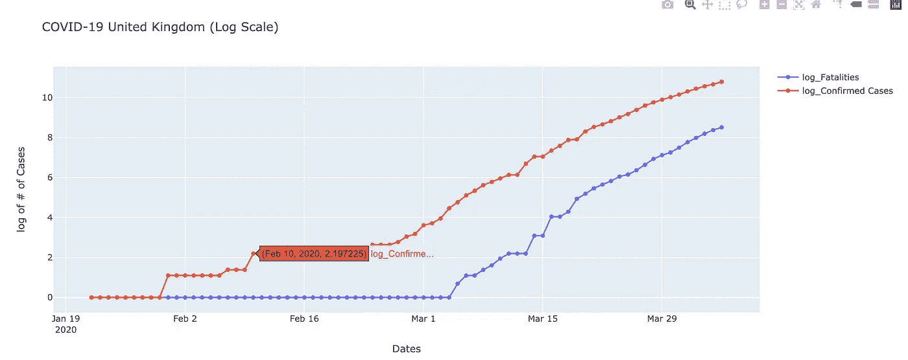

英国(2 月 10 日)

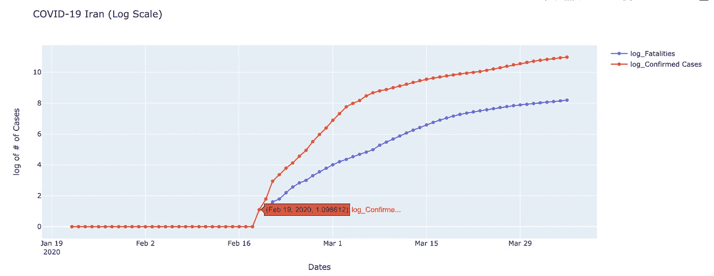

伊朗(2 月 9 日)

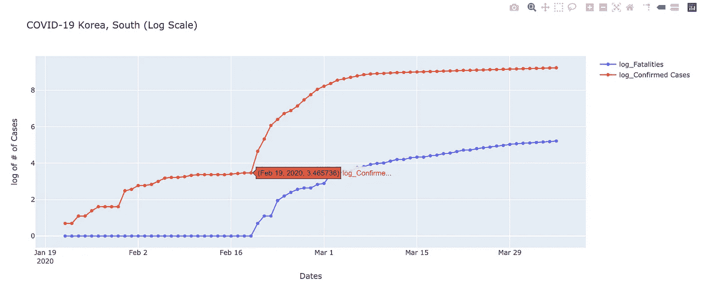

韩国(2 月 19 日)

美国在 3 月 10 日也观察到了类似的模式。

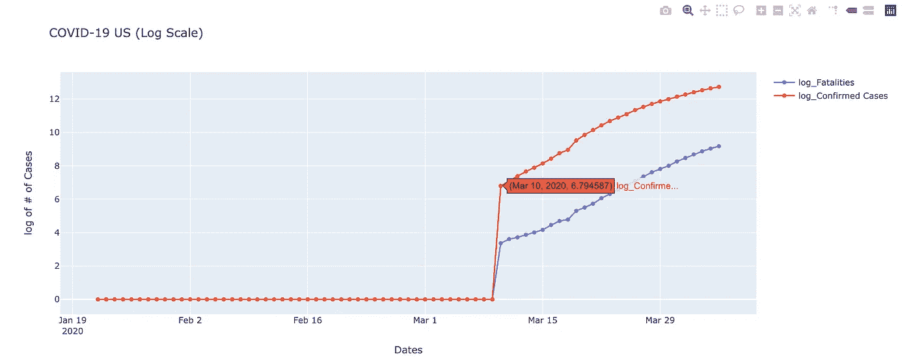

美国(3 月 10 日)

印度提前采取措施阻止电晕传播，迈出了一大步。然而，看着上面的图和比较不同的国家，呼吁更早的行动看起来迫在眉睫。然而，到目前为止，它不能更多地强调，这种病毒只能通过任何国家的公民保持的巨大控制和社会距离来阻止。不幸的是，最近在印度发生的事件恰恰相反。作为一个公民，一个人不是对自己负责，而是对整个社会负责。每个人都应该努力保持冷静，保持社交距离。

我希望世界有一个更好的未来！