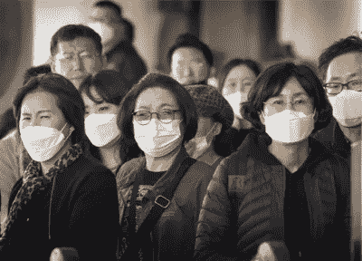
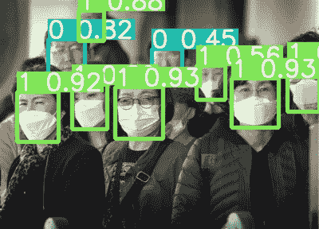

# 新冠肺炎:使用 YOLOv5 的面具检测

> 原文：<https://medium.com/analytics-vidhya/covid-19-face-mask-detection-using-yolov5-8687e5942c81?source=collection_archive---------8----------------------->

> 使用 GPU 上的自定义数据训练您自己的 YOLOv5 模型的完整指南

预测视频

**源代码:** [Github](https://github.com/iAmEthanMai/mask-detection-dataset) | [Colab 笔记本](https://colab.research.google.com/github/iAmEthanMai/mask-detection-dataset/blob/main/Face_Mask_Detection_YOLOv5.ipynb)

**快速介绍:YOLOv5 是什么？**

YOLO 代表“你只看一次”，这是一种用于实时物体检测的最先进的算法。YOLOv5 是 6 月 25 日发布的 YOLO 的最新版本。

YOLOv5 非常快，高性能(就 FPS 而言)且易于使用。欲了解更多信息，请查看这篇[文章](https://blog.roboflow.com/yolov5-improvements-and-evaluation/)。

现在这个问题已经解决了…让我们来编码吧！

**步骤№1:打开 Google Colab，设置 GPU**

对于这个项目，我们使用 Colab 笔记本电脑，以便利用谷歌免费的 Tesla K80 GPU。

创建新笔记本:

*   在你的 Google Drive 中:**右键** > **更多** > **谷歌合作实验室**

设置 GPU:

*   在您的笔记本中:**运行时** > **改变运行时类型**
*   选择 GPU 并**保存**
*   在代码单元中运行以下命令来检查 GPU 分析:

```
!nvidia-smi
```

**第二步:克隆 YOLOv5 框架**

要使用 YOLOv5 框架，我们需要在项目中克隆存储库，只需运行以下命令:

```
!git clone [https://github.com/ultralytics/yolov5](https://github.com/ultralytics/yolov5)
```

我们还需要安装依赖项:

```
%cd /content/yolov5!pip install -U -r requirements.txtimport torchfrom IPython.display import Image
```

**步骤 3:准备并导入您的自定义数据集**

[](https://www.kaggle.com/andrewmvd/face-mask-detection) [## 面罩检测

### 属于 3 类的 853 个图像。

www.kaggle.com](https://www.kaggle.com/andrewmvd/face-mask-detection) 

对于这个项目，我使用的数据集是我在 [Kaggle](https://www.kaggle.com/andrewmvd/face-mask-detection) 上找到的，不幸的是，注释必须是 YOLO 文件`.txt`格式，而在这个数据集中并非如此。

> 如果你的注释是用 Pascal VOC 文件`*.*xml`格式写的，如下图所示，它需要被改成 YOLO 注释格式。

```
<annotation>
    <folder>images</folder>
    <filename>maksssksksss4.png</filename>
    <size>
        <width>301</width>
        <height>400</height>
        <depth>3</depth>
    </size>
    <segmented>0</segmented>
    <object>
        <name>with_mask</name>
        <pose>Unspecified</pose>
        <truncated>0</truncated>
        <occluded>0</occluded>
        <difficult>0</difficult>
        <bndbox>
            <xmin>70</xmin>
            <ymin>185</ymin>
            <xmax>176</xmax>
            <ymax>321</ymax>
        </bndbox>
    </object>
</annotation>
```

为了解决这个问题，一个简单的 [python 脚本](https://github.com/iAmEthanMai/mask-detection-dataset/blob/main/scripts/data_processing.py)可以解决这个问题

如果您使用自己的数据集，克隆我的 [Github 库](https://github.com/iAmEthanMai/mask-detection-dataset)，将您的标签`.xml`和图像移动到 xml 文件夹和 images 文件夹。确保删除`train.txt`、`validate.txt`和`test.txt`文件，并通过在终端上运行以下命令来处理数据:

```
python data_processing.py
```

> YOLO 注释格式:

```
<class-name> <center-x> <center-y> <width> <height>
```

> 样本标签:

```
1 0.4053156146179402 0.63 0.35215946843853824 0.34
```

然后，我们需要将我们的数据集导入笔记本，如果您正在使用我的数据集，您可以克隆 Github 存储库:

```
!git clone https://github.com/iAmEthanMai/mask-detection-dataset.git
```

如果您使用自己的数据，请将您的本地文件夹上传到 Colab 文件系统中。

**步骤№4:准备你的模型**

在您的笔记本文件系统中，您应该可以找到以下两个目录:

```
yolov5
|
|-- data
|    `-- images
|
|-- models
|   |-- yolov5l.yaml
|   |-- yolov5m.yaml
|   |-- yolov5s.yaml
|    `-- yolov5x.yaml
|
 `-- runs
     |-- detect
      `-- train mask-detection-dataset
|
|-- scripts
|    `-- processing_data.py
|   
 `-- data
     |-- images
     |-- xml
     |-- labels
     |-- data.yaml
     |-- train.txt
     |-- validate.txt
      `-- test.txt
```

打开`data.yaml`文件并改变类的数量和类名，在本例中，我们有 3 个不同的类:

*   0:无遮罩
*   1:正确佩戴面罩
*   2:面具佩戴不当

```
train: ../mask-detection-dataset/data/train.txt
val: ../mask-detection-dataset/data/train.txt
test: ../mask-detection-dataset/data/test.txtnc: 3 # number of classes
names: ['0', '1', '2'] # class names
```

我们现在需要在`yolov5/models/`中选择一款车型，您可以在这里找到每款车型[之间的详细对比，但是为了这个项目，我们将使用 **yolov5s** ，因为它的训练速度更快。](https://github.com/ultralytics/yolov5#pretrained-checkpoints)

> 确保您更改了`yolov5s.yaml` 文件中的类别数量:

```
# parameters
nc: 3  # number of classes
depth_multiple: 0.33  # model depth multiple
width_multiple: 0.50  # layer channel multiple# anchors
anchors:
  - [10,13, 16,30, 33,23]  # P3/8
  - [30,61, 62,45, 59,119]  # P4/16
  - [116,90, 156,198, 373,326]  # P5/32# YOLOv5 backbone
backbone:
  # [from, number, module, args]
  [[-1, 1, Focus, [64, 3]],  # 0-P1/2
   [-1, 1, Conv, [128, 3, 2]],  # 1-P2/4
   [-1, 3, BottleneckCSP, [128]],
   [-1, 1, Conv, [256, 3, 2]],  # 3-P3/8
   [-1, 9, BottleneckCSP, [256]],
   [-1, 1, Conv, [512, 3, 2]],  # 5-P4/16
   [-1, 9, BottleneckCSP, [512]],
   [-1, 1, Conv, [1024, 3, 2]],  # 7-P5/32
   [-1, 1, SPP, [1024, [5, 9, 13]]],
   [-1, 3, BottleneckCSP, [1024, False]],  # 9
  ]...
```

**步骤№5:训练模型！**

通过使用以下选项运行以下命令来训练模型:

*   **—批量:**批量大小
*   **—历元:**历元数
*   **—数据:`data.yaml`文件的**路径
*   **—CFG:**`yolov5s.yaml`*模型配置文件的路径*
*   ***—权重:**自定义权重的路径*
*   ***—设备:**“0”代表 GPU，“cpu”代表 CPU*

```
*!python3 train.py --batch 1 --epochs 100 --data /content/mask-detection-dataset/data/data.yaml --cfg /content/yolov5/models/yolov5s.yaml --weights '' --device 0*
```

***第 6 步:测试模型***

*要使用我们训练好的模型对测试图像进行推断，请运行带有选项的命令:*

*   ***—来源:**测试图像的路径*
*   ***—权重:**权重路径*

```
*!python3 detect.py --source /content/mask-detection-dataset/data/images/maksssksksss787.png --weights /content/yolov5/runs/train/exp/weights/last.pt*
```

***

我们模型的预测* 

*预测将保存在`/yolov5/runs/detect`目录中。*

***结论***

*感谢你的坚持，我希望你喜欢遵循这个指南。*

*在 [Github](https://github.com/iAmEthanMai) 、 [Kaggle](https://www.kaggle.com/ethanmai) 和 [Linkedin](http://www.linkedin.com/in/ethan-mai-0430a4198) 上和我联系。*

*有关该项目的更多细节，请查看 Github 资源库:*

*[](https://github.com/iAmEthanMai/mask-detection-dataset) [## 直径/掩模检测数据集

### 此时您不能执行该操作。您已使用另一个标签页或窗口登录。您已在另一个选项卡中注销，或者…

github.com](https://github.com/iAmEthanMai/mask-detection-dataset)*