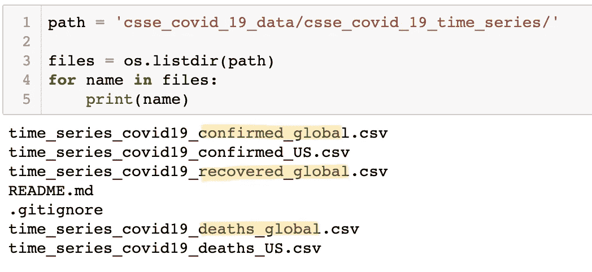
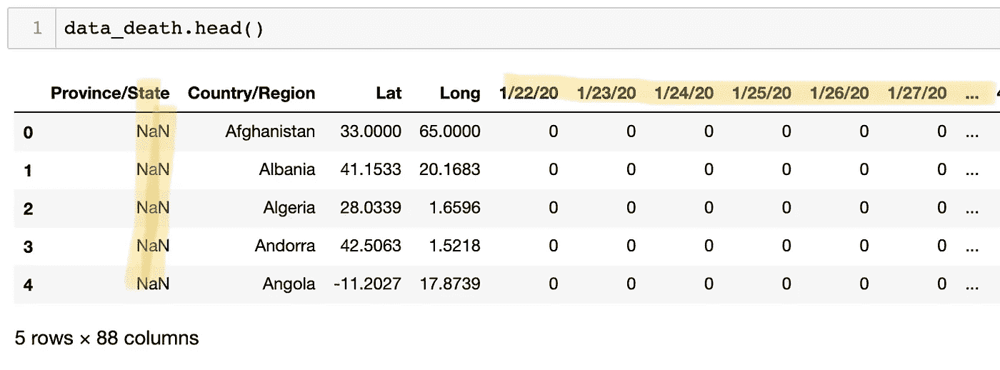
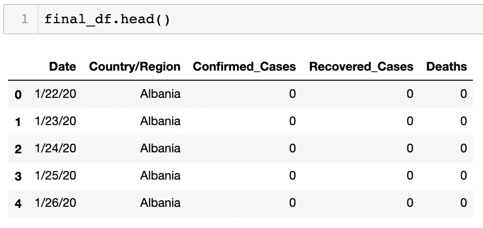
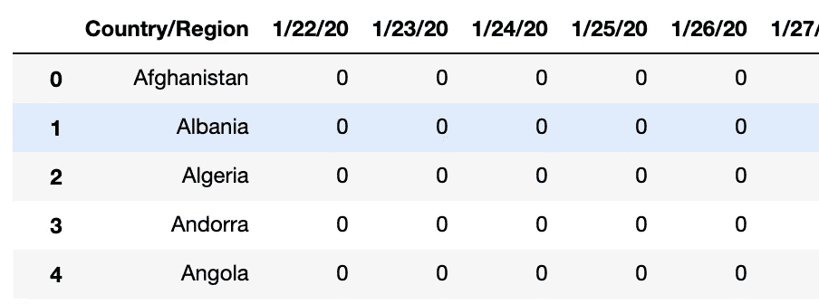
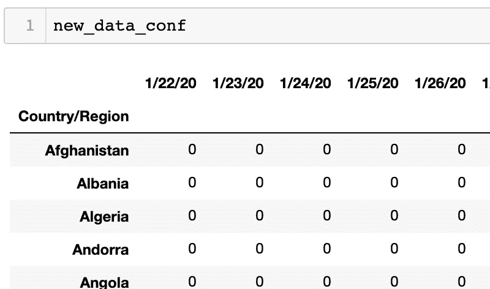
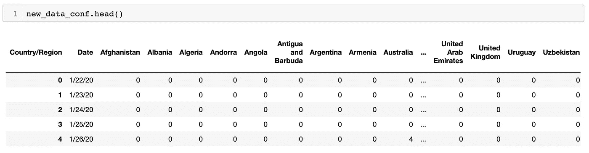
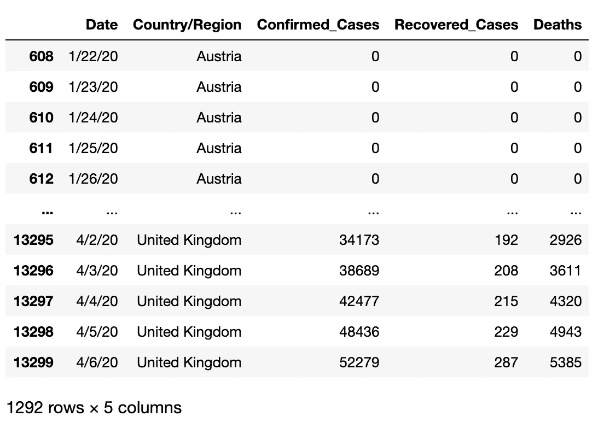
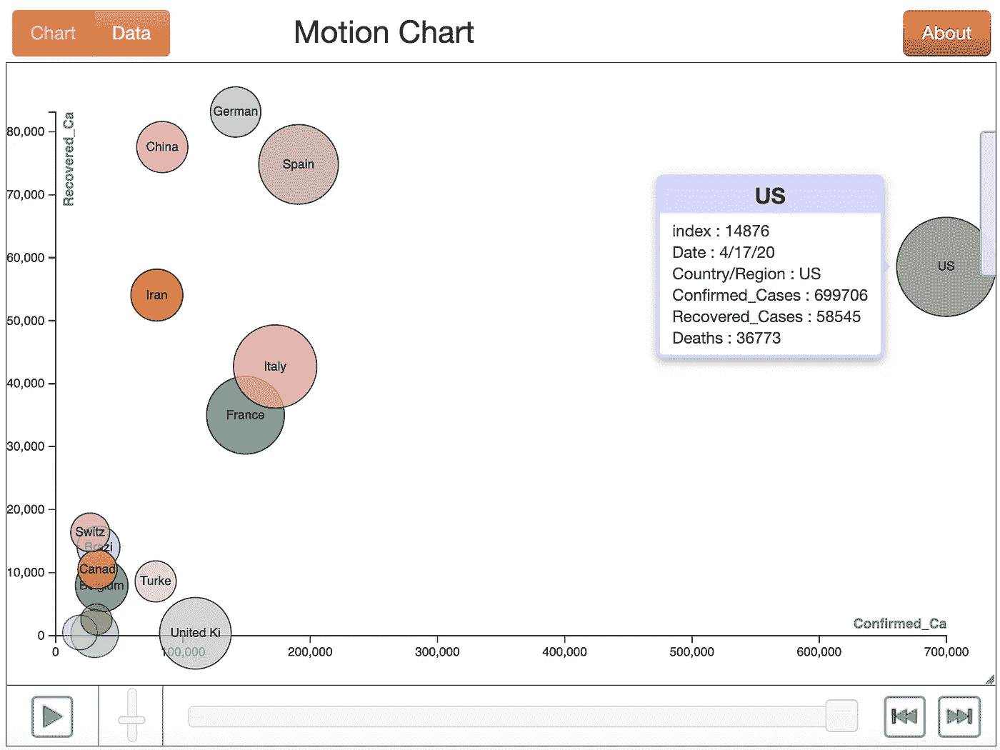
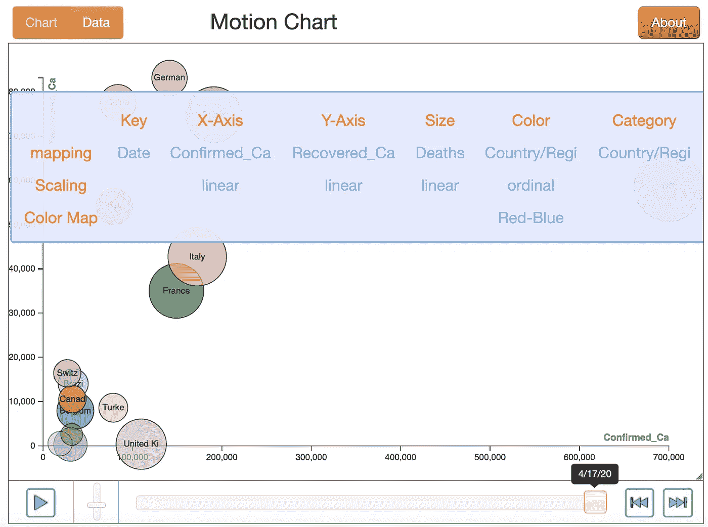

# 新冠肺炎:基因突变还是工程

> 原文：<https://medium.com/analytics-vidhya/covid-19-genetic-mutation-or-engineering-a55afe359659?source=collection_archive---------24----------------------->

## Python 中的运动图表可视化

> [病毒会给经济留下几十年的影响](https://www.smh.com.au/politics/federal/virus-will-leave-an-economic-impact-for-decades-20200406-p54hk9.html)。

*利用* ***长期*** ***利率*** ***数据*** *等资料来源来考察历史上 12 次大流行的经济影响，研究人员从持续 40 年的大流行中发现了“显著的宏观经济后效”。*

# 在本文中，我让数据自己说话。

一张**视觉** **动作图****从 3 个角度说明了不同国家疫情**的趋势，有很多话要说…

1.  确诊病例数
2.  恢复的病例数
3.  死亡人数

## 数据源

我从约翰·霍普金斯大学系统科学与工程中心(JHU·CSSE)**运营的[数据源](https://github.com/maziarizadi/COVID-19)获取数据。此外，由 **ESRI 生活地图集团队**和**约翰霍普金斯大学应用物理实验室(JHU APL)** 支持。**

**截至 2020 年 4 月 6 日，新冠肺炎在死亡人数超过 1 万人的国家爆发**

**这项工作的 Python 代码在我的 [GitHub](https://github.com/maziarizadi/COVID-19) 上完全可用，所以我尽量让它更通用。**

**上面的动作图是用 5 个维度创建的:**

1.  **x 轴:确诊病例数**
2.  ****y 轴:回收的**箱数******
3.  ****圆圈颜色:**国家******
4.  ****圆圈大小:死亡人数**死亡人数******
5.  ******时间******

# ****让我们让数据运转起来****

****资料来源:www.giphy.com****

****给定的数据被从 [**JHU CSSE 新冠肺炎**](https://github.com/CSSEGISandData/COVID-19) 分支到我的 github 中，使用`os`库，我查看 Github 文件夹并打印内容。****

********

****打印 Github 文件夹的内容****

****在所有的内容中，我把三个有标记的文件分成三个独立的`pandas`数据帧，下面是我打印的样本。****

********

****time _ series _ covid 19 _ deaths _ global . CSV 到数据帧的前 5 行(**在预处理**之前)****

# ****预处理数据****

****像往常一样，我们需要为消费准备数据。我们想要的数据框架必须如下图所示，有 5 列。****

****我将解释三个数据帧中的一个的过程，因为它们都是以完全相同的方式完成的。****

********

****运动图表创建所需的数据格式(预处理后的****

******看这两个数据结构，很明显我们需要做一些准备。为此，让我们从原始数据框中删除额外的列。******

```
****new_data_conf = data_conf.drop(columns=['Province/State','Lat', 'Long'])****
```

************

******接下来，我们需要将所有内容转换成列。有许多方法可以做到这一点。我的方法是使用基于国家名称的`groupby`将它们统一到唯一的行中。(请记住，在原始数据集中，由于“省/州”字段，同一国家在多行中重复出现)。******

> ******关于`groupby()`的快速说明。对于我已经使用了`mean()`的数字列，需要使用数学函数。******

```
****new_data_conf = new_data_conf.groupby(['Country/Region'])[new_data_conf.columns].sum()****
```

************

******现在，为了将`date`转换成列，我使用了`transpose()`、`reset_index()`，最后是`rename()`。******

```
****new_data_conf=new_data_conf.transpose()new_data_conf.reset_index(level=0, inplace=True)new_data_conf.rename(columns={'index' : 'Date'}, inplace=True)****
```

************

******time _ series _ covid 19 _ deaths _ global . CSV 到数据帧的前 5 行******

******接下来，我们需要`melt`数据框来创建另一个包含国家名称的列，这样我们就可以将“已确认”、“已恢复”和“死亡”病例的值作为三个单独的列相加，从而得到我们想要的结构。******

1.  ******`melt`每个数据帧分开:******

```
****cols = new_data_conf.columns.tolist()new_data_conf = new_data_conf.melt(id_vars='Date', value_vars=cols[2:])****
```

******2.使用`merge`逐个加入他们:******

```
******new_df** = pd.merge(**new_data_conf**, **new_data_reco**,  how='left', left_on=['Date','Country/Region'], right_on = ['Date','Country/Region'])**final_df** = pd.merge(**new_df**, **new_data_death**,  how='left', left_on=['Date','Country/Region'], right_on = ['Date','Country/Region'])****
```

******我们得到了我们想要的数据帧💪******

************

******五列理想数据帧******

******还有最后一步，那就是绘制实际的 ***运动图*** 。但在此之前，为了获得更好的结果，我想根据“确诊”病例数最高的国家来筛选数据。******

```
****top_countries = final_df.loc[final_df['Confirmed_Cases'] > 15000]
top_countries_set = set(top_countries['Country/Region'])****
```

> ******输出列表反映了截至该日期(4 月 15 日)的国家列表。******

******3.选择行:******

******将选择的国家列表作为`set()`放入一个列表中，我使用`loc()`函数仅选择必填字段，并将其保存在`top_countries_df`数据框中。******

```
****top_countries_df = final_df.loc[final_df['Country/Region'].isin(top_countries_set)]
top_countries_df****
```

# ******运动图表******

******为了绘制运动图，我们需要填写下面列出的超参数，剩下的是我们导入的`MotionChart`库******

```
****from motionchart.motionchart import MotionChartmChart = MotionChart(df = top_countries_df, key='Date', x='Confirmed_Cases', y='Recovered_Cases', xscale='linear', yscale='linear', size='Deaths', color='Country/Region', category='Country/Region')****
```

******`key`:“日期”将是我的图表的主要驱动力******

******`x`轴:选择了“已确认”病例******

******`y`轴:选择了“已恢复”案例******

******泡泡`size`:选择每个场景中‘死亡’的数量******

******`category`:国家列表******

******这些是我的偏好，任何人都可以根据自己的喜好做出任何改变。******

## ******出版******

******要发布图表，取决于您的环境。当我使用 Jupyter 笔记本时，我使用了`.to_notebook()`。要在 web 上发布相同的结果，您需要使用`.to_browser()`。******

```
****mChart.to_notebook()****
```

******这是最终结果:******

************

******截至 2020 年 4 月 17 日的最终图表******

************

******最终图形包括打开的滑动条******

******如果您有任何问题/反馈/意见，请在下面评论。******

************

******资料来源:giphy.com******