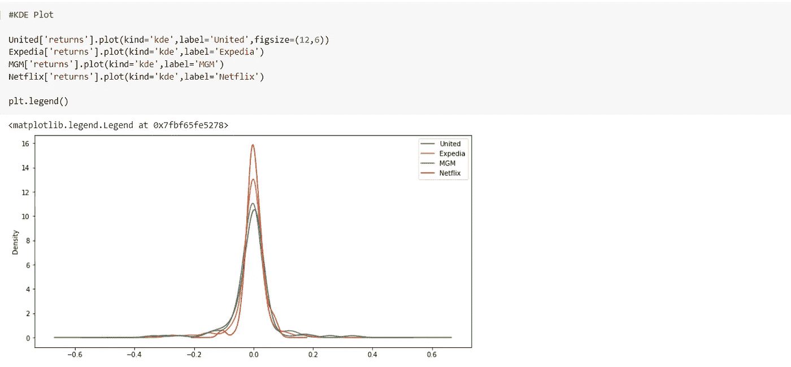
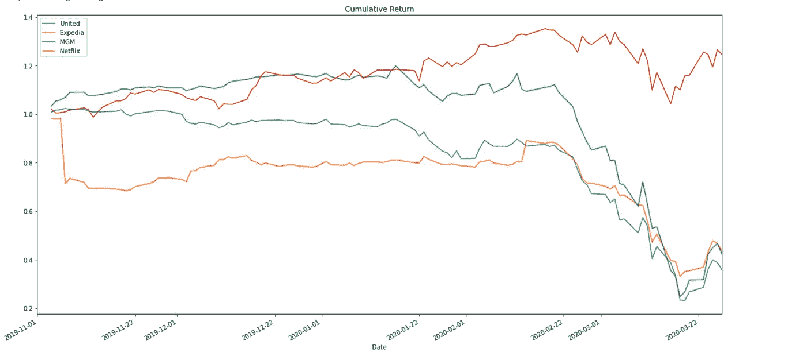

# 新冠肺炎对股票市场的影响

> 原文：<https://medium.com/analytics-vidhya/covid-19-impact-on-stock-market-analysis-with-python-e40016be4918?source=collection_archive---------29----------------------->

## #冠状病毒#Python #GoogleColab

你好，我是苏米特·帕蒂尔。我们意识到，新冠肺炎已经扭转了经济形势。旅游和娱乐行业的公司，即所谓的**海滩**股票，绝对是受打击最大的。这些股票在过去的一个月里蒸发了超过 3320 亿美元。因此，我用 python 做了一个基本的股票市场分析，以了解它在金融市场中是如何工作的。


**沙滩股票**

# 指数

> 1.1 导入模块
> 
> 1.2 获取数据
> 
> 1.3 可视化数据
> 
> 1.4 基本财务分析

# 1.1 导入所有必要的模块


# 1.2 从雅虎财经获取数据

> 美国联合航空公司股票(股票代码: **UAL** 纳斯达克上市)- **航空公司**
> 
> Expedia 股票(纳斯达克股票代码:**EXPE**)**预订**
> 
> 米高梅度假村股票(纳斯达克股票代码:**米高梅**)**酒店和度假村**
> 
> 网飞股票(股票代码: **NFLX** 纳斯达克上市)- **家庭娱乐**


联合航空公司股票

> 我把网飞包括在内，因为它是一家家庭娱乐公司。因此，我想将它的结果与受打击最严重的公司进行比较，因为由于新冠肺炎的突然崛起，人们现在正在疏远社会..


Expedia，米高梅，网飞股票

# 1.3 可视化数据

## a)开盘价

> 这是一种证券在交易日开市时首次交易的成本；例如，纽约证券交易所(NYSE)在东部时间绝对上午 9:30 开盘。
> 
> 纳斯达克利用一种称为“[开盘交叉](https://www.investopedia.com/terms/o/opening-cross.asp)的方法，考虑到中期聚集的请求，选择最佳的开盘成本。


开盘

## b)收盘价

> It 成本是财务专家使用的标准基准，用于在一段时间后跟踪其演示。收盘价是股票在标准交易日的最后交易成本。


收盘价格

## c)每日交易量

交易量是每天交易的报价数量，除此之外，还可以找到不同日期的中间值，以确定每天的正常交易量。平均每日交易量(ADTV)是一个重要的指标，因为高或低的交易量吸引了各种各样的经纪人和金融专家。


日车流量

## D) **本次最大交易量日期**


每个公司的最大交易日期

## e)总交易量

它是在任何一个正常交易日内转手的股票总数。

*   a 买了 100，000 股网飞股票
*   b 卖出了 20，000 股相同的股票
*   c 购买了 50，000 股相同的股票

因此，总交易量为 1，70.000。


总交易数量

## f)移动平均数

移动平均线(MA)是专业调查中普遍使用的标记，通过筛选任意瞬时值变化的“骚动”来帮助平滑行程值活动。


联合航空公司文学硕士


马代表网飞

# 1.4 基本财务分析

## a)每日百分比变化

**日收益率:**日收益率是股票相对于前一日的盈利/亏损。

```
x['returns'] = x['Close'].pct_change(1)
```

> **直方图**

直方图显示了一致的示例信息的形状和分布。

**分别绘制一个柱状图，或者将它们堆叠起来，查看最“不稳定”的股票。**


联合和 Expedia 直方图


米高梅和网飞直方图


堆积直方图

> **KDE 剧情**

KDE 图被描绘成核密度估计，用于预测一致变量的概率密度。

**剧情 KDE 为另一个观点查最“宽”的剧情。**



KDE 图

> **箱线图**

箱线图是一种制度化的方法，用于显示依赖于五个数字概要的信息占用:最少、第一个四分位数、中间、第三个四分位数和最极端。


箱形图

## b)累积回报

累积回报是根据投资当天的情况计算的。如果累计回报高于 1，你就在盈利，否则你就亏损。

公式:

**df[每日 _ 累计 _ 返回]=(1+df[百分比每日 _ 返回])。cumprod()**



累积回报

> 就是这样。使用 Python 编程的非常基本的财务分析..！！
> 
> 下次见，谢谢:)