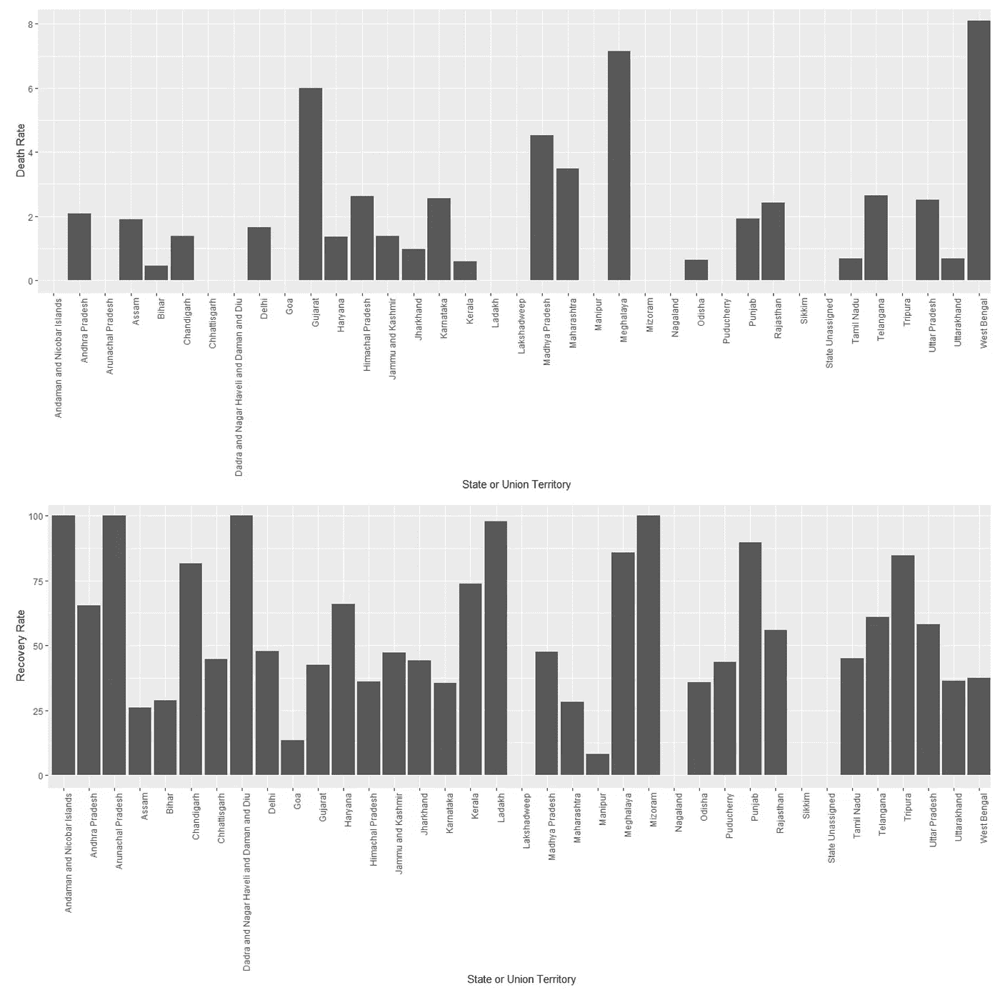
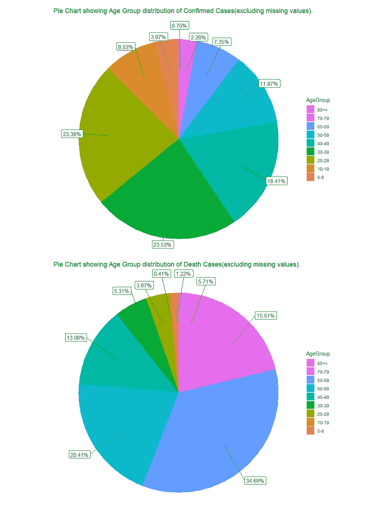

# 印度的新冠肺炎:一项数据研究

> 原文：<https://medium.com/analytics-vidhya/covid-19-in-india-a-data-study-8814f9a3dea9?source=collection_archive---------42----------------------->

图片来源:谷歌

由新型冠状病毒引起的持续的新冠肺炎疫情已经在全球范围内感染了大约 520 万人，并导致大约 34 万人死亡。2019 年 12 月在中国武汉首次报道，它已经蔓延到世界其他地区，造成严重危害，特别是在欧洲和美国的大部分地区。2020 年 1 月 30 日，印度报告了首例新冠肺炎病例。从那以后，政府采取了重大措施来控制新型冠状病毒的传播，包括全国范围的全面封锁，增加检测次数，宣布新冠肺炎为严格控制区等等。在这里，我们将看看印度是如何对抗世界其他国家来遏制正在进行的疫情的。请注意，这里研究的数据是截至 2020 年 5 月 22 日的最新数据。所使用的数据集来自 Kaggle，可以在这里找到[，还有代码。](https://github.com/gauravalley/COVID-19-In-India)

**确诊病例数比较**

在这里，我们看到，与其他十个国家相比，印度的病例数量较少，但曲线仍在以指数方式增长，而大多数其他国家的曲线——如德国、法国、意大利和伊朗；已经开始随着时间变平。这表明，新冠肺炎的影响在印度刚刚开始达到顶峰，而在大多数欧洲国家，它已经开始消退，或至少已经得到控制。

当我们将印度的新冠肺炎确诊病例数趋势与过去五天中病例数最高的六个国家的趋势进行比较时，可以进一步看出这一点。我们看到，如前所述，与英国、西班牙和意大利等国家相比，印度的病例数呈指数增长，这表现在与印度病例数相对应的曲线的陡度上。

如果我们将印度每天的新冠肺炎确诊人数与这六个国家过去五天的确诊人数进行比较，会得出同样的结果。与欧洲三个国家相比，印度每天的病例数要高得多，而与美国、俄罗斯和巴西相比则相对较低。

**死亡人数对比**

就像确认的数字一样，印度的死亡人数相对较低，其相应的曲线虽然呈上升趋势，但似乎比其他国家要平坦得多。

比较这些国家的死亡率，我们发现印度是最低的。

接下来，我们将印度的死亡人数趋势与过去五天中死亡人数最多的六个国家进行比较。我们看到，代表印度数字的线似乎比其他国家更平坦，但这一趋势越来越接近意大利、法国和西班牙。

当我们将印度每天的死亡人数与上述三个欧洲国家的死亡人数进行比较时，就可以理解印度与这三个欧洲国家的趋势越来越接近了。这里我们看到印度每天的死亡人数开始接近意大利、法国和西班牙；在某些场合甚至超过了他们。

**印度的新冠肺炎统计数据**

我们在下面看到，代表确诊病例数的曲线随着时间呈指数增长，这是一个很大的问题。虽然在治愈病例的曲线上可以看到同样的模式，再加上死亡病例的曲线相对较平，这应该会有所缓解，但如果不能通过使确诊病例的曲线变平来遏制传播，只会使情况随着时间的推移而恶化。

此外，我们看到印度的死亡率几乎是全球死亡率的一半，而两者的恢复率几乎相同。

**印度各邦的新冠肺炎统计数据**

现在，我们将分析新型冠状病毒教在印度各邦的影响。借助柱状图，我们看到马哈拉施特拉邦、古吉拉特邦、泰米尔纳德邦和德里报告的确诊病例数最高。马哈拉施特拉邦和古吉拉特邦以及中央邦和西孟加拉邦也是死亡人数最多的邦。

如果我们考虑确诊病例最多的 10 个州，我们会看到大多数代表州数的曲线已经开始呈指数增长，这是一个令人担忧的迹象。

我们还可以比较不同州的死亡率和恢复率。

**年龄组和性别分析**

从为数不多的关于患者的信息中，我们看到，在所有确诊病例中，大多数人的年龄在 20 至 39 岁之间。接下来是 40-49 岁年龄段的人，接下来是 50-59 岁，10-19 岁等等。对已经去世的人做同样的事情，我们看到几乎一半的人年龄在 60-69 和 50-59 之间。

接下来，我们从现有数据中获得了确诊病例的性别分布，对于已经死亡的人也是如此。

最后，我们对确诊的新冠肺炎病例进行了州级性别分类，再次只考虑可用的数据。

**在印度测试数字**

首先，我们有在印度进行的新冠肺炎测试的结果分布。大约 4.52%的测试结果是阳性。然后，我们检查到目前为止接受检测的印度人口的百分比，令人惊讶的是，只有大约 0.22%。

将印度与其他国家进行比较，我们发现印度的测试数据位居世界前列。只有五个国家比印度进行了更多的测试。

然后，我们得到了这些国家中每 10，000 人中检测的阳性率和检测次数。

虽然印度的检测数量是世界上最高的，但是庞大的人口造成了重大问题。当我们比较这些国家每 100 万人口中进行检测的数量时，就可以看出这一点。我们看到，与其他国家相比，印度的数字最低。这表明，虽然正在进行的测试数量相对较高，但当我们考虑到庞大的人口时，这个数字肯定是不够的。

为了更好地了解印度庞大人口的影响，我们比较了这些国家接受测试的总人口的百分比。不用说，印度在其中排名最低。

**状态测试编号**

首先，我们检查不同状态的测试统计数据。我们看到泰米尔纳德邦、马哈拉施特拉邦、安得拉邦、拉贾斯坦邦和北方邦是印度进行测试次数最多的几个邦。

然后，我们比较了测试的阳性率和各州每 10，000 人中进行测试的数量。

我们已经看到，与其他国家相比，印度的庞大人口是一个重要因素。我们将在州一级的数据中看到同样的人口影响。如果我们检查每个州每一百万人口中进行的测试数量，我们会发现进行的测试数量非常低。

如果我们检查到目前为止已经测试过的每个州的人口百分比，结果同样令人担忧。

**对不同区域的观察**

为了控制新型冠状病毒病毒的传播，印度的所有地区都被分为三个区域——绿色、橙色或红色，分类是根据几个变量进行的，例如这些地区报告的确诊病例数、完成的检测量和新冠肺炎病例的加倍率。这种区域分类被宣布为一个动态过程，将每周进行研究和修订。我们将检查三个区域在不同州的分布情况。

红色区域是确诊病例数非常高、加倍率非常高的区域。因此，它被认为是监控方面的重中之重，除了全国范围的封锁之外，还受到许多限制的严格控制。

橙色区域的病例数和加倍率低于红色区域。因此，附加限制相对较低。但是相对于上述变量，橙色区域可能上升到红色区域，反之亦然。这样做的目的是控制蔓延，这样它就不会上升，而是下降一级，成为一个绿区。如果一个区域至少连续 21 天没有新病例，则该区域被宣布为绿色。

**印度的医疗设施**

我们将从比较各州的医院数量和医院床位开始。北方邦拥有最多的医院，而泰米尔纳德邦和马哈拉施特拉邦拥有最多的医院床位。

接下来，我们来看看美国各医院的平均病床数量。除了六个州，其他所有的州每家医院的床位都不到 30 张，这对于正在进行的疫情来说是不够的。当我们试图看到每 10，000 人的医院病床数量时，这些数字变得更加惊人。几乎所有的州每 10，000 人一组的床位都不到 7 张。

如果我们把各州的人口考虑在内，那么我们会有更多可悲的数字。在这里，我们有每个州每张病床上的人数。这是一个非常可怕的统计数字，因为表明人口过多只会导致医疗部门崩溃。当我们计算每个州每百万人口的病床数量时，也可以观察到同样的情况。

最后，我们通过比较每个邦的医院床位数和活跃病例数，以及整个印度的活跃病例数，来了解医疗部门目前的状况。从柱状图来看，马哈拉施特拉邦可能很快就会没有床位了。

**印度的测试实验室**

在比较每个州的检测实验室数量时，我们看到实验室数量最多的州也是确诊病例最多的州。这表明新型冠状病毒病毒已经在该国大范围传播，控制它的唯一方法是进行更多的检测并隔离阳性患者。

然后，我们看到不同类型的测试实验室在各州的分布。最后，我们比较每个州每个测试实验室完成的测试数量。

**简单时间序列预测**

在这里，通过使用一个简单的 ETS 时间序列模型，根据我们手头的数据，我们预测病例数在未来 15 天内可能会增加。该模型预测，在未来 15 天内，我们的病例将超过 1，750，000 例。

*注意:可以通过运行带有更新数据集的代码来更新最新结果，这些数据集用于* [*【世界】*](https://www.kaggle.com/sudalairajkumar/novel-corona-virus-2019-dataset) *、* [*印度*](https://www.kaggle.com/sudalairajkumar/covid19-in-india) *、* [*州级*](https://www.kaggle.com/imdevskp/covid19-corona-virus-india-dataset) *印度和* [*测试*](https://github.com/owid/covid-19-data/tree/master/public/data/testing) *数字。*