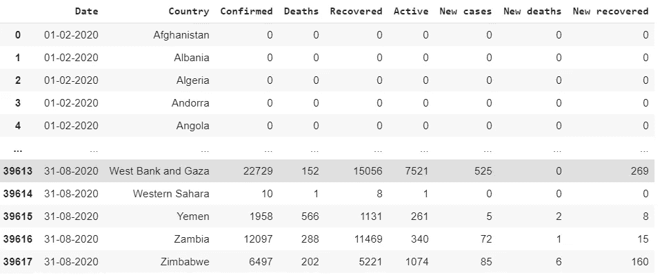

# 使用 Streamlit、Altair 和 Heroku 的新冠肺炎交互式仪表板

> 原文：<https://medium.com/analytics-vidhya/covid-19-interactive-dashboard-using-streamlit-altair-and-heroku-24d09072d52c?source=collection_archive---------18----------------------->

# 介绍

这种新的冠状病毒在科学上被称为 SARS-Cov-2 或新冠肺炎，已经感染了全世界数百万人。

创作者:Naeblys，鸣谢:Getty Images/iStockphoto

许多网络和移动应用程序可用于跟踪疾病的进展。仪表板显示每日病例、恢复、死亡、活动病例、进行的测试数量等的实时更新。大多数仪表板只为地图提供交互性，而不为其他类型的可视化提供交互性。

开发这个应用程序的主要必要性是给用户更多的控制权，这样他就可以提供输入来可视化各种交互式图表和结果。该应用程序还允许用户通过**缩放、平移和工具提示**来查看图表中非常微小的数据点。网络应用程序向用户提供答案，并允许他们**下载创建的每张图表**。

# 使用的工具

整个应用程序是使用开源工具开发的。该应用程序是使用 Python 编程语言以及 Pandas、Altair 和 Streamlit 等包创建的。整个应用程序所需的数据是从 [Github 存储库](https://raw.githubusercontent.com/CSSEGISandData/COVID-19)中提取的。

## 熊猫图书馆

Pandas 库用于将数据读入表格格式并对其进行操作。它是处理原始数据最常用的数据科学库。从源中提取的数据被清洗、处理，并用于回答与新冠肺炎病例相关的问题。

## 牛郎星图书馆

[Altair](https://altair-viz.github.io/) 是一个 Python 交互式可视化开源库，使用它只需几行代码就可以创建非常漂亮且有意义的可视化效果。使用 Altair 创建的图表基于 Vega 和 Vega-Lite 语法，允许以 JSON 格式描述。Altair 是极少数遵循声明式可视化方法的库之一。

## 简化程序库

[Streamlit](https://www.streamlit.io/) 是一个开源 python 库，用于创建交互式 web 应用和仪表盘。使用这个库创建的应用程序具有高度的交互性和丰富的信息。Streamlit 库有一个非常令人愉快和丰富多彩的用户界面，即使是新手用户也可以使用。

## 赫罗库

实现代码以及所需的文件和数据集被上传到 Github 中。应用程序部署在云上，使用一个著名的云平台服务，名为 [Heroku](http://www.heroku.com) 。它提供了一种简单的方法来部署 web 应用程序，只需从 Github 存储库中直接链接即可。

# 应用程序描述

该应用程序分为三个类别:可视化国家案例、可视化多个国家的案例和关于新冠肺炎的见解

## 可视化全国每日新增病例、死亡和康复情况

下拉框将允许用户从所有国家列表中选择国家。选择国家后，用户可以选择按日期查看每日新增病例或死亡或康复的选项。

选择选项后，用户可以以交互式折线图或散点图的形式显示所选国家的新冠肺炎病例。图表是交互式的，可以缩放以查看图表中每个数据点的详细信息。

可视化每日病例、死亡和康复

**可视化死亡，确认与恢复**

该应用程序最有趣的功能是将所选国家的死亡人数可视化为交互式热图。该国的死亡人数按日、日、月、日、月分组。用户可以了解在选定的国家，哪一天、哪一天或哪一个月的新冠肺炎死亡人数较多。

用户还可以将一段时间内累计确认和恢复的病例显示为面积图。这些交互式图表将显示选定国家的确诊病例和恢复病例之间的视觉差异。也可以通过单击图表旁边的…按钮来保存图表。

**可视化死亡，确认与恢复**

## 可视化多国新冠肺炎案例

仪表板还允许用户选择多个国家，并可视化和比较所选国家的感染情况。用于比较各国新冠肺炎病例数量的图表有火球图、柱状图和文字云。每当所选国家发生变化时，图表也会动态变化。

可视化多国新冠肺炎案例

## 与新冠肺炎案例相关的见解

该应用程序还为用户提供了选择日期的界面，以获取在所选日期有更多病例、死亡和康复的国家的详细信息。该应用程序还允许用户了解该国关于新冠肺炎感染的排名。此外，用户可以通过选择月份来查看用于整个分析的实际数据集。

与新冠肺炎案例相关的见解

# 履行

清理后的数据集以表格格式显示

资料组

该应用程序的用户界面是使用 Streamlit 创建的。下面给出了使用 Streamlit 创建一个非常简单的选择框来选择国家的代码。该命令显示一个选择框，显示消息“选择国家”，并从数据集中选择所有 186 个国家名称。

> Country = ST . Select box(" Select Country "，covid["Country"][:186])

以下示例代码使用 Altair 库显示所选国家/地区(从选择框中)每日案例的交互式散点图。

> 表示“另类的”图表(covid[covid[" Country "]= = Country])。标记圆圈()。编码(
> 
> x= "日期"，
> 
> y= "新病例"，
> 
> 工具提示=["日期"，"国家"，"新案例"]
> 
> ).交互式()

使用了许多 Streamlit 控件，如单选按钮、侧边栏、多选等。完整的代码可在[这里](https://github.com/e-bengeorge/Covid-19-Interactive-Dashboard)获得。

# 结论

新冠肺炎交互式仪表板应用程序旨在让用户以一种简单且更具交互性的方式直观了解新冠肺炎感染情况。该应用程序可用于研究人员获得关于感染的更多见解。

# 链接

申请链接:[新冠肺炎互动仪表盘](https://covid-19-interactive-dash.herokuapp.com/)

Github 资源库: [Github-Covid19](https://github.com/e-bengeorge/Covid-19-Interactive-Dashboard)

# 参考

[1][https://covid19.who.int/](https://covid19.who.int/)

[https://ncov2019.live/](https://ncov2019.live/)

[https://coronavirus.jhu.edu/map.html](https://coronavirus.jhu.edu/map.html)

[4][https://towards data science . com/新冠肺炎-数据处理-58aa 3663 F6](https://towardsdatascience.com/covid-19-data-processing-58aaa3663f6)

[https://raw.githubusercontent.com/CSSEGISandData/COVID-19](https://raw.githubusercontent.com/CSSEGISandData/COVID-19,)