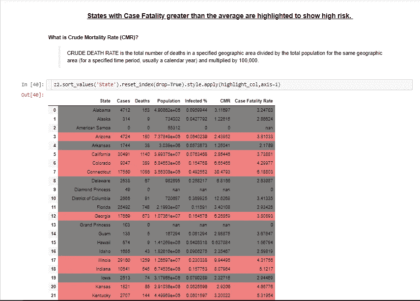
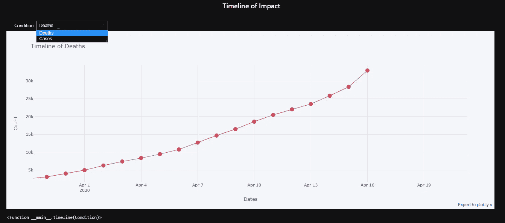
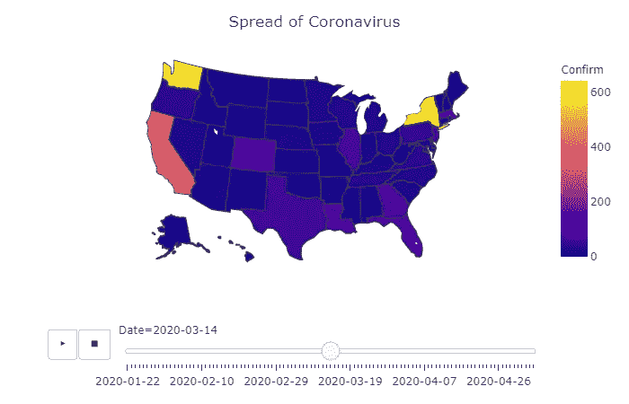
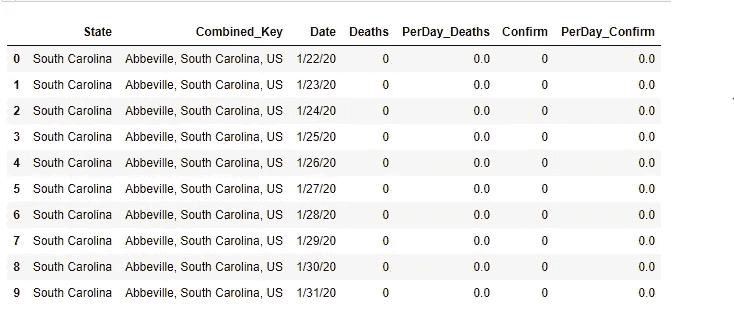
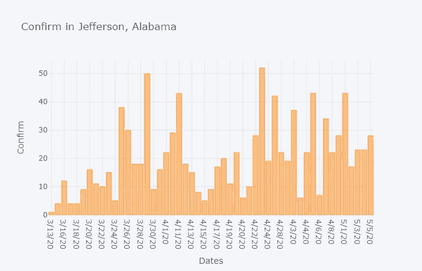
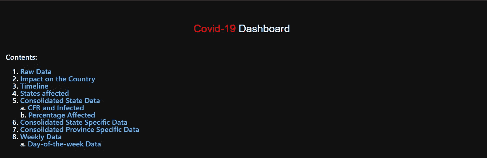

# 新冠肺炎交互式可视化

> 原文：<https://medium.com/analytics-vidhya/covid-19-interactive-visualization-b46966b8b63b?source=collection_archive---------17----------------------->

可视化**新冠肺炎**数据，了解其对美国人口的影响。


新型冠状病毒已导致全球 20 多万人死亡。

在这篇文章中，我将带你了解如何只使用 python 工具和 api 来构建你自己的交互式仪表盘，并将其发布到像 [binder](https://mybinder.org/) 或 [heroku](https://www.heroku.com/) 这样的提供商上。

首先，原始数据集是由约翰霍普金斯大学提供的，可以在他们的 github 页面上找到。这只是集中在美国的数据，但同样可以扩展到其他国家。

首先，请确保您已经安装了 python，Jupyter notebook 并准备就绪。我将只详细介绍执行的一些操作。你可以自己尝试一下:)或者在我的 [GitHub](https://github.com/abhim-12/Covid-19) 上找到整个项目。

您需要安装以下 python 文件来执行分析和可视化数据。

```
**import** **pandas** **as** **pd**
**import** **matplotlib.pyplot** **as** **plt**
**from** **IPython.display** **import** Markdown, display
**from** **datetime** **import** datetime **as** dt
**from** **ipywidgets** **import** interact
**import** **chart_studio.plotly** **as** **py**
**import** **plotly.graph_objs** **as** **go**
**from** **plotly.offline** **import** iplot, init_notebook_mode
**import** **cufflinks**
**from** **plotly.subplots** **import** make_subplots
cufflinks.go_offline(connected=**True**)
init_notebook_mode(connected=**True**)
**import** **dateutil
import plotly.express as px**
```

pandas —使用数据帧读取数据并创建数据子集。
matplotlib——Python 的 go to 可视化库。
datetime —处理时间序列数据的直观库，适用于数据帧。
ipywidgets——在 Jupyter 中创建小部件，使仪表板更具交互性。
plot ly/袖扣——更好的交互式可视化效果。

从 git repo 中提供的链接收集数据。

```
x1 = 'https://raw.githubusercontent.com/CSSEGISandData/COVID-19/master/csse_covid_19_data/csse_covid_19_time_series/time_series_covid19_confirmed_US.csv' 
x2 = 'https://raw.githubusercontent.com/CSSEGISandData/COVID-19/master/csse_covid_19_data/csse_covid_19_time_series/time_series_covid19_deaths_US.csv' 
x3 = 'https://raw.githubusercontent.com/abhim-12/Covid-19/master/population.csv' 
x4 = 'https://raw.githubusercontent.com/abhim-12/Covid-19/master/state-codes.csv'
```

使用 pandas read.csv()函数将数据读入数据帧:

```
conf = pd.read_csv(x1) 
death = pd.read_csv(x2) 
pop = pd.read_csv(x3)      # US Population data
codes = pd.read_csv(x4)    # US State Codes
```

使用 head()函数了解数据包含的内容、列、数据类型等。

执行一些数据清理(如重命名列、删除)以使其更加一致和可展示。还要删除任何不必要的列。

```
del death['Population']
def filt(df):
    df.drop(columns=['iso3','code3','Admin2','Country_Region'],axis=1,inplace=True)
    df.rename(columns={'Province_State':'State'},inplace=True)
    df=df.reset_index()
    del df['index']
```

我们创建的第一个数据框架( *z2* )合并了各州的确诊病例和死亡病例框架。接下来，我们创建几个列，根据数据推断每个州的情况的严重性。

```
cols = conf.columns.to_list()[-1]
ctemp = conf.groupby('State').sum()[conf.columns[-1]].sort_values(ascending=False).reset_index()
dtemp = death.groupby('State').sum()[death.columns[-1]].sort_values(ascending=False).reset_index()
ctemp = ctemp[['State',conf.columns[-1]]]
dtemp = dtemp[['State',death.columns[-1]]]# State level aggregated data
z2 = pd.merge(ctemp,dtemp,on=['State'],how='inner').merge(temp2,on='State',how='left')      

z2.rename(columns={deaths:'Deaths',confirm:'Cases'},inplace=True)z2['CMR'] = (z2['Deaths']/z2['Population'])*100000                          # Crude Mortality Rate per 100000
z2['Infected %'] = (z2['Cases']/z2['Population'])*100                       # Percentage of population infectedz2['Case Fatality Rate'] = (z2['Deaths']/z2['Cases'])*100                   # Case Fatality Rate - Ratio of Deaths out of those infected
z2 = z2[['State','Cases','Deaths','Population','Infected %','CMR','Case Fatality Rate']]
```

计算粗死亡率、病死率和感染百分比，我选择突出 CFR 高于平均值的州。结果如下所示(*点击* 了解更多关于数据帧样式的信息)。



使用您喜欢的任何方法对数据进行样式化也有助于更好地传达信息。

我们的第一个可视化是病毒如何影响整个国家，所以我们做了两个可视化——1)影响的时间线和 2)choropleth 图

```
def timeline(Condition):
    tempd = cc.groupby('Date').sum().reset_index()
    temph = tempd.loc[tempd['PerDay_Confirm']>0].reset_index(drop=True)
    if Condition=='Deaths':
        title = 'Timeline of Deaths'
        color='red'
    if Condition=='Cases':
        Condition='Confirm'
        title = 'Timeline of Cases'
        color='orange'
    temph.iplot(x='Date',y=Condition,xTitle='Dates',yTitle='Count',title=title,mode='lines+markers',color=color)
interact(timeline, Condition=['Deaths','Cases'])
```

因此，上面定义的函数生成了病毒影响的时间序列图。iplot 包允许结合 jupyter 小部件绘制交互式图形。函数 *interact* 以函数名为参数，变量 *Condition* 为包含“病例”和“死亡”的列表。该图生成一个下拉列表，用户可以在不同时间的病例和死亡之间切换。plotly 软件包使我们的绘图具有交互性，向我们显示每个数据点的数字，无需任何额外的代码。



新冠肺炎影响的交互式时间序列图

你可以做的另一个有趣的可视化是**动画**显示每天对每个状态的影响。

```
def timeline2(Condition):
    fig = px.choropleth(tempz,
                        locations='Code',
                        color=Condition,
                        hover_name='State',
                        locationmode='USA-states',
                        animation_frame='Date',
                        scope='usa'
    )
    fig.update_layout(
        title_text = 'Spread of Coronavirus',
        title_x = 0.5,
        geo=dict(
            showframe = False,
            showcoastlines = True
        ))fig.show()
interact(timeline2,Condition=['Confirm','Deaths'])
```



我创建的另一个中间数据框架包含每个州每天的死亡和确诊病例的合并版本**(州-天级别)**。

```
def transform(df,s):   #s is a String with 'Confirm' or 'Deaths'                    
# To dcast the data and get it at a state-date level 

    temp = df.copy(deep=True)
    temp.drop(columns=['UID','iso2','Lat','Long_','FIPS'],inplace=True)
    temp = temp.melt(id_vars=['State','Combined_Key'],var_name='Date',value_name=s) # Source data is cumulative, this gets the numbers per day

    temp2 = temp.groupby(['Combined_Key'])[s].diff().fillna(0).reset_index()
    p = 'PerDay'+'_'+s
    temp2.rename(columns={s:p},inplace=True) 
    temp2 = pd.concat([temp,temp2],axis=1)
    del temp2['index']
    temp2 = temp2.sort_values(['Combined_Key','Date',s,p]).reset_index(drop=True)
    return temp2
```

对每个单独的数据集(conf & death)调用该函数，合并结果以创建如下输出:



现在，您可以对上述数据框进行大量的可视化操作。我做的一个这样的可视化是显示一个州的一个省每天的病例或死亡人数。

```
zz['Province'] = [s.split(',')[0] for s in  zz['Combined_Key']]
province = zz['Province'].unique()
# Plots Cases/Deaths for a Province per Day 
def plots2(State,Province,Condition):                        
    a = zz.loc[(zz['Province']==Province) & (zz['State']==State) ]
    if Condition.startswith('C'):
        Condition = 'PerDay_Confirm'
        color = 'orange'
    if Condition.startswith('D'):
        Condition = 'PerDay_Deaths'
        color = 'red'
    a = a[a[Condition].gt(0)]
    a = a.sort_values('Date',ascending=True)
    a.iplot(x='Date',y=Condition,kind='bar',xTitle='Dates',yTitle=Condition.split('_')[1],title=(Condition.split('_')[1] + " in " + Province + ", " + State),color=color)
interact(plots2,State=z2['State'].sort_values(),Province = province,Condition=['Cases','Deaths'])
```



您可以使用我展示的示例执行许多类似的绘图。继续学习如何在笔记本上创建仪表板。

**瞧吧** —瞧吧，这是一个基于 jupyter 的 python 库，可以将你的笔记本变成仪表盘。安装和运行 voila 相当简单，github 页面上提供了说明。

**从 cmd 运行 voila**:*voila \ path \ to \ notebook \ notebook . ipynb—theme = dark*

您的交互现在看起来会像这样:



瞧仪表板

现在您的仪表板已经完成，是时候部署它了。如我之前所说，你可以使用 heroku 或 binder。两者都要求你将数据推送到 git(确保你已经安装了 git)。

Heroku 提供了一个 cli 来推动您的项目。你可以在这里找到更多细节[。瞧，文档](https://github.com/voila-dashboards/voila-heroku)提供了部署项目的清晰步骤。

和“瞧！”你完了。您已经完全用 python 创建了一个仪表板，不需要外部软件，并且可以与您的同事、同事或其他人共享。添加更多的组件使用模板为未来的项目，你认为合适的。