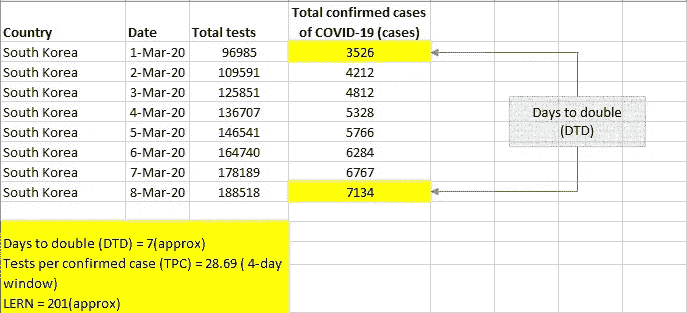
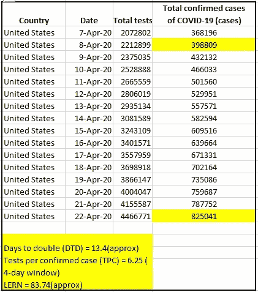
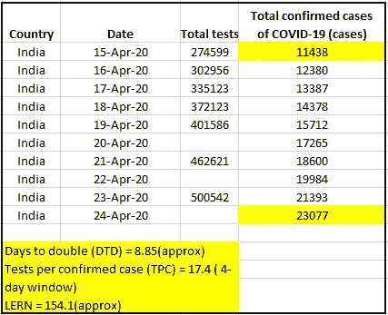
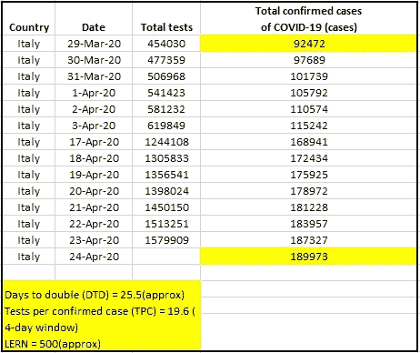

# 新冠肺炎:锁定放松准备系数

> 原文：<https://medium.com/analytics-vidhya/covid-19-lockdown-easing-readiness-factor-2b2916532b70?source=collection_archive---------27----------------------->

本文将提供一些有意义的见解，来量化一个国家或地区放松封锁的准备情况。有两个几乎所有人都认同的重要因素。首先是感染病例的翻倍率。它被普遍认为是确定病毒传播速度的关键指标。第二是每个确诊病例的检测次数，这对于主动识别感染病例至关重要。还有几个其他因素，但将这些作为主要因素，我将尝试得出一个锁定放松准备就绪数字(LERN)以及随后的一个锁定放松准备就绪系数(LERF)，这将是一个相对于参考的数字。计算将针对以下 3 个国家——印度、美国和意大利。

注*: —这里我们讨论的是检测病毒存在的试验，而不是抗体试验。

**参考:**

我们需要一个好的参照，而韩国无疑是一个理想的参照。尽管除了关闭学校一段时间之外，它没有实施积极的封锁措施，但它引入了严格的纪律，创造了类似封锁的条件。不用说，他们的测试策略堪称典范。

**LERN 计算方法:**

加倍率越高，解除锁定的准备程度就越高。我们将把这个变量称为双倍天数( *dtd* )。每个确诊病例的检测次数也是如此。我们将把这个变量称为每个确认案例的测试( *tpc* )。

因此，如果政府从明天开始作出决定，那么要问的问题是

1.多久以前感染病例总数是现在的一半？

2.在过去 4 天(或任何其他合适的时间窗口)内，我们对在此期间发现的每个确诊病例进行的检测总数是多少？

假设尽可能接近线性关系，LERN 独立地与这些变量中的每一个成正比。

LERN α *dtd* * *tpc*

引入扩展常数 *s* 。

LERN =*s***dtd***TPC*

显然，LERN 的价值越高，放松封锁的意愿就越强。

**南韩的计算:**

我们将计算南韩的 LERN，假设封锁已于 3 月 8 日解除。这是因为这一时期的关键变量与其他相关国家相当，更重要的是，在此日期之后，感染率显著下降——这是任何国家都希望看到的。

下表显示了 3 月 1 日至 3 月 8 日期间的相关数据和计算。

所以，LERN = s* 201

**其他国家的计算:**

美国:

假定解除封锁的日期是 4 月 22 日。

印度:

假定解除封锁的日期是 4 月 24 日。

意大利:

假定解除封锁的日期是 4 月 24 日。

以上所有数字的数据来源是数据中的[我们的世界。](https://ourworldindata.org/grapher/covid-19-total-confirmed-cases-vs-total-tests-conducted)

因此，一般来说，如果某个国家加倍的天数较少，那么为了弥补这一点，需要对每个确诊病例进行更多的检测。

**锁定解除准备系数(LERF):**

=154.1/201 = 0.77

因此，很明显，在放松封锁措施时，LERF ≥ 1 是首选值。既然是比值，常数' *s* '就会抵消掉。

美国的 LERF 是 0.42，意大利是 2.48。

**测试效率**

假设检测过程在不同地区/国家识别由确诊病例引起的潜在感染人群的效率相同。这有点像对一群鱼撒网。网的面积大致类似于每个确诊病例的检测数量，但为了捕获更多的鱼，网需要瞄准正确的位置。接触追踪是正在使用的关键工具。

测试完成和采取隔离措施的周期时间也是一个重要方面，该方面假定在整个地区/国家是一致的。

**其他因素:**

测试覆盖面:该国的人口在遏制病毒的能力方面可能相当重要。对于像意大利这样的国家而言，相对于印度，前者的优势是由于其人口较少，达到群体免疫阶段的速度要快得多。因此，每 1000 人的测试数量将是一个重要的指标。

热点地区:国家的面积对于确定病毒爆发的潜在注射点(疾病媒介)的数量以及热点地区可能是重要的。因此，对于一个较大的国家来说，通过适当的检测措施来控制传播将会带来更大的挑战。

死亡率:这可能是一个影响因素，根据人口统计和其他方面，这可能是该地区特有的。