# 新冠肺炎疫情探索性数据分析与预测

> 原文：<https://medium.com/analytics-vidhya/covid-19-outbreak-exploratory-data-analysis-and-prediction-5ff0ec4ad47a?source=collection_archive---------21----------------------->


2019 年冠状病毒疾病的爆发(**新冠肺炎**)始于中国湖北省武汉市。新冠肺炎的繁荣正迅速成为一个主要的全球性危机，这使得世界卫生组织(世卫组织)宣布新冠肺炎为疫情。

虽然谷歌的 DeepMind 等公司正在使用人工智能来生成关于冠状病毒的预测，这可能有助于研究人员阻止全球爆发，但较小的公司和个人数据科学家和数据分析师也在修补冠状病毒数据，以便更好地理解爆发。

下面我对**新冠肺炎**数据集进行探索性数据分析，并基于数据集做出推论。我们研究使用的数据集在约翰·霍普金 GitHub 库上。它包括累计确诊病例数、痊愈病例数和死亡病例数。它还包括被感染患者的省/州、观察日期(观察日期)和国家。

让我们导入所需的 python 库和数据集:

然后我们会读取数据集。涵盖的数据集更新到 3 月 29 日。让我们打印前五行数据集。

```
covid19.head()
```

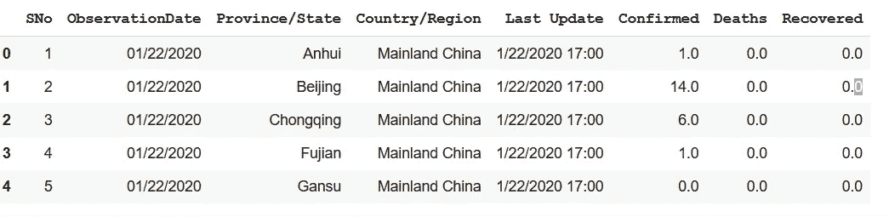

如您所见，我们有 8 列包含各国的确诊、康复和死亡病例，数据集有 67 个条目。

我们希望将 **ObservationDate** 和 **Last Update** 列转换为日期和时间对象。

lets 将 2020 年 1 月 22 日以来全球范围内的确诊和死亡病例总数进行了分组

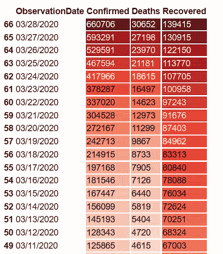

从上表中，我们可以推断，在近三个月的时间里，病毒的传播从 2020 年 1 月 22 日的 555 例确诊病例上升到截至 2020 年 3 月 28 日的 660，706 例。

让我们创建一个名为**的新列活动**行，从死亡列中减去确认列，并且不包含中国数据框架，以便于数据可视化和分析

让我们计算整个世界的总活跃，恢复，死亡和百分比随着时间的推移。

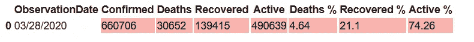

按照上述方法，我们可以计算中国和意大利一段时间内的总活跃死亡、康复死亡和百分比

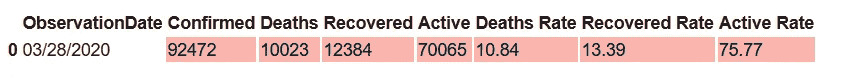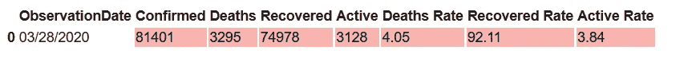

现在让我们制作全球确诊病例的分布图。一个**分布图**显示一个**分布图**和一组数值的范围，绘制一个新的分布数据框。

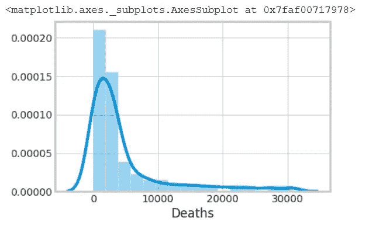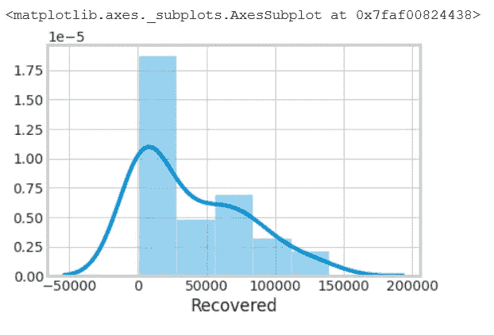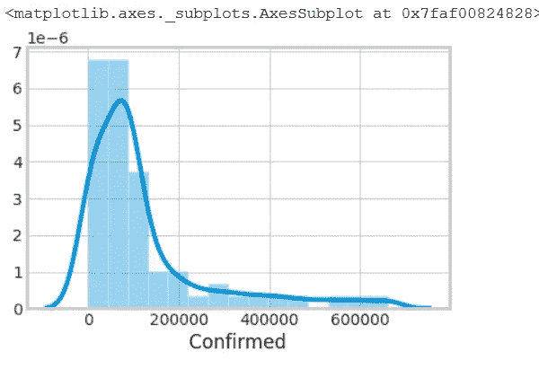

全球确诊病例分布图

那么让我们看看全世界的死亡率和恢复率。死亡率是对全部确诊病例中死亡人数的衡量，而恢复率是对一段时间内全部确诊病例中恢复人数的衡量。

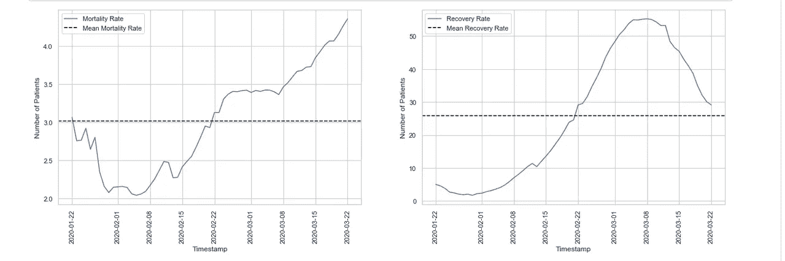

全世界死亡率和恢复率分析

现在让我们开始玩一些交互式数据可视化。我使用 Ploty 进行数据可视化。Plotly 的 Python 和 R graphing library 制作了交互式的、出版物质量的图形。

一段时间内的全球案例

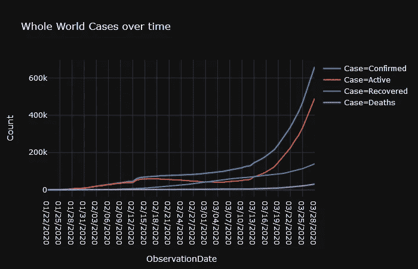

从上面的图表中我们可以看到，确诊病例的数量不断增加，从而增加了死亡病例的数量，康复病例的数量，以及仍然感染的患者的数量。幸运的是，与死于新冠肺炎相比，康复的可能性更高。

除此之外，我们还可以看到，在 2020 年 2 月 16 日到 2020 年 3 月 8 日之间，感染患者的恢复率有所下降。我们可能会建议受影响国家的政府需要采取措施，以确保在很长一段时间内康复患者的数量有显著增加。

中国案例随时间推移

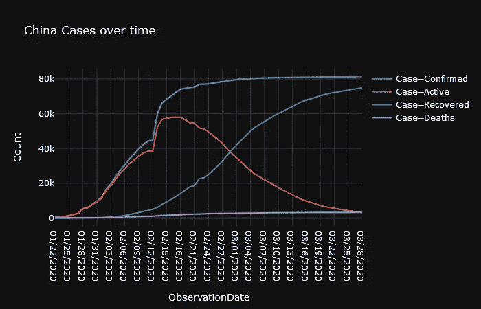

在上述案例中，我们可以看到中国的活跃案例正在减少。

活动、已恢复和死亡案例的饼图

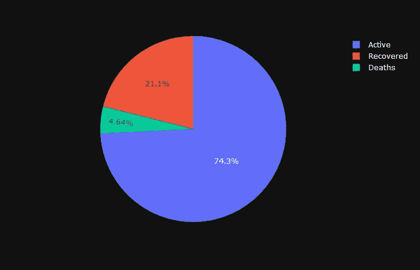

让我们把整个世界的地理地图形象化。

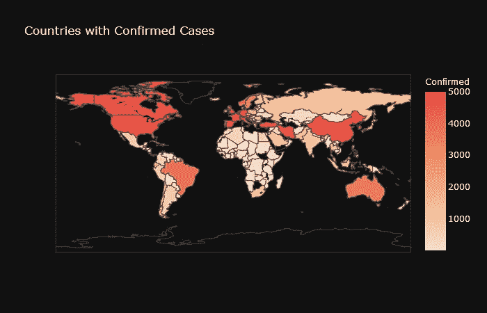

上图只是说明了病毒是如何在全球传播的。

## **进行预测**

为了创建我们的模拟，我们从约翰·霍普金斯大学系统科学与工程中心提供的[在线知识库](https://github.com/CSSEGISandData/COVID-19)中提取了追溯到 1 月 22 日的冠状病毒数据。

这些带有时间戳的数据详细记录了新冠肺炎确诊病例的数量和位置，包括康复的人和死亡的人。

选择合适的建模技术对于我们结果的可靠性是不可或缺的。我们使用时间序列预测，这是一种基于以前观察到的值来预测未来值的方法。

我使用支持向量机算法对未来进行预测。

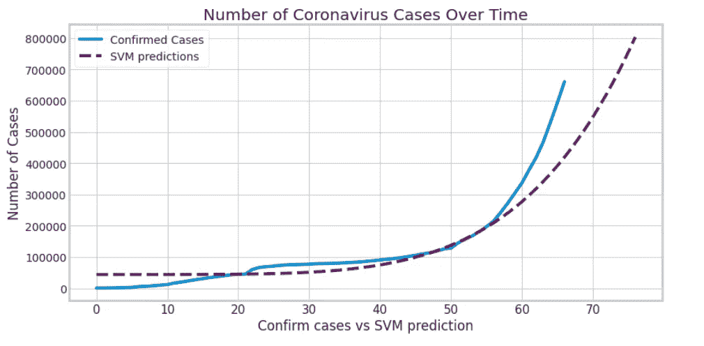

上图显示了真实的确认案例与我的预测模型的对比图，你可以从这里得到源代码【https://github.com/aadhil96/covid19_analysis_and_prediction。