# 新冠肺炎使用分类预测死亡率

> 原文：<https://medium.com/analytics-vidhya/covid-19-predicting-death-rate-using-classification-9a095eba9e57?source=collection_archive---------16----------------------->

[来源](https://www.crayon.com/en/news-and-resources/covid-machine-learning/)

美国 5 月 26 日因 COVID 19 死亡的总人数突破了 10 万大关。随着新冠肺炎的每日增加和有限的医院容量，医护人员极难监测所有 COVID 19 检测呈阳性的人，因为大多数国家的病死率低于 10%。美国消费者新闻与商业频道发表的一篇[文章](https://www.google.ca/amp/s/www.cnbc.com/amp/2020/04/06/coronavirus-cases-states-with-biggest-hospital-bed-shortfalls.html)指出，许多州的医院缺乏足够的重症监护室床位来应对预计的 COVID 19 病例。然而，由于大多数国家每天都在更新与 COVID 19 相关的数据。随着使用历史数据的机器学习的进步，很容易预测哪些人因 COVID 19 而面临风险。

如果我们能够准确预测所有感染 COVID 19 的人，患者是否会死亡。那么可以给予病人更多的优先权，并且可以对病人进行持续的监测，以防止病人死亡。

# **数据可视化**

由于从[加拿大统计局](https://www150.statcan.gc.ca/t1/tbl1/en/tv.action?pid=1310078101)网站下载数据的复杂性，只收集了与 2000 个 COVID 19 案例相关的数据。关于 COVID 19 是如何影响不同年龄组和性别的一些有趣的问题已经在我之前的博客([链接](/@jaswanth.badvelu/how-does-covid-19-affect-different-age-groups-and-genders-8347155a189))中回答了。除了我以前的博客中使用的变量，加拿大统计局发布了地区无症状状态的更新数据。让我们在进入分类之前探索这些数据，看看是否能发现任何新的见解。

**哪个地区的住院人数更多？**

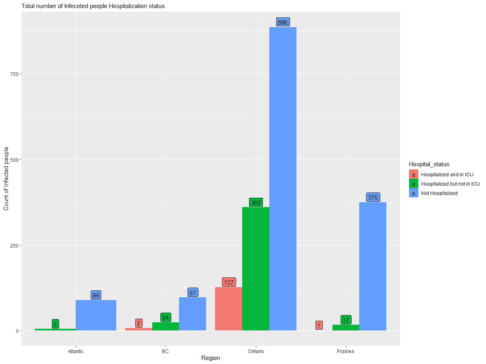

图一。按区域划分的住院人数状态

大西洋地区包括新不伦瑞克、新斯科舍、爱德华王子岛、纽芬兰和拉布拉多。安大略地区包括安大略省和努勒维特。大草原地区包括阿尔伯塔省、萨斯喀彻温省、马尼托巴省和西北地区。不列颠哥伦比亚和育空被认为是公元前。可以看出，大多数病例来自安大略地区，几乎 35%的感染 COVID 19 的人住院治疗，而不列颠哥伦比亚省为 25%。大西洋和大草原地区的住院病人比例不到 5%。

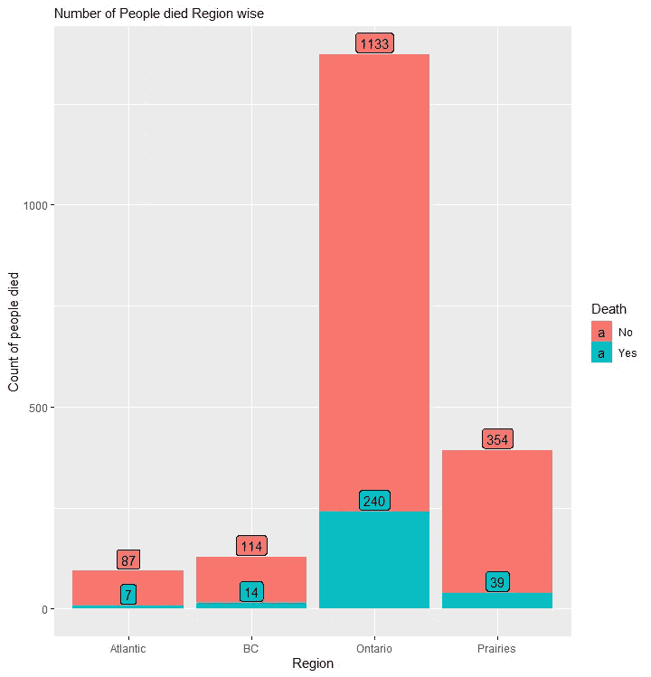

图二。人们死于地区性疾病

安大略省死亡率最高，有 17.5%的感染者死于新冠肺炎，大西洋地区死亡率最低，只有 7.45%的感染者死亡。大草原地区的死亡率为 9.9%。令人惊讶的是，即使不列颠哥伦比亚省有更多的人住院治疗，死亡率也是 11%，这与安大略省相比是非常好的。

受感染的人有任何症状吗？

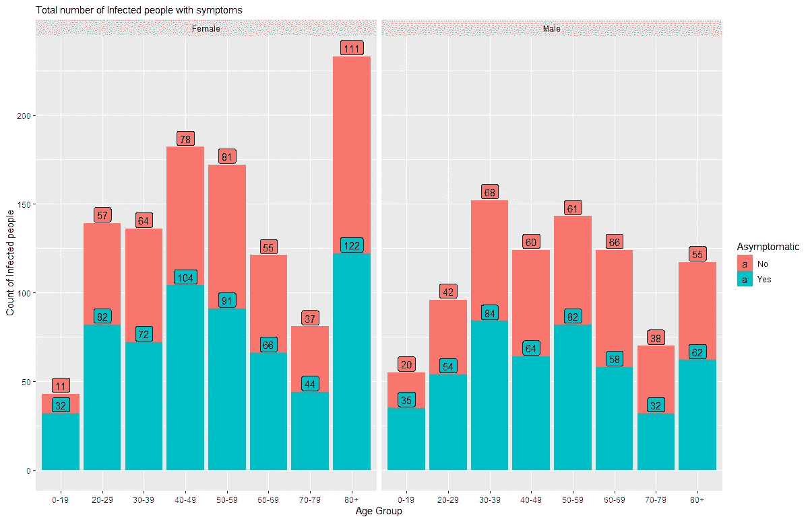

图三。不同年龄组人群症状状况

在所有 COVID 19 检测呈阳性的人中。可以看出，几乎 50%的男女患者即使感染了 COVID 19 也没有表现出任何症状。

看到几天后没有表现出任何症状而住院的人数将是有趣的。

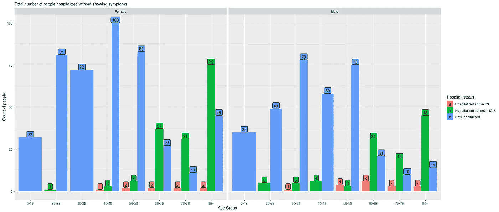

图 4。人住院状态没有表现出任何症状

在所有检测呈阳性的 COVID 19 名患者中没有任何症状。只有 80 岁以上的人需要医疗护理，有些人甚至需要重症监护室。大多数 60 岁以下的人康复时不需要医疗护理。现在让我们看看有多少人在没有任何症状的情况下死去。

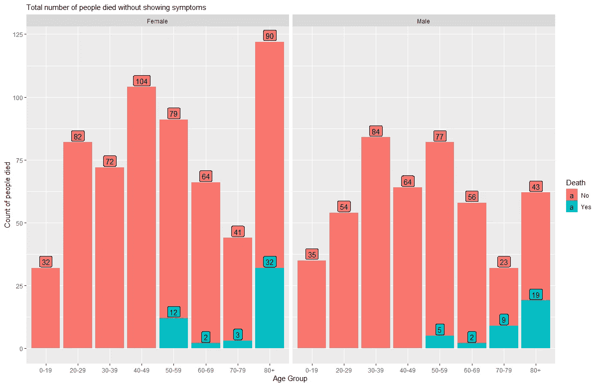

图五。没有症状的死亡状态

所有未表现出任何症状的 50 岁以下的人从 COVID 19 中康复。即使对于 50 岁以上的人来说，大多数人在接受医疗护理后都康复了。

# 分类

在任何预测一个变量的机器学习模型中，在训练机器模型之前识别正确的变量是非常关键的，因为每次都获得所有变量是非常困难的。正确的变量可以通过使用相关矩阵来识别。在矩阵中，应考虑与所需变量高度相关的所有变量。

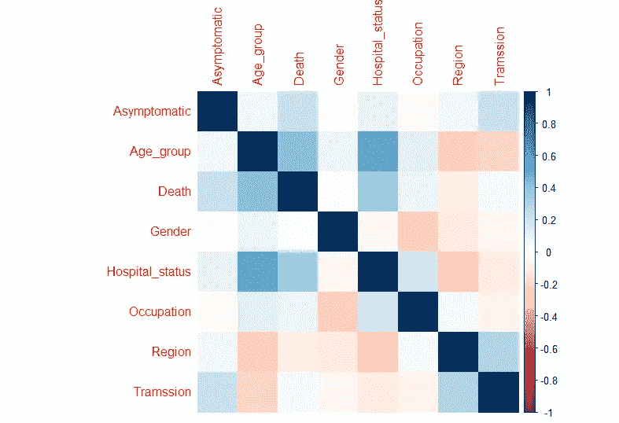

图六。相关矩阵图

从相关矩阵可以看出，死亡变量与年龄组、医院状况和无症状变量相关，即这些变量与死亡变量相关。所以用这些变量来训练模型，预测病人会不会死。

在使用数据训练模型之后，检查模型在使用看不见的数据时是否表现良好也很重要。所以用样本。split 命令在 R 中，70%的数据被随机划分以训练模型，剩余的 30%的数据对模型隐藏，因此可以用于验证模型。

**支持向量机**

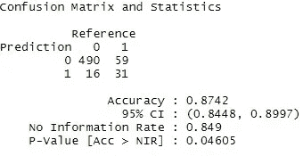

使用所有变量时的混淆矩阵和准确性

当训练支持向量机模型来预测死亡状态时。当使用所有变量时，模型预测的准确率为 87.42%。

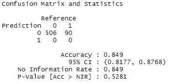

仅使用 3 个变量进行训练时的混淆矩阵和准确性

而当年龄组、医院状况和无症状变量用于训练模型时，准确率为 84.9%。

**逻辑回归**

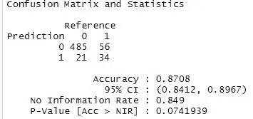

两种情况下逻辑回归的混淆矩阵和准确性

Logistic 回归模型能够以 87.8%预测患者是否会死亡。当使用所有变量和仅使用 3 个变量时，两种情况下的准确率保持相同。

**决策树**

在决策树模型的情况下，当用所有变量训练模型以预测死亡状态时，准确率为 87.42%。

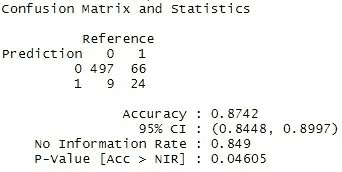

当所有变量都用于训练时，混淆矩阵和准确性

有趣的是，当只使用年龄组、医院状况和无症状变量来训练模型时，准确性略有提高，准确率为 87.75%。

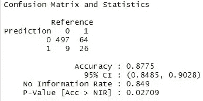

仅使用 3 个变量进行训练时的混淆矩阵和准确性

下面绘制了决策树，以便更好地理解哪些变量更重要。

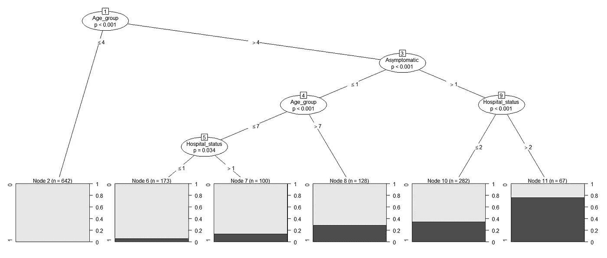

图 7。三变量决策树图

根据这个决策树，可以解释为，对于所有年龄在 40 岁以下的人，该模型假设他将存活。对于 40 岁以上的人，先检查症状，然后检查年龄组和医院状况。对于没有症状的人，70 岁以上的人更受重视。在有症状的人的情况下，需要医疗护理的人更优先，转移到 ICU 的人有 75%的可能性，住院的人有 30%的可能性。

**随机森林**

当仅使用年龄组、医院状况和无症状变量来训练模型时，随机森林模型能够以 87.92%的最高准确度预测患者是否会死亡。

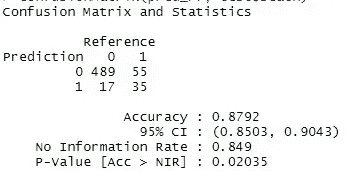

使用 3 个变量进行训练时的精确度

现在让我们看看当所有变量都被使用时是否会有任何改进。

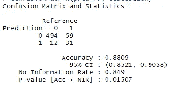

所有变量用于训练时的准确性

当所有变量都用于训练模型预测死亡时，随机森林的准确率为 88.09%。绘制随机森林的可变重要性，以检查哪些因素对预测死亡具有最高影响。

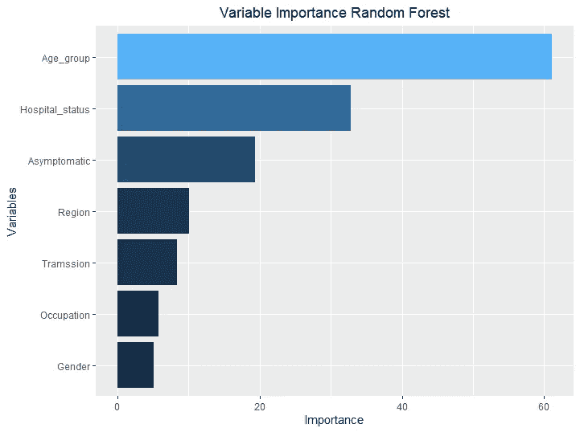

图 8。可变重要性

可以看出，作为预期年龄组，医院地位，无症状变量有更多的重要性。

# **结论**

当已知患者的年龄组、医院状况以及患者是否出现症状时。使用随机森林，我们可以预测病人是否会死亡，准确率接近 88%。这有助于卫生保健工作者识别死亡风险最高的患者，从而可以给予这些患者更多的优先权。尽管准确率是 88%,但这意味着错误率是 12%,这对医疗保健部门来说有点高，因为我们处理的是病人的生命。因此，该模型应该用更多的数据进行训练，并且在用于医疗保健部门进行决策之前，还应该使用超调进行改进，以降低错误率。

# 数据收集

数据包括从加拿大统计局收集的 2000 例 COVID 19 病例。