# Covid 19 Return(新常态)—重返办公室并保护人们安全的解决方案，一种新方法

> 原文：<https://medium.com/analytics-vidhya/covid-19-return-new-normal-solution-to-return-to-office-and-keep-people-safe-a-new-approach-420dcbf9bf4c?source=collection_archive---------20----------------------->

```
Note: This project is open sourced. There is no intention to use person picture for any other use. We take privacy and security very serious. Other's when you use the project be cognizant of the privacy and security please.
```

鉴于 Covid 时代，我们希望建立一个使用人工智能或机器学习或深度学习来识别人、面具和社交距离的系统。该系统应该能够报告它能够检测到什么对象。在检测到物体时，系统还应该计算

*   距离
*   检测到物体
*   找到中心
*   找到多少个中心
*   紧密配对-违反列表
*   数数有多少风险在哪里
*   找到的总人数
*   纬度
*   经度
*   序列号
*   事件时间

上述收集的数据被收集并存储用于长期存储，也可查询存储以报告。构建报告是为了显示 KPI。

*   每天违规总数-高风险
*   违规时的普通人
*   违规时的平均距离
*   当天检测到它的时间图
*   以周/月为单位的时间图表，显示违规的趋势。
*   设备地图并在地图上显示违规次数-覆盖不同的位置。
*   基于上述 KPI 的位置向下钻取。

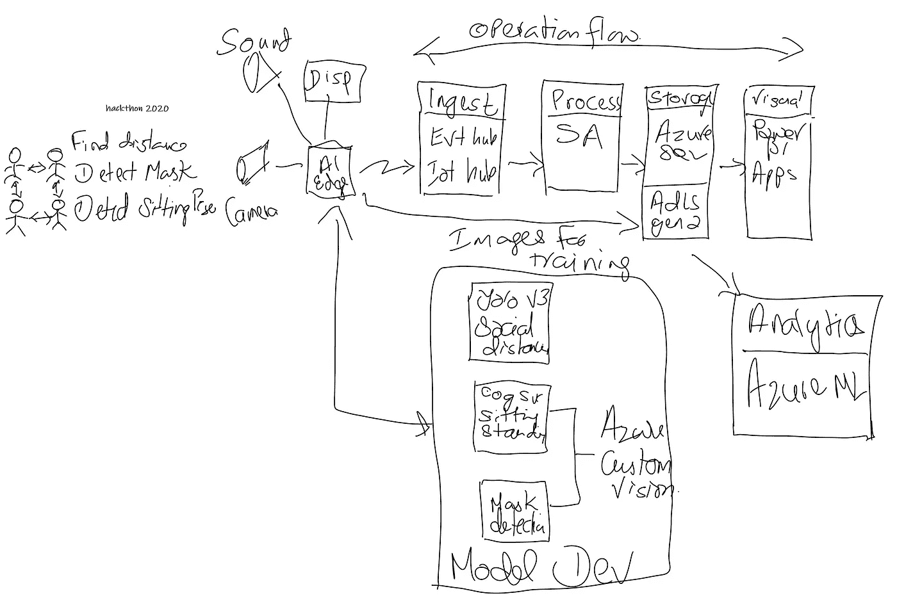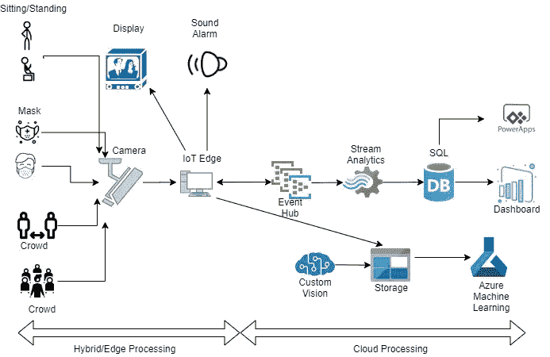

*   模型构建
    使用现有的开源 yolo v3 模型
    计算社交距离
    构建模型检测面具
*   收集事件数据并发送到事件中心
*   用于处理来自活动中心的数据的流分析
*   将数据存储在 ADLS EN2，用于长期存储和分析
*   存储用于 KPI 报告的 Azure SQL 数据库

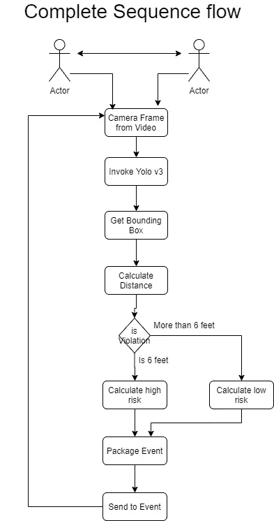

用于社交距离检测器


用于报告和云处理

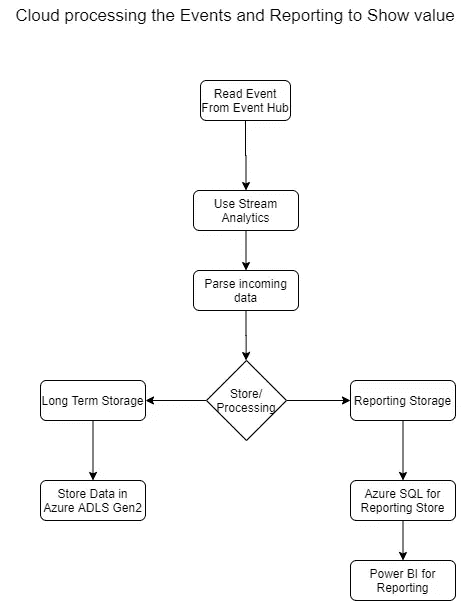

我们使用 python 来构建模型推理代码。我们也在利用 yolo v3 微型版。

```
wget https://pjreddie.com/media/files/yolov3-tiny.weights
```

配置

[https://github . com/pjreddie/darknet/blob/master/CFG/yolov 3-tiny . CFG](https://github.com/pjreddie/darknet/blob/master/cfg/yolov3-tiny.cfg)

sdd_gui.py 是启动视频的主可视化程序。

sdd.py 是进行推理和社交距离计算的代码，它还将事件打包并发送到事件中心进行进一步处理。

示例事件看起来像

```
{"label": "person", "distance": "265.41476974727686", "center": "[[580, 345], [576, 346], [317, 288]]", "length": "3", "highrisk": "3", "ans": "0", "close_pair": "[[[580, 345], [576, 346]], [[580, 345], [317, 288]], [[576, 346], [580, 345]], [[576, 346], [317, 288]], [[317, 288], [580, 345]], [[317, 288], [576, 346]]]", "s_close_pair": "[]", "lowrisk": "0", "safe_p": "0", "total_p": "3", "lat": "42.8895", "lon": "-87.9074", "serialno": "hack20201", "eventtime": "22/07/2020 07:23:19"} Message: {"label": "person", "distance": "268.68941177500835", "center": "[[583, 343], [579, 343], [316, 288]]", "length": "3", "highrisk": "3", "ans": "0", "close_pair": "[[[583, 343], [316, 288]], [[579, 343], [316, 288]], [[316, 288], [583, 343]], [[316, 288], [579, 343]]]", "s_close_pair": "[]", "lowrisk": "0", "safe_p": "0", "total_p": "3", "lat": "42.8895", "lon": "-87.9074", "serialno": "hack20201", "eventtime": "22/07/2020 07:23:21"}
```

运行 sdd_gui.py。

```
Note: the application needs conda environment to run tensorflow models. Also the yolo and weights are needed.
```

单击“开始”按钮，不为本地网络摄像机填写任何内容

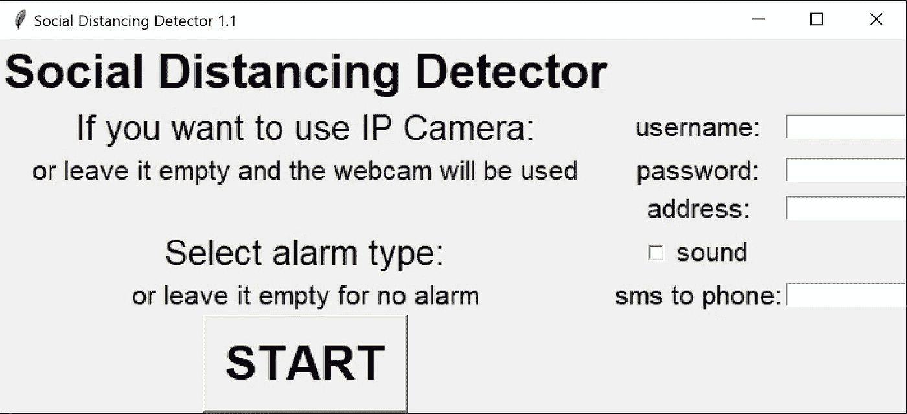

等待带有方框的视频屏幕出现。

检查输出窗口，查看发送到事件中心的消息。

风险状况

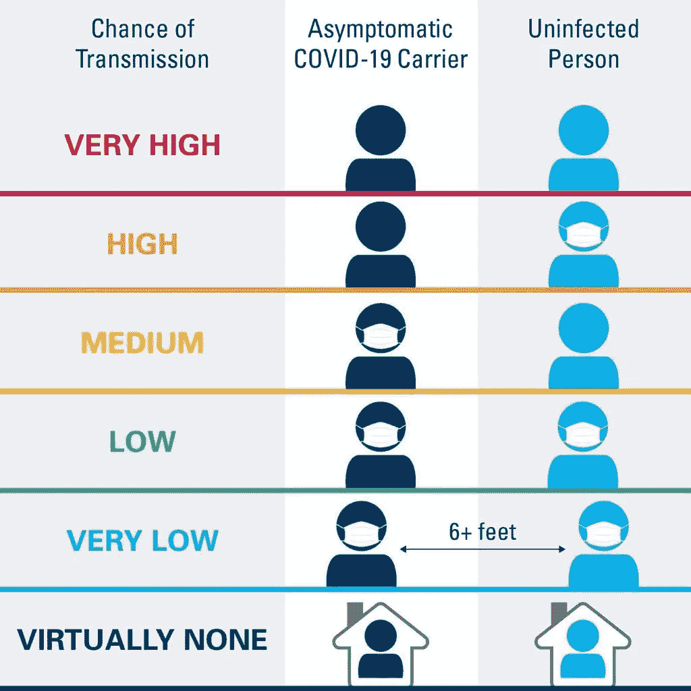

为了处理来自事件中心的事件，我们使用流分析从事件中心读取事件，并写入这里的 2 个输出

*   Azure data lake store gen2 用于长期存储
*   用于报告的 Azure SQL 数据库

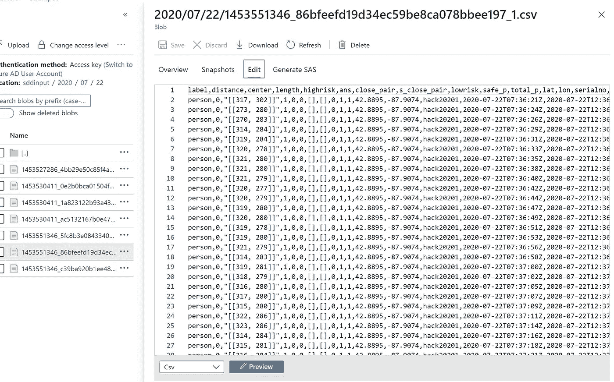

SQL 模式

```
create table dbo.sdddeetails
(
    label varchar(50),
    distance varchar(100),
    center varchar(100),
    length varchar(50),
    highrisk varchar(50),
    ans varchar(50),
    close_pair varchar(200),
    s_close_pair varchar(200),
    lowrisk varchar(50),
    safe_p varchar(50),
    total_p varchar(50),
    lat varchar(50),
    lon varchar(50),
    serialno varchar(50),
    posepredict varchar(50,
    posepredictprob varchar(50),
    maskPredict varchar(50,
    maskPredictProb varchar(50),
    EventProcessedUtcTime datetime,
    EventEnqueuedUtcTime datetime
)
```

让我们为模型添加更多的细节，以保存公司、位置和序列号

```
create table company
(
    companyid bigint IDENTITY(1,1),
    companyname varchar(250),
    address1 varchar(250),
    address2 varchar(250),
    city varchar(100),
    state varchar(50),
    zip varchar(15),
    country varchar(250),
    parent varchar(1),
    parentid bigint,
    inserttime datetime
)

insert into company(companyname, address1,city,state,zip,country,parent,parentid,inserttime) values('company A', '850 east address street','city','WA','xxxxx','US','n',0,getdate())

create table locations
(
    locationid bigint IDENTITY(1,1),
    companyid bigint,
    locationname varchar(200),
    address1 varchar(250),
    address2 varchar(250),
    city varchar(100),
    state varchar(50),
    zip varchar(15),
    country varchar(250),
    latitude varchar(25),
    longitude varchar(25),
    active varchar(1),
    inserttime datetime
)

insert into locations(companyid,locationname,address1,city,state,zip,country,latitude,longitude,active,inserttime) values(1,'city','1 dre ave','xyz','WI','12345','US','xxxxxxxx','xxxxxxxx','1',getdate())

create table serialno
(
    id bigint IDENTITY(1,1),
    locationid bigint,
    serialno varchar(100),
    latitude varchar(25),
    longitude varchar(25),
    active varchar(1),
    inserttime datetime
)

insert into serialno(locationid,serialno,latitude,longitude,active,inserttime) values (1,'hack20201','xxxxxxx','xxxxxx','1',getdate())

create table violationaggr
(
SerialNo varchar(50),
Label varchar(50),
Avgdistance float,
Maxdistance float,
Mindistance float,
Countofhighrisk float,
Avghighrisk float,
Countsafep float,
Avgsafep float,
Counttotalp float,
Avgtotalp float,
StartTime datetime,
EndTime datetime
)
```

现在，让我们构建 SQL 数据存储来存储所有数据，并进行一些数据建模。

```
Note the above company, location tables are sample. for proper implementation please use below data model.
```

这是我们正在收集的上述数据的更多元数据的 ER 图。

为了使它成为一个真正的系统，我们决定增加更多的细节。

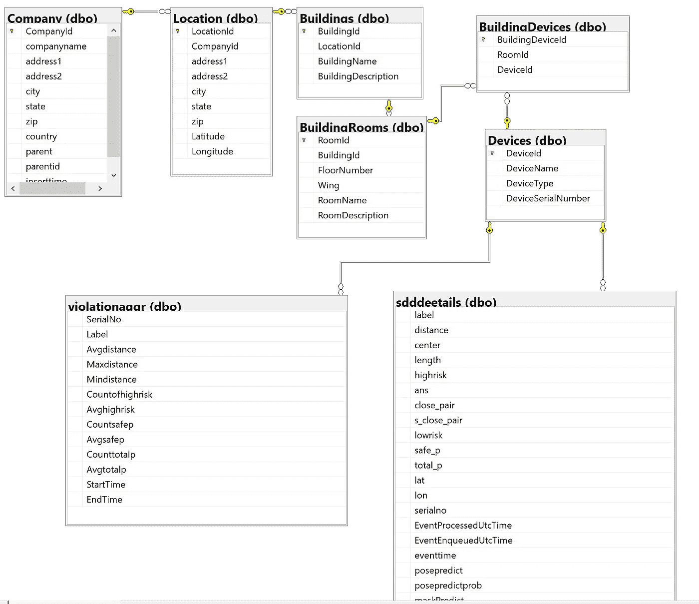

因此，对于上面的图表，SQL 是

```
/****** Object:  Table [dbo].[BuildingDevices]    Script Date: 7/27/2020 10:30:56 PM ******/
SET ANSI_NULLS ON
GO
SET QUOTED_IDENTIFIER ON
GO
CREATE TABLE [dbo].[BuildingDevices](
	[BuildingDeviceId] [int] IDENTITY(1,1) NOT NULL,
	[RoomId] [int] NULL,
	[DeviceId] [int] NULL,
 CONSTRAINT [PK__Building__11661996594571B7] PRIMARY KEY CLUSTERED 
(
	[BuildingDeviceId] ASC
)WITH (STATISTICS_NORECOMPUTE = OFF, IGNORE_DUP_KEY = OFF) ON [PRIMARY]
) ON [PRIMARY]
GO
/****** Object:  Table [dbo].[BuildingRooms]    Script Date: 7/27/2020 10:30:56 PM ******/
SET ANSI_NULLS ON
GO
SET QUOTED_IDENTIFIER ON
GO
CREATE TABLE [dbo].[BuildingRooms](
	[RoomId] [int] IDENTITY(1,1) NOT NULL,
	[BuildingId] [int] NULL,
	[FloorNumber] [int] NULL,
	[Wing] [varchar](400) NULL,
	[RoomName] [varchar](800) NULL,
	[RoomDescription] [varchar](800) NULL,
 CONSTRAINT [PK__Building__328639394CD8D22D] PRIMARY KEY CLUSTERED 
(
	[RoomId] ASC
)WITH (STATISTICS_NORECOMPUTE = OFF, IGNORE_DUP_KEY = OFF) ON [PRIMARY]
) ON [PRIMARY]
GO
/****** Object:  Table [dbo].[Buildings]    Script Date: 7/27/2020 10:30:56 PM ******/
SET ANSI_NULLS ON
GO
SET QUOTED_IDENTIFIER ON
GO
CREATE TABLE [dbo].[Buildings](
	[BuildingId] [int] IDENTITY(1,1) NOT NULL,
	[LocationId] [int] NULL,
	[BuildingName] [varchar](800) NULL,
	[BuildingDescription] [varchar](8000) NULL,
 CONSTRAINT [PK__Building__5463CDC4D2ECF49E] PRIMARY KEY CLUSTERED 
(
	[BuildingId] ASC
)WITH (STATISTICS_NORECOMPUTE = OFF, IGNORE_DUP_KEY = OFF) ON [PRIMARY]
) ON [PRIMARY]
GO
/****** Object:  Table [dbo].[Company]    Script Date: 7/27/2020 10:30:56 PM ******/
SET ANSI_NULLS ON
GO
SET QUOTED_IDENTIFIER ON
GO
CREATE TABLE [dbo].[Company](
	[CompanyId] [int] IDENTITY(1,1) NOT NULL,
	[companyname] [varchar](800) NULL,
	[address1] [varchar](8000) NULL,
	[address2] [varchar](8000) NULL,
	[city] [varchar](400) NULL,
	[state] [varchar](400) NULL,
	[zip] [varchar](100) NULL,
	[country] [varchar](200) NULL,
	[parent] [int] NULL,
	[parentid] [int] NULL,
	[inserttime] [datetime] NULL,
 CONSTRAINT [PK__Company__AD5755B8E30FA13C] PRIMARY KEY CLUSTERED 
(
	[CompanyId] ASC
)WITH (STATISTICS_NORECOMPUTE = OFF, IGNORE_DUP_KEY = OFF) ON [PRIMARY]
) ON [PRIMARY]
GO
/****** Object:  Table [dbo].[Devices]    Script Date: 7/27/2020 10:30:56 PM ******/
SET ANSI_NULLS ON
GO
SET QUOTED_IDENTIFIER ON
GO
CREATE TABLE [dbo].[Devices](
	[DeviceId] [int] IDENTITY(1,1) NOT NULL,
	[DeviceName] [varchar](800) NULL,
	[DeviceType] [varchar](800) NULL,
	[DeviceSerialNumber] [varchar](50) NOT NULL,
 CONSTRAINT [PK__Devices__49E1231141A059F5] PRIMARY KEY CLUSTERED 
(
	[DeviceId] ASC
)WITH (STATISTICS_NORECOMPUTE = OFF, IGNORE_DUP_KEY = OFF) ON [PRIMARY],
 CONSTRAINT [UQ_DeviceSerialNumber] UNIQUE NONCLUSTERED 
(
	[DeviceSerialNumber] ASC
)WITH (STATISTICS_NORECOMPUTE = OFF, IGNORE_DUP_KEY = OFF) ON [PRIMARY]
) ON [PRIMARY]
GO
/****** Object:  Table [dbo].[Location]    Script Date: 7/27/2020 10:30:56 PM ******/
SET ANSI_NULLS ON
GO
SET QUOTED_IDENTIFIER ON
GO
CREATE TABLE [dbo].[Location](
	[LocationId] [int] IDENTITY(1,1) NOT NULL,
	[CompanyId] [int] NULL,
	[address1] [varchar](8000) NULL,
	[address2] [varchar](8000) NULL,
	[city] [varchar](400) NULL,
	[state] [varchar](400) NULL,
	[zip] [varchar](100) NULL,
	[Latitude] [varchar](80) NULL,
	[Longitude] [varchar](80) NULL,
 CONSTRAINT [PK__Location__306F78A6EB400AE6] PRIMARY KEY CLUSTERED 
(
	[LocationId] ASC
)WITH (STATISTICS_NORECOMPUTE = OFF, IGNORE_DUP_KEY = OFF) ON [PRIMARY]
) ON [PRIMARY]
GO
/****** Object:  Table [dbo].[sdddeetails]    Script Date: 7/27/2020 10:30:56 PM ******/
SET ANSI_NULLS ON
GO
SET QUOTED_IDENTIFIER ON
GO
CREATE TABLE [dbo].[sdddeetails](
	[label] [varchar](50) NULL,
	[distance] [varchar](100) NULL,
	[center] [varchar](100) NULL,
	[length] [varchar](50) NULL,
	[highrisk] [varchar](50) NULL,
	[ans] [varchar](50) NULL,
	[close_pair] [varchar](200) NULL,
	[s_close_pair] [varchar](200) NULL,
	[lowrisk] [varchar](50) NULL,
	[safe_p] [varchar](50) NULL,
	[total_p] [varchar](50) NULL,
	[lat] [varchar](50) NULL,
	[lon] [varchar](50) NULL,
	[serialno] [varchar](50) NULL,
	[EventProcessedUtcTime] [datetime] NULL,
	[EventEnqueuedUtcTime] [datetime] NULL,
	[eventtime] [datetime] NULL,
	[posepredict] [varchar](50) NULL,
	[posepredictprob] [varchar](50) NULL,
	[maskPredict] [varchar](50) NULL,
	[maskPredictProb] [varchar](50) NULL
) ON [PRIMARY]
GO
/****** Object:  Table [dbo].[violationaggr]    Script Date: 7/27/2020 10:30:56 PM ******/
SET ANSI_NULLS ON
GO
SET QUOTED_IDENTIFIER ON
GO
CREATE TABLE [dbo].[violationaggr](
	[SerialNo] [varchar](50) NULL,
	[Label] [varchar](50) NULL,
	[Avgdistance] [float] NULL,
	[Maxdistance] [float] NULL,
	[Mindistance] [float] NULL,
	[Countofhighrisk] [float] NULL,
	[Avghighrisk] [float] NULL,
	[Countsafep] [float] NULL,
	[Avgsafep] [float] NULL,
	[Counttotalp] [float] NULL,
	[Avgtotalp] [float] NULL,
	[StartTime] [datetime] NULL,
	[EndTime] [datetime] NULL
) ON [PRIMARY]
GO
ALTER TABLE [dbo].[BuildingDevices]  WITH CHECK ADD  CONSTRAINT [FK_BuildingDevices_BuildingRooms] FOREIGN KEY([RoomId])
REFERENCES [dbo].[BuildingRooms] ([RoomId])
GO
ALTER TABLE [dbo].[BuildingDevices] CHECK CONSTRAINT [FK_BuildingDevices_BuildingRooms]
GO
ALTER TABLE [dbo].[BuildingDevices]  WITH CHECK ADD  CONSTRAINT [FK_BuildingDevices_Devices] FOREIGN KEY([DeviceId])
REFERENCES [dbo].[Devices] ([DeviceId])
GO
ALTER TABLE [dbo].[BuildingDevices] CHECK CONSTRAINT [FK_BuildingDevices_Devices]
GO
ALTER TABLE [dbo].[BuildingRooms]  WITH CHECK ADD  CONSTRAINT [FK_BuildingRooms_Buildings] FOREIGN KEY([BuildingId])
REFERENCES [dbo].[Buildings] ([BuildingId])
GO
ALTER TABLE [dbo].[BuildingRooms] CHECK CONSTRAINT [FK_BuildingRooms_Buildings]
GO
ALTER TABLE [dbo].[Buildings]  WITH CHECK ADD  CONSTRAINT [FK_Buildings_Location] FOREIGN KEY([LocationId])
REFERENCES [dbo].[Location] ([LocationId])
GO
ALTER TABLE [dbo].[Buildings] CHECK CONSTRAINT [FK_Buildings_Location]
GO
ALTER TABLE [dbo].[Location]  WITH CHECK ADD  CONSTRAINT [FK_Location_Company] FOREIGN KEY([CompanyId])
REFERENCES [dbo].[Company] ([CompanyId])
GO
ALTER TABLE [dbo].[Location] CHECK CONSTRAINT [FK_Location_Company]
GO
ALTER TABLE [dbo].[sdddeetails]  WITH CHECK ADD  CONSTRAINT [FK_sdddeetails_SerialNumber] FOREIGN KEY([serialno])
REFERENCES [dbo].[Devices] ([DeviceSerialNumber])
ON UPDATE CASCADE
ON DELETE CASCADE
GO
ALTER TABLE [dbo].[sdddeetails] CHECK CONSTRAINT [FK_sdddeetails_SerialNumber]
GO
ALTER TABLE [dbo].[violationaggr]  WITH CHECK ADD  CONSTRAINT [FK_violationaggr_SerialNumber] FOREIGN KEY([SerialNo])
REFERENCES [dbo].[Devices] ([DeviceSerialNumber])
ON UPDATE CASCADE
ON DELETE CASCADE
GO
ALTER TABLE [dbo].[violationaggr] CHECK CONSTRAINT [FK_violationaggr_SerialNumber]
GO
```

因为我们要写入多个位置，所以我们创建一个 CTE 来保存临时数据，然后写入多个位置。

我们还可以在流分析中进行窗口、分析和其他聚合，并保存到表中。

流分析有 2 个输入和 4 个输出

输入

```
input - Event hub input for device data sqlreferenceinput - Azure SQL based Reference data for power bi realtime
```

SQL 输入参考数据查询

```
select address1,city,state,b.BuildingName,Latitude,Longitude,FloorNumber, RoomName, DeviceSerialNumber  from Location a
inner join Buildings b
on a.LocationId = b.LocationId
inner join BuildingRooms c
on b.BuildingId = c.BuildingId
inner join BuildingDevices d
on d.RoomId = c.RoomId
inner join Devices e
on e.DeviceId = d.DeviceId
```

输出

```
outputblob - Output for ADLS gen2 storage for long term aggrsqloutput - Aggregated output every 1 minute to Azure SQL database table sqloutput - Raw data parsed and stored in Azure SQL database table for power BI report pbioutput - Streaming data set to Power BIWITH sddinput AS
(
    SELECT
    label,
    distance,
    center,
    length,
    highrisk,
    ans,
    close_pair,
    s_close_pair,
    lowrisk,
    safe_p,
    total_p,
    lat,
    lon,
    serialno,
    eventtime,
    posepredict,
    posepredictprob,
    maskPredict,
    maskPredictProb,
    EventProcessedUtcTime,
    EventEnqueuedUtcTime
    FROM input
)
SELECT
    label,
    distance,
    center,
    length,
    highrisk,
    ans,
    close_pair,
    s_close_pair,
    lowrisk,
    safe_p,
    total_p,
    lat,
    lon,
    serialno,
    eventtime,
    posepredict,
    posepredictprob,
    maskPredict,
    maskPredictProb,
    EventProcessedUtcTime,
    EventEnqueuedUtcTime
INTO outputblob
FROM sddinput

SELECT
    label,
    distance,
    center,
    length,
    highrisk,
    ans,
    close_pair,
    s_close_pair,
    lowrisk,
    safe_p,
    total_p,
    lat,
    lon,
    serialno,
    eventtime,
    posepredict,
    posepredictprob,
    maskPredict,
    maskPredictProb,
    EventProcessedUtcTime,
    EventEnqueuedUtcTime
INTO sqloutput
FROM sddinput

SELECT 
    sddinput.serialno,
    sqlreferenceinput.city,
    avg(CAST(sddinput.distance as bigint)) as Avgdistance,
    max(CAST(sddinput.distance as bigint)) as Maxdistance,
    min(CAST(sddinput.distance as bigint)) as Mindistance,
    COUNT(CAST(sddinput.highrisk as bigint)) as Countofhighrisk,
    AVG(CAST(sddinput.highrisk as bigint)) as Avghighrisk,
    COUNT(CAST(sddinput.safe_p as bigint)) as Countsafep,
    AVG(CAST(sddinput.safe_p as bigint)) as Avgsafep,
    COUNT(CAST(sddinput.total_p as bigint)) as Counttotalp,
    AVG(CAST(sddinput.total_p as bigint)) as Avgtotalp,
    min(CAST(sddinput.eventtime as datetime)) as StartTime,
    max(CAST(sddinput.eventtime as datetime)) as EndTime
INTO pbioutput
FROM sddinput inner join sqlreferenceinput
on sddinput.serialno = sqlreferenceinput.DeviceSerialNumber
Group by sddinput.serialno, sqlreferenceinput.city, TumblingWindow(minute, 1)

SELECT 
    serialno,
    avg(CAST(sddinput.distance as bigint)) as Avgdistance,
    max(CAST(sddinput.distance as bigint)) as Maxdistance,
    min(CAST(sddinput.distance as bigint)) as Mindistance,
    COUNT(CAST(sddinput.highrisk as bigint)) as Countofhighrisk,
    AVG(CAST(sddinput.highrisk as bigint)) as Avghighrisk,
    COUNT(CAST(sddinput.safe_p as bigint)) as Countsafep,
    AVG(CAST(sddinput.safe_p as bigint)) as Avgsafep,
    COUNT(CAST(sddinput.total_p as bigint)) as Counttotalp,
    AVG(CAST(sddinput.total_p as bigint)) as Avgtotalp,
    min(CAST(sddinput.eventtime as datetime)) as StartTime,
    max(CAST(sddinput.eventtime as datetime)) as EndTime
INTO aggrsqloutput
FROM sddinput
Group by serialno, TumblingWindow(minute, 1)
```

现在转到 SQL 并显示表数据

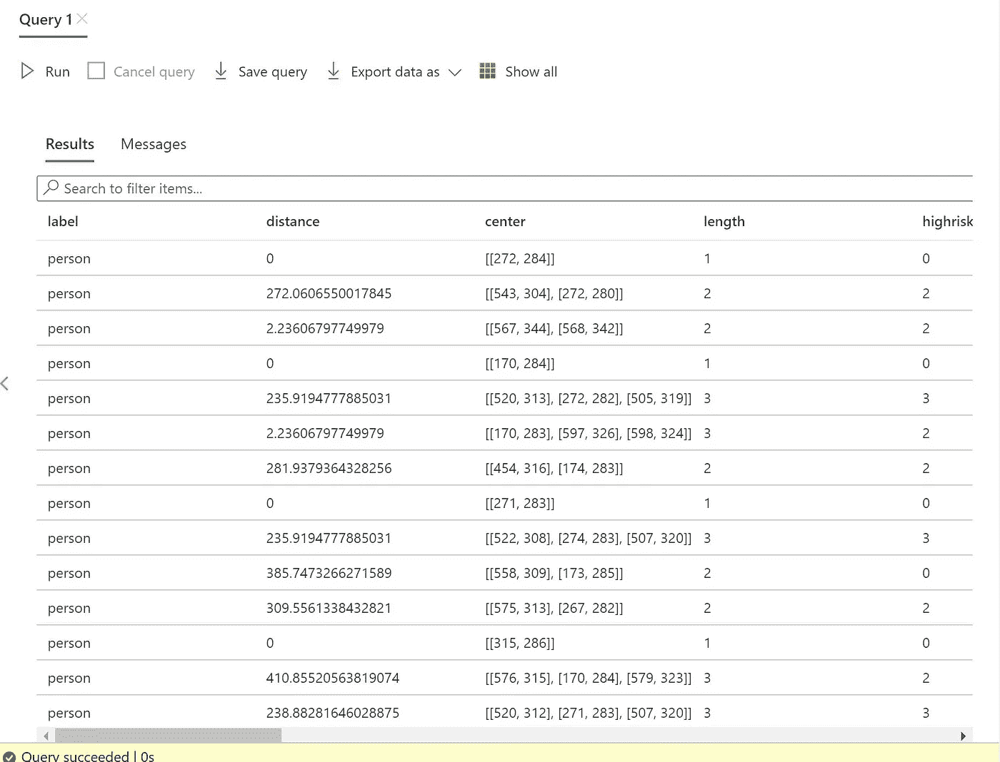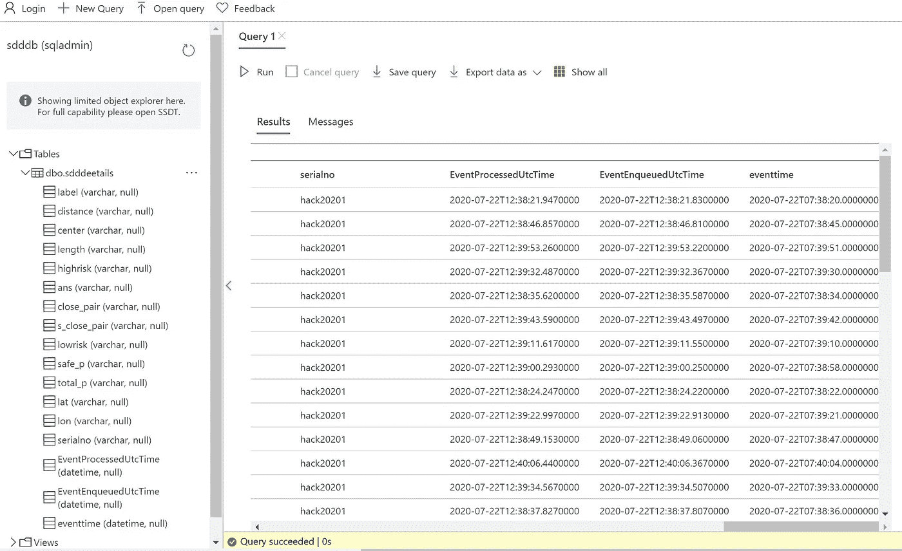

使用 Azure 认知服务 api 创建模型-自定义视觉。

*   创建认知服务帐户。选择 S1 计划
*   登录 [https://customvision.ai](https://customvision.ai)
*   创建一个名为 sittingposition 的新项目，使用精简对象检测模型 S1
*   在本地计算机上创建图像。(我用的是 windows 10 中的相机 app，拍的照片不多)
*   上传图片。
*   创建 2 个标签坐着，站着
*   用包围盒标记坐着和站着的图像。
*   点击训练-选择快速训练
*   等到模型训练完成
*   转到预测，然后单击导出
*   选择 Tensorflow 并下载 zip 文件
*   Zip 文件包含 model.pb，labels.txt(张量图)
*   下载中提供了示例推理代码
*   与我们的 sdd.py 导入 tensorflow 和其他库集成
*   将框架大小调整为 320，320，3
*   编写推理代码，保存预测的类和概率，并将其发送到事件中心
*   下面的代码必须放在 run 函数中。(检查第 261 行)

```
import argparse
import tensorflow as tf
import numpy as np
import PIL.Image

MODEL_FILENAME = 'model.pb'
LABELS_FILENAME = 'labels.txt'

            INPUT_TENSOR_NAME = 'image_tensor:0'
            OUTPUT_TENSOR_NAMES = ['detected_boxes:0', 'detected_scores:0', 'detected_classes:0']
            model_filename = 'model.pb'
            labels_filename = 'labels.txt'

            posepredict = "";
            posepredictprob = 0;

            dim = (320, 320)

            reframe = cv2.resize(frame, dim, interpolation = cv2.INTER_AREA)

            graph_def = tf.compat.v1.GraphDef()
            with open(model_filename, 'rb') as f:
                graph_def.ParseFromString(f.read())

            graph = tf.Graph()
            with graph.as_default():
                tf.import_graph_def(graph_def, name='')

            # Get input shape
            with tf.compat.v1.Session(graph=graph) as sess:
                sess.input_shape = sess.graph.get_tensor_by_name(INPUT_TENSOR_NAME).shape.as_list()[1:3]

            inputs = np.array(reframe, dtype=np.float32)[np.newaxis, :, :, :]
            with tf.compat.v1.Session(graph=graph) as sess:
                output_tensors = [sess.graph.get_tensor_by_name(n) for n in OUTPUT_TENSOR_NAMES]
                outputs = sess.run(output_tensors, {INPUT_TENSOR_NAME: inputs})
                #print("output " + str(outputs))

            with open(labels_filename) as f:
                labels = [l.strip() for l in f.readlines()]

            for pred in zip(*outputs):
                #print(f"Class: {labels[pred[2]]}, Probability: {pred[1]}, Bounding box: {pred[0]}")
                posepredict = labels[pred[2]]
                posepredictprob = pred[1]
```

模型预测及其输出

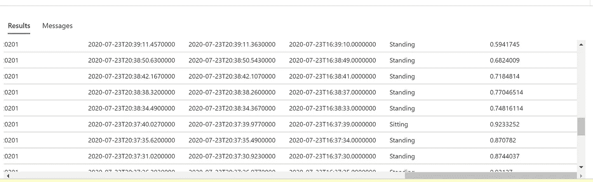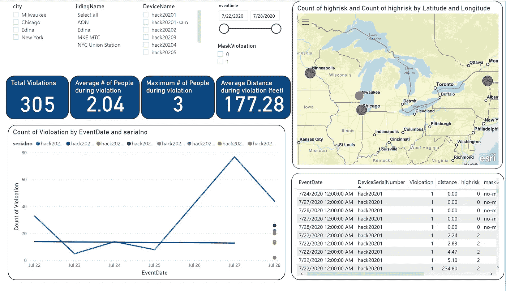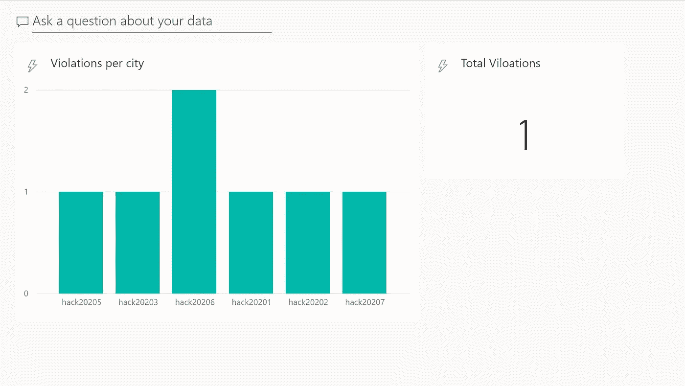

这是电源应用程序代码示例。

*   登录电源应用设计器
*   创建 Azure SQL 数据库的数据源
*   创建画布应用程序
*   连接到 SQL 数据库
*   创建一个公式，如果高风险计数> 0，则将颜色更改为红色，否则将其更改为绿色

```
in the formula: 
If(Value(ThisItem.highrisk) > 0, Red, Green)
```

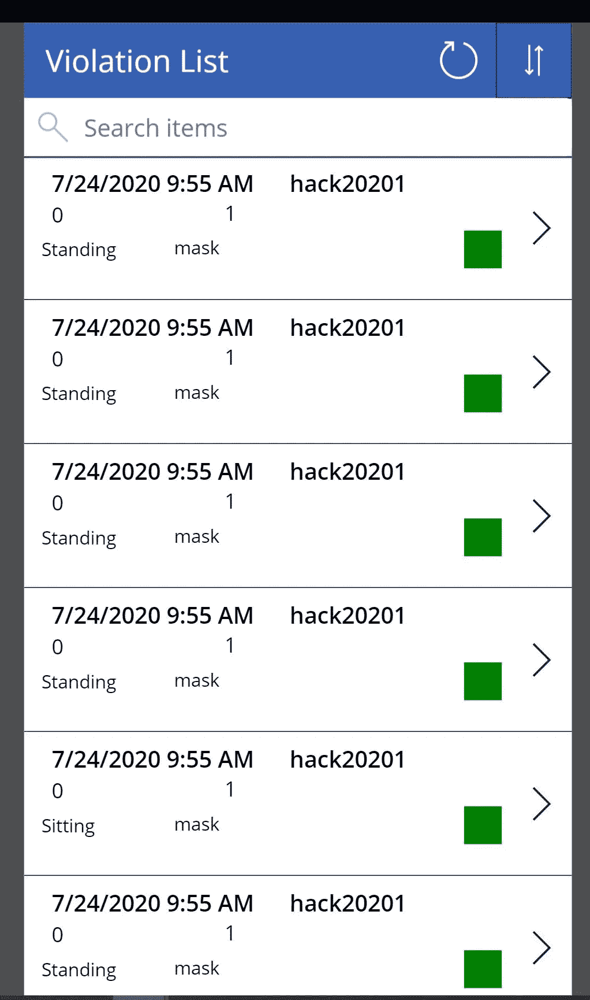

详细的

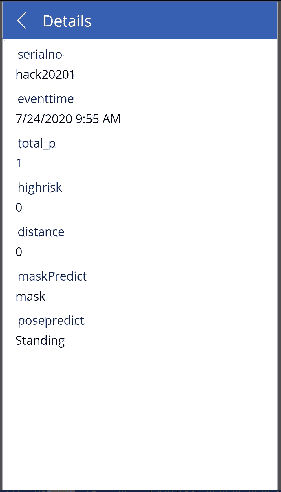

更多即将到来。

*   工作环境卫生工作习惯。改善员工健康的坐姿与站姿比率分析
*   办公桌照明
*   疲劳检测
*   应力检测
*   警报检测
*   打喷嚏和咳嗽检测
*   普里亚·阿斯瓦尼
*   巴拉穆鲁甘·巴拉克雷什南
*   Shruti Harish
*   米奇·帕特尔
*   普拉蒂克·甘地
*   梁振英
*   马利克·埃尔·卡曾
*   迪·库马尔
*   亚伯拉罕·帕巴蒂
*   史蒂文·汤普森

*最初发表于*[T5【https://github.com】](https://github.com/balakreshnan/sdd/blob/master/covidproject.md)*。*

享受构建您自己的解决方案的乐趣，并提供您对项目进展的想法和经验。