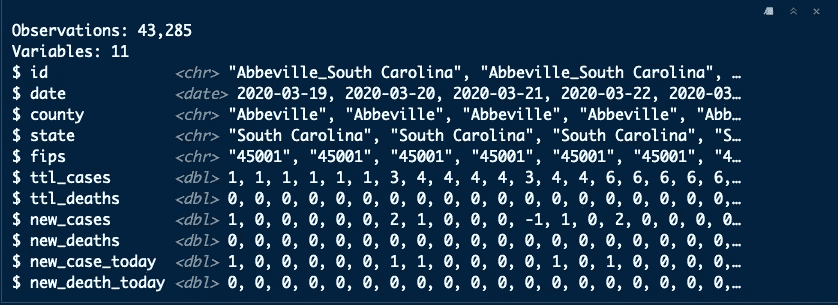
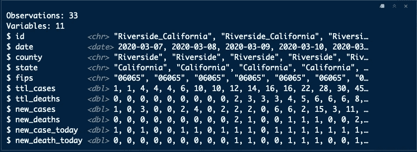
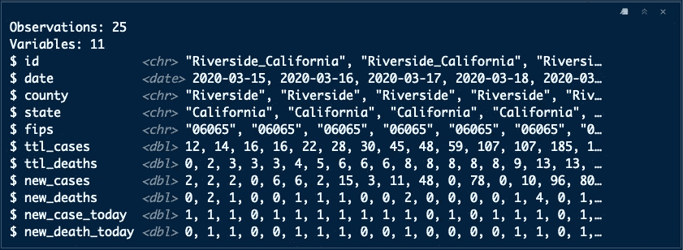
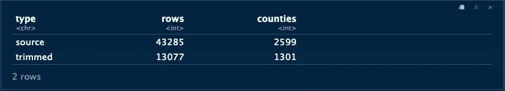
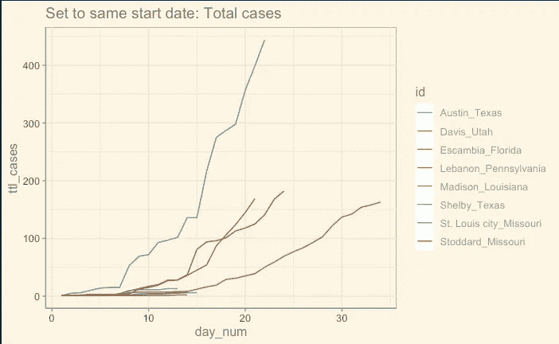
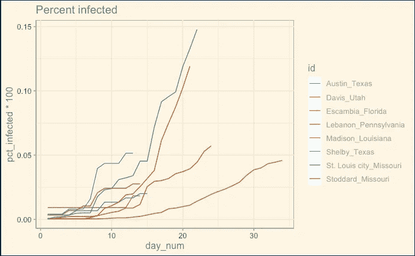
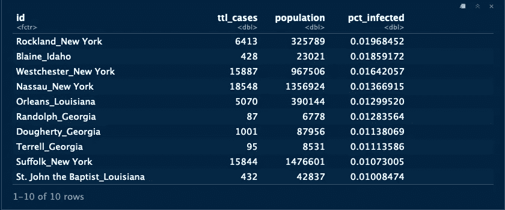
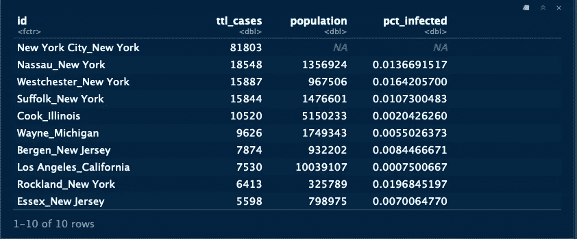

# 新冠肺炎:那些领先的日子打乱了你的模型

> 原文：<https://medium.com/analytics-vidhya/covid-19-those-leading-days-are-messing-up-your-model-2746d927c030?source=collection_archive---------34----------------------->


# 摘要

我正在研究纽约时报的新冠肺炎数据，并注意到在观察加州各县时，第一个病例和下一个病例之间有很长一段时间。我用这些数据来预测新冠肺炎的热点，而那漫长的潜伏期打乱了我的模型。例如，如果我使用加利福尼亚州奥兰治县的所有天数提前一天进行预测，该县的首例病例与持续的每日病例增长之间有 30 多天，则模型会产生一个明显低于前一天的数字，尽管趋势是上升的。当那些早期的日子过去后，预测开始看起来像他们应该的那样。

我们倾向于使用所有的数据，因为这些数据是真实的，已经发生了，但是如果你在早期建立一个预测模型，那就没什么价值了。如果需要，完整的数据集总是在那里。

# 方法学

在看新闻联播时，我看到一张新冠肺炎的预测图表，明确表示他们的模型是在连续三天出现新病例后启动的。这对我来说很有意义，但我不知道如何实施，因为有 2500 多个县至少有一个病例？我做了研究，这篇文章向你展示了如何修剪这些领先的日子，并提供了一些额外的功能。

# 目标

删除在每日案例的第一个 3 天运行的第一天之前发生的每个县的所有行。

# 这到底是什么意思？

首先让我们加载数据。《T2 时报》的数据给出了每天和县的死亡总数&。由于**没有为新病例或死亡提供栏目**，所以必须创建这些栏目。为此，我使用了“lag()”函数。我还制作了两个二元变量来表示当天是否有新的病例/死亡。

```
library(tidyverse)us <- read_csv(“Data/us-counties-2020–04–08.csv”) %>% 
 mutate(id = paste0(county, “_”, state)) %>% 
 arrange(id, date) %>% 
 rename(ttl_cases = cases, 
 ttl_deaths = deaths) %>% 
 group_by(id) %>% 
 mutate(new_cases = ttl_cases — lag(ttl_cases),
 new_cases = if_else(is.na(new_cases), ttl_cases, new_cases),
 new_deaths = ttl_deaths — lag(ttl_deaths),
 new_deaths = if_else(is.na(new_deaths), ttl_deaths, new_deaths),
 new_case_today = if_else(new_cases >= 1, 1, 0), 
 new_death_today = if_else(new_deaths >= 1, 1, 0)) %>% 
 ungroup() %>% 
 select(id, everything())glimpse(us)
```



如果你看上面的“今天新案例”一行，你会看到有一个单一的案例，然后几天，直到一个新的案例。根据我们的连续三天规则 Abbeville，南卡罗来纳州将从最终数据集中删除，因为它在历史上没有这种模式。

# 个案研究

加州的 Riverside 提供了一个简洁的例子来看看我们在寻找什么样的模式以及如何修复它。沿着“new_case_today”行，3 天模式直到第 9 天才出现。我们的目标是放弃前 8 天。

```
us %>% 
  filter(id == "Riverside_California") %>% 
  glimpse()
```



# 构建一个删除前导日的函数

关键是“rle()”函数。这是一个基本的 R 函数，所以不需要加载新的库。游程编码寻找一系列的 0 和 1，这就是我们创建`new_case_today`的原因，它使得在你需要的地方分割数据变得相当容易。这个函数的内容是从这篇关于 RLE 的[文章](https://technocrat.rbind.io/2019/12/26/run-length-encoding/)中复制粘贴的&。

```
trim_lead_days <- function(my_id) {
  # Filter & sort
  df <- us %>%
    filter(id == my_id) %>% 
    arrange(date)

  # We want to identify the first occurrance of three days in a row with new cases
  # Record sequences of 1s & 0s
  runs <- rle(df$new_case_today)
  runs <- tibble(runs$lengths, runs$values)
  colnames(runs) <- c("lengths", "values")
  #runs

  #Calculate cumulative index numbers when sequence starts
  sequences <- tibble(lengths = runs$lengths, 
                      values = runs$values) %>% 
    mutate(indices = cumsum(runs$lengths))
  #sequences

  # Get index for first occurance of new cases 3 or more days in a row
  start_index <- sequences %>%
    filter(values == 1, lengths >= 3) %>% 
    slice(1) %>% 
    pull(indices)

  # If no 3-day sequence then return empty row
  #  else return only the rows after 3-day rule met 
  #  starting with the first day of 3-day run.  
  if(is_empty(start_index)) {
    final_df <- df[0, ]
  } else {
    final_df <- df %>% 
      slice((start_index - 2):nrow(df))
  }

  return(final_df)
}
```

当函数在 Riverside county 上运行时，我们看到新数据正确地从 3 月 15 日开始。请注意，如果一个县从未连续三天出现病例，则该县的所有记录都将被排除。

```
my_id <- "Riverside_California"final_df <- trim_lead_days(my_id)glimpse(final_df)
```



# 我们如何为所有县做到这一点？

超过 2500 个县报告了至少一例病例。上述函数适用于一个县。我们如何能让这在所有的县运行。“purrr”包为我们提供了一种在所有县进行反馈并返回结果的单一数据框架的方法。每次我使用这种在 Hadley Wickham 的[的《函数式编程的快乐》(针对数据科学](https://www.youtube.com/watch?v=bzUmK0Y07ck))中很出名的模式时，我都会惊讶于它是多么的强大和优雅。

这是处理整个数据集并分配给`final_df`所需的所有代码。

```
final_df <-  map_dfr(unique(us$id), ~ trim_lead_days(.x))
```

# 行数和郡数有什么区别？

```
trimmed_summary <- tibble(type = "trimmed", 
                          rows = nrow(final_df), 
                         counties = length(unique(final_df$id)))
source_summary <- tibble(type = "source", 
                          rows = nrow(us), 
                         counties = length(unique(us$id)))bind_rows(trimmed_summary, source_summary) %>% 
  arrange(-rows)
```



行数和郡数存在显著差异，因此要小心使用。

# 奖金代码

这可能是我就这个主题写的唯一一篇论文，所以我想包含一些额外的代码，我认为这些代码对于刚开始使用这些数据的人来说很重要。

# 添加自第一个案例以来的天数

数据集给你日期，仅此而已。很多时候，您会希望根据自病例开始被诊断以来的天数来比较各县。我们需要一个计数器来告诉我们从第一个案例开始已经过去了多少天。这将允许我们将每个县的每日数据与第一个病例/死亡的天数联系起来。这对于绘图非常有用，因为您将能够清楚地看到哪些县在控制增长方面做得更好。
*记住，源数据中的第一天可能与修整数据中的第一天有很大不同。*

```
us2 <- us %>% 
  arrange(id, date) %>%
  mutate(incrementer = 1) %>% 
  group_by(id) %>% 
  mutate(day_num = cumsum(incrementer)) %>% 
  ungroup() %>%
  mutate(id = factor(id), 
         id_day_num = paste0(id, "_", as.character(day_num)), 
         type = "Actual") %>% 
    arrange(id, day_num) # Get eight random counties for plotting
set.seed(317)
county_sample <- sample(as.character(us2$id), 8, replace = FALSE)p_data <- us2 %>% 
  filter(id %in% county_sample)library(ggthemes)
ggplot(p_data, aes(day_num, ttl_cases, color = id)) + 
  geom_line() +
  ggtitle("Set to same start date: Total cases") +
  theme_solarized() +
  scale_colour_solarized()
```



# 添加县人口数据

如果没有居住在该县的人数，病例的数量就没有那么重要了。纽约市可能有 10，000 个病例，但这仍然只是居住在那里的总人口的一小部分。较小的县可能有较高比例的公民被感染，但被城市中心产生的大量病例所掩盖。

我们将使用县人口的外部数据集，该数据集使用 2010 年人口普查的预测，可在此处获取[。该数据有一个州和县 fips 代码，在连接到主数据帧之前，必须连接该代码。](https://www2.census.gov/programs-surveys/popest/datasets/2010-2019/counties/totals/)

```
us_w_pop <- read_csv("Data/co-est2019-alldata.csv") %>%
  select(STATE, COUNTY, STNAME, CTYNAME, POPESTIMATE2019) %>%
  rename(population = POPESTIMATE2019) %>% 
  mutate(fips = paste0(STATE, COUNTY)) %>% 
  right_join(us2, by = "fips") %>% 
  mutate(pct_infected = ttl_cases / population, 
         pct_dead = ttl_deaths / population)
```

# 受感染人口百分比图表

```
p_data <- us_w_pop %>% 
  filter(id %in% county_sample)ggplot(p_data, aes(day_num, pct_infected*100, color = id)) + 
  geom_line() +
  ggtitle("Percent infected") +
  theme_solarized() +
  scale_colour_solarized()
```



八个县中没有一个县的感染率超过 0.15%。

# 哪些县的感染率最高？

```
us_w_pop %>% 
  group_by(id) %>% 
  filter(date == max(date)) %>% 
  ungroup() %>% 
  select(id, ttl_cases, population, pct_infected) %>% 
  arrange(-pct_infected) %>% 
  top_n(10)
```



请注意，该组中有几个低人口县，截至 2020 年 4 月 8 日，没有一个县的居民感染率超过 2%。

# 纽约怎么了？

看起来纽约市没有与人口数据相匹配的 FIPS 代码。我不知道为什么会这样，但我想指出来。病例和死亡人数最多的地方没有人口是个问题。希望一个温和的读者会解决，并让我们知道如何获得纽约市的人口数据。

```
us_w_pop %>% 
  group_by(id) %>% 
  filter(date == max(date)) %>% 
  ungroup() %>% 
  select(id, ttl_cases, population, pct_infected) %>% 
  arrange(-ttl_cases) %>% 
  slice(1:10)
```



# 结束注释

总之，现在您已经有了代码和数据源，可以直接进入新冠肺炎在美国传播的探索性数据分析了。如果您在县一级进行预测，则“trim_lead_days()”函数将移除许多县具有的导致模型失去准确性的不规则期初数据。

# 确认

我要感谢 [RStudio 社区](https://community.rstudio.com/t/filter-rows-before-threshold/59913)的 Richard Careaga(又名技术官僚)给我提供了他关于这个主题的论文。[连胜怎么了？rle:游程编码](https://technocrat.rbind.io/2019/12/26/run-length-encoding/)。

# 结束