# 新冠肺炎推文—地理和情感分析

> 原文：<https://medium.com/analytics-vidhya/covid-19-tweets-geographical-and-sentiment-analysis-c33b4aa5b777?source=collection_archive---------9----------------------->

## 在 Python 中使用 leav 的交互式热图和使用 NLTK VADER 的情感分析

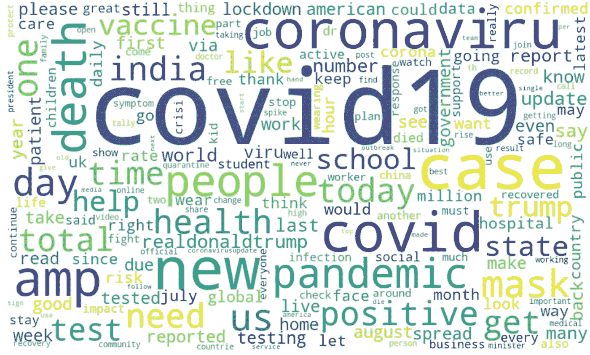

就像他们说的，**你的** **推特，你的声音。**多年来，Twitter 一直被认为是每个人都喜欢谈论正在发生的事情的地方。根据 [Omnicore](https://www.omnicoreagency.com/twitter-statistics/) 发布的统计数据，截至去年，月活跃用户超过 3 亿，每天有超过 5 亿条推文。在《新冠肺炎时报》期间，twitter 已经产生了海量的数据，来自世界各地的人们都在推特上谈论它。有趣的是，今天的技术如何使我们能够处理所有这些数据，并通过应用无数的算法和模型来产生洞察力。

在这篇博客中，我将带您浏览一个这样的分析，重点是使用 Twitter API 收集的带有高频标签(#covid19)的推文。我们使用了 2020 年 7 月至 2020 年 8 月期间约 18 万条推文的样本集。关于数据和 python 脚本的更多细节可以在 [Kaggle](http://www.kaggle.com/gpreda/covid19-tweets) 上访问；感谢 [Gabriel Preda](https://medium.com/u/a963dff30149?source=post_page-----c33b4aa5b777--------------------------------) 发布这个数据集。

使用这些数据，我们试图回答一些商业问题。发推特最多的人来自哪个国家和城市？
2。新冠肺炎病例数量对**每日推文**有何影响？
3。这些推文中的**情绪**是什么？最受欢迎的推文是正面的还是负面的？
4。这些推文中最常见的词语和实体是什么？
5。哪种类型的人发微博更多——他们使用网络或手机发微博吗，他们有很多粉丝吗，某些账户倾向于特定的语气吗？

在我们开始分析推文之前，有几个基本步骤涉及到数据探索(EDA)、修复数据类型、填补数据缺口等。已经实施。就像来自社交媒体的任何其他非结构化数据一样，我们的数据集中的文本字段也需要某种程度的清理和规范化，以便为进一步的分析做准备。不仅如此，在我们的例子中，我们还必须通过应用一些业务规则来区分国家和城市，这些业务规则在原始数据集中出现在一列中，没有遵循标准格式。有时，我们还可以从外部来源引入额外的数据点来丰富数据集。为了进行地理分析，在本例中，我们使用了[名称](https://nominatim.openstreetmap.org/ui/search.html)来获取这些国家和城市的纬度和经度，然后绘制在热图上。关于这些步骤的细节，请访问笔记本[这里](https://www.kaggle.com/arushi2/covid19-tweets-geo-and-sentiment-analysis)。

一旦数据都准备好并清理完毕，我们就可以开始深入分析，决定使用什么 APIs 模型，并回答已确定的业务问题。

# 1.地理分析，以确定大多数人发推文来自哪个**国家和城市**？

首先，我们根据大量的推文提取了排名靠前的国家和城市，并绘制出它们的趋势。

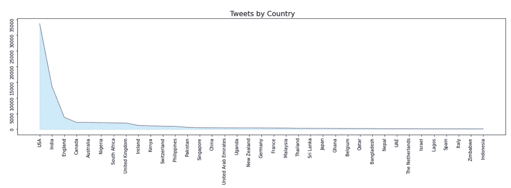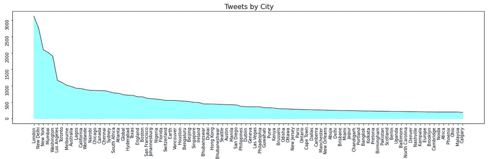

很明显，**美国的推特数量最多**，紧随其后的是印度，几乎是美国的一半。所有其他国家的推特数量都远远少于美国或印度。就城市而言，伦敦、新德里、纽约、孟买和华盛顿是推特数量最多的前五名。

接下来，为了在交互式视觉中轻松定位推文高度集中的国家/城市，我们创建了一个热图，并提供了放大和缩小选项。为了能够绘制热图，我们首先需要获得这些国家和城市的坐标，这是使用 get_coordinates()函数完成的。

```
def get_coordinates(input_type, name, output_as='center'):
    """
    Function to get coordinates of country/ cityAttributes
    ----------
    input_type : str
        Pass 'country' or 'city' to generate the respective URL
     name : str
        Name of the country or city we need the coordinates for
    output_as : str
        Pass 'center' or 'boundingbox' depending upon what      coordinates type to fetch Methods
    -------
        Returns the coordinates of the country or city
    """ # create url
    url = '{0}{1}{2}'.format('[http://nominatim.openstreetmap.org/search?'+input_type+'='](http://nominatim.openstreetmap.org/search?'+input_type+'='\),name,'&format=json&polygon=0')
    response = requests.get(url)
    try:
        response = response.json()[0]
        # parse response to list
        if output_as == 'center':
            lst = [response.get(key) for key in ['lat','lon']]
            output = [float(i) for i in lst]
        if output_as == 'boundingbox':
            lst = response[output_as]
            output = [float(i) for i in lst]
        return output

    except (IndexError, ValueError):
        # this will log the whole traceback
        return [0,0]
```

一旦获得坐标，我们就可以使用其中一个提供创建热图功能的库。这里我们使用了一个知名的 Python 库，叫做[](https://python-visualization.github.io/folium/)**。函数 generateBaseMap()解释了它用来生成热图的参数以及它上面的标记。标记上添加了弹出标签和图标，当我们悬停在上面时，它们会显示国家/城市名称和推文数量等详细信息。有许多其他参数和选项可用于根据需要定制您的可视化。**

```
import folium
from folium import plugins
from folium.plugins import HeatMap
import branca.colormap# Create a heatmap using folium
def color(magnitude):
    if magnitude>=2000:
        col='red'
    elif (magnitude>=500 and magnitude<2000):
        col='beige'
    elif magnitude<500:
        col='green'
    return coldef generateBaseMap(input_type,df,default_location=[40.693943, -73.985880], default_zoom_start=2):
    """
    Function to generate the heatmapAttributes
    ----------
    input_type : str
        Pass 'country' or 'city' to generate the respective heatmap
    df : str
        Name of the dataframe having the country/city coordinates  and other details
    default_location : int
        Pass the default location for the displayed heatmap
    default_zoom_start: int
        Pass the default zoom for the displayed heatmap

    Methods
    -------
        Returns the base_map
    """

    base_map = folium.Map(location=default_location, control_scale=True, zoom_start=default_zoom_start)
    marker_cluster = plugins.MarkerCluster().add_to(base_map)

    HeatMap(data=df[['lat','long']].values.tolist(),radius=20,max_zoom=13).add_to(base_map)
    for lat,lan,tweet,name in zip(df['lat'],df['long'],df['# of tweets'],df.iloc[:,0]): 
        # Marker() takes location coordinates as a list as an argument 
        folium.Marker(location=[lat,lan],popup = [name,tweet], 
                      icon= folium.Icon(color=color(tweet), 
                      icon_color='white', icon='twitter', prefix='fa')).add_to(marker_cluster)

    #specify the min and max values of your data
    min, max = df['# of tweets'].min(), df['# of tweets'].max()
    colormap = cm.LinearColormap(colors=['green','beige','red'], vmin=min,vmax=max)

    colormap.caption = input_type.title() +' distribution of COVID-19 tweets'
    colormap.add_to(base_map)
    return base_map
```

**下面是我们生成的热图，显示了推文在各个城市的分布情况。当我们放大和缩小时，地图允许我们查看所选城市的细节。图标的红、黄、绿色显示了推文音量的强度。每一个单独的图标，当点击时，给我们城市的名称和推文的数量。**

**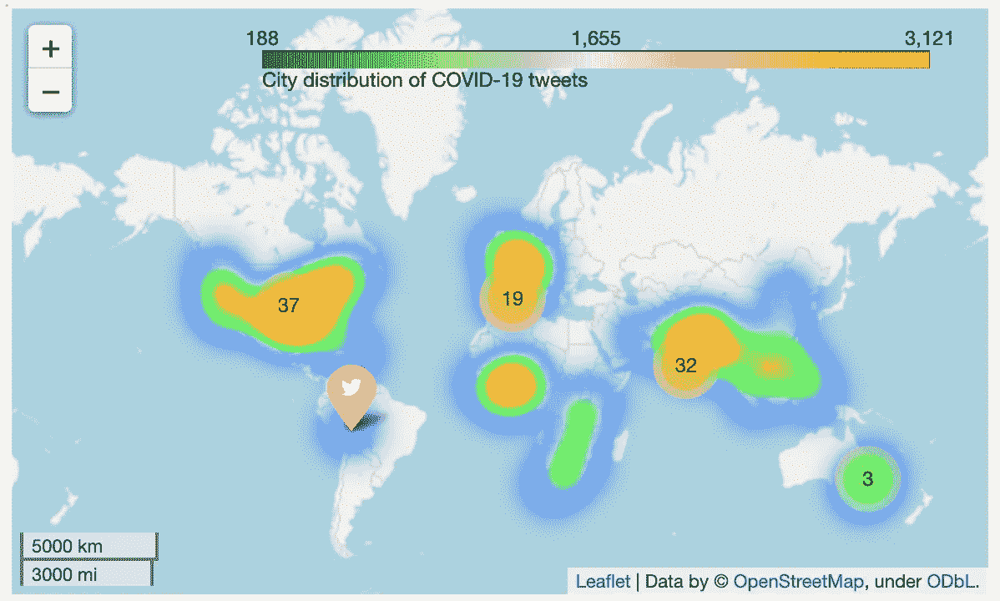****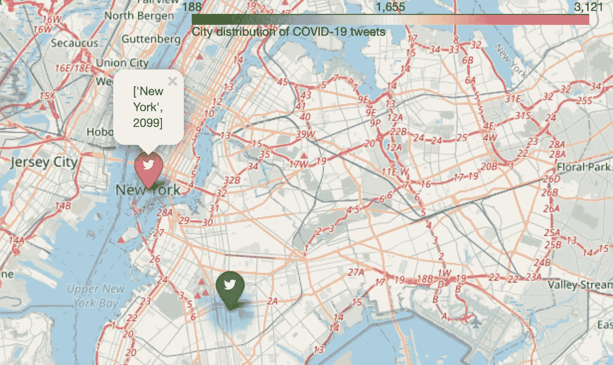**

# **2.每日推文趋势**

**当我们绘制每天的推文数量时，我们注意到推文数量在 7 月的最后一周出现了一个高峰。这可能是因为据世界气象组织报道，在那段时间里发生了最多的日冕事件。**7 月 24 日，截至 8 月底，每日电晕** **病例**最高，全球约 29 万例，美国约 8 万例。这可能解释了那一周，尤其是 7 月 25 日的大量推文。**

**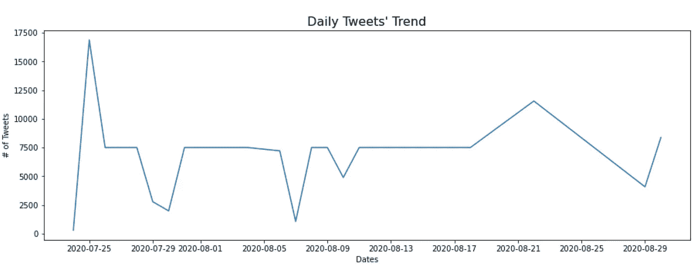****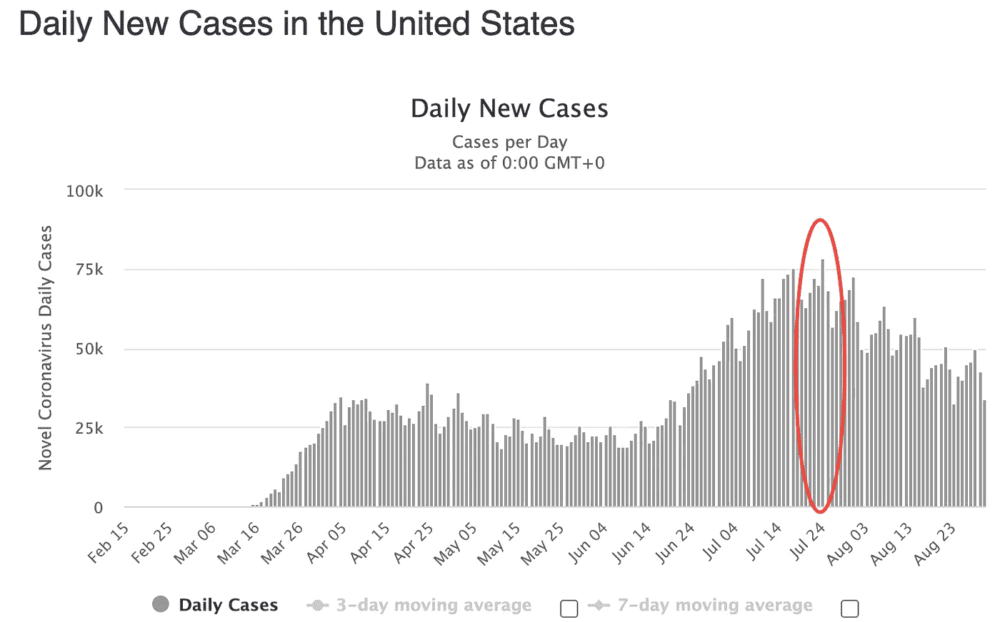**

**来源:[世界计量表](http://www.worldometers.info/coronavirus/country/us/)**

**随着病例数量的上升，人们似乎倾向于在推特上发布更多关于冠状病毒的信息。知道这些人在推特上谈论什么难道不是很有趣吗——他们是对越来越多的电晕病例感到担忧和焦虑，还是对这种情况充满希望。好吧…让我们继续读下去，寻找答案。**

# **3.Tweet **情绪**分析识别积极或消极的语气**

**为了对推文进行文本分析并检测情绪，我们首先通过将除 a-z、A-Z、0–9 之外的所有内容转换为空格来清理推文，从推文中删除 twitter 链接和其他噪音。然后，我们可以使用许多可用的情感分析库之一。如果你在选择合适的库方面有困难，这里的[是一本帮助你解决这个问题的好书。](https://elitedatascience.com/python-nlp-libraries)**

**这里我们使用的是 NLTK VADER SentimentIntensityAnalyzer 这是一个基于词汇和规则的情感分析工具，在处理社交媒体文本时非常成功。它不仅为我们提供正面、负面、中性分数，还提供复合分数，该复合分数是一种计算所有词典评级总和的度量，这些评级已在-1(最负面)和+1(最正面)之间标准化。下面的代码解释了业务规则——如果复合得分≥ 0.5，则总体情绪为“积极”,如果复合得分≤ -0.5，则为“消极”,如果介于两者之间，则为“中性”。要了解更多关于 [VADER](/analytics-vidhya/simplifying-social-media-sentiment-analysis-using-vader-in-python-f9e6ec6fc52f) 情绪分析的知识，请阅读这篇由[帕鲁尔·潘迪](https://medium.com/u/7053de462a28?source=post_page-----c33b4aa5b777--------------------------------)撰写的惊人博文。**

```
# Cleaning the tweets for characters other than a-z, A-Z, 0-9
tweets['clean_tweet'] = tweets['text'].apply(lambda x: re.sub("([^0-9A-Za-z \t])|(\w+:\/\/\S+)"," ", x))# Run sentiment analysis
from nltk.sentiment.vader import SentimentIntensityAnalyzer
sid = SentimentIntensityAnalyzer()
for index, row in tqdm(tweets.iterrows()): #tqdm 
    ss = sid.polarity_scores(row['clean_tweet'])
    if ss['compound'] >= 0.05 : 
        tweets.at[index,'sentiment'] = "Positive"
    elif ss['compound'] <= - 0.05 : 
        tweets.at[index,'sentiment'] = "Negative"
    else : 
        tweets.at[index,'sentiment'] = "Neutral"
```

**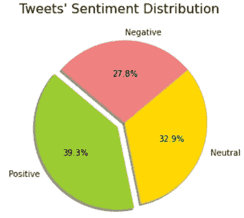**

**在总共约 180，000 条推文中，**~ 70，000 条有正面情绪**，占图表中约 40%的推文，是最大的一块饼。**

**在**最受欢迎的 10 条推文中，30%的推文语气积极**，谈论一旦疫苗制成，情况可能会如何改善，40%的推文语气消极，担心新冠肺炎病例增加以及国家无力控制疫情。剩下的 30%带有中性语气，主要是对新冠肺炎病例数量的更新。**

# **4.识别推文中最常见的词和实体(人、地点、组织)**

**为了能够识别实体，我们首先对上一步中已经清理过的 tweets 进行标记。为此，我们可以使用 NLTK 提供的基本标记器，也可以使用专门为 twitter 文本编写的 TweetTokenize。然后，这些标记被传递给 [pos_tag](http://www.nltk.org/book/ch05.html) ，它将单词分类成词性。这又被传递给 [ne_chunk](https://www.nltk.org/book/ch07.html) ，它是一个基于分类器的命名实体识别器。下面代码中的“binary”参数提供了一个选项，当设置为 True 时，获取所有命名实体的 NE 标签，或者当设置为 False 时，获取更具体的类别标签，如 PERSON、ORGANIZATION 和 GPE。**

```
from nltk.tokenize import TweetTokenizer
from nltk import pos_tag, ne_chunk# Create dictionary of entities and their frequency in the tweets then create a wordcloud
tt = TweetTokenizer()
entities={}for sent in tqdm(tweets.clean_tweet):
    for chunk in ne_chunk(pos_tag(tt.tokenize(sent)), binary=True):
        if hasattr(chunk, 'label'):
            if chunk[0][0] in entities.keys():
                entities[chunk[0][0]] = entities[chunk[0][0]]+1
            else:
                entities[chunk[0][0]]=1

#sorted by value, return a list of tuples   
top50_entities = sorted(entities.items(), key=lambda x: x[1], reverse=True)[:50]
entities_text = " ".join([(k + " ")*v for k,v in dict(top50_entities).items()])
```

**我们创建了一个字典“实体”,如上面的代码所示，它捕获了每个实体的出现频率，如下面的折线图所示。正如预期的那样，COVID 出现的频率最高，其次是印度，第二是 realDonaldTrump，第三是其他国家。**

**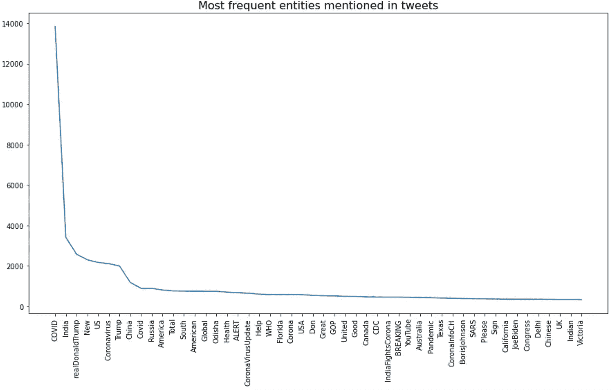**

**我们还创建了一个 wordcloud，可以很容易地从其他实体中识别出出现频率高的实体。为此，我们已经导入了 WordCloud 库，并设置了所有需要的参数，可以根据需要轻松定制。**

```
from nltk.corpus import stopwords
from wordcloud import WordClouddef createWordCloud(input_type, text):
    """
    Function to generate the wordcloudAttributes
    ----------
    input_type : str
        Pass 'words' or 'entities' to update the chart title based on the text passed
    text : str
        Name of the string text to make the wordcloud

    Methods
    -------
        Returns the wordcloud
    """
    wordcloud = WordCloud(width = 1000, height = 600, 
                      #colormap = 'Paired',
                      background_color ='white',
                      collocations = False,
                      stopwords=stop_words
                     ).generate(text)plt.figure(figsize = (12, 12), facecolor = None)
    plt.title("Most common "+ input_type +" in the tweets \n", fontsize=20, color='Black')
    plt.imshow(wordcloud, interpolation='bilinear') 
    plt.axis("off") 
    plt.tight_layout(pad = 0) 
    plt.show()
```

**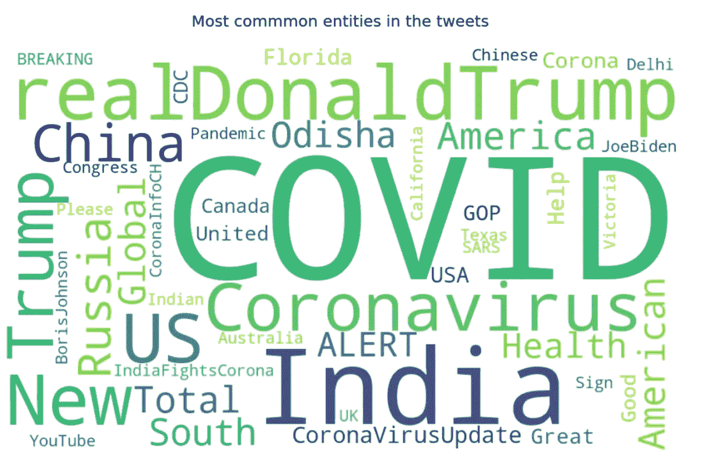**

**正如我们所看到的，所有高频词的大小都很大，使它们非常独特。除了最明显的单词“COVID ”,其他常见的实体有 Donald Trump、Joe Biden、Boris Johnson、国会、世卫组织、CDC。一些国家，如印度、美国、中国、俄罗斯，以及一些城市/州，如奥迪沙(印度的一个城市)、佛罗里达、德克萨斯等。在推特上也经常被提及。**

# **5.更多地了解发微博多的**类型的人****

**虽然分析推文告诉我们它的内容和情绪，另一个重要的方面是了解发推文更多的人的类型，以及我们如何对他们进行分类。**

**首先，我们看了这些人发推文的来源。结果显示，32%的人使用 Web 应用程序发推文，其次是 Android 用户，为 22%，iPhone 用户接近 20%。结合 Android 和 iPhone 用户，移动用户几乎占到 45%，是网络用户的 1.5 倍。**

**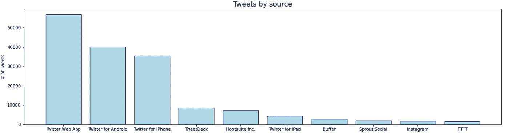****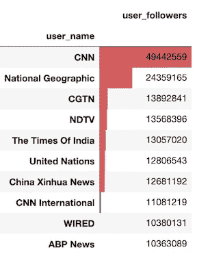**

**接下来，我们查看了拥有大量 tweets 的最高粉丝的账户。不出所料，大部分新闻频道都高居榜首。CNN、国家地理、CGTN、NDTV 和《印度时报》是排名前五的账号，CNN 拥有超过 5000 万粉丝，国家地理拥有大约 2500 万粉丝。**

**最后，我们查看了正面、负面和中性推文数量最多的账户。全球大流行。“网络”有最多的正面推文，而“公开信”在负面推文列表中领先，“冠状病毒更新”是中性推文。**

**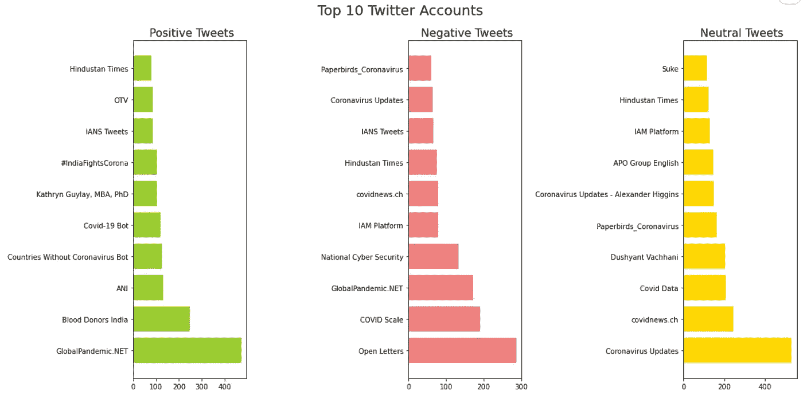**

# ****结束语:****

**当我们使用不同的 NLP 模型时，有许多额外的东西可以探索和实现。不仅如此，还可以应用额外的业务规则来进一步清理这些文本数据字段。可以合并更多的外部源来扩充数据集并实现多维分析。我希望你喜欢我的作品。😃**

***要访问完整的代码，请点击* *查看我的 GitHub 的链接* [*。*](https://github.com/ArushiC/COVID-19-Tweets-Analysis)**

> ****参考文献:****
> 
> **[https://www.omnicoreagency.com/twitter-statistics/](https://www.omnicoreagency.com/twitter-statistics/)
> [http://www.kaggle.com/gpreda/covid19-tweets](http://www.kaggle.com/gpreda/covid19-tweets)
> [http://www.worldometers.info/coronavirus/country/us/](http://www.worldometers.info/coronavirus/country/us/)
> [https://www . geeks forgeeks . org/python-情操-分析-使用-维德/](https://www.geeksforgeeks.org/python-sentiment-analysis-using-vader/)**