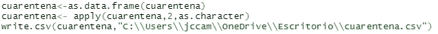
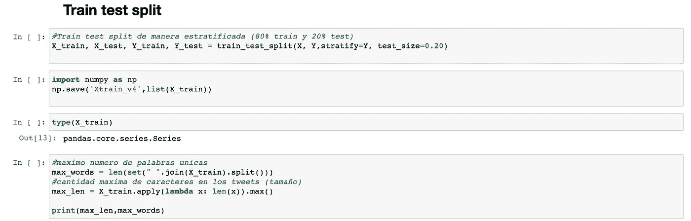
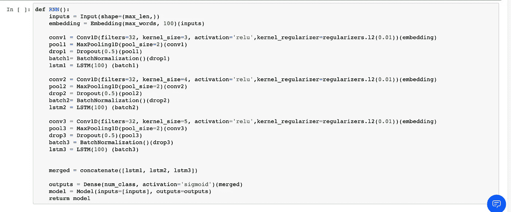
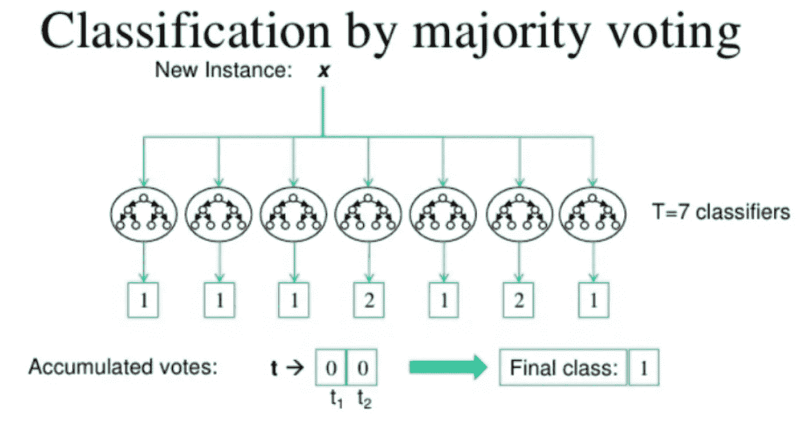
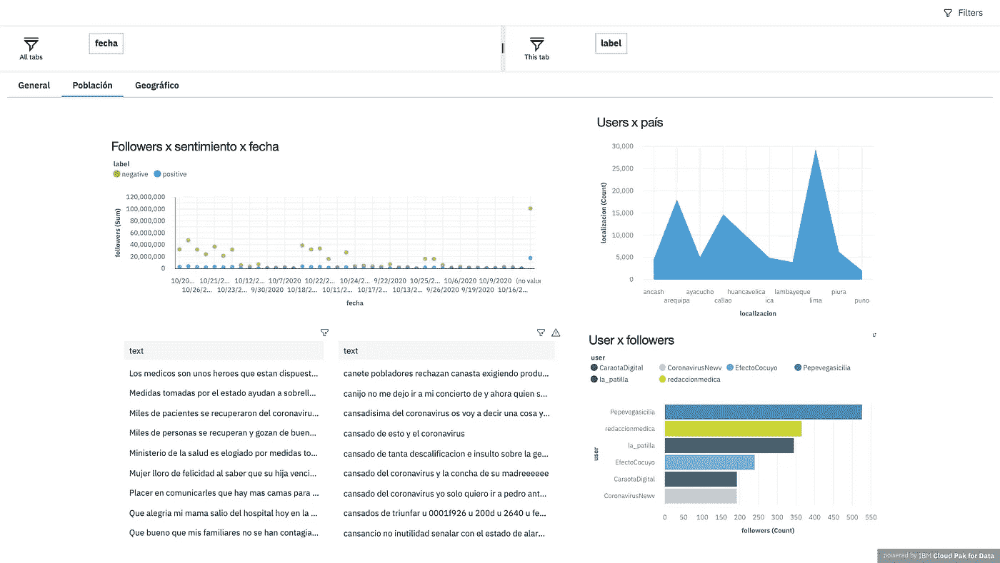

# 新冠肺炎使用深度学习架构和 IBM 云服务进行情感分析

> 原文：<https://medium.com/analytics-vidhya/covid-19-tweets-sentiment-analysis-using-deep-learning-architectures-and-ibm-cloud-services-a886d4391af5?source=collection_archive---------22----------------------->

维基百科上由 [Pharexia](https://commons.wikimedia.org/wiki/User:Pharexia) 拍摄的照片

目前，我们正在经历一场疫情，全球约有 130 万人死亡，新冠肺炎或通常称为冠状病毒的变化已经在政治、健康、教育等方面影响了几个国家。这就是为什么，因为这是一个当前的问题，有必要不断更新这一信息。另一方面，在不同的社交网络(如脸书、Linkedin、Instagram 和 Twitter)中，每秒钟会产生成千上万的评论，它们传达各自社交网络的成千上万用户的观点、感受和关注。大量的数据得到很好的利用将使我们能够理解人们的行为和事实，从而能够采取行动。

推特图片

目前，有专门的架构可以解析注释的原始形式(当然是在注释被清除之后)。这些架构是递归神经网络(RNN)，并且具有各种类型，例如一对多(通常用于图像字幕)、多对一(用于情感分类)和多对多(通常用于翻译者)。

一种叫做长短期记忆(LSTM)的 RNN，其记忆单元允许你学习序列中元素之间的顺序的依赖性，以及进行分类或预测(时间序列预测)所必需的上下文。

## LSTM

isch_tudou 在[建树](https://www.jianshu.com/p/1a617c3e190c)上的照片

## 比尔斯特姆

科内格鲁塔等人在代码为的[文件上的照片](https://paperswithcode.com/method/bilstm)

# 方法学

该方法由 5 个步骤组成:数据收集和准备、标记、建模、模型评估和模型实现。

# 数据收集和预处理

为了收集，使用了 tweepy 和 twitterR 库，以便获得带有关键字的评论:*冠状病毒*、 *covid19、cuarentena* y los *标签#冠状病毒、#新冠肺炎、#bonouniversal、#yomequedoencasa、# cuarentenaextendida、#toquedequeda、#vacuna。*

extracción de tweets usando Twitter RR

定义了应用程序的名称和 4 个 Twitter 开发者密钥，然后创建一个 token 类型的对象来执行 tweets 的提取。随后，使用 search_tweets 函数提取 tweets，该函数的参数为:

1.  keyword →是提取注释的单词
2.  n →表示要提取的注释数量
3.  include_rts →指示是否使用布尔值提取转发
4.  retryonratelimit →指示该功能在超过限制后是否继续提取推文(每次提取后 15 分钟)
5.  lang →表示注释的语言

因为 twitterR 允许获得更大数量的 tweets，所以它被用来获取训练数据。这些推文保存在一个 csv 文件中。

Exportando csv

另一方面，tweepy 用于自动提取 Watson Studio 笔记本中的推文。

Tweepy 被导入到第一个单元格中，然后 Rstudio 使用相同的凭证来提取 tweets。要使用 tweepy 提取 tweepy，您必须首先使用将接收消费者代码的 OAuthHandler 函数，然后使用 set_access_token 函数进行访问，最后使用 API 函数启用 tweet 提取权限。

光标函数允许我们提取 tweets，并具有以下参数:

1.  q →是提取推文的关键字或“查询”。
2.  lang →推文的语言。
3.  tweet_mode →默认情况下为 None，如果使用“extended ”,将允许超过 140 个字符。
4.  geocode →允许根据 tweets 的坐标和 250km 的直径从某个地方提取 tweets。
5.  result _ type→‘recent’表示将提取最近的评论
6.  items →是评论数。

所有信息都保存在结果中，并使用 for 循环对每个元素中获得的信息进行分解。提取的数据是推文、用户、日期、位置、用户名、关注者数量和朋友数量。
随后，使用函数 remove_urls、demojir、remove_user、remove_hashtag、remove_rt 和 signs 对评论进行预处理，以便移除 URL、表情符号、hastags、RTs(从转发中)，并且移除符号和波浪符号。

通过应用功能，这些功能被应用于数据帧。最后，使用 drop_duplicates()函数删除数据帧的副本。

# 标记

为了标记数据，使用了 IBM 云服务自然语言理解(NLU)。使用该服务所需的信息是 apikey 和 url。

创建 NLU 服务后，将打开一个笔记本进行标注。为此，需要导入 naturalglanguageunderstanding v1、IMAuthenticator、SentimentOptions 和 KeywordsOptions 函数。

为了在笔记本中使用服务，使用 apikey 创建一个认证器。使用验证者和版本创建服务。然后这个服务被激活，给出 url 作为输入。随后，通过一个 for 循环，分析每个评论并获得其极性(api 提供三种极性:正、负和中性)、分数(该极性的置信度百分比)和相同的评论，并将它们保存在一个列表中。
然后，以超过 90%的置信度过滤评论，这些评论被手动标记，以便创建更精确的分类器。

# 建模

需要注意的是，在能够训练深度学习架构之前，必须使用以下命令安装以下的 keras == 2.4.3 和 tensorflow == 2.3.0:

创造 propia

在这篇文章中，只有深度学习架构被称为:

1.  BiLSTM:双向长短期记忆是一种循环神经网络，与 LSTM 不同，它允许我们从过去和未来的信息中学习，并更好地将信息置于上下文中。
2.  LSTM:被明确设计用来避免长期依赖问题的循环神经网络和**能够长时间记忆信息**实际上是它们的默认行为。
3.  多通道:这是一种并行使用多个卷积 1-D(一维)网络的架构，这些网络具有不同的内核大小

## Paso 1:导入库

将要使用的库是 NumPy 和 pandas，用于处理文本数据。另一方面，模型、优化器、层、预处理、卷积、调节器和合并库用于创建 3 种不同的深度学习架构，并使用优化器对它们进行优化:Adam、RSMprop、SGD。

**帕索 2: X 和 Y 分裂**

然后使用熊猫阅读推文。正如你所看到的，我们有不平衡的数据，这是因为在现实中，负面评论的数量大于正面评论，这是推文的真实分布。

**Paso 3:一键编码**

使用 LabelEncoder 函数，将执行一键编码，以便能够将正负标签转换为 0 和 1。

**帕索 4:训练测试分割**

然后，执行 80/20 分割训练测试，计算所有 tweets 中的唯一单词数和最大字符数。请注意，分层参数用于执行除法，该除法具有在分割时生成的样本中值的比例。

例如，如果变量 y 是值为 0 和 1 的二进制分类变量，并且有 25%的 0 和 75 %的 1，则分层= y 将确保您的随机除法在定型数据(X_train)和测试(X_test)中有 25%的 0 和 75%的 1。

使用 Tokenizer，使用最大数量的唯一词对文本语料库进行矢量化，即我们的字典具有最大大小的唯一词，将每个文本转换为整数序列(每个整数是字典中某个标记的索引)。

需要注意的是，对于 Tokenizer 来说，要将 tweets 转换成编码单词的完整序列列表，必须使用 texts_to_sequences 函数。

此函数将使用 texts_to_sequences 后获得的序列列表转换为(max_words，max_len)形式的 Numpy 2D 数组。maxlen 是列表中最长序列的长度。

**帕索 5:深度学习架构**

参数是 num_class = 1，因为它是二进制分类，并且从所有优化器来看，使用学习率为 0.00001 的 RSMprop 获得了更好的性能

这些架构是 3:

**LSTM**

**比尔斯特姆**

**多通道模式**

稍后，加载各自的架构。

**帕索 6:编译架构**

在三个优化器(SGD、Adam 和 RSMprop)中，给我们最好结果的是 **RSMprop**

**帕索 7:训练架构**

由于体系结构的性质，使用了不同数量的时期。
从多通道架构可以看出，模型泛化速度快，容易过拟合。

我们可以看到，总的来说，这三个模型的性能都很好，而且它们对数据集信息的概括也相对较好。

为了继续使用多数投票技术，必须导出记号赋予器和 h5 模型

# 多数表决

多数表决技术意味着分类是根据拥有最多票数的类进行的。也就是说，如果我们有 5 个分类器，让我们采用从所有 5 个结果中获得的模式。

首先，我们必须导入项目凭据。

然后导入模型凭证，通过 ibm_boto3 和 download_file 函数，我们可以利用三种深度学习架构(model_v3、model_v4、model_v5)。非常重要的是，我们还导入了标记化器，因为它包含了字典中单词的列表以及它们各自的索引，并且有必要进行预测。

**多数投票代码**

在代码中，预测保存在 pred1、pred2、pred3 中，标签通过 argmax 获得。然后，将类存储在一个数组中，以确定哪些类拥有最多的投票，并通过 if 获得多数票。这些注释将保存在一个 csv 文件中，该文件将保存在对象存储中，IBM Cognos 将部署仪表板。

# 履行

在 IBM Cloud Pak for Data 中有一个名为 IBM Cognos Dashboard Embedded 的资产，这是一个基于 API 的解决方案，允许开发人员轻松地将端到端数据可视化功能添加到他们的应用程序中。因此，它被用来图形化显示从 Twitter 中提取的数据中发现的结果、预测和见解。
仪表盘分为三个部分:

第一个称为“一般”，目标是显示一般 KPI，您可以查看“情绪分布”图，了解大多数评论是否有正面或负面情绪。接下来，你可以看到一张图表，显示了一段时间内推文的情绪，其目的是能够识别每个新帖子的评论是有积极影响还是消极影响。然后，有两个数字表明提取的推文数量和用户数量，这是两个重要的数字，允许以“一般”的方式了解商业模式。最后，在底部有两个包含正面和负面评论的列表。

第二个被称为“人口”，你想代表的是每个用户的评论如何，能够根据一个人可能拥有的追随者数量做出决定。在第一张图中，您可以看到一个分散可视化，其目标是找到对该问题持反对或支持立场的人，并能够确定他们每天对网络的影响有多大。接下来，您会看到一个根据用户数量划分的图表，并知道他们来自哪里，在本例中，大多数用户来自利马。在底部，有正面和负面的评论，与第一部分不同，在这一部分，您可以在用户级别筛选评论，以了解每条评论的内容。最后，观察一个条形图，它指示谁是拥有最多追随者的用户，并且根据这个，可以做出新的战略决策。

第三个称为“地理”，在这种情况下，分析是通过秘鲁的城市进行的，在地理地图上，您可以看到这个话题在哪里被谈论得最多，圆圈代表地点，颜色的强度代表推文的数量。在“前 10 个地区”图表中，可以更详细地观察到每个城市的推文数量比较，利马、卡亚俄和皮乌拉是推文数量最多的城市。最后，在图表“关注者 x 地区 x 日期”中，可以按日期和城市看到，哪个用户的关注者数量最高，知道他写的推文是正面的还是负面的。