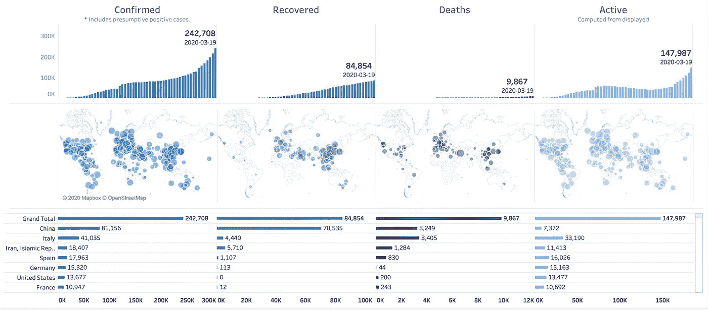
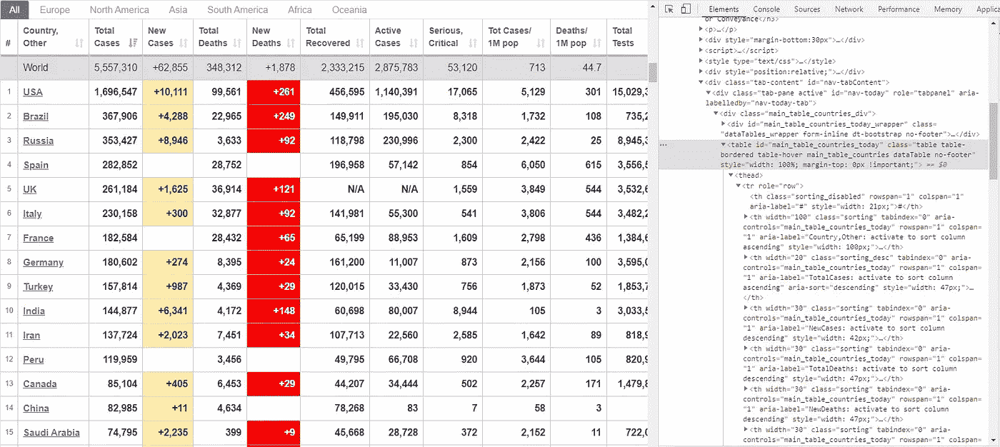
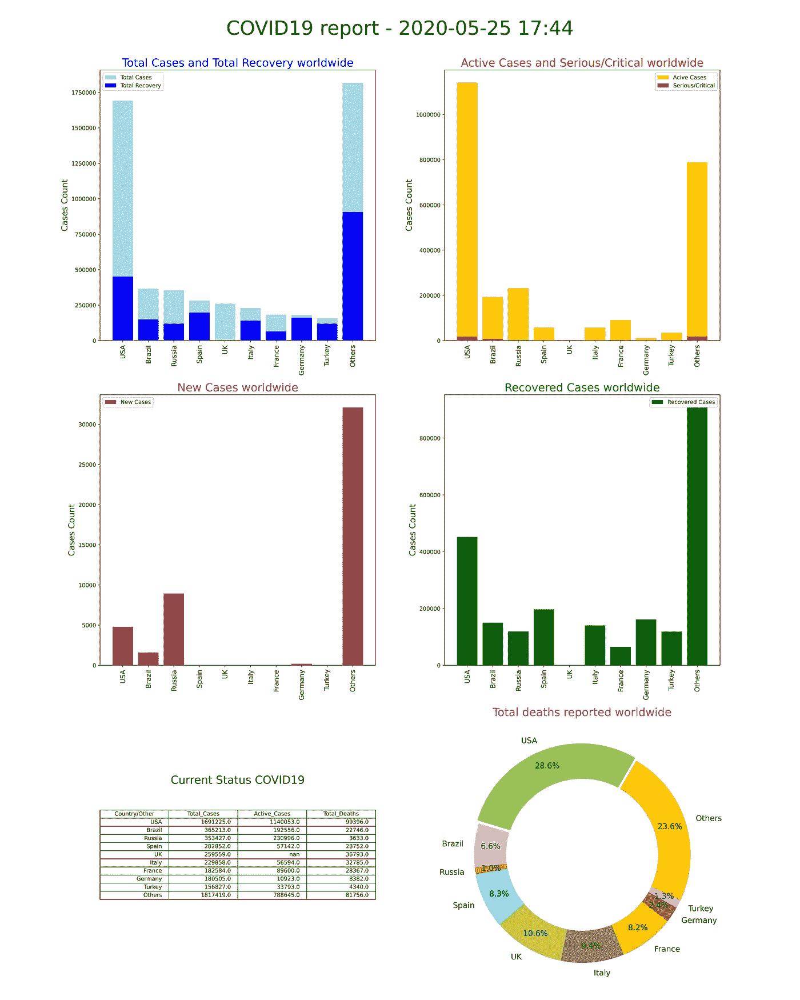
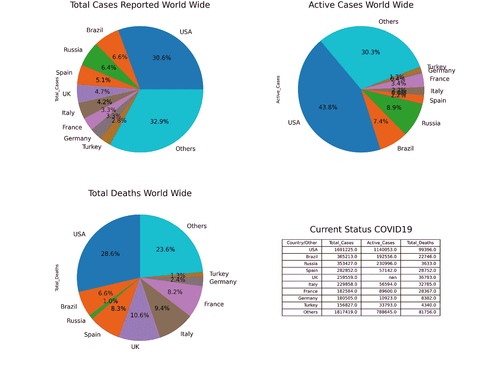
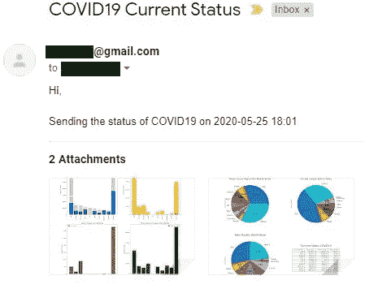

# 新冠肺炎—网页抓取、分析和发送定制电子邮件

> 原文：<https://medium.com/analytics-vidhya/covid-19-web-scrape-analyze-and-send-custom-emails-d9dfbff05d90?source=collection_archive---------33----------------------->



来源:starschema.com

自新冠肺炎疫情病毒爆发以来，人们依靠多个网站来获取该病毒在不同国家或地区的影响信息。在本文中，我们将探索从网站获取数据(网络抓取)并对其进行分析的过程，以创建可视化的图表来展示新冠肺炎当前的状况。稍后，我们将了解如何将这些图作为电子邮件附件发送，以及如何通过电子邮件自动发送定期更新。整个工作流程是用 python 编程语言编写的。

## 网站(全球资讯网的主机站)

我们将用来获取数据的网站是 worldometer。该网站提供新冠肺炎病例、康复、死亡等数字的频繁更新。在每个国家。

[](https://www.worldometers.info/coronavirus/) [## 冠状病毒病例:

### 追踪确诊病例、康复患者、检测和死亡人数的实时统计数据和冠状病毒新闻…

www.worldometers.info](https://www.worldometers.info/coronavirus/) 

## 网页抓取

在我们开始写代码之前，我们需要确定我们应该瞄准的网站部分。为此，我们应该打开 web 浏览器并导航到上面提到的网页。您将能够看到一个包含国家名称和病例数信息的表格。我们可以将该表设置为执行 web 抓取的目标。

按键盘上的 F12，浏览器上弹出的新窗口就是网页的 HTML 代码。您可以通过使用 Google chrome 浏览器上的 Ctrl + Shift + C 键并使用鼠标悬停在网页上来检查网页元素。我们的目标是识别表格的 HTML 代码。



识别要执行网页抓取的表格

如上图所示，我们可以识别代表表格的 HTML 代码和元素。我们将在 python 代码中使用这些信息从网站获取数据。如果你有困难或者需要更多关于检查网页元素的信息，请点击这个链接([网页抓取视频](https://www.youtube.com/watch?v=Bg9r_yLk7VY))观看一个有趣的网页抓取教程。

# 编写代码

我们将使用 python 对整个工作流程进行编程。我们应该导入网络抓取、分析和发送电子邮件所需的所有必要的包。

导入库

## 用于网页抓取的 Python 代码

下面的代码将从网页的表格中提取所有数据，并将数据排列到一个 python 列表中。

Web 抓取并将数据放入列表中

## 数据争论

在我们开始分析和绘图之前，需要对数据进行充分的准备和整理。我们将排列成列表的数据转换成 pandas 数据框。观察数据时，我们可能会注意到有些单元格没有数据或有空白。它们大多表示没有新病例或活跃病例。但是，我们需要将它们更改为一个数学值来执行操作。我们丢弃冗余数据，并用 0 替换一些数据，如空格或“Nan”值。由于我们在此分析中仅关注国家，因此我们删除了与大洲相关的数据。我们还观察到不同列中的数字的数据类型不是整数或浮点数。为了执行数学计算和绘图，我们将它们转换成浮点数据类型。由于数据框架包含 200 多个国家，我们将其缩减到报告病例数最多的前 9 个国家，以及一个名为“其他”的新类别，其中包含来自所有其他国家的信息。我们将使用这些数据进行分析并生成图表。

数据争论

## 生成图

在数据争论过程结束时准备的数据帧用于生成绘图。下面列出了生成一些图的代码。

生成条形图和圆环图的 Python 代码



分析网络搜集的数据后生成的图

生成饼图的 Python 代码



使用数据生成的饼图

## 通过电子邮件发送绘图

通过在“email.txt”文件中提及所有收件人的电子邮件地址，可以将保存的绘图作为附件通过电子邮件发送给多人。“email.txt”文件应该存储在 python 脚本的同一个文件夹中，除非您在代码中提到了确切的路径。“email.txt”文件的内容如下。

```
user.email@gmail.com
Userp@ssw0rd
receiver1@yahoo.com, receiver2@aol.com
```

对于 gmail 用户来说，如果使用“yagmail”软件包，通过电子邮件发送文件的过程可以简化。你可以在下面的链接中找到更多信息。
[YAG mail-教程](https://blog.mailtrap.io/yagmail-tutorial/)

将图作为电子邮件附件发送的代码



收件箱中电子邮件的预览

## 整个过程的自动化

现在我们已经看到了整个工作流程，下面是一些关于我们如何自动化整个过程的提示。
1。编写一个批处理进程，每隔“x”小时执行一次 python 代码。这里的缺点是，你将不得不保持你的电脑运行。
2。我们可以将完整的 python 脚本嵌入到一个带有休眠计时器的循环中。这里，我们也有保持 PC 运行的缺点。
3。在 Google Colab 或其他类似平台中运行代码。像 Google Colab 这样的大多数平台只支持 12 小时内代码的免费不间断执行。
4。您可以在云中设置一个虚拟机，它基于计时器执行 python 脚本。请记住，虚拟机可能会产生成本。
5。最好的选择是将 python 脚本放在开发板中，比如 BeagleBone 或 Raspberry Pi。我们可以将代码嵌入一个带有睡眠定时器的循环中，让它运行。如果电源和互联网连接没有中断，代码将顺利执行。

在 web 抓取过程之后，可以对生成的数据帧进行更多的分析。我想邀请你进行这些分析。在下面的链接中，你可以找到我用来编写网页抓取、分析和发送电子邮件的整个工作流程的 jupyter 笔记本。

[](https://github.com/aj7amigo/COVID-19/blob/master/python_scripts/COVID19_data_analyzer.ipynb) [## aj7 amigo/新冠肺炎

### permalink dissolve GitHub 是超过 5000 万开发人员的家园，他们一起工作来托管和审查代码，管理…

github.com](https://github.com/aj7amigo/COVID-19/blob/master/python_scripts/COVID19_data_analyzer.ipynb) [](https://www.kaggle.com/aj7amigo/covid-19-web-scrape-analyze-send-custom-email) [## 新冠肺炎-网页抓取，分析和发送自定义电子邮件

### 使用 Kaggle 笔记本探索和运行机器学习代码|使用来自非数据源的数据

www.kaggle.com](https://www.kaggle.com/aj7amigo/covid-19-web-scrape-analyze-send-custom-email) 

非常欢迎你的改进建议。

感谢您抽出时间阅读这篇文章。非常欢迎您的反馈。

**谢谢**