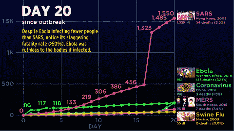
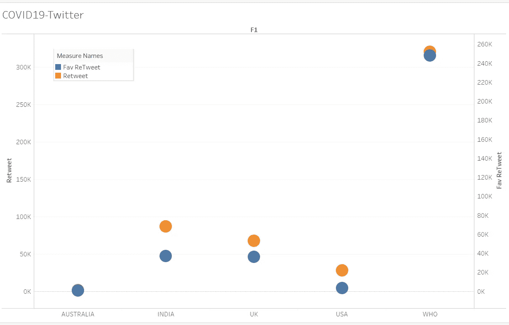
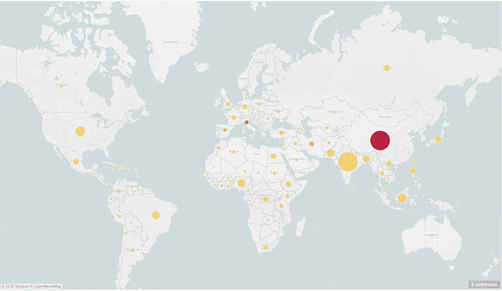
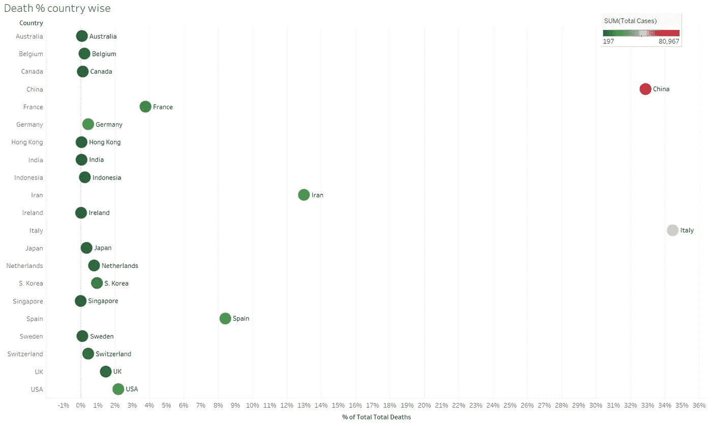
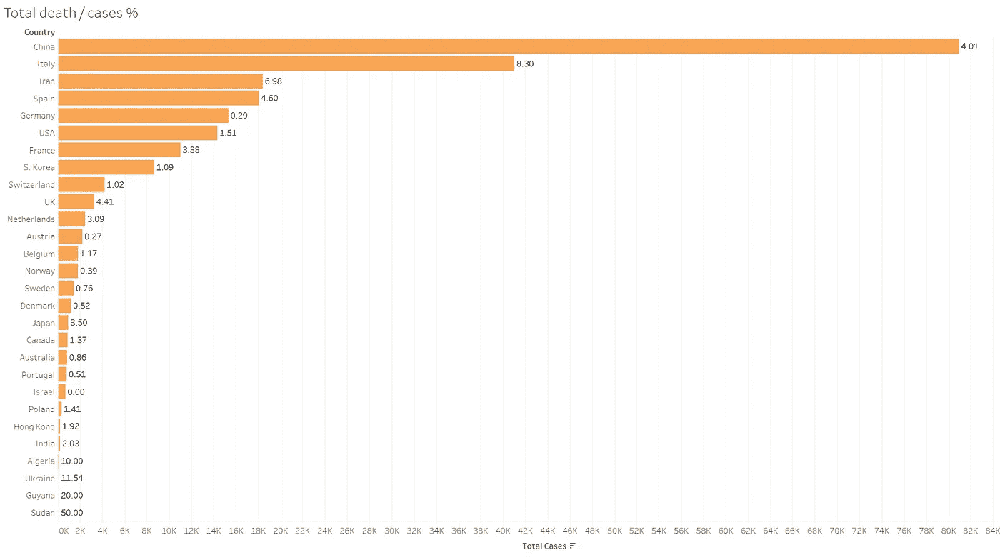
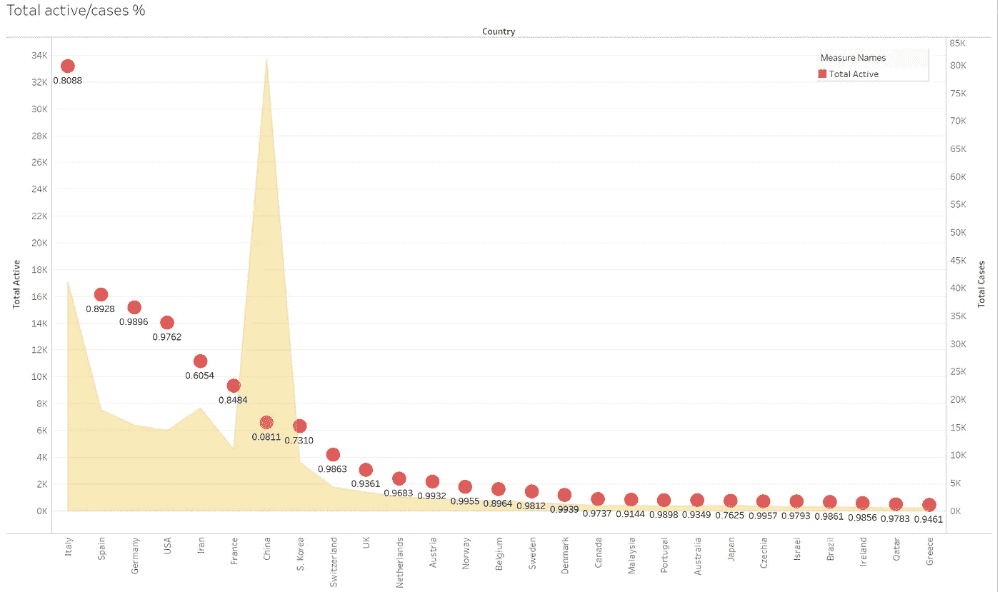
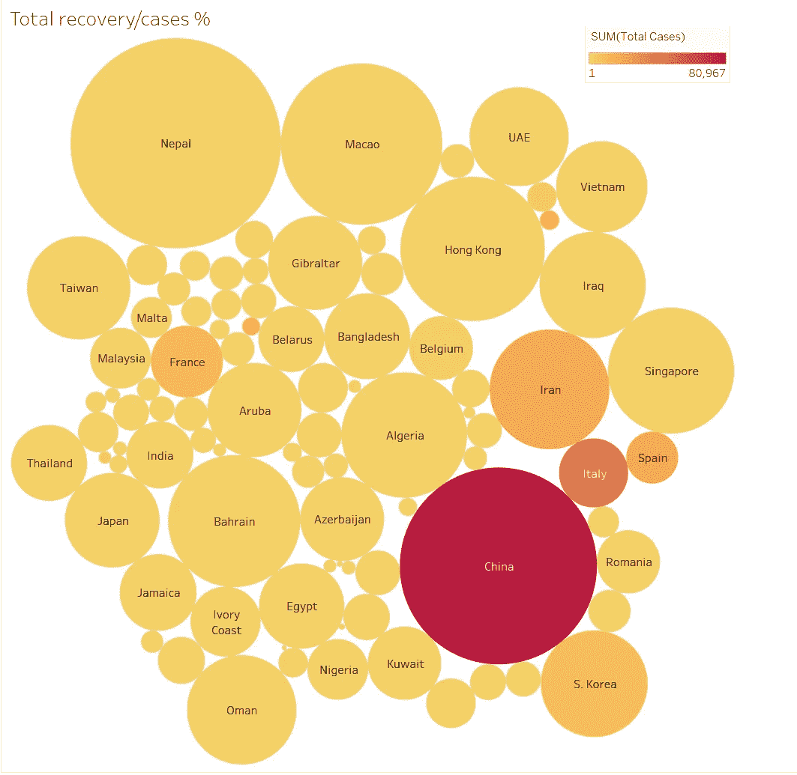

# COVID 19 世界地图分析

> 原文：<https://medium.com/analytics-vidhya/covid-19-world-map-analysis-2eaf9042b312?source=collection_archive---------20----------------------->

## 拥有世界上最好的卫生系统之一的国家如何未能阻止新型冠状病毒！中国之后，欧洲成了震中，接下来呢！

metro.co.uk

关于 novel covid19 及其对世界的影响的数据分析基于 2020 年 3 月 20 日的更新。

在我早期的 twitter 分析研究中，**我们发现了一些奇怪的事情，来自各国的世界领先卫生组织及其在社交媒体上的活动。**

> *对于 covid 19 twitter 分析，我们的目标是对自 2019 年 12 月 31 日在中国武汉举行的新冠肺炎疫情爆发的顶级国家卫生部门官方 twitter 账户和世卫组织 twitter 账户进行分析。我们分析了哪些国家的卫生部门在这场抗击疫情的战争中最为积极。*

在这里，我们针对的是各国重要的卫生部门及其官方推特账号。推特官方账号，

*   世界卫生组织:@世卫组织
*   印度:卫生部:@ MoHFW _ 印度
*   美国:美国卫生与公众服务部:@HHSGov
*   英国:卫生和社会福利部:@DHSCgovuk
*   澳大利亚:澳大利亚政府卫生部:@healthgovau

在收集数据的时间段内，只有世界卫生组织和印度卫生部从他们的官方推特账户上积极传播最新消息。

> ***这显示了从 2020 年 12 月 31 日到宣布疫情，各国卫生部门对新型冠状病毒爆发的反应。***
> 
> ***坦白说！在中国发出警告后，世界还没有做好准备。***

[*研究链接:*](https://github.com/RutvijBhutaiya/COVID-19-Twitter-Analysis)

 [## rutvijbhutaya/新冠肺炎-推特-分析

### 自 2011 年 11 月 31 日发现首例 COVID19 病毒以来，热门国家/地区卫生部门的 Twitter 分析

github.com](https://github.com/RutvijBhutaiya/COVID-19-Twitter-Analysis/blob/master/README.md) 

在接下来的分析中，我们研究了国家。

对于研究，我们参考:[https://www.worldometers.info/coronavirus/](https://www.worldometers.info/coronavirus/)

**数据基于 2020 年 3 月 20 日(上午— IST)。**

# **总病例/人口%**

正如我们在世界地图上看到的，中国、印度、美国、巴西、尼日利亚是世界上人口数量最多的国家，这是根据圆圈的大小来计算的。然而，深色到浅色代表 covid19 病例。

在中国声称他们已经控制了病毒后，橙色圆圈是新的震中。

像印度、印度尼西亚、美国这样的国家需要在健康和检测设施方面做好准备。然而，另一方面，像巴基斯坦、埃塞俄比亚、埃及、尼日利亚、伊朗这样的国家需要非常谨慎。

# 国家死亡率%

中国和意大利在死于该病毒的人数上绝对领先。然而，伊朗和西班牙分别占该病毒死亡总数的 12%和 8%

美国、法国、英国、德国需要格外小心，因为随着中国宣称对新病例的控制，他们将会看到更多的人死于该病毒。

# 死亡/病例总数%

在下面的柱状图中，尽管是中国登记病例最多的国家，但中国对死亡人数控制得很好。

另一方面，意大利、伊朗和西班牙等国家的情况最糟糕，一方面，它们的病例数名列前茅，而且伤亡似乎没有得到控制。

与排名靠前的国家相比，美国、英国、法国、荷兰和日本的冠状病毒病例数量确实较少，但伤亡人数可能会有所转移。

# 活动/案例总数%

红点越小，对县越好。中国在灭活病毒病例方面做得非常好。

正如我们在下图中看到的，面积线显示了案例数量，红点表示相对于总案例数的总活动案例数。

对于意大利、西班牙、德国、美国、伊朗、法国、韩国、瑞士、英国和荷兰等国家来说，前进的道路极其艰难。因为相对于案例总数而言，它们在活动案例中所占的比例非常高。

# 总回收率/案例%

这是分析的必要参数。我们希望每一个圈都越来越大。

下图中圆圈的大小显示了患者的恢复情况。

图表中令人悲伤的部分是那些国家，颜色很深，他们的圆圈不够大，像意大利，伊朗，西班牙，法国。等等。

这不是结束，还会有更多新的数据出现。做这些分析很有趣，但事实是，世界正处于全球衰退的边缘。

> ***我们唯一能从分析中向前推进的是——对自己的提问。***

为什么欧洲国家——尽管拥有世界上最好的卫生保健系统之一——未能阻止病毒。根据世界卫生组织对卫生系统绩效国家的调查，许多排名靠前的国家都是欧洲国家，从法国和意大利开始。**意大利！是的，根据总体卫生系统表现，意大利排名第二，西班牙排名第七。**

> 这个疫情将会留下许多教训。但是，有一点对世界来说是清楚的。 ***排名不重要，“一针见血”才重要。***
> 
> 世界上许多发达国家都缺乏快速反应和紧迫感。

 [## Github |机器学习|数据科学 I 项目

### 这个网页反映了我对机器学习和数据科学项目及其实施的理解。

rutvijbhutaiya.wixsite.com](https://rutvijbhutaiya.wixsite.com/newage)