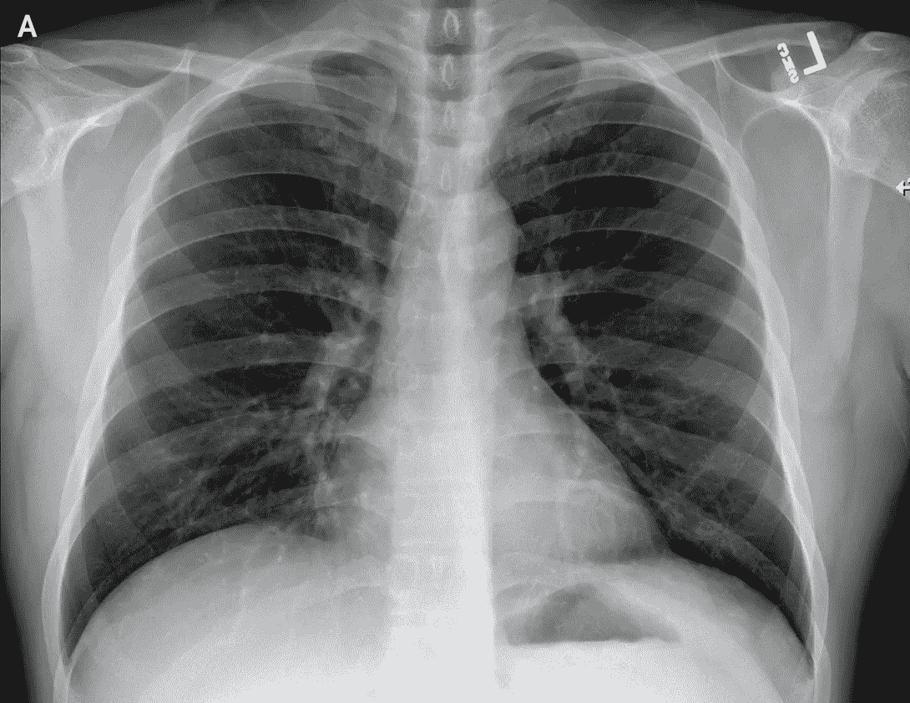
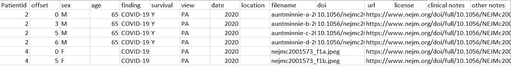
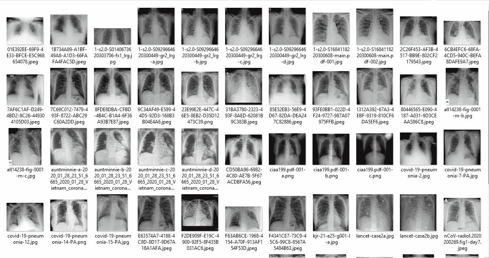

# 新冠肺炎 X 射线数据集-使用 Python 对数据集进行预处理以训练 CNN 网络

> 原文：<https://medium.com/analytics-vidhya/covid-19-x-ray-data-set-preprocessing-of-the-data-set-to-train-a-cnn-network-using-python-40ab53a87a76?source=collection_archive---------12----------------------->

向大家问好！

在我们深入技术部分之前，我想敦促每个人保持水分，经常使用消毒剂，并遵循所有谨慎的措施来保护自己免受新冠肺炎病毒的感染。

来源:[新冠肺炎 x 光数据集](https://github.com/ieee8023/covid-chestxray-dataset/tree/master/images)

O 目的:提取新冠肺炎病毒感染者和健康人肺部的 X 射线图像。创建一个单独的文件夹来存储这些图像，并相应地调整图像的大小来训练 CNN 网络

这篇文章将带你了解以下观点:

1.  新冠肺炎 X 射线数据集概述
2.  Python 程序，用于从中给出的数据中提取受新冠肺炎影响的患者的肺部图像。可用于训练 CNN 模型的 csv 文件
3.  从 [Kaggle 胸部 x 光图像数据集](https://www.kaggle.com/paultimothymooney/chest-xray-pneumonia)中提取一组健康肺部的图像。
4.  调整图像大小以训练 CNN 网络

D ***数据集:*** 新冠肺炎 X 射线数据集的数据集可以通过此[链接](https://github.com/ieee8023/covid-chestxray-dataset)访问。我要感谢约瑟夫·保罗·寇恩。蒙特利尔大学 Mila 博士后研究员主动收集 X 射线图像以帮助研究学者的研究活动。

数据集由 metadata.csv 文件组成，该文件由 119 行(不包括标题)和 15 列组成，即'患者 id '、'偏移'、'性别'、'年龄'、'发现'、'存活'、**、'视图'、'日期'、'位置'、'**文件名【T21 '、' doi '、' url '、'许可证'、'临床注释'和'其他注释'。【以**粗体**标记的列名将帮助我们根据我们的要求提取图像】****

## 注意:数据集中图像的文件名与“文件名”栏下的数据相匹配，请勿更改图像的文件名。

> Python 代码来提取在 **PA** 视图中记录有**新冠肺炎**病例的图像。

你可以通过这个[链接](https://gist.github.com/arnoldsachith/03c8275ead04d7c4e0cf7277cb296086)访问代码。

总共有 56 幅图像被提取到输出文件夹中，这些图像是在**后前(PA)** 视图中记录的**新冠肺炎**病例。文件夹看起来像这样…..

总共有 56 张图像被提取到目标文件夹

当你仔细观察这些图像时，你可以断定这些图像的大小不同。我们知道，为了训练 CNN 模型，所有的输入图像应该具有相同的大小。以下代码有助于一次性调整和保存图像:

> 统一调整图像大小的 Python 代码

你可以通过这个[链接获得代码。](https://gist.github.com/arnoldsachith/fa63cc0fad3c70642eae94d5ed201e80)

现在我们有 56 张新冠肺炎病例的 x 光图像记录在 PA 视图中。从 [Kaggle 胸部 X 射线图像数据集](https://www.kaggle.com/paultimothymooney/chest-xray-pneumonia)中获取“健康肺部”的 X 射线图像，重复提取、调整图像大小以及将图像存储在文件夹中的相同程序。

最后，我们有两个文件夹，里面有新冠肺炎阳性病例和新冠肺炎阴性病例的 x 光图像(一个健康人的正常 x 光图像)。虽然来自 [Kaggle 胸部 X 射线图像数据集](https://www.kaggle.com/paultimothymooney/chest-xray-pneumonia)的图像存在一些难题，如数据集中的噪声，而一些图像没有被适当标记，但为了训练基本的 CNN 模型，这些图像应该工作正常。

你可以训练一个预先训练好的模特，像 VGG、雷斯内特等；或者通过修改超参数来实现更好的准确性，从头开始 CNN 网络。

D 声明:本文**不聚焦**的研究视角** e 对**新冠肺炎**的鉴别，而是**揭示了** [**机器学习**](http://BecomingHuman.ai) **、** [**深度学习**](http://BecomingHuman.ai) **、** [**人工智能**](http://BecomingHuman.ai)**我必须提醒您，我是**而不是**医学专家，对于检测新冠肺炎的实时应用，所建立的模型应该经过教条式的测试，并且应该在部署到实时场景之前由医学专家进行验证。

你可以通过 [LinkedIn](https://www.linkedin.com/in/arnold-sachith-98752a141/) 、 [Instagram](https://www.instagram.com/arnoldsachith/) 和我联系

任何建议请通过您的宝贵意见告诉我。

编码快乐！

干杯:)
阿诺·萨基特