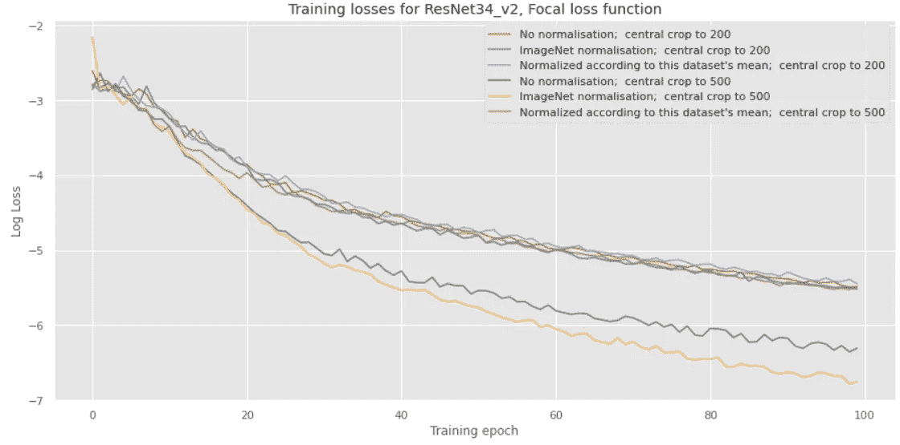
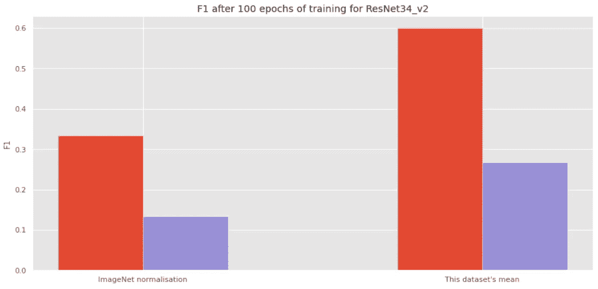
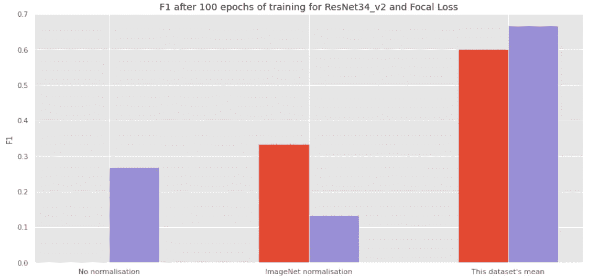
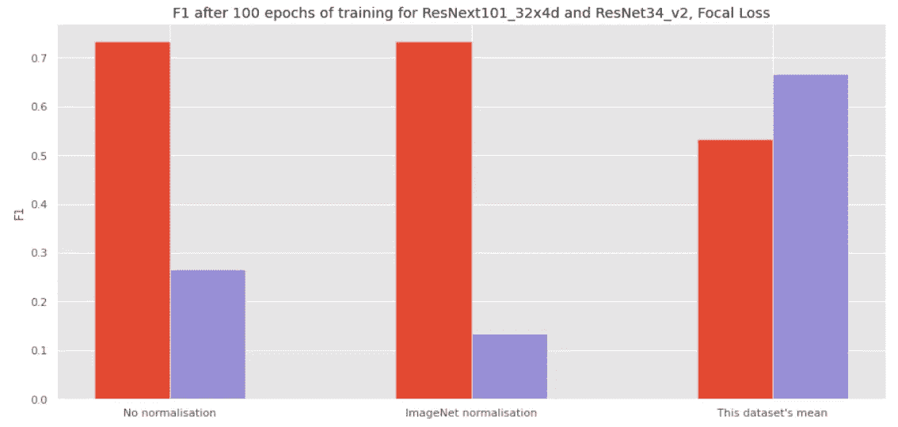

# 基于 mxnet 的新冠肺炎 X 射线图像分类

> 原文：<https://medium.com/analytics-vidhya/covid-19-xray-image-classification-with-mxnet-f09c752a8e67?source=collection_archive---------16----------------------->

# **3 个月内，全球几乎所有国家都确诊了冠状病毒**

3 月 11 日，世界卫生组织终于宣布，新冠肺炎疾病的传播已经达到了疫情的水平。自那时以来，局势进一步恶化，导致许多国家数千人死亡，特别是在意大利。

新冠肺炎病毒与 SARS 病毒非常相似，SARS 是一种在 21 世纪初出现并迅速消失的疾病，导致大约 8000 人受到感染，800 人死亡。这两种病毒都属于冠状病毒家族，这是医学研究人员非常熟悉的:其中一些病毒非常常见，通常不会给患者带来大问题。

新冠肺炎传播非常快，医生需要更多的检测工具。测试程序是基于聚合酶链式反应，需要一些时间，因此，一个便宜、可靠和或多或少自动化的诊断解决方案的问题摆在了桌面上。此外，死亡的进一步传播取决于我们以低水平的假阳性检测它的能力，更重要的是，尽可能低水平的假阴性(未确诊的病人将继续感染其他人，因为将不采取预防措施)。

中国人工智能/人工智能巨头已经开始实施人工智能系统，帮助医生诊断新冠肺炎。在下文中，我们将介绍一个基于患者胸部 x 射线扫描的新冠肺炎检测的简单研究。然而，由于这个问题是非常新的，并且没有 x 射线图像数据的官方来源，从人工智能的角度来看，我们使用的数据集的质量不是很好，因此我们开发的分类器的准确性相当低。如果没有对医疗数据使用的严格监管，它甚至无法接近与医院合作的中国领先技术公司的准确性。

我们将用于训练和测试的数据来自[1]。开发我们的分类器的框架是 Apache mxnet 和 Gluon。我们将看到不同的数据扩充技术、不同的损失和不同的超参数如何影响分类的质量。

# 资料组

我们使用的数据集非常不平衡，包含 x 光图像，之前标记为

*   新冠肺炎:124 张图片
*   SARS: 11 张图片
*   链球菌:6 张图片
*   ARDS: 4 幅图像
*   肺囊虫:2 张图片
*   无发现:2 张图片

这些扫描中的一些显然取自与大多数图像不同的分布。在许多标签上，我们可以看到外部标签。因此，我们从数据集中删除了一些图像。此外，出于我们的目的，我们将把这个数据集聚集到两个类中。

# 数据预处理和扩充

我们使用了以下数据预处理和数据扩充技术:

*   图像向左/向右翻转
*   中间作物
*   完全没有标准化:我们照原样对待图像
*   ImageNet 标准化:使用 ImageNet 数据集的平均值和标准偏差
*   对该数据集的平均值进行归一化:相同的统计数据，但在给定的数据集上进行计算

提前说一句，没有标准化并没有做好工作，而使用 x 射线扫描数据集的统计数据进行标准化已经显示出最好的 F1 度量结果。第二个和第三个程序的平均值和标准偏差值非常接近。

# 使用 mxnet 的基本分类器

首先，导入必要的库

```
import mxnet as mximport numpy as npimport os, time, shutilfrom mxnet import gluon, image, init, ndfrom mxnet import autograd as agfrom mxnet.gluon import nnfrom mxnet.gluon.data.vision import transformsfrom gluoncv.utils import makedirsfrom gluoncv.model_zoo import get_modelfrom gluoncv.loss import FocalLoss
```

我们需要设置超参数，并告诉系统我们将使用 GPU 进行训练

```
classes = 2epochs = 100lr = 0.001per_device_batch_size = 1momentum = 0.9wd = 0.0001lr_factor = 0.75lr_steps = [10, 20, 30, np.inf]num_gpus = 1num_workers = 8ctx = [mx.gpu(i) for i in range(num_gpus)] if num_gpus > 0 else [mx.cpu()]batch_size = per_device_batch_size * max(num_gpus, 1)
```

我们将裁剪图像以避免考虑它们侧面的标签，并尝试不同的标准化。例如，为了避免粘贴太多代码

```
transform_train = transforms.Compose([transforms.CenterCrop(crop_size),transforms.RandomFlipLeftRight(),transforms.ToTensor(),transforms.Normalize([0.485, 0.456, 0.406], [0.229, 0.224, 0.225])]) transform_test = transforms.Compose([transforms.CenterCrop(crop_size),transforms.ToTensor(),transforms.Normalize([0.485, 0.456, 0.406], [0.229, 0.224, 0.225])])
```

我们还定义了我们的数据加载器。由于数据集非常小且不平衡，我们放弃了创建验证集的必要性，仅使用训练集和测试集来限制自己:

```
path = foldertrain_path = os.path.join(path, 'train')test_path = os.path.join(path, 'test')train_data = gluon.data.DataLoader(gluon.data.vision.ImageFolderDataset(train_path).transform_first(transform_train), batch_size=batch_size, shuffle=True, num_workers=num_workers)test_data = gluon.data.DataLoader(gluon.data.vision.ImageFolderDataset(test_path).transform_first(transform_test), batch_size=batch_size, shuffle=False, num_workers = num_workers)
```

现在我们定义预训练模型:

```
model_name = ‘ResNet34_v2’finetune_net = get_model(model_name, pretrained=True)with finetune_net.name_scope():finetune_net.output = nn.Dense(classes)finetune_net.output.initialize(init.Xavier(), ctx = ctx)finetune_net.collect_params().reset_ctx(ctx)finetune_net.hybridize()
```

最后，我们定义训练器来训练网络，F1 作为要遵循的度量，以及两个损失函数供选择:

```
trainer = gluon.Trainer(finetune_net.collect_params(), 'sgd', {'learning_rate': lr, 'momentum': momentum, 'wd': wd})metric = mx.metric.F1()#L = gluon.loss.SoftmaxCrossEntropyLoss()L = FocalLoss(num_class = classes)
```

我们还定义了一个函数来获得准确性和 F1 指标，并运行训练和测试迭代:

```
for epoch in range(epochs):if epoch == lr_steps[lr_counter]:trainer.set_learning_rate(trainer.learning_rate*lr_factor)lr_counter += 1train_loss = 0metric.reset()for i, batch in enumerate(train_data):data = gluon.utils.split_and_load(batch[0], ctx_list=ctx, batch_axis=0, even_split=False)label = gluon.utils.split_and_load(batch[1], ctx_list=ctx, batch_axis=0, even_split=False)with ag.record():outputs = [finetune_net(X) for X in data]loss = [L(yhat, y) for yhat, y in zip(outputs, label)]for l in loss: l.backward()trainer.step(batch_size)train_loss += sum([l.mean().asscalar() for l in loss]) / len(loss)metric.update(label, outputs)_, train_f1 = metric.get()train_loss /= num_batchval_acc, val_F1 = test(finetune_net, test_data, ctx)
```

# 损失函数

我们已经用两个损失函数进行了实验:经典交叉熵损失函数和焦点损失函数。

焦点损失首先被引入用于物体检测问题，但是发现它对于分类也是非常有效的。最初的问题，触发了新的损失函数的开发，是非常简单的:由于前景-背景类别不平衡，一级物体检测器落后于两级物体检测器。

在[2]中，作者已经提出根据神经网络置信度来降低损失函数的权重，缩小来自易于学习的样本的训练贡献，从而处理类不平衡。

# 结果和讨论

给定小规模的训练和测试集以及小数量的训练时期，分类的结果与工业中可接受的结果相差甚远。



不同作物值和不同标准化技术的训练损失

然而，即使从这些结果中我们也可以得出一些结论:

*   焦点损失显示出好得多的结果。



红色:焦点损失，蓝色:交叉熵损失

*   中央裁剪为 500(对于大多数图像来说，大约是图像大小的 30%)比裁剪为 200(图像大小的 10%-15%)要好。
*   使用当前数据集的平均值对数据集进行归一化比使用 ImageNet 平均值更好(根据最终的 F1 指标);然而，ImageNet 归一化显示了训练期间损失函数的最低结果。



红色:裁剪到 200，蓝色:裁剪到 500

*   更复杂的预训练模型 ResNext101_32x4d 比 ResNet34_v2 的性能更高。



对于数据集，使用其平均值进行归一化，ResNext101_32x4d 模型显示出比更简单的模型更差的性能。需要更多培训？

# 结论和进一步措施

mxnet 是相当高性能和易于使用的。新冠肺炎病可以在患者的 x 光扫描中检测出来，但是需要更多的训练数据和更多的实验来获得可接受的精确度和召回率。

## 如何改进这种模式？

*   使用更多图像
*   利用领域信息预处理图像
*   延长训练时间
*   测试其他神经网络架构
*   测试其他职业的目标(目前，新冠肺炎对其余的)

[1][https://github.com/ieee8023/covid-chestxray-dataset](https://github.com/ieee8023/covid-chestxray-dataset)

[2]https://arxiv.org/abs/1708.02002