# COVID 推文分析—第 1 部分

> 原文：<https://medium.com/analytics-vidhya/covid-tweet-analysis-part-1-a88ef91f432f?source=collection_archive---------12----------------------->

## 探索 COVID 推文数据

在这篇博客中，我从 Kaggle 获取了 COVID tweet 数据集，并对其进行了探索，以了解人们在使用 NLP 技术谈论什么。

那么让我们来了解一下新常态开端的数据吧！！

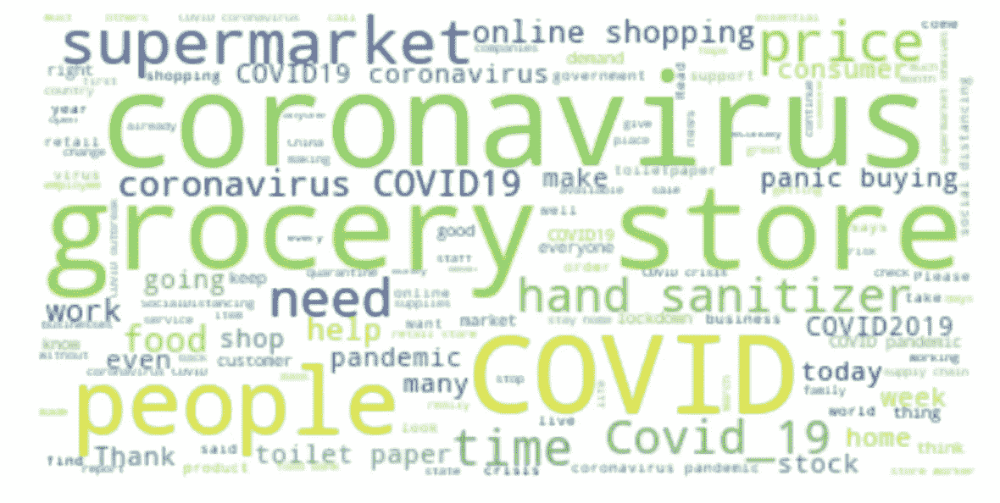

# 使用的数据集

我已经从 Kaggle 获取了数据集“[冠状病毒标记数据](https://www.kaggle.com/datatattle/covid-19-nlp-text-classification)”。这些推文已经从 Twitter 上撤下，人工标记也已经完成。这些名字和用户名都有代码，以避免任何隐私问题。有两个数据集可用——train.csv 和 test.csv。我使用 train . CSV 进行探索性分析。

**列呈** :-

*   用户名
*   昵称
*   在发推文
*   原始推文
*   标签

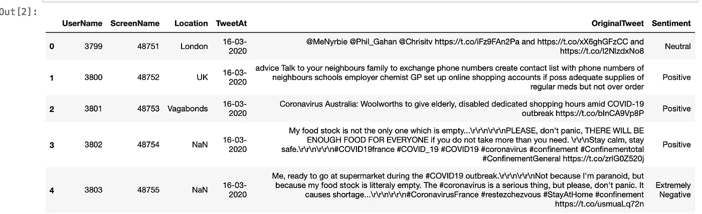

数据一瞥

# 探索 COVID 推文

在所考虑的数据集中，我们有 41k 条记录。让我们开始探索这些 twitter 数据。

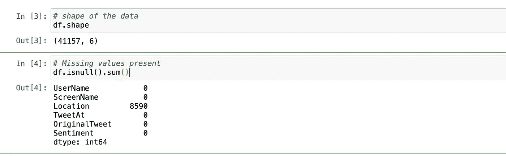

*检查是否存在缺失值* —只有'**位置'**列有大约 8.5k 的缺失值。

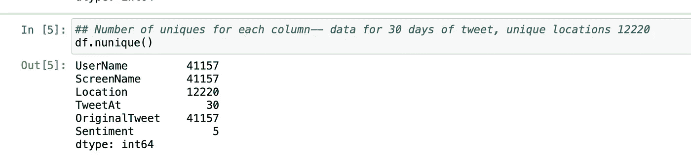

*检查每列唯一值的数量* -同时所有推文都有唯一的用户名和昵称。该数据集包含 12.2K 个唯一位置、5 个唯一情感和 30 个唯一日期。

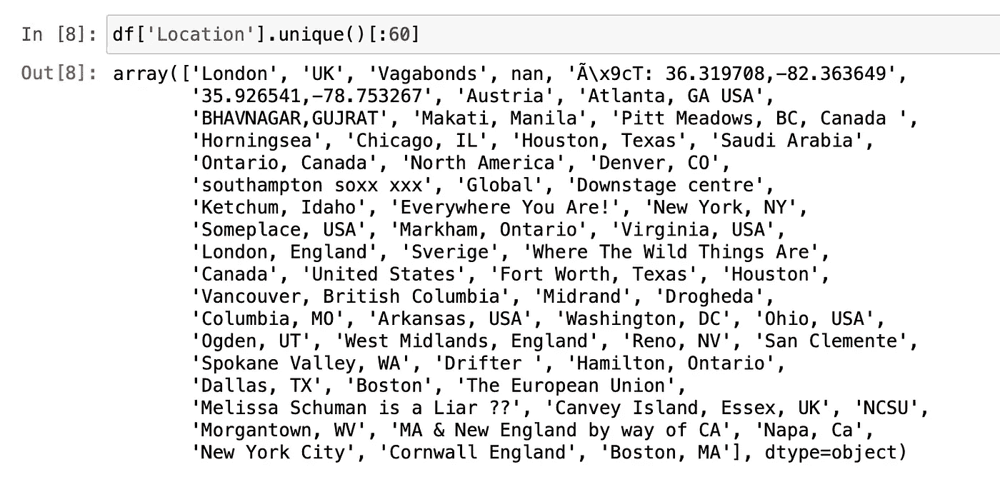

我刚刚检查了位置名称，以了解更多的数据。除了像“伦敦”、“休斯顿”这样的地名之外，还有一些嘈杂的地名，如“野生动物在哪里”、“你在哪里！”。虽然在这个分析中我不会使用位置变量，但了解可用数据集的质量总是有好处的。

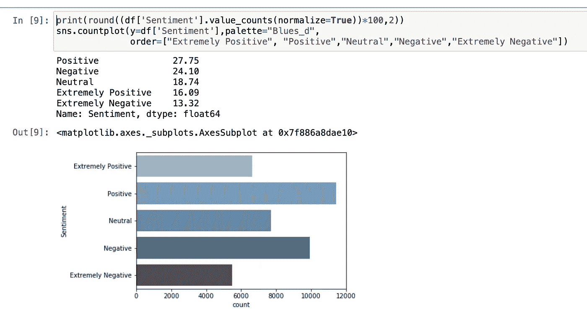

情感栏的分布

此数据已被手动标记。正面和负面情绪的分布似乎非常接近，分别为 28%和 24%，而 16%的推文非常正面，13%非常负面。

*查看推文中的提及次数(@Username)。*

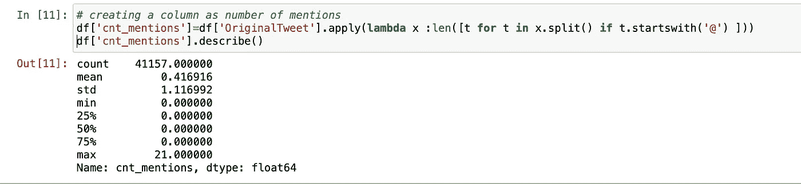

在检查“提及次数”这一列的统计数据时，最大值是 21。我有点好奇，想看看这些推文会是什么样子…所以让我们看看吧！！！

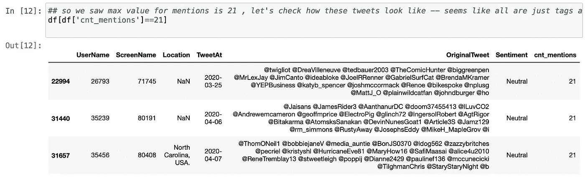

很明显，这些推文只有提及(@Username)，没有其他内容，因此可以被丢弃。

所以这是关于探索数据集中提到的变量，尽管我也检查了每条推文的标签数。你也可以考虑其他特征(比如一条推文的长度),并在分类任务中把它们作为变量。

# 数据解毒

数据清洗是文本分析的无名英雄！有多种方法可以实现这一点，主要取决于数据集和手头的任务。所以我们开始吧！！

*   **删除推文中的网址**

df[' processed ']= df[' original tweet ']。替换(r'http\S+'，' '，regex=True)

*   **转换成小写**

df['已处理']=df['已处理'].str.lower()

*   **修复收缩，我正在使用收缩库**

df['已处理']=df['已处理']。应用(缩写. fix)

*   **从推文中删除提及**

df['已处理']=df['已处理']。apply(lambda x:[t for t in x . split()if not t . starts with(' @ ')])。应用(lambda x:“”。join(x))

*   **删除特殊字符和数字**

df['已处理'] = df['已处理']。replace(r'[^A-Za-z]+'，' '，regex=True)

*   **去除空白**

df['已处理']=df['已处理']。应用(lambda x : x.strip())

# 使用 WordCloud 查看推文中的常用词

我已经使用 **wordcloud** 库的 **WordCloud** 函数构建了一个 wordcloud。一句话里有很多单词云。

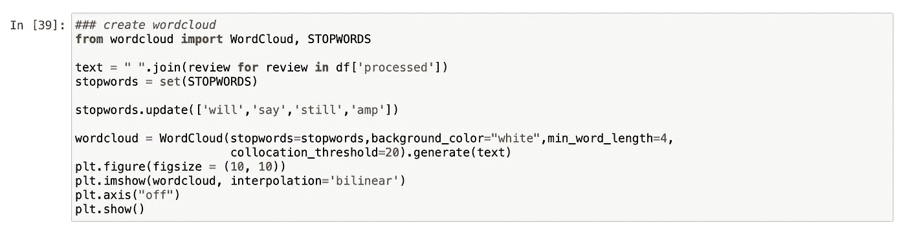

在上面的代码中，我们创建了一个“文本”变量，即一个字符串，该字符串组合了来自数据清理阶段的已处理 tweets 的所有单词。加载从 wordcloud 库中获得的停用词，我在这个集合中添加了一些词。由于这个数据集是专门关于 COVID 推文的，所以很明显我们会将 COVID，冠状病毒作为频繁出现的词。

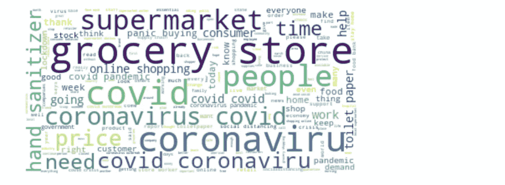

在将类似于**‘covid’，‘冠状病毒’**的词添加到停用词集中后，最终的词云看起来是这样的。

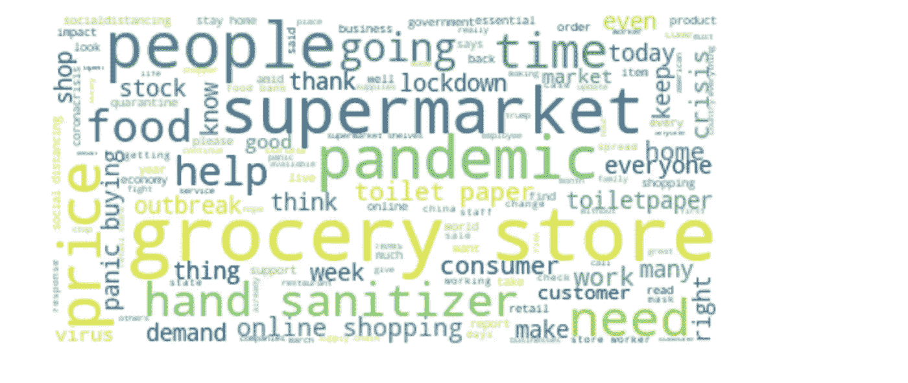

像**‘杂货店’，‘超市’，‘疫情’，‘洗手液’，‘网上购物’，‘抢购’，‘封锁’，‘卫生纸’**这样的词在给定的推特数据集中是频繁出现的词。

至此，您已经完成了探索和理解 COVID tweet 数据的第 1 部分。在接下来的部分中，我们将从 ML 的角度分析这些推文，比如发现潜在的主题和建立情感分类器。

这里可以参考完整代码[。](https://github.com/poojamahajan0712/COVID_tweet_analysis/blob/master/Covid_Tweet_Analysis_EDA.ipynb)