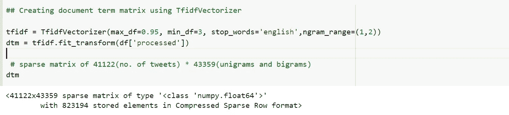
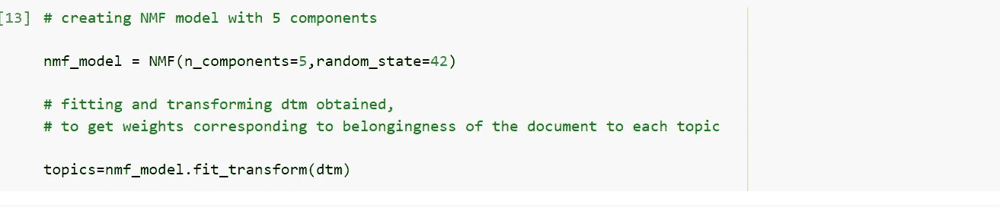
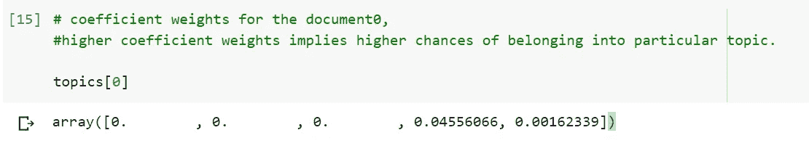
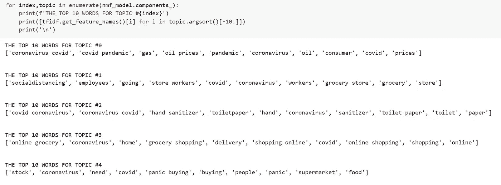
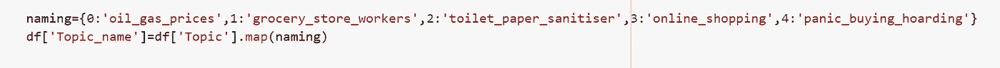
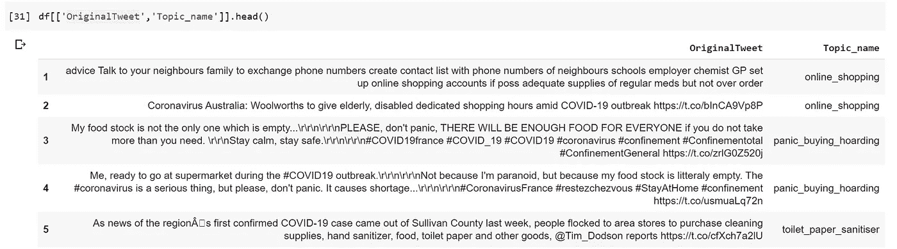
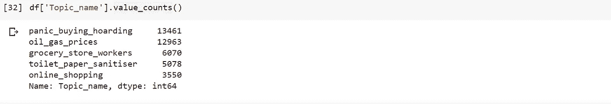

# COVID 推文分析-第 2 部分

> 原文：<https://medium.com/analytics-vidhya/covid-tweet-analysis-part-2-5faae4062c6e?source=collection_archive---------1----------------------->

## 利用主题建模发现潜在主题

在[第一部分](/analytics-vidhya/covid-tweet-analysis-part-1-a88ef91f432f)的继续中，我们探索了与 COVID 相关的 twitter 数据。在本帖中，我们将使用主题建模来更多地了解人们在推特上谈论的潜在关键观点。

我们先来了解一下什么是话题造型！

## 主题建模

主题建模是一种无监督的技术，有助于发现潜在主题，也称为潜在主题，存在于大量可用的文档中。

在现实世界中，我们观察到大量未标记的文本数据，以评论、评论或投诉等形式出现。对于这些场景，主题建模是找到正在讨论的潜在主题的快速解决方案，有助于标记过程。

## 用于主题建模的技术

*   **潜在狄利克雷分配(LDA)**

它的工作基于这样的假设，即具有相似主题的文档使用相似的单词。它假设文档是潜在主题的概率分布，主题是单词的概率分布。

简而言之，LDA 将文档表示为主题的混合物，这些主题以一定的概率与单词相关。

*   **非负矩阵分解**

它是一种数学技术，将一个矩阵因式分解为两个矩阵，其性质是所有三个矩阵都没有负元素(这就是名字的由来！).

我们可以创建维数为 n * p **、**的矩阵 X(数据矩阵)，其可以表示为两个矩阵的乘积，即维数为 n*k 的 A(基向量)和维数为 k *p 的 B(系数矩阵)**其中 n 是文档的数量，p 是令牌的数量，k 是主题的数量。**因此，这种分解对应于将文档与主题相关联以及将主题与标记相关联，因此可以用作进行主题建模的一种方式。

这两种技术都使用了将文档与主题相关联以及将主题与标记(或单词)相关联的概念。LDA 将其建模为概率分布，以找到与主题更相关的单词和与主题更相关的文档，而 NMF 则使用每个主题的单词的系数值(在矩阵分解过程中获得)进行解释。

## COVID Twitter 数据的 Python 实现

所以，让我们回到上次离开的地方，在 Twitter 数据上应用主题建模。在[上一篇博客](/analytics-vidhya/covid-tweet-analysis-part-1-a88ef91f432f)中，我们已经进行了数据清理，所以我将从那一点开始。

**创建文档术语矩阵**

使用**sk learn . feature _ extraction . text . tfidf vectorizer**创建文档术语矩阵，然后对处理后的推文应用 fit_transform。我已经设置了一些参数，如 max_df，min_df，ngram_range，stop_words。作为输出，您将得到 dtm，它是一个 41122*43359 的稀疏矩阵，分别对应于 tweets 的数量和令牌的数量，即根据上述定义的维数为 n*p 的矩阵 X。

**打造 NMF 模式**

我尝试了 LDA 和 NMF，NMF 表现更好，所以带你通过 NMF 的结果。

使用**sk learn . decomposition . NMF**创建一个 NMF 对象，将 n_components 设置为 5(尽管我也尝试了 n_components 的其他值，如 3、6、7)，然后拟合并转换从 Tfidf 过程中获得的文档术语矩阵。

我们来探讨一下转换的输出是什么样子的！这是一个维数为 n*k 的矩阵，正如我们在上面的定义中所讨论的。

对于与索引 0 处的文档相对应的主题[0],我得到一个具有五个值的数组(对应于主题的数量),索引 3 处的最高系数值意味着该特定文档属于主题 3。

**解释每个主题**

因为我们已经了解了如何使用上面讨论的 nmf_model.fit_transform(dtm)的输出将主题与文档相关联。我们也来了解一下这些题目是由什么组成的！

在这种情况下，我们使用 nmf_model.components_(这是维数为 k*p 的第二个矩阵 B)通过查看对应于每个主题的具有最高系数值的前 10 个单词来获得主题与单词的关系。

这些词提供了撰写主题名称的思路，以更好地报告这些发现。

在这里，话题 0 谈论石油和天然气价格，话题 1 涉及杂货店，话题 2 对应洗手液和卫生纸，话题 3 涉及网上购物，话题 4 涉及抢购。

**给推文贴标签**

因此，在了解了这五个主题的构成之后，下一步就是给推文贴标签。

我们讨论的第一个矩阵，即 n*k(主题变量)，我们使用**df[' Topic ']= topics . arg max(axis = 1)**分配对应于最大系数值的主题号

基于与每个主题相关的词，我们可以创建相应的标签。我创造了 5 个标签，分别是‘石油 _ 天然气 _ 价格’，‘杂货店 _ 工人’，‘卫生纸 _ 消毒剂’，‘网上购物’，‘抢购 _ 囤积’。这些名字可以根据:D 创意重新定义

将主题名称映射到主题编号

原始推文和相应的主题名称

我们可以看到，这些标签在理解推文方面做得很好。更多的推文被贴上了恐慌购买囤积和石油天然气价格的标签。

原来如此！你坚持到了最后。

您可以在这里找到该分析的相应代码[。](https://github.com/poojamahajan0712/COVID_tweet_analysis/blob/master/Covid_Tweet_Topic_Modelling.ipynb)

参考资料:-

*   [https://sci kit-learn . org/stable/modules/generated/sk learn . feature _ extraction . text . tfidfvectorizer . html](https://scikit-learn.org/stable/modules/generated/sklearn.feature_extraction.text.TfidfVectorizer.html)
*   [https://sci kit-learn . org/stable/modules/generated/sk learn . decomposition . NMF . html](https://scikit-learn.org/stable/modules/generated/sklearn.decomposition.NMF.html)
*   [https://www . ka ggle . com/data tattle/新冠肺炎-nlp-text-classification](https://www.kaggle.com/datatattle/covid-19-nlp-text-classification)