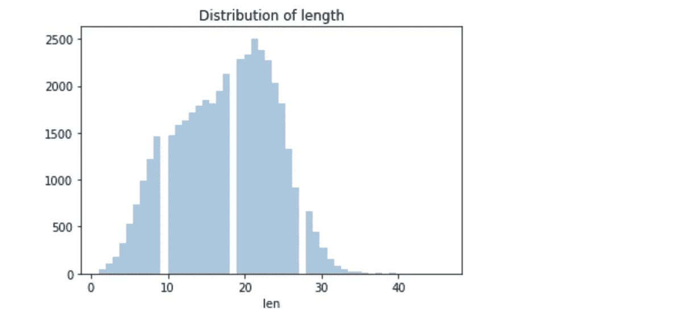

# COVID 推文分析—第 3 部分

> 原文：<https://medium.com/analytics-vidhya/covid-tweet-analysis-part-3-2e24ab3e484d?source=collection_archive---------16----------------------->

## 构建情感分类器

在我之前的博客[第一部分](/analytics-vidhya/covid-tweet-analysis-part-1-a88ef91f432f)和[第二部分](/analytics-vidhya/covid-tweet-analysis-part-2-5faae4062c6e)中，我们分别探索了 COVID 推文数据并进行主题建模，在这一部分，我们将构建一个情感分类器。

正面和负面推文中出现频率最高的词。

虽然前面几部分已经做了基本的数据探索，再次展现一点数据的惊鸿一瞥！！

## a)所用数据集的预览。

*   COVID Tweet 数据集一瞥

*   推文数据可用于一个月的时间段，最大推文数量从 3 月 19 日至 21 日。

*   让我们也看看推文的长度(我已经处理过推文)。大量的推文都有 20-22 个单词长。

关于探索性数据分析的更多细节，请参考[这篇](/analytics-vidhya/covid-tweet-analysis-part-1-a88ef91f432f)博客。

## b)建立情感分类器

由于这是一个延续博客，数据清理已经在前面的步骤中处理过了。因此，我将从模型构建过程开始。

*   **将数据分为训练集和测试集**

我使用经过处理的 tweets 作为独立变量，并创建了一个目标变量，有 3 个级别——中性、积极和消极，分别表示为 0、1 和 2。为了训练，我使用了 70%的数据。

目标分布

*   **创建用于文本特征提取的管道，随后拟合分类器模型**。

我创建了一个函数，它将模型调用作为参数，并创建一个管道，首先使用**tfidfvectorser**转换 tweets，然后拟合分类模型。然后，拟合的模型用于预测测试数据，并且测试预测作为输出返回。

*   **训练分类器**

对于模型构建过程，我尝试了多个模型。让我们带你看一下适合这个数据集的各种基线模型。

1.  **多项式朴素贝叶斯**

多项式朴素贝叶斯是文本分类中使用的两种经典朴素贝叶斯变体之一(其中数据通常表示为词向量计数，尽管已知 tf-idf 向量在实践中也工作得很好)。朴素贝叶斯在文本分类问题上多次被认为是成功的。让我们看看它的表现如何！

其准确率为 64%，对于 0 类的召回率很低，而 1 类的召回率最高，为 0.89。

**2。使用 RandomForestClassifier**

在尝试了朴素贝叶斯之后，让我们尝试使用基于树的分类器 RandomForestClassifier 对此数据进行建模。随机森林在数据集的各个子样本上拟合几个决策树分类器，并使用平均来提高预测精度和控制过拟合。

对于随机森林，准确率提高到 73%。就类 1 和类 2 的精度和召回率而言，它在 0.7-0.79 的范围内，并且无疑是对以前构建的朴素贝叶斯模型的改进。

**3。使用线性支持向量分类**

LinearSVC 执行“一个对其余的”多类策略，从而训练 n 类模型。它类似于参数 kernel=' linear '的 SVC。

它将准确率大幅提高到 79%，特别是对于类别 1 和类别 2(分别为阳性和阴性)，准确率和召回率提高到≥0.81。

请注意，我只是在这里安装了基线模型，这些可以进一步调整。

*   **文字云对测试数据的最终预测**

可视化对应于预测情感值的测试数据集的频繁出现的词。在积极情绪词云中，可以看到像“帮助”、“感谢”、“好”这样的词，而在消极情绪词云中，可以看到像“抢购”、“价格”、“需要”这样的词。

你可以在这个博客[这里](https://github.com/poojamahajan0712/COVID_tweet_analysis/blob/master/COVID_Tweet_Sentiment_classifier.ipynb)找到相关代码。

参考资料:-

*   [https://sci kit-learn . org/stable/modules/generated/sk learn . SVM . linear SVC . html # sk learn . SVM . linear SVC](https://scikit-learn.org/stable/modules/generated/sklearn.svm.LinearSVC.html#sklearn.svm.LinearSVC)
*   [https://sci kit-learn . org/stable/modules/generated/sk learn . naive _ Bayes。MultinomialNB.html](https://scikit-learn.org/stable/modules/generated/sklearn.naive_bayes.MultinomialNB.html)
*   [https://sci kit-learn . org/stable/modules/generated/sk learn . ensemble . randomforestclassifier . html](https://scikit-learn.org/stable/modules/generated/sklearn.ensemble.RandomForestClassifier.html)