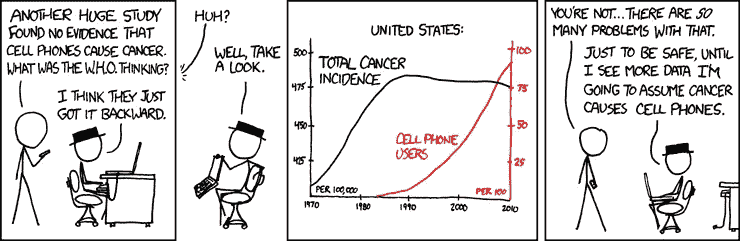
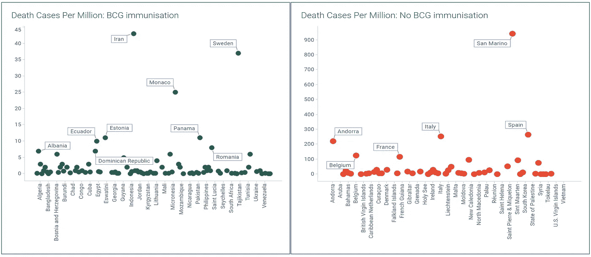

# COVID19 和卡介苗(结核)疫苗

> 原文：<https://medium.com/analytics-vidhya/covid19-and-bcg-tb-vaccine-93b01bfa458a?source=collection_archive---------20----------------------->

> 没有杀死你的东西会让你变得更强，除非它最终真的杀死了你。

卡介苗接种与 COVID19 确诊病例(每百万人口)

如果你通读了一些[的文章](https://www.google.com/search?q=bcg+covid+19&oq=bcg+cov&aqs=chrome.2.69i57j0l5j69i61l2.7635j0j7&sourceid=chrome&ie=UTF-8)，研究人员和医生都在**暗示**covid 19 病例(确诊、死亡)的数量与该国是否有全国性(或大规模)的卡介苗免疫规划之间有很强的相关性。

世界各地的科学家都在争先恐后地为 COVID19 创造疫苗，但我们不应该期待任何东西会这么早出来。

在我以前的文章中，我讨论了为什么我认为在足够好的措施下(没有大规模移民，没有大型集会，以及合理的封锁期)，印度可能不会像一些专家预测的那样有很多病例(以百万计)。

这篇文章用最近出现的一些新见解对这一理论进行了扩展。

首先，提醒一句:

我不是科学家或流行病学家，没有资格评论流行性疫苗的话题。这篇文章是为了教学的目的，仅仅为读者提供了所有必要的数据来理解事实上是否有任何关联。即使我们确实发现了任何关联，我们也不能马上假设因果关系，因为有许多其他因素不属于比较的一部分。然而，这是一个很好的起点，可以更深入地探讨这种关系。

图片来自 xkcd

**什么是卡介苗**:卡介苗(BCG)是一种主要用于预防结核病和脑膜炎的疫苗。这是一种百年疫苗(20 世纪 20 年代)。这种疫苗是给婴儿接种的，不同的国家有不同的全国性卡介苗免疫政策。

请注意，尽管两者都影响呼吸系统，但结核病是一种细菌感染，不同于 COVID19，它是一种病毒感染。然而，卡介苗有助于增强免疫系统，这是我们抵御各种传染病的第一道防线。更多福利[此处](https://www.youtube.com/watch?v=LLTcNHfRuVs)。

为什么有些国家有结核病(或者为什么其他国家没有):这与一个国家面临的结核病负担有关。例如，像印度这样的发展中国家，结核病例较多，因此卡介苗大规模免疫接种在 1948 年独立后就开始了。中国在 20 世纪 30 年代开始了国家级免疫接种。伊朗始于 20 世纪 80 年代中期。对于西方国家来说，大部分都没有全民接种卡介苗。

**提出了什么主张**:根据各种研究人员和医疗专业人士的说法，卡介苗接种情况和 COVID19 病例数之间似乎有直接的关联。

**什么意思**？遵循标准的卡介苗全国接种计划的国家，COVID19 病例数量少得多(因此死亡率也低)。

得出的潜在结论是:卡介苗接种不仅有助于预防结核病，还有助于预防其他传染病，COVID19 似乎就是其中之一(SARS 对卡介苗接种国家的传染性也较低)。

**各国的反应如何**:很少有国家已经开始进行试验，并给他们的医疗工作者和普通民众接种卡介苗。澳大利亚领先了。荷兰已经开始向医护人员和老年人发放这种疫苗。在其他国家，卡介苗是国家疫苗接种计划的一部分，他们对此感到高兴，但对结果持谨慎态度。

**数据**:这个博客的数据来自世卫组织和 Worldometer(链接在最后提供)。 [TIBCO Spotfire](https://www.tibco.com/products/tibco-spotfire) ，一款领先的高级数据分析工具，用于创建所有可视化效果。卡介苗免疫数据是 2018 年的。COVID19 数据截至 2020 年 4 月 5 日。

# 大局

树形图:大小决定事例的数量。颜色红色:无卡介苗，绿色:卡介苗

上面的表示是[树形图](https://en.wikipedia.org/wiki/Treemapping)。盒子越大，每 100 万人口中的感染病例就越多。颜色表示是否有国家级卡介苗接种(截至 2018 年)。非常明显的是，所有没有国家级卡介苗的国家每 100 万人中有更多的病例，如左上角所示。所有的绿色盒子都很小，都藏在右下角。

# **卡介苗状态的 Covid19 确诊病例**

下面两个散点图显示了有卡介苗免疫规划的国家与没有卡介苗免疫规划的国家的 COVID19 确诊病例。由于不同国家的人口差异很大，我们将数据标准化为百万分之一病例，而不是整个人口。

对于上述情况，我们观察到:

1.  每百万病例在卡介苗免疫接种国家中处于较低范围(摩纳哥最高为每百万 1600 例)。
2.  在没有卡介苗免疫接种的国家，每百万病例最多约为 8000 例(圣马力诺)
3.  对于卡介苗免疫的人群，这些国家聚集在 Y 轴的底部，而对于没有卡介苗免疫的国家，我们看到数据分布在 Y 轴上，没有明显的聚集。聚类是识别特定模式是否存在的第一步。

# 具有卡介苗状态的 Covid19 死亡病例

下面两个散点图显示了有卡介苗免疫规划的国家与没有卡介苗免疫规划的国家的 COVID19 死亡率。相反，我们将数据标准化为百万分之几。

1.  每百万死亡病例在卡介苗免疫接种的国家中处于较低范围(中国最高为每百万 45 例)。
2.  在没有卡介苗免疫接种的国家，每百万死亡病例最高可达 950+左右。这几乎是卡介苗免疫接种国家的 20 倍。

# COVID 超过 10，000 例的国家 9

在撰写本文时，有 15 个国家出现了 10K+病例，我们可以看到其中 11 个国家没有任何形式的卡介苗接种政策。

我们如何解释中国和伊朗，这两个国家都有 99%的卡介苗接种率？当然人口是最大的原因，他们在前 10。仅仅基于百万分之几的病例，它的平均值。

然而，对于中国，我们可以说，由于它是疫情的震中，它措手不及，因此我们看到如此高的数字。

另一方面，伊朗从 20 世纪 80 年代中期开始普及卡介苗，因此今天 40 岁以上的人口没有接种疫苗。不幸的是，COVID19 对老年人的打击最大，这或许可以解释。

总之，虽然这看起来是一个不错的相关性，但必须进一步探索，并用其他因素进行测试。不应该只看表面，应该进行更多的分析和专家研究。然而，就像澳大利亚和荷兰一样，各国可以开始试验并给健康的医疗专业人员服用，看看是否真的有帮助。

**来源**:

【2018 年 BCG 数据。

[截至 2020 年 4 月 5 日的 COVID19 数据。](https://www.worldometers.info/coronavirus/)

[新闻。](https://www.khaleejtimes.com/coronavirus-outbreak/bcg-vaccine-a-potential-new-tool-to-fight-covid-19-study)

**我的其他文章**:

[COVID19-印度的进展](/@PandeySudhendu/covid19-indias-progression-1f0f75450772)

[建模疫情— SIR 模型](/@PandeySudhendu/modeling-a-pandemic-sir-model-18a8c76034a1)