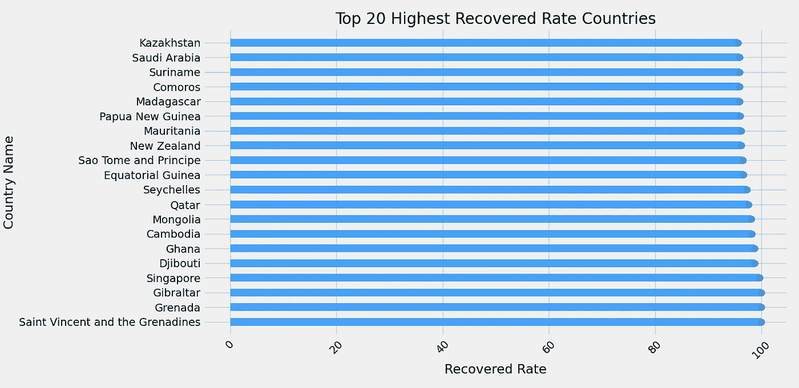

# 使用 Python 进行 COVID19-API.org 数据探索和可视化

> 原文：<https://medium.com/analytics-vidhya/covid19-api-org-data-exploration-and-visualizing-using-python-203639996d35?source=collection_archive---------24----------------------->

Covid19 是一种已经传播到全世界的疫情。世界上大多数国家都被感染了。根据政府政策，每个国家的处理方式是不同的。这导致不同国家 COVID 病例增加或减少的趋势存在差异。

在这种情况下，我们将尝试从一个可用的明火中挖掘 covid19 数据，即[https://covid19-api.org/.](https://covid19-api.org/)

[](https://covid19-api.org/) [## 免费新冠肺炎 API

### 你可以在 Postman 中查看我们 API 的文档。它包含所有请求的描述，它们被接受…

covid19-api.org](https://covid19-api.org/) 

> 简单来说，API 可以理解为计算机与其他计算机进行通信的一种方式，以便可以发生数据交换事务。因此在这个项目中，我们将学习从 API 检索数据的技术、准备数据的技术以及数据分析和可视化。

# 导入库

首先，导入需要的库。

```
import jsonimport numpy as npimport pandas as pdimport requestsimport matplotlib.pyplot as pltimport datetime
```

# 加载数据

用 api_url 参数创建一个 python get_json 函数。如果结果 status_code 为 200，此函数将返回一个 python 字典值。否则，返回值为 None。

```
def get_json(api_url):response = requests.get(api_url)if response.status_code == 200:return json.loads(response.content.decode('utf-8'))else:return None
```

全球 COVID19 数据在 covid19-api.org。我们通过“2020–09–7”使用 record_date 变量，并将 API 响应结果放入 df_covid_worldwide 变量中。

```
record_date = '2020-10-12'covid_url = 'https://covid19-api.org/api/status?date='+record_datedf_covid_worldwide = pd.io.json.json_normalize(get_json(covid_url))
```

为了获得 COVID19 数据帧，我们应该规范化并调用之前创建的函数。然后，我们可以看到数据框中的前 5 个数据。

```
df_covid_worldwide.head()country          last_update    cases  deaths  recovered
0      US  2020-08-16T23:27:50  5401167  170019    1833067
1      BR  2020-08-16T23:27:50  3340197  107852    2655017
2      IN  2020-08-16T23:27:50  2589682   49980    1862258
3      RU  2020-08-16T23:27:50   920719   15653     731444
4      ZA  2020-08-16T23:27:50   587345   11839     472377
```

# 数据探索和可视化

## —各大洲的案例

让我们从名为 countries.csv 的 [my GitHub](https://github.com/dwiknrd/medium-code/blob/master/covid19-eda/countries.csv) 中取出一个不同的数据帧，然后作为熊猫数据帧加载。将先前的数据帧与新的数据帧合并

```
countries_df = pd.read_csv("countries.csv")countries_df = countries_df.rename(columns = {'location': 'name'}, inplace = False)covid_df = countries_df.merge(df_covid_denormalized, on='name')
```

通过可视化，我们可以看到病例百分比很高的大陆。

```
continent_case = covid_df.groupby('continent')['cases'].sum()plt.style.use('fivethirtyeight')plt.figure(figsize=(13,7))plt.title("Percentage of Confirmed Cases on Each Continent")g = plt.pie(continent_case, labels=continent_case.index,autopct='%1.1f%%', startangle=180)plt.show()
```


正如我们在上面的饼图中所看到的，亚洲在 Covid19 的高确诊病例中占据首位。

## —病死率(CFR)

在流行病学中，有一个致死率，它是指在特定时期内，死于某种疾病的人数占被诊断患有该疾病的总人数的比例。

所以，让我们为死亡率做一个新的栏目。

```
df_covid_denormalized['fatality_ratio'] = df_covid_denormalized['deaths']/df_covid_denormalized['cases']
```

通过可视化，我们可以看到死亡率高的 20 个国家。

```
plt.figure(figsize=(17, 7))y = df_top_20_fatality_rate['name']x = df_top_20_fatality_rate['fatality_ratio']plt.ylabel('Country Name')plt.xlabel('Fatality Rate')plt.title('Top 20 Highest Fatality Rate Countries')plt.xticks(rotation=45)plt.hlines(y=y, xmin=0, xmax=x, color='indianred', alpha=0.8, linewidth=10)plt.plot(x, y, "o", markersize=8, color='#007acc', alpha=0.8)plt.tight_layout()
```


## 死亡率

死亡率是对特定人群中死亡人数的一种度量，与该人群的规模成比例。我们用死亡病例数除以人口数来计算死亡率。

```
covid_df["mortality_rate"] = round((covid_df['deaths']/covid_df['population'])*100,2)covid_mortality_top_20 = covid_df.sort_values(by='mortality_rate', ascending=False).head(20)
```

通过可视化，我们可以看到死亡率高的 20 个国家。

```
plt.figure(figsize=(17, 7))y = covid_mortality_top_20['name']x = covid_mortality_top_20['mortality_rate']plt.ylabel('Country Name')plt.xlabel('Mortality Rate')plt.title('Top 20 Highest MortalityRate Countries')plt.xticks(rotation=45)plt.hlines(y=y, xmin=0, xmax=x, color='darkblue', alpha=0.8, linewidth=10)plt.plot(x, y, "o", markersize=8, color='#007acc', alpha=0.8)plt.tight_layout()
```


## —恢复比率

我们通过治愈病例数除以确诊病例数来计算治愈率。

通过可视化，我们可以看到回收率较高的 20 个国家。

```
covid_df["recovered_rate"] = round((covid_df['recovered']/covid_df['cases'])*100,2)covid_recovered_top_20 = covid_df.sort_values(by='recovered_rate', ascending=False).head(20)plt.figure(figsize=(15, 7))y = covid_recovered_top_20['name']x = covid_recovered_top_20['recovered_rate']plt.ylabel('Country Name')plt.xlabel('Recovered Rate')plt.title('Top 20 Highest Recovered Rate Countries')plt.xticks(rotation=45)plt.hlines(y=y, xmin=0, xmax=x, color='dodgerblue', alpha=0.8, linewidth=10)plt.plot(x, y, "o", markersize=8, color='#007acc', alpha=0.8)plt.tight_layout()plt.show()
```



# 按时间表分列的新冠肺炎数据

这一节，我们想看看新冠肺炎发展的时间线。从前面的 API 源开始，我们开始创建 API 函数

```
timeline_url = ‘https://covid19-api.org/api/timeline'covid_timeline_df = pd.io.json.json_normalize(get_json(timeline_url))
```

现在，我们想象时间线上的差异

```
plt.clf()fig, ax = plt.subplots(figsize=(15,7))covid_timeline_df.plot(x='last_update', kind='line', ax=ax, lw=3, color=['salmon', 'slategrey','olivedrab'])ax.set_title("Dynamic COVID-19 Cases")ax.set_xlabel('')plt.grid()plt.tight_layout()
```


# 结论

从显示的数据和图表中，我们可以得出结论，世界上的新冠肺炎病例正在增加。因此，我们必须保持健康和清洁，以避免新冠肺炎。呆在家里，注意安全。

您可以通过我的 GitHub 下载数据和 python 代码文档:

[](https://github.com/dwiknrd/medium-code/tree/master/covid19-eda) [## dwiknrd/中等代码

### 此时您不能执行该操作。您已使用另一个标签页或窗口登录。您已在另一个选项卡中注销，或者…

github.com](https://github.com/dwiknrd/medium-code/tree/master/covid19-eda)