# COVID19-印度的进展

> 原文：<https://medium.com/analytics-vidhya/covid19-indias-progression-1f0f75450772?source=collection_archive---------14----------------------->

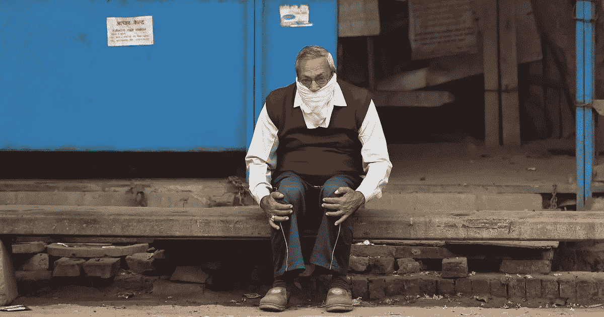

# 就 COVID19 而言，接下来的几天对印度至关重要。我们要去哪里？

*** * * * * * * * *更新(3 月 27 日)**:本文原写于 3 月 23 日。仅仅两天后，巧合但并不意外的是，印度政府宣布完全关闭 21 天。这可能是最近做出的最好的决定。以下是截至今天的数字*(确认:764 人死亡:20 人康复:71 人)*。印度还没有看到指数增长，这是一个好消息。我乐观地认为，如果人民坚持关闭，这个数字不会增长到意大利或伊朗的水平。手指交叉* * * * * * * *

这篇文章提供了一个渠道来讨论印度在新型冠状病毒爆发方面的立场以及政府在不久的将来应对疫情的计划。根据我们目前掌握的数据，我们将评估两种可能性:印度是否会像韩国一样勉强应付，还是会类似于意大利的全面战争状态。

*情况的严重性和生命的价值是至关重要的，无论如何，这篇文章和统计数据都没有削弱情况的严重性。这篇文章是为了帮助我们更清楚地了解这次疫情。欲了解最新信息，请访问 WHO.int 或 CDC.gov*

它还将表明，如果印度想要遏制疫情，为什么它应该改变其内部旅行计划，以完全封锁。

这是截至 2020 年 3 月 21 日的数据。

截至 3 月 21 日，三个国家的日期(JHU)

这是随着时间的推移。请注意，所有三个图表都位于不同的时间轴上，如 Y 轴所示。

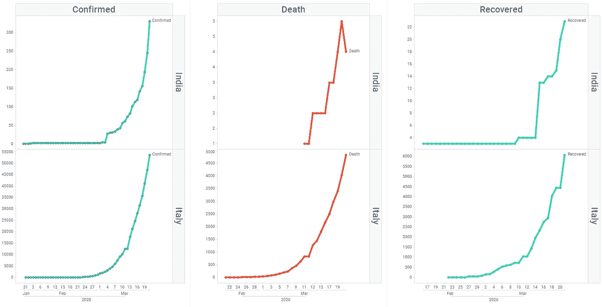

案例进展:印度对意大利

# 与意大利的相关性

如果你浏览新闻，很可能你已经听说印度是 COVID19 疫情的下一个热点。欧洲是下一个候选者。两者的相似性？人口。

记者、医学专家、专家和普通人做出这一预测有多种原因。这种预测背后的原因可以分为以下一种或多种。走过每一个点，我们看到作出这种声明的(明显的)理由。

**1。** **人口**

印度人口 1380004385。超过 10 亿人。相比之下，意大利的人口为 60，461，826，是印度的 1/22。客观地说，每一个意大利人，就有 22 个印度人。韩国是印度的 1/26 倍。

明白这个数字为什么有价值是很有意义的。如果拥有 1/22 人口的意大利可以面对如此程度的浩劫，为什么印度不会呢？

这些国家的人口

**2。** **生活质量和医疗保健体系**

印度的医疗体系并不出名。就全球医疗保健提供系统而言，意大利排名第二，仅次于法国，而印度甚至没有进入前 100 名(我找不到确切的位置，但与当前的讨论无关)。大多数印度人都很贫困，很少或根本没有机会获得基本的卫生和体面的医疗保健福利。

**3。** **与其他国家的时间对比**

这也许是最重要的一点。意大利、中国、伊朗等。在更短的时间内实现了非常高的指数增长。毫无疑问，COVID19 是一个疫情，我们正看到前所未有的增长。这使得将印度与这些国家进行比较变得显而易见，在某种程度上也很好。高估而不是低估，我们没有什么损失，但我们要认识到，不是每个国家都会看到同一水平的水平，这取决于多重因素。

**4。** **缺少更多数据，否则无法得出结论**

在最近的过去，这是我们第一次受到如此沉重的打击。SARS、MERS、埃博拉尽管致命性更高(就确诊病例与死亡病例而言)，但就确诊病例总数而言相对有限。下面的数字显示了细节。

正如我们所见，COVID19 在总确诊数方面远远超出了界限，但当我们考虑死亡率时，它相当低。

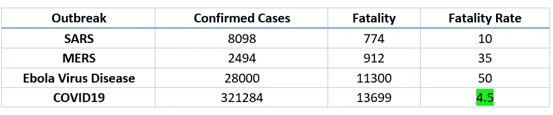

# 还有其他我们应该考虑的因素吗？

如果你想合理清晰地预测，我们还应该考虑其他因素。没有两个国家是相同的，根据其他国家的数据准确预测一个国家的疫情进展是不可能的。有如此多的因素，不可能处理如此复杂的系统。最好的办法是，停止预测，开始行动(就像纳西姆·尼古拉斯·塔勒布一样)。

但我们仍应关注以下重要因素和关键数据点，以更好地了解我们如何控制局面。

如果你浏览一下下面的因素，它们表明印度似乎更接近韩国的结果，而不是意大利。只有时间能证明一切。

**1。** **年龄**

**2。** **性别**

**3。** **吸烟习惯和现有医疗状况**

**4。**T22【印度与其他国家的比较】

1.  **年龄**

年龄是致死率的主要指标之一。根据世界气象组织、世卫组织和疾病预防控制中心公布的数据，这是它如何影响死亡率的。下面的表格和图表显示了如果一个人处于某个年龄段，他死于 COVID19 的可能性有多大。

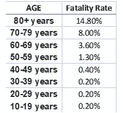

COVID19 按年龄分类的死亡率

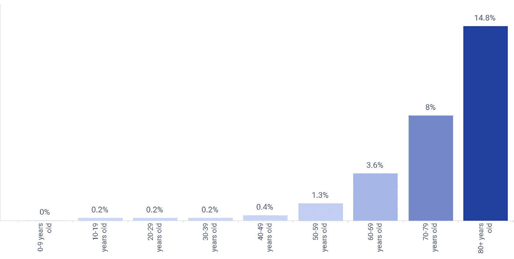

年龄组死亡率

非常明显的是，如果患者年龄超过 50 岁，与其他年龄段相比，死亡的可能性要高得多。10 周岁以下的，为 0%。

下面是意大利、印度和韩国 60 岁以上的人口统计数据。

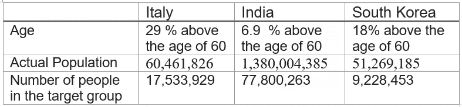

从年龄人口统计来看，印度的老年人要少得多，因为我们的人口相对年轻。这可能对我们有利，但也可能造成严重破坏，因为我们的老年人口总数是意大利的 4 倍以上。也就是说，这些老年人中的所有人或任何人都不会患有 COVID19。

这意味着我们应该努力隔离和治疗这个年龄组的人。

**2。** **性别**

如果我们看看世卫组织和疾病预防控制中心提供的数据，性别也是一个很好的指标。全世界新冠肺炎病例的性别比例大约是 50:50，但是在存活率上存在性别差异。新的证据表明，死亡的男性多于女性，这可能是由于基于性别的免疫或性别差异，如吸烟的模式和流行程度。

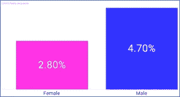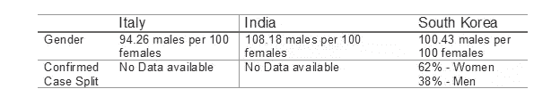

由于我们没有印度 COVID19 病例的性别数据，因此很难评估这一标准。然而，如果我们看看韩国，62%的病例是女性。数据显示，与男性相比，女性死亡的几率更低(男性中有 5%，女性中有 3%，这是一个很大的差异)。我们也没有意大利的性别数据。

**拿走**:印度应该公布确诊病例的性别划分，以便更好地评估这一标准。没有印度的数字，我们无法做出任何猜测，但我们知道，如果确诊病例中女性比例更高，死亡人数可能会更少。

**3。** **吸烟习惯和其他健康状况**

毫不奇怪，吸烟习惯在 COVID19 的存活中起着至关重要的作用(就像任何重大疾病一样)。“主动吸烟会增加你呼吸道感染的风险，”南安普敦大学的英国国民保健服务顾问医师兼研究员汤姆·威尔金森教授说。

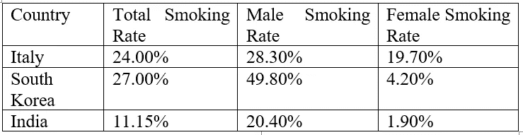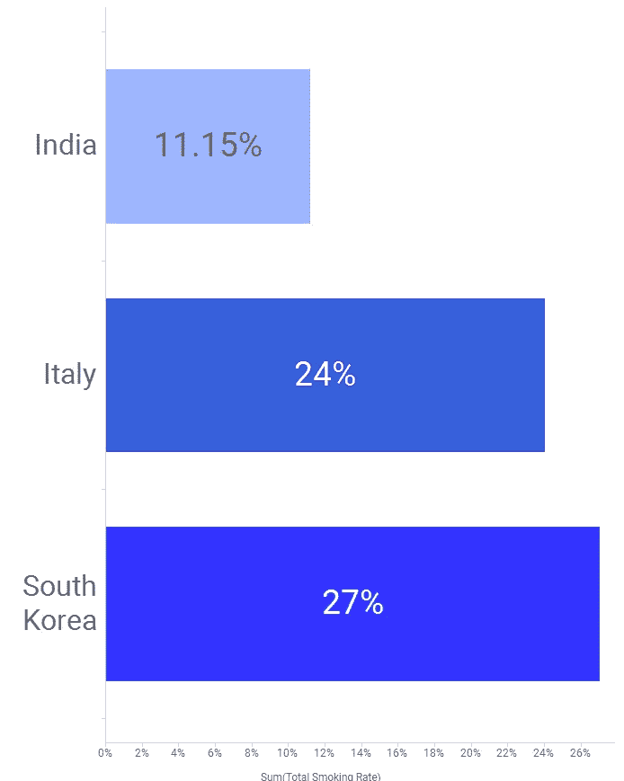

吸烟人口百分比

如果我们看看上面的数据，印度积极吸烟者的人数要少得多(与意大利或韩国相比，分别为 11%和 24%或 27%)。因此，即使确诊病例的数量可能明显更高，我们预计转化为实际死亡的病例会更少。

另一方面，印度有更多的人患有心血管疾病。据统计，印度每 1000 人中有 146 人死亡

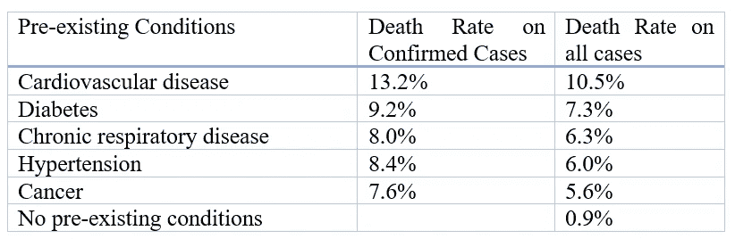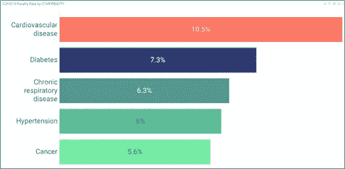

如果我们看到下面的表格，印度在我们有信息的所有类别中都名列前茅。我可以做出合理的假设，对于我们没有信息的类别(心血管疾病、CRD、高血压)，印度将高于其他国家。

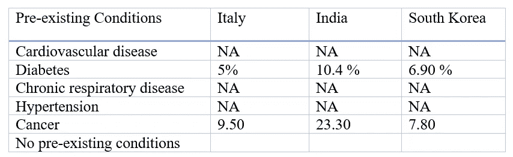

**拿走**:印度在有吸烟习惯的人口方面有优势，但这一优势被印度患有重大先决条件的人口所推翻。对于这些先决条件，死亡率要高得多，因此我们可能会看到这些人的情况恶化。对这类患者的建议(尤其是患有心血管疾病的患者)是尽可能地保持隔离。

**4。** **将印度与其他国家进行比较**

最引人注目的观察结果之一是，印度报告的病例数量如此之少，原因何在？根据下表，尽管印度在意大利和韩国发现病例的同时也发现了病例，但我们并没有看到病例数量的显著增加。

下面的图像让印度和意大利之间的区别更加明显。正如我们所看到的，这两个国家几乎在同一时间开始发现病例，但意大利的确诊病例和死亡病例突然上升，而印度保持相对稳定。

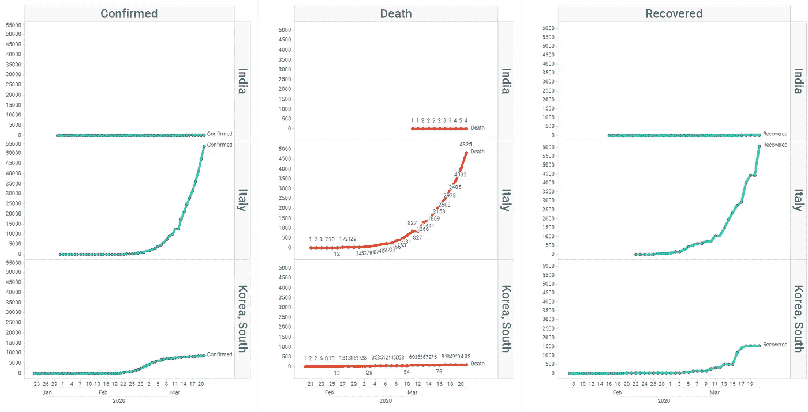

这可能有许多原因:

1.**印度没有测试足够的人**。这是真的。每 100 万人中，印度只对 3 人进行检测。与之相比，意大利每 100 万人中有 1420 人接受测试。我们测试的越少，我们的数量就越少。

2.第一个病人:第一个被检测为阳性的人是一名 38 岁的男子，他在仍具有传染性时，参加了三次晚餐，踢足球，并与一个团队一起跑步。当他被确诊时，一号病人已经伤害了 100 多人。我们不确定我们在印度是否有这样的情况。所有在初始阶段检测呈阳性的人员都曾出国旅行或与出国旅行的人有过接触。一旦得到控制和追踪，就很容易避免这种情况的发生。

3.**印度少报了死亡人数**:这也可能是真的，可能与第 1 点有关。但即使这是真的，我也不确定印度怎么能少报这么高的数字。目前死亡人数(2/22)为 7 人。我知道印度可能少报了 70-80 人。但我不知道我们怎么能少报 1000+死亡病例。

> 印度人口如此之多的事实使得疫情成为最糟糕的情况。印度应该采取分而治之的策略。所有状态都应进入完全锁定状态，并表现为更小的集群，以便将损害降至最低。

**总之:**

1.  人口年龄结构对印度有利。
2.  我们不知道印度确诊病例的性别分布。如果有更多的女性感染冠状病毒，总死亡人数可能会减少。
3.  印度的吸烟人口非常少，因此可以认为对呼吸系统相关问题有更好的抵抗力。
4.  与意大利和韩国相比，印度的心血管疾病和糖尿病发病率更高，这可能会影响死亡总数。
5.  到目前为止，印度一直设法不被人注意，这是一个非常好的迹象。意大利同时开始，有 5000+死亡。印度有 7 个。
6.  总人口将是印度面临的最大负担，可能会抵消所有优势。解决办法是孤立各个州，并实施严格的旅行限制。

**Ref**
[https://www . worldometers . info/world-population/population-by-country/](https://www.worldometers.info/world-population/population-by-country/)
[https://worldpopulationreview . com/countries/best-health-care-in-the-the-world/](https://worldpopulationreview.com/countries/best-healthcare-in-the-world/)
[https://www . world life expect . com/cause-of-of-death/coronary-heart-disease/by-country/](https://www.worldlifeexpectancy.com/cause-of-death/coronary-heart-disease/by-country/)
[https://www.isglobal.org/en/ebola](https://www.isglobal.org/en/ebola)
[https://wwwSTA.DIAB.ZS/rankings](https://www.thejournal.ie/quit-smoking-coronavirus-5047328-Mar2020/)
[https://www.indexmundi.com/facts/indicators/SH.DYN.NCOM.ZS/rankings](https://www.indexmundi.com/facts/indicators/SH.DYN.NCOM.ZS/rankings)
[https://caravan magazine . in/health/lack-testing-kits-人手不足-医院-covid-exposes-India-cracking-health care-system](https://caravanmagazine.in/health/lack-testing-kits-understaffed-hospitals-covid-exposes-india-crumbling-healthcare-system)

* *所有图像均使用 TIBCO Spotfire 创建。**