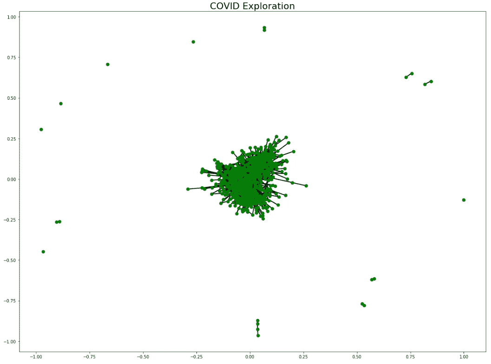
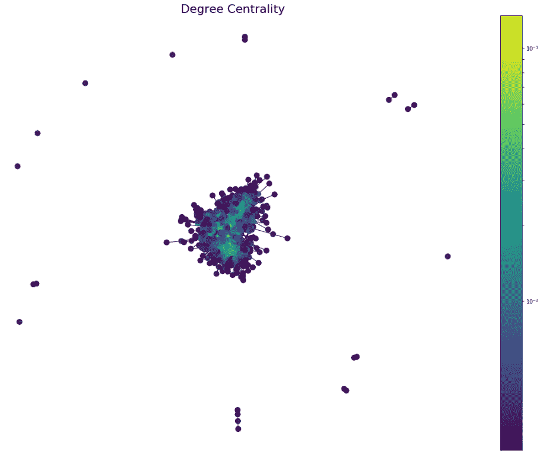
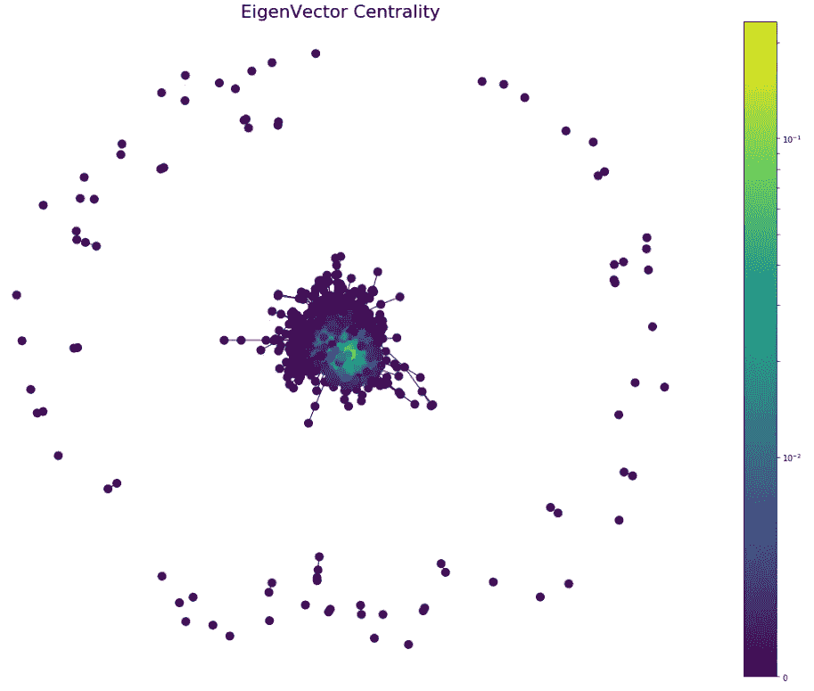

# 为 COVID19 构建知识图

> 原文：<https://medium.com/analytics-vidhya/covid19-knowledge-graph-e382df12e774?source=collection_archive---------22----------------------->

这个项目的目的是分享一些关于如何处理 Kaggle 提供的新冠肺炎数据的想法。我参考了其他的内核，并采纳了我认为对这个项目有用的东西。因此，如果你发现有些代码有点熟悉，请原谅，我正试图通过自己实现它们向你学习。可以在下面找到参考链接。

让我们开始吧！


照片由[像素](https://www.pexels.com/photo/illuminated-cityscape-against-blue-sky-at-night-316093/?utm_content=attributionCopyText&utm_medium=referral&utm_source=pexels)的[皮克斯拜](https://www.pexels.com/@pixabay?utm_content=attributionCopyText&utm_medium=referral&utm_source=pexels)拍摄

# **快速总结**

1.  数据预处理
2.  使用 FastText 嵌入文档
3.  从用户的查询中提取相关文档
4.  计算前 n 个相关文档的相似性矩阵
5.  利用相似向量构建知识图
6.  使用中心度来识别最有用的文档

所有的代码都在 GitHub 的一个笔记本里。

[](https://github.com/Niellai/Text-Sentiment/blob/master/3_COVID19_KnowledgeGraph.ipynb) [## 尼尔莱/文-感悟

### permalink dissolve GitHub 是 4000 多万开发人员的家园，他们一起工作来托管和审查代码，管理…

github.com](https://github.com/Niellai/Text-Sentiment/blob/master/3_COVID19_KnowledgeGraph.ipynb) 

# **数据集和我们的目标**

该数据集由超过 45，000 篇学术文章组成，包括 33，000 篇关于新冠肺炎、新型冠状病毒和相关冠状病毒的文本。我们只关注 *metadata.csv 和*我们只对标题和摘要列感兴趣。我们可以使用以后提供的所有数据，但现在这是为了测试我的方法是否有效。

这个项目的目标是提供关键的答案，可以找到使用数据集提供。这些科学问题可能会给专家们在抗击新冠肺炎病毒时的工作方向提供线索。

这些问题包括:

*   改进临床流程的新诊断方法和产品。
*   预防二次传播、卫生保健和社区环境的运动控制策略

# **1。数据预处理**

像往常一样，会有一些脏记录需要删除，我们提取唯一的标题和摘要列，并将其合并，以便于访问。因为我们要将它们转换成矢量形式，以便进行后续处理。

# **2。文件嵌入**

有很多方法可以做到这一点，我们可以使用一个单词包，Word2Vec 或更先进的模型，如 ELMo 或 BERT。选择 FastText 是因为这是一个测试项目，我们希望从小规模开始，快速迭代。当我们确信这种实现可行时，我们可以随时扩大规模。

**快速文本**

FastText 建立在 Word2Vec 的基础上，学习每个单词的向量表示。FastText 不是直接从单词中学习向量，而是学习每个单词在 n 元字符中的表示。这有助于捕捉较短单词的含义，并允许嵌入来学习后缀和前缀。示例单词“冠状病毒”，n-gram =5，我们将有集合[coron，orona，ronav，onavi，…，virus]。

FastText 可以很好地处理罕见的单词，因为它可以将单词分解成更小的片段。从上面的例子中，我们知道“冠状病毒”这个词与一种病毒有关。Word2Vec 和 GloVe 对于不在模型字典中的单词将很难表示向量。更多详细解释请参考下面的[链接](https://towardsdatascience.com/beyond-word-embeddings-part-2-word-vectors-nlp-modeling-from-bow-to-bert-4ebd4711d0ec)。

**在文档中嵌入句子**

我将使用 [Gensim](https://radimrehurek.com/gensim/models/fasttext.html) FastText 模型来创建我的嵌入。我的灵感来自于他们对“most_similar”函数的实现，其中他们允许计算正负文本来调整向量的方向。我在嵌入用户查询时添加了这个功能，这个额外的字段将提供用户查询的上下文。

```
**def** search_doc(query, **context=None**, top_n=100):
    query_vector = sentence_vector(query, positive=context)
    result = model.cosine_similarities(query_vector, df_vectors.values)
    df['score'] = result 
    return df.sort_values('score', ascending=False)[:top_n]
```

看下面的例子，在没有提供上下文的情况下，这两个句子有很高的相似度。该模型不能区分冠状病毒和计算机病毒。

```
sent1 = sentence_vector(“**new coronavirus affecting every household**”)
sent2 = sentence_vector(“**computer virus is affecting every household**”)
model.cosine_similarities(sent1, [sent2])
array([**0.9350175**], dtype=float32)
```

有了上下文，我们可以指导模型更好地理解句子。第一句我们说的是生物病毒，第二句我们说的是数字病毒。这大大降低了相似性得分。

```
sent1 = sentence_vector(“new coronavirus affecting every household”, positive=”**biology**”)
sent2 = sentence_vector(“computer virus is affecting every household”, positive=”**digital**”)
model.cosine_similarities(sent1, [sent2])
array([**0.64123195**], dtype=float32)
```

我使用 Spacy 将文档分割成句子，然后将它们分词。然后对单词向量进行平均，结果将是我们的文档向量(平均单词嵌入)。来自数据集的文档不需要添加上下文，因为它们不是单个句子，它们有许多关键字来提供上下文。

# 3.提取相关文档

有了所有的嵌入之后，我们现在可以提取与用户查询相关的文档。我们通过使用“余弦相似度”将我们所有的文档向量与用户的查询向量进行比较来做到这一点。这将为我们提供一个相似性得分，1 是最高的相似性，1 是最低的相似性。接下来，我们将对结果进行排序，并选择前 n 名。

我们做这一步是因为我们想要仅使用相关文档来构建知识图。

# 4.类似地计算前 n 个相关文档的矩阵

这背后的想法是为我们的知识图表建立联系。通过使用相似矩阵，相似的文档将在彼此之间形成边缘。您可能会问，是不是所有文档在开始时都是相似的，而且每个文档都会形成一个边缘。是的，这是真的，这就是为什么我们需要对我们的矩阵进行最小-最大归一化。这将增加每个文档之间的差异，只有非常相关的文档才会形成边缘。最后，我们将过滤掉相似性分数低于 0.8 的文档，这个阈值可以调整，它将决定您稍后要处理的边的数量。

请注意，我们的最终矩阵将是 n×n 矩阵，如果你发现你的机器在计算时太慢，减少 n 会有所帮助。

# 5.利用相似向量构建知识图

准备好我们的边，我们将形成我们的知识图。对于这个项目，我正在我的知识图中寻找集群。使用 0.8 的过滤器，我能够获得 12 的平均度数。经过几轮测试后，我也意识到 10-20 范围内的平均度数会产生更好的结果。下面显示了我们的结果。

```
Number of nodes: 710
Number of edges: 4310
Average degree:  12.1408
```



这些集群显示了文档是如何相互关联的。我们可以看到有一些异常值，我们的中心聚类包含我们查询的最重要的信息。我们可以使用不同的中心性算法来提取前 n 个文档并推荐给我们的用户。以下是对不同中心性的简短解释。

**度中心性**:衡量传入连接的数量。可以解释为**人气**节点，连接最多的是前 n 个节点。

**接近度** **中心性:**衡量网络中一个节点连接到其他节点的速度(最小步骤数)。可以解释为**中心性**节点。

**特征向量中心性:**测量节点与那些高度连接的节点的连接性。解释为**影响**节点和在幕后行使控制的节点。

**中间中心性:**测量一个节点，该节点作为**节点到其他节点的桥梁**。

# **6。使用中心度来识别最有用的文档**



我们的知识图表中的前 3 个结果如下所示。结果看起来不错，它回答了用户的查询要求。

用户查询:**新的诊断方法和产品，改善临床流程。**

背景:医疗、肺炎、快速、检测试剂盒

```
**Doc1:** Advances in the diagnosis of respiratory virus infections.
**Background:** Advances have been made in selecting sensitive cell lines for isolation, in early detection of respiratory virus growth in cells by rapid culture assays, in production of monoclonal antibodies to improve many tests such as immunofluorescence detection of virus antigens in nasopharyngeal aspirates, in highly sensitive antigen detections by time-resolved fluoroimmunoassays (TR-FIAs) and biotin-enzyme immunoassays (BIOTH-E), and, finally, in the polymerase chain reaction (PCR) detection of respiratory virus DNA or RNA in clinical specimens...**Doc2:** Diagnostic Techniques: Microarrays.
Current techniques for viral detection and discovery, which include culture and serological methods as well as polymer chain reaction (PCR)-based protocols, possess a variety of inherent limitations. In an effort to augment the capabilities of existing diagnostic methodologies, the use of virus-specific DNA microarray technology has been recently applied in both research and clinical settings with favorable results. The primary advantage of this approach is that DNA microarrays containing literally thousands of virus-specific sequences allow simultaneous testing for essentially all known viral species...**Doc3:** Modernising epidemic science: enabling patient-centred research during epidemics.
**BACKGROUND:** Emerging and epidemic infectious disease outbreaks are a significant public health problem and global health security threat. As an outbreak begins, epidemiological investigations and traditional public health responses are generally mounted very quickly. However, patient-centred research is usually not prioritised when planning and enacting the response. Instead, the clinical research response occurs subsequent to and separate from the public health response, and is inadequate for evidence-based decision-making at the bedside or in the offices of public health policymakers...
```

前两个文件向我们展示了做测试的方法，有趣的是第三个文件强调了临床研究的现代化。从某种意义上说，这是真的，如果你有一个旧的研究机构，你甚至不需要考虑诊断。我们的社会经常优先考虑错误的事情，而忽略了给予我们的东西。


一张图胜过千言万语

接下来，我们将查看下一个查询，看它是否按预期工作。请注意，这一次我使用的是特征向量中心性。目的是探索，看看这是否给我们一个好的结果。



同样，我们的知识图表中的前 3 名结果如下所示。

用户查询:**防止二次传播的运动控制策略，医疗保健和社区设置。**

背景:肺炎，医学

```
**Doc1:** Practical recommendations for critical care and anesthesiology teams caring for novel coronavirus (2019-nCoV) patients.
This paper summarizes important considerations **regarding patient screening, environmental controls, personal protective equipment, resuscitation measures (including intubation)**, and critical care unit operations planning as we prepare for the possibility of new imported cases or local outbreaks of 2019-nCoV. Although understanding of the 2019-nCoV virus is evolving, lessons learned from prior infectious disease challenges such as Severe Acute Respiratory Syndrome will hopefully improve our state of readiness regardless of the number of cases we eventually manage in Canada.**Doc2:** Experiences and challenges in the health protection of medical teams in the Chinese Ebola treatment center, Liberia: a qualitative study.
BACKGROUND: Health care workers are at the frontline in the fight against infectious disease, and as a result are at a high risk of infection. During the 2014–2015 Ebola outbreak in West Africa, many health care workers contracted Ebola, some fatally. However, no members of the Chinese Anti-Ebola medical team, deployed to provide vital medical care in Liberia were infected. This study aims to understand how this zero infection rate was achieved. METHODS: Data was collected through 15 in-depth interviews with participants from the People’s Liberation Army of China medical team which operated the Chinese Ebola Treatment Center from October 2014 to January 2015 in Liberia. Data were analysed using systematic framework analysis.**Doc3:** **Timely mental health care for the 2019 novel coronavirus outbreak is urgently needed.**
he emergence of the 2019-nCoV pneumonia has parallels with the 2003 outbreak of severe acute respiratory syndrome (SARS), which was caused by another coronavirus that killed 349 of 5327 patients with confirmed infection in China.3 Although the diseases have different clinical presentations, the infectious cause, epidemiological features, fast transmission pattern, and insufficient preparedness of health authorities to address the outbreaks are similar. So far, **mental health care for the patients and health professionals directly affected by the 2019-nCoV epidemic has been under-addressed,** although the National Health Commission of China released the notification of basic principles for emergency psychological crisis interventions for the 2019-nCoV pneumonia on Jan 26, 2020.
```

文件 1 显示需要筛选，环境控制*(我相信应该是检疫？)*，防护装备是防止传染必不可少的。令我惊讶的是，文件 3 向我们表明，医疗保健专业人员的心理健康也受到影响。尽管卫生保健专业人员在他们职业生涯中经常看到许多人死亡，但如此高的死亡人数和始终如一地决定谁生谁死对他们的心理健康是一个巨大的打击。我们可以想象，面对如此巨大的压力不会影响他们在医院的工作。因此，让我们向这些前线英雄和他们的无私贡献致敬。我们也应该尽自己的一份力量，使曲线变平，以减轻我们医疗保健系统的负担。

谢谢你一直读到最后。这是我的第一篇文章，在我的实现中可能会有错误。如果你发现任何错误，一定要纠正我。让我们希望所有人都能度过这个疫情，继续我们的日常生活。

页（page 的缩写）s:除非万不得已，请不要出门，记得洗手。注意安全。

[](https://www.kaggle.com/allen-institute-for-ai/CORD-19-research-challenge) [## 新冠肺炎开放研究数据集挑战(CORD-19)

### AI2 大学、CZI 大学、MSR 大学、乔治城大学、美国国家卫生研究院和白宫的人工智能挑战

www.kaggle.com](https://www.kaggle.com/allen-institute-for-ai/CORD-19-research-challenge) [](https://www.kaggle.com/shahules/cord-tools-and-knowledge-graphs) [## CORD:工具和知识图表

### 使用 Kaggle 笔记本探索和运行机器学习代码|使用来自多个数据源的数据

www.kaggle.com](https://www.kaggle.com/shahules/cord-tools-and-knowledge-graphs) [](https://towardsdatascience.com/beyond-word-embeddings-part-2-word-vectors-nlp-modeling-from-bow-to-bert-4ebd4711d0ec) [## 超越单词嵌入第 2 部分-单词向量&从 BoW 到 BERT 的自然语言处理建模

### 神经 nlp 模型结构和单词表示的初级读本。

towardsdatascience.com](https://towardsdatascience.com/beyond-word-embeddings-part-2-word-vectors-nlp-modeling-from-bow-to-bert-4ebd4711d0ec) [](https://github.com/Niellai/Text-Sentiment/blob/master/3_COVID19_KnowledgeGraph.ipynb) [## 尼尔莱/文-感悟

### permalink dissolve GitHub 是 4000 多万开发人员的家园，他们一起工作来托管和审查代码，管理…

github.com](https://github.com/Niellai/Text-Sentiment/blob/master/3_COVID19_KnowledgeGraph.ipynb)