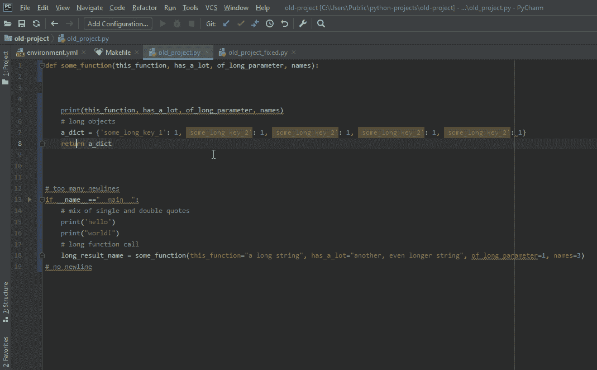
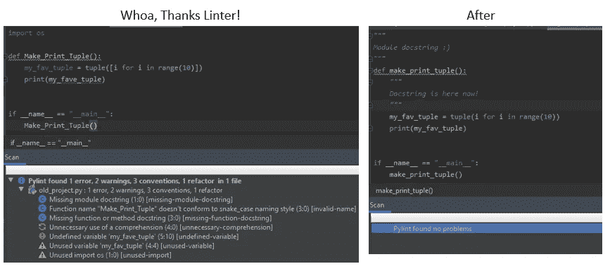
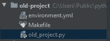
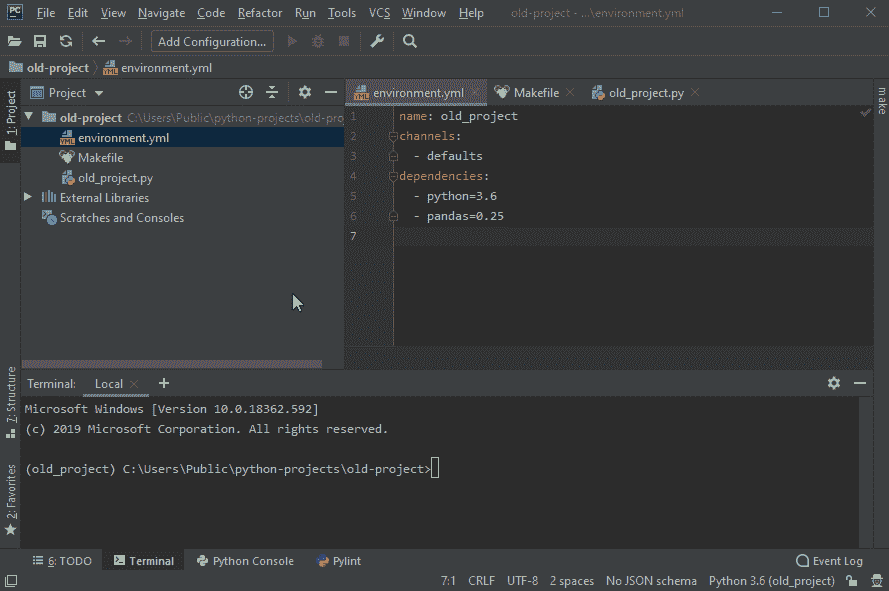
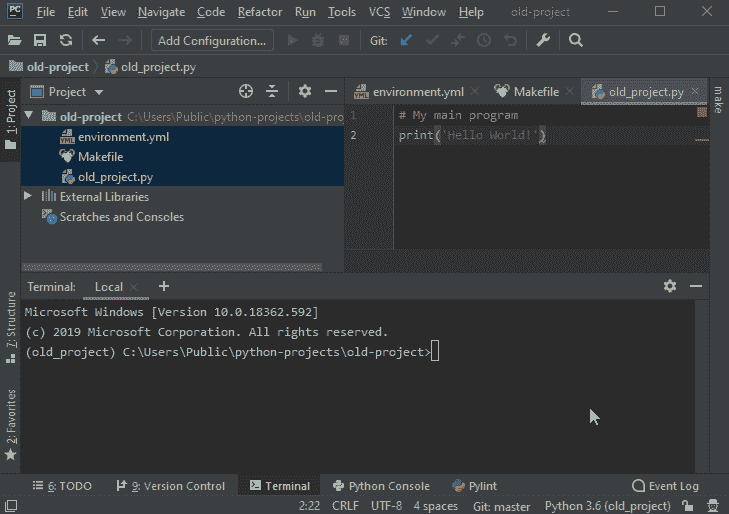

# 专业开发人员的牛仔编码

> 原文：<https://medium.com/analytics-vidhya/cowboy-coding-to-professional-developer-f271d5627439?source=collection_archive---------8----------------------->

## 当我还是一个业余爱好者时，我会告诉自己什么


仅仅 8 个月前，我还在业余时间一起编写脚本。我不知道任何正式的编程礼仪，但我是我自己的人，并把事情做好。

我称之为牛仔编码。

一旦我找到了一份职业开发人员的工作，我就知道我错过了什么。这些是我本可以告诉自己的事情，也是我给任何涉足软件开发的人的建议。

# **1。使用真正的 IDE**

如果你是 Python 用户，还在用 IDLE，马上下载 [VSCode](https://code.visualstudio.com/) 。或者[皮查姆](https://www.jetbrains.com/pycharm/)。或者[原子](https://atom.io/)。它们是免费的，并提供了无数的功能来帮助你。如果你用另一种语言编程，做一点研究，找出什么是最好的 IDE。我目前使用 PyCharm 开发 Python(和 Jupyter Notebook)，使用 VSCode 开发 JavaScript、HTML、TypeScript、Go 和几乎所有其他东西。

对于您的 10 行 hello-world 测试脚本来说，使用这样一个发达的高科技工具可能感觉有些多余，但是当您开始开发多文件项目，或者需要在它们之间切换，或者试验不同的环境时，您就会理解为什么一个复杂的 IDE 如此重要。

1.  **支持多文件项目** —不知不觉中，您的项目将不再是简单的单文件应用程序。将它们放在一起管理，而不是一个个点击窗口，这样很好。
2.  **支持多种语言**——你将学习其他编程语言，这是无法回避的。随着你的项目变得越来越复杂，你会突然发现它们由不止一种语言组成。在 VSCode 中，我可以轻松地在 Python、Go 和 Javascript 之间跳转。
3.  **插件** —这些 ide 背后有巨大的社区，开发开源插件，试图让我们的生活变得更简单。有用于代码格式化(见下文)、Git 集成、测试、查看 MarkDown 文件或 HTML 的插件；如果有你需要的东西，可能有人已经为它创建了插件。
4.  **自省** —我可以在程序中高亮显示一个函数，它会告诉我它的参数。我可以点击“tab ”,我的 IDE 将自动完成我输入的内容，或者至少给出很好的建议。我也可以点击一个术语，它会把我带到那个变量/函数被声明的地方，或者显示它被使用的地方。

# **2。使用代码格式器(和棉绒)**

我怎么强调这一点都不为过。** **使用代码格式化程序！**** 这不是作弊！使用代码格式化程序并不会降低你的程序员水平；这让你成为一个聪明的人，想要把事情做好，并在这个过程中看起来不错。更少的格式化时间意味着更多的编程时间。

如果你用的是 Python，我强烈推荐[黑](https://black.readthedocs.io/en/stable/)。它可以添加到任何真正的 IDE 中。它甚至可以在每次保存文件时被调用。对于 Javascript/Typescript，有更漂亮的。对于围棋来说，好吧，围棋有自己内置的 gofmt。



好满足。

同样，你需要安装一个棉绒。linter 让你知道你是否有输入错误的变量，或者没有使用的输入，任何其他常见的编码错误。PyCharm 安装了一个，但是我建议添加 [Pylint](https://www.pylint.org/) 。



“理解的不必要使用”？—我来判断。

# **3。控制你的环境**

假设你是一名 Python 开发者。你用的 Python 是什么版本？如果你像我一样，你的回答可能是“嗯，3 分…什么的。有什么关系？”正确的回答应该是“为了哪个项目？”

## **项目中的版本冲突**

假设你有一个非常酷的项目叫做`**Old_Project**`。您开始使用`**New_Project**`，并很快发现您需要的新特性在您的 Python 版本或某个库中不可用。所以你升级了，会发生什么？

`**Old_Project**`不再管用。

为什么要这样？它从未同意与你刚刚升级到的所有这些新的尖牙软件一起工作。那么解决办法是什么呢？

有自己的`**New_Project**`或`**Old_Project**`环境。见鬼，如果你喜欢的话，每个项目可以有不同的环境！

## **步骤 1:获得一个环境管理器(Python 的 Conda)**

在 Python 中，Conda 使这变得非常容易，其他语言也有类似的工具。如果您没有 Conda，请下载 [Anaconda](https://www.anaconda.com/distribution/#download-section) 或 [Miniconda](https://docs.conda.io/en/latest/miniconda.html) 并将其用作您的默认 Python 发行版。

要创建一个新环境，只需输入`conda create -n cool-environment`，然后输入`conda activate cool-environment`，就可以了。当你完成后，`conda deactivate`。如果您愿意，也可以在 PyCharm 项目设置中设置这个环境。

## **第二步:使用 Makefile**

想提高你的水平吗？在每个名为`environment.yml`的项目中创建一个文件，并用一个`Makefile`调用它。`environment.yml`保存您的环境信息，而`Makefile`有办法运行这个脚本。这为您的环境提供了难以置信的严格控制，并为您的项目在各种系统上运行做好了准备。



两个小文件，无忧环境支持！看看那些很酷的图标。

这里有一个`environment.yml`的例子:

```
name: old_project
 channels:
 — defaults
 dependencies:
 — python=3.6
 — pandas=0.25
```

这可以通过键入`conda env create -f environment.yml`来调用。但是 Makefiles 是可行的方法。这里有一个非常基本的例子:

```
setup: env-setupremove: env-removeenv-setup:
    conda env create -f environment.ymlenv-remove:
    conda env remove -n old_project
```

当您键入`make setup`时，这会在严格的版本控制下构建一个 conda 环境。如果你需要删除它，只需输入`make remove`。每个项目可以有自己的`environment.yml`和`Makefile`！

这是皮查姆的一个动作镜头。(注意:如何突出显示每个文件自己的语法—即使用真正的 IDE！)



任何下载您的项目的人都可以立即创建一个兼容的环境！

# **4。Drop Dropbox 获取 Git**

## **Dropbox 不是版本控制**

是的，我愉快地使用 Dropbox 来保护我的文件安全，并同步了 4 年。有一些小的不便，比如每次我从台式机转到笔记本电脑时都要重置我的环境，或者处理有冲突的副本，但这很有效..

但是你知道吗？—我们开发了一个计划来解决这一特定问题！

当 Git 与远程存储库一起使用时，它可以完成你现在使用 Dropbox 所做的一切。**又大幅增加。**

## **用 GitHub 保护你的项目安全**

GitHub 这么好心，免费托管 Git 项目！您可以拥有无限数量的公共回购和 3 个私人回购。如果您使用 Git，您只需将您的更改推送到远程 repo。您甚至不需要使用“复杂的”git 命令:只需提交您的更改并推送即可。当您切换工作站时，只需一个快速的“git pull ”,现在您就可以从您离开的地方开始了。

**如果你曾经申请过软件开发工作，你的 GitHub repo 是宣传自己的绝佳方式**。招聘经理肯定会注意到这一点，你应该自豪地展示出来。把它放在你的简历上，展示你的热情！

回到 Git——它不仅仅是一个美化了的文件共享平台…

## **分支机构案例研究—添加新功能**

举个例子，你需要给你的程序添加一个很酷的新特性。唯一的问题是这需要一周的时间来实现，而且你明天就需要你的程序函数。

在 DropBox 的世界里，你必须复制并粘贴你的整个目录树，然后开始破解……现在你有两个目录占据了空间，要合并你的修改，你需要做一些笨拙的复制粘贴技巧。这显然是一种反模式。

在 Git 世界中，您可以创建代码的分支，并毫不费力地在它们之间跳转。你可以输入`git checkout -b cool_new_feature`。这将为你的代码创建一个名为“cool_new_feature”的新分支，一个完整的虚拟游戏场来试验你的程序。ide 都为此做好了准备，当一个新的分支被调用时，它们很乐意更新你的代码。如果您需要恢复到正常运行的程序，提交您的更改并简单地键入`git checkout master`。嘣——功能代码！一旦你准备好开始制作你的专题，输入 `git checkout cool_new_feature`，从你停下的地方继续。一旦你完成了，输入`git checkout master`、`git merge cool_new_feature`合并成大师。



## **简化的 Git 工作流程**

如果这听起来很复杂，有关于如何/何时分支的工作流和命名约定。我的组使用 [Git 流](https://www.atlassian.com/git/tutorials/comparing-workflows/gitflow-workflow)。但是这对于小项目来说是多余的，我向业余爱好者推荐 [GitHub Flow](https://guides.github.com/introduction/flow/) 。如果你是一个项目中唯一的工作人员，95%的 Git 命令都是`git commit`、`git branch <new branch>`、`git checkout <branch>`、`git push`、`git pull`、`git merge <branch>`。

## **软件开发流程**

此外，把这作为一个学习软件开发的机会。每个分支应该只完成一个目标，不管是一个新特性，一个错误修复，还是其他一些琐事。

## **我向你保证:你不会后悔学 Git 的！**

# **6。不要觉得自己不够好**

我曾经有这样的想法，我写的任何东西，别人都可以做得更好。这甚至用来阻止我写工具，结果证明是相当成功的，认为这将是一种伤害推我的劣质产品！

## **不要为这些复杂的东西担心**

你知道类属性和实例属性的区别吗？「Python 路径」vs「系统路径」？你知道如何在递归函数中同步一个异步修饰生成器吗？

许多开发人员也会对这些问题回答“不”。这很好。

留意程序特性是很好的，但是如果你不需要使用它们，不要担心。这并不会让你成为一个低劣的程序员，因为你使用的字典中其他人都试图创建一个类(有些人可能会认为这会让你成为一个更好的程序员)。

如果你写的程序能满足你的需求，那意味着你足够优秀。当然，这并不意味着没有更好的方法，这就引出了我的下一个观点:

## **找朋友**

现在的我和 8 个月前最大的不同是，我身边还有另外 7 个专业的开发者。我们都有长处和短处，有些人更有经验，但是没有人知道其余六个人加起来做的所有事情。

我有七个人可以向我提问。七个可以评论我作品的人。七个人创造了我能读懂的代码杰作，我觉得“哦，有意思。”(并不总是讽刺)。我不再在别人可以轻松解决的琐碎问题上浪费时间。我可以问他们。

## **这比因堆栈溢出而蒙羞要好得多。**

找几个朋友，参与进来。你们中有两个人在开发相同/相似的项目吗？成立一个敏捷小组！即使你们都不是特别有经验，也能学到很多东西。

# 总之…

## **编程不仅仅是写代码**

在本文中，我展示了多少实际代码？几乎没有。

我曾经认为要成为一名更好的程序员，我需要学习 Python 的本质。但是作为一名开发人员，我的大部分成长并不是关于获得 Python 的专业知识，而是关于围绕它的一切。比如学习 REST、AWS，或者仅仅是如何构建一个多部分的项目。

当我申请软件开发工作时，我也不认为我有机会，但是我来了。如果你对编码充满热情，这里有你的位置。

## **其他一些事情**

我上面列出的建议对于任何编程语言都是通用的，值得您努力深入研究。不会浪费时间。

其他一些小建议:

*   进行单元测试。我推荐 PyTest，以及用 Makefile ( `make test`)调用它的加分。
*   熟悉命令行！
*   再学一门编程语言！你最喜欢的动态类型是什么？学习一门静态类型语言(比如 Go！).它将改变你对编程的看法，并最终使你变得更好。
*   学习基本的网络知识和休息。学习如何制作一个简单的网站和一个 REST 后端。一点点就够了。

# **一些有用的链接**

*   [Git 教程](https://try.github.io/)
*   [在 VSCode 上安装 Black](/@marcobelo/setting-up-python-black-on-visual-studio-code-5318eba4cd00)
*   [在 Pycharm 上安装黑色](https://black.readthedocs.io/en/stable/editor_integration.html)
*   [py charm 上的 PyTest](https://www.jetbrains.com/help/pycharm/pytest.html)

## 图像制作者名单:

牛仔帽:[https://www.1001freedownloads.com/free-clipart/cowboy-hat-2](https://www.1001freedownloads.com/free-clipart/cowboy-hat-2)

平局:[https://www.1001freedownloads.com/free-clipart/necktie](https://www.1001freedownloads.com/free-clipart/necktie)

gif 创建者:[https://www.screentogif.com/](https://www.screentogif.com/)