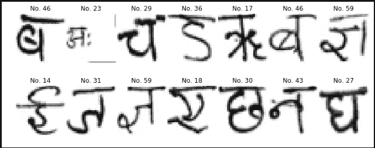

# CPAR-印地语数字和字符数据集

> 原文：<https://medium.com/analytics-vidhya/cpar-hindi-digit-and-character-dataset-1347a7ff946?source=collection_archive---------6----------------------->

## 包含数字和字符的印地语 MNIST 数据集在这里



CPAR 数据集

**这个数据集从何而来？**

CPAR 数据集由 Rajiv Kumar 和另外两个人收集。同年，当我即将毕业时，幸运的拉吉夫·库马尔成为我大学的一名教师。他给了我这个数据集，让我转换成 MNIST 格式并上传。我在文章底部放了一个他论文的链接。

**这个数据集是如何收集的？**

根据 Rajiv Kumar 的说法，收集这个数据集花了将近 3 年的时间。他从不同阶层的作家那里收集资料。他们属于不同的年龄组(从 6 岁到 77 岁)、性别、教育背景(从 3 年级到研究生水平)、职业(软件工程师、教授、学生、会计师、家庭主妇和退休人员)、地区(印度各邦:比哈尔邦、北方邦、哈里亚纳邦、旁遮普省、国家首都区(NCR)、中央邦、卡纳塔克邦、喀拉拉邦、拉贾斯坦邦，以及国家:尼日利亚、中国和尼泊尔)。所有这些都是可能的，因为他是一所大学的教授，这所大学的学生来自印度各地。

如果你浏览他的论文，你会看到他创建了一个必须手工填写的表格。然后用软件处理这些表格。关于他如何收集数据的更多信息在他的论文中。

**这个数据集看起来怎么样？**

数据集由数字和字符组成。


字符数据集


数字数据集

让我们安装和导入来看看

```
$ pip install cpar
```

让我们先来看看角色数据集

```
from cpar.char import load_data
train_x, test_y, train_y, test_y = load_data()
```

我对这个数据集的第一印象是它很难。为什么？让我们看一个案例


Aa 的几个变体


相似的角色

如此微小的变化会给区分它们带来很大的困难。

现在，让我们看看数字数据集


梵文数字

**印地语的手写识别面临哪些挑战？**

与英语相比，印地语非常复杂，因为即使是一个我们称之为“matra”的字符也有许多变体。这里有几个例子


印地语中的同音词

考虑到单词中的这些微小差异，正确阅读它们的任务变得非常困难。

**结论**

对印地语手写识别的各种研究正在进行。浏览完这个数据集后，我感觉到了挑战是什么。与英语相比，印地语要复杂得多。很少有词可以用不同的形式来表达，这使得它更加复杂。

该项目的 GitHub 回购是[https://github.com/gaganmanku96/CPAR](https://github.com/gaganmanku96/CPAR)

**参考文献**

1.  [针对 ***天城*** 文档识别研究的基准数据集](http://www.wseas.us/e-library/conferences/2013/Lemesos/TELSYS/TELSYS-39.pdf)