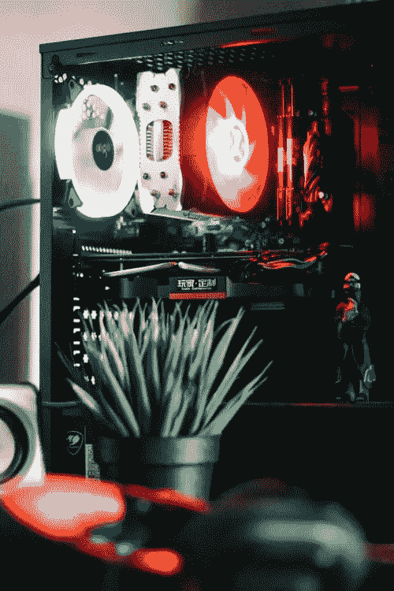
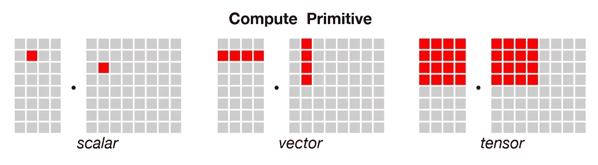

# CPU / GPU/ TPU — ML 视角

> 原文：<https://medium.com/analytics-vidhya/cpu-gpu-tpu-ml-perspective-1f049cd4d43d?source=collection_archive---------14----------------------->

作为一个一直试图即兴发挥学习模型性能的机器学习爱好者，我们都已经达到了性能上限，并开始经历不同程度的处理滞后。

过去需要几分钟完成较小训练数据集的任务现在开始需要几个小时来训练大数据集。为了解决这些问题，我们必须相应地升级硬件，为此，我们需要了解不同处理单元之间的差异。

从中央处理器(CPU)开始，它本质上是计算设备的大脑，通过执行控制、逻辑和输入/输出(I/O)操作来执行程序指令。

> CPU 用于通用编程问题。

一种被设计用来以通用方式解决每一个计算问题的处理器。内存和缓存被设计为对于任何一般的编程问题都是最优的，并且可以处理不同的编程语言，比如(C、Java、Python)。

> CPU 一次处理的最小数据单位是一个标量，它是 1x1 维的数据。

[图像来源](https://arabhardware.net/wp-content/uploads/2019/06/Scalar-vs-Vector-vs-Tensor.jpg)

现在谈论 GPU，图形处理单元是许多阅读本文的游戏玩家熟悉的名字。最初主要设计为计算机游戏的专用图形渲染工具，GPU 后来得到了增强，以加速照片/视频编辑、动画、研究和其他分析软件等需要用大量数据绘制图形结果的其他软件。

> CPU 最擅长顺序处理单个更复杂的计算，而 GPU 更擅长并行处理多个但更简单的计算。

一般来说，GPU 是快速机器学习的更安全的赌注，因为在其核心，数据科学模型训练由简单的矩阵数学计算组成，如果计算可以并行执行，其速度可以大大提高，因此 GPU 在单个处理器中有数千个 ALU，这意味着你可以同时执行数千次乘法和加法。

> 它们每个周期可以处理数万次运算，数据的维数一般为 1×N 个数据单元。

但是内存访问的问题仍然存在，因为 GPU 在成千上万的 alu 上执行并行计算，所以它也在内存访问上花费了更多的精力。为了克服这个问题，谷歌设计了 TPU。

张量处理单元(TPU)是一个 ASIC 处理器，它是一个专用集成芯片，旨在加速使用 Tensorflow 框架开发的深度学习任务。

> 它不是一个通用处理器。它只能在上面处理张量流模型。

TPU 解决了内存访问问题。首先，它将参数从存储器加载到乘法器和加法器的矩阵中。之后，TPU 从内存中加载数据。每次执行乘法时，结果将传递给下一个乘法器，同时进行求和。因此，输出将是数据和参数之间所有乘法结果的总和。在大规模计算和数据传递的整个过程中，根本不需要任何内存访问。这就是为什么 TPU 可以在神经网络上实现高计算吞吐量的原因。

没有为 TPU 开发可用于通用编程的编译程序，因此，在 TPU 上进行通用编程需要很大的努力。

> TPU 每周期可处理 128000 次运算，数据的维数为 NxN 数据单元。

参考资料:

1.  [*机器学习中 CPU vs GPU*](https://blogs.oracle.com/datascience/cpu-vs-gpu-in-machine-learning)
2.  [*是什么让 TPU 针对深度学习进行微调？*](https://cloud.google.com/blog/products/ai-machine-learning/what-makes-tpus-fine-tuned-for-deep-learning)
3.  [*TPU vs GPU vs CPU*](https://candid.technology/tpu-vs-gpu-vs-cpu-comparison/)