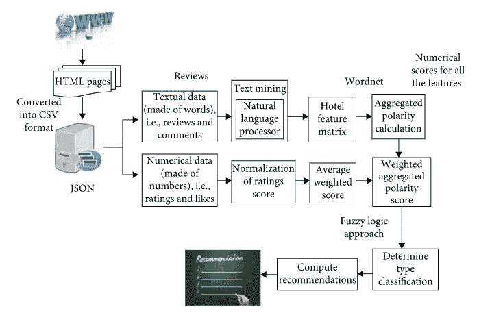
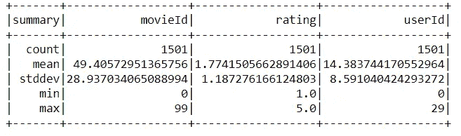
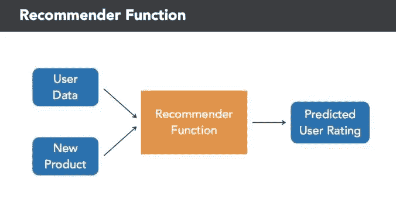
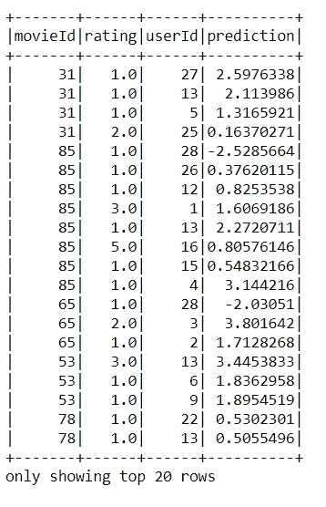
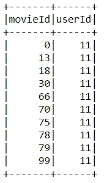
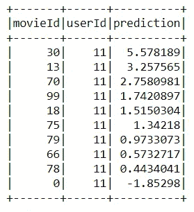

# 在 PySpark 中制作推荐引擎

> 原文：<https://medium.com/analytics-vidhya/crafting-recommendation-engine-in-pyspark-a7ca242ad40a?source=collection_archive---------3----------------------->


Jez Timms 在 [Unsplash](https://unsplash.com?utm_source=medium&utm_medium=referral) 上拍摄的照片

H ello，

在今天的网络时代，每个顾客都有多种选择。假设最近我想买一台经济实惠的笔记本电脑，却不知道该买什么。有可能会浪费大量的时间在互联网上浏览和浏览各种网站，希望找到一些有用的信息。我可能会寻求其他人的推荐。

数据收集的快速增长导致了一个新的信息时代。数据被用来创建更高效的系统，这就是推荐系统发挥作用的地方。推荐系统是一种信息过滤系统，因为它们提高了搜索结果的质量，并提供了与搜索项目或用户的搜索历史更相关的项目。它们用于预测用户对某个项目的评分或偏好。像网飞和 Spotify 这样的公司，他们的业务和成功高度依赖于推荐引擎的有效性

可能会有一些网站或网络应用程序根据我以前购买的笔记本电脑或我朋友的笔记本电脑向我推荐一些最好的笔记本电脑。我可以登录然后中大奖！我得到了符合我口味的被大力推荐的笔记本电脑。

这就是被推荐引擎利用的力量。从亚马逊到网飞，推荐引擎是机器学习最广泛使用的应用之一。

这个博客主要致力于推荐引擎的直观解释及其在 PySpark 中的实现。

> *所以我们滚吧！*

> **推荐引擎**

推荐引擎更广为人知的名称是推荐系统，它是一种分析数据的工具，目的是为用户可能感兴趣的网站、广告横幅、产品提供建议。

*更简单地说，它基本上是一个根据用户的趋势或数据分析向用户推荐服务、产品和信息的系统。该数据可以是用户的历史或类似用户的行为。*

推荐系统通过用户的体验、行为、偏好和兴趣为用户打开了接触整个数字世界的大门。这些系统还为亚马逊、沃尔玛等公司提供了一种高效的方式，为消费者提供*个性化信息*和*解决方案*。

> **推荐系统的优势**

*   这些系统有助于提高组织的点击率和收入
*   推荐引擎对用户体验产生积极的影响，从而带来更高的客户满意度和保留率。
*   例如，有了网飞，你不必浏览成千上万的盒子和电影名称，网飞为你提供了你可能喜欢的更窄的项目选择。该功能提供了更好的用户体验。这样，网飞实现了更低的取消率，每年为公司节省了大约 10 亿美元。
*   亚马逊在近 20 年前开始使用推荐系统，现在它已经被部署到其他行业，如金融和旅游。

> **推荐系统的工作流程**


来源:[https://upload . wikimedia . org/Wikipedia/commons/5/52/Collaborative _ filtering . gif](https://upload.wikimedia.org/wikipedia/commons/5/52/Collaborative_filtering.gif)

基本上，推荐系统通过一种完全基于用户视角和浏览历史的过滤过程向特定用户提供建议。推荐系统的输入将是关于用户的信息，比如他的浏览历史、偏好和喜好。此信息反映了产品的先前使用情况以及指定的等级。他们还根据有多少用户喜欢来对产品和服务进行排名。它有助于对用户最喜欢的产品进行分类。在余弦相似度的帮助下，人们还可以发现不同产品之间有多相似。如果产品彼此非常相似，它们可能会吸引相同的用户。



典型推荐引擎来源:【https://new.hindawi.com/journals/sp/2019/5941096/fig2/ 

*主要有三种推荐系统:-*

**1)人口统计过滤**——他们根据电影的受欢迎程度和/或类型，向每个用户提供综合推荐。系统向具有相似人口统计特征的用户推荐相同的电影。由于每个用户都是不同的，这种方法被认为太简单了。这个系统背后的基本思想是，更受欢迎和好评的电影将有更高的概率被普通观众喜欢。当我们打开手机上的某个应用程序时，它会要求访问我们的位置。基于我们的位置和周围的人，它会推荐我们可能喜欢的东西，这是任何应用程序中的一个基本推荐器。

2)基于内容的过滤——他们根据一个特定的项目推荐相似的项目。该系统使用项目元数据，例如流派、导演、描述、演员等。对于电影，提出这些建议。这些推荐系统背后的一般思想是，如果一个人喜欢一个特定的项目，他或她也会喜欢与之相似的项目。这可以在网飞、Facebook Watch 等应用中看到，它们根据导演、英雄等推荐下一部电影或视频。

**3)协同过滤**——该系统匹配具有相似兴趣的人，并基于该匹配提供推荐。协作过滤器不像基于内容的过滤器那样需要项目元数据。这是最复杂的个性化推荐，这意味着它考虑了用户喜欢什么和不喜欢什么。这方面的主要例子是谷歌广告。在协同过滤的保护伞下，我们有以下几种方法

*   ***基于记忆-*** *它基本上识别用户的聚类，以便计算一个特定用户的* *交互来预测其他相似用户的交互。第二个思考过程是识别用户 A 评定的项目群，并预测用户与项目 B 的交互。基于记忆的方法在处理大型稀疏矩阵时会失败*。
*   ***基于模型-*** *方法基本上围绕着 ML 和数据挖掘工具和技术展开。传统的机器学习方法用于训练模型并从中获得预测* ***。这些方法的一个优点是，与其他基于记忆的方法相比，它们能够向更多的用户推荐更多的项目。与基于记忆的方法相比，这些方法对于大型稀疏矩阵工作良好。***

3)混合系统- 整合两种类型的信息，目的是避免使用一种推荐系统时产生的问题。

> 现在是理论实践的时候了！

> **用 PySpark 构建推荐引擎**

根据[阿帕奇 Spark](https://spark.apache.org/docs/latest/) 的官方文档-

> “Apache Spark 是一个快速通用的集群计算系统。它提供了 Java、Scala、Python 和 R 的高级 API，以及支持通用执行图的优化引擎。它还支持一套丰富的高级工具，包括用于 SQL 和结构化数据处理的 [Spark SQL](https://spark.apache.org/docs/latest/sql-programming-guide.html) ，用于机器学习的 [MLlib](https://spark.apache.org/docs/latest/ml-guide.html) ，用于图形处理的 [GraphX](https://spark.apache.org/docs/latest/graphx-programming-guide.html) ，以及 [Spark Streaming](https://spark.apache.org/docs/latest/streaming-programming-guide.html)

在高层次上，它是一个开源的大范围数据预处理引擎，具有自己的开发 API，这些 API 具有分布式工作负载，用于完成需要重复访问数据集的流、机器学习或 SQL 工作负载。Spark 的核心能力在于处理批处理和流作业。

*基本上 Apache Spark 给用户提供的都是高级 API，比如*[*Java*](https://spark.apache.org/docs/latest/api/java/index.html)*、Scala、*[*Python*](https://spark.apache.org/docs/latest/api/python/index.html)*和 r .虽然 Spark 是用 Scala 写的，但还是提供了 Scala、Java、Python，以及 R.* 中丰富的 API

我可以一整天都谈论 Spark，因为它很棒，但这不在本博客的讨论范围之内。欲了解更多信息，请参考此[链接](https://spark.apache.org/docs/latest/quick-start.html)。

让我们直接跳到使用 MLib Spark Python API 构建推荐引擎。

> **集成 PySpark 和 Anaconda**

当您在初始阶段设置 Apache Spark 时，这将有点棘手。这篇文章真的有助于快速初始化 PySpark 与 Jupyter 笔记本的集成。

> **数据集**

为了构建我们的推荐系统，我们使用了 MovieLens 数据集。你可以在这里 找到我们在推荐系统项目 [*中使用过的 movielens_rating.csv。该数据由应用于 10329 部电影的 105339 个评级组成。*](https://github.com/shashwatwork/Building-Recommeder-System-in-PySpark/blob/master/movielens_ratings.csv)

> **推荐系统的方法**

使用协作过滤，我们通过从许多用户(协作)收集偏好或品味信息来预测(过滤)用户的兴趣。潜在的假设是，如果用户 A 在一个问题上与用户 B 有相同的意见，A 更有可能在不同的问题 x 上有 B 的意见，而不是随机选择用户对 x 的意见。

起初，人们会对不同的项目进行评分(比如视频、图片、游戏)。然后，系统预测用户对尚未评级的项目的评级。新的预测建立在与活动用户具有相似评级的其他用户的现有评级的基础上。

> **导入基本库**

为了用 PySpark 构建机器学习模型，我们将使用以下软件包-

*   find Spark-用于 Jupyter 笔记本与 Spark 的集成
*   火花。任何 Spark 应用程序的会话入口点。
*   py spark . ml-py spark 的机器学习 API。
*   熊猫-用于数据导入和 EDA。

*对 Spark Session 感到困惑让我们分解一下 py Spark . SQL . Spark Session(Spark context，jsparkSession=None)* 用 Dataset 和 DataFrame API 编程 Spark 的入口点。SparkSession 可用于创建数据帧、将数据帧注册为表、对表执行 SQL、缓存表和读取 parquet 文件。为了创建 Spark 会话，请遵循以下构建模式

> **检索数据&数据预处理**

对于 Spark 来说，2.x 具有强大的内置加载能力。csv 文件作为 PySpark 数据帧。我们将使用 *data.describe()。show()* 函数显示关于 spark 数据帧的信息。

*输出截图:*



我们可以做一个分割来评估我们的模型表现如何，但是请记住，很难确切地知道一个推荐系统对于某些主题的实际效果如何。特别是如果涉及到主观性，例如，不是每个喜欢《星球大战》的人都会喜欢《星际迷航》,即使推荐系统可能会建议不是这样。

*由于我们使用较小的数据集，因此 80:20 的列车分割对于我们的用例来说足够了。*

```
(training, test) = data.randomSplit([0.8, 0.2])
```

> **对训练数据使用 ALS 构建推荐模型**



来源:[https://towards data science . com/learning-how-recommendation-system-recommended-45 ad8 a 941 a 5a](https://towardsdatascience.com/learning-how-recommendation-system-recommends-45ad8a941a5a)

Spark 提供了一个机器学习算法 MLib。Spark MLib 算法旨在提供具有可扩展性和易用性的实用机器学习。以下是一些与 spark 机器学习库相关的术语-

*   **提取:**从“原始”数据中提取特征。
*   **转换**:缩放、转换或修改特征。
*   **选择**:选择较大特征集合的子集。
*   **位置敏感散列(LSH)** :这类算法结合了特征转换和其他算法的各个方面。

用于机器学习的 Spark MLlib 库通过使用交替最小二乘法来提供协同过滤实现。MLlib 中的实现具有以下参数:

*   *numBlocks* 是用于并行计算的块数(设置为-1 自动配置)。
*   *rank* 是模型中潜在因素的个数。
*   *迭代*是要运行的迭代次数。
*   *λ*指定 ALS 中的正则化参数。
*   *implicitPrefs* 指定是使用显式反馈 ALS 变量还是适用于隐式反馈数据的变量。
*   *alpha* 是一个适用于 ALS 隐式反馈变量的参数，该变量控制偏好观察中的基线置信度。

现在，让我们构建 ALS 模型，并用由 *randomsplit()* 函数创建的训练特征来拟合该模型。

*此处需要注意的一点是，我没有使用冷启动策略，该策略用于确保我们不会获得 NaN 评估指标。*

答对了！！！我们的模型现在是适合的，下一步将从适合的交替最小二乘模型生成推荐或预测。

> **生成预测&模型评估**

在成功执行 spark 作业之后，是时候使用内置的转换函数来评估构建模型了。这个函数或多或少类似于传统机器学习算法(Sklearn)中的 predict()函数。然而，transform()函数转换输入的测试数据或看不见的数据，以便生成预测。

*输出截图*



评估模型是建立有效的机器学习模型的核心部分。在 PySpark 中，我们将使用 *RMSE(均方根误差)*作为我们的评估指标。

RMSE 在评级栏中描述了我们的错误。

那么接下来我们还没有为我们的用户获得电影推荐。我们现在就开始吧！

> **推荐患有 ALS 的电影**

现在我们有了模型，你将如何向用户提供推荐呢？

这里的方法很简单，我们将采用单个用户 id example11 作为特征，并将其传递给经过训练的 ALS 模型。就像我们处理测试数据一样！

*输出截图*



现在我们将使用 *model.transform()* 函数来生成推荐电影及其预测特征。

*输出截图*



> **结束注释**

从使用案例中，我们观察到在您当前的系统中包含一个推荐将是有效的和有吸引力的，因为它增强了体验以吸引更多的客户参与。从商业的角度来看，它创造了巨大的收入。此外，推荐系统完全依赖于商业目标。

*PySpark 无疑拥有强大的机器学习 API，并且在不断发展。我强烈建议您将此 Collabaortave filtering 与其他* [*推荐引擎*](https://gist.github.com/entaroadun/1653794) [*数据集*](https://gist.github.com/entaroadun/1653794) *一起使用。坚持练习，坚持学习！*

*我的*[*GitHub*](https://github.com/shashwatwork/Building-Recommeder-System-in-PySpark)*上有这个项目使用的完整代码和数据集。*

> **参考文献**

*   [https://spark . Apache . org/docs/latest/ml-collaborative-filtering . html](https://spark.apache.org/docs/latest/ml-collaborative-filtering.html)
*   [https://spark.apache.org/docs/latest/ml-guide.html](https://spark.apache.org/docs/latest/ml-guide.html)
*   [https://tryo labs . com/blog/introduction-to-recommender-systems/](https://tryolabs.com/blog/introduction-to-recommender-systems/)
*   [https://towards data science . com/learning-how-recommendation-system-recommended-45 ad8 a 941 a 5a](https://towardsdatascience.com/learning-how-recommendation-system-recommends-45ad8a941a5a)
*   [https://spark . Apache . org/docs/latest/API/python/py spark . ml . html](https://spark.apache.org/docs/latest/api/python/pyspark.ml.html)
*   [https://www . analyticsvidhya . com/blog/2018/06/comprehensive-guide-recommendation-engine-python/](https://www.analyticsvidhya.com/blog/2018/06/comprehensive-guide-recommendation-engine-python/)

如果你喜欢这个帖子，请关注我。如果你注意到思维方式、公式、动画或代码有任何错误，请告诉我。

*干杯！*