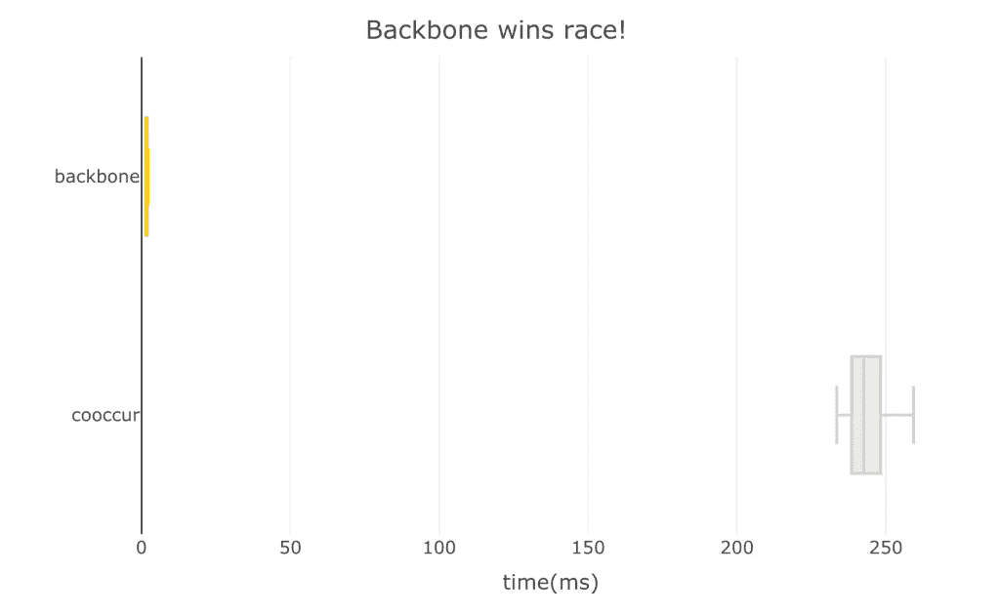

# 速度测试:“cooccur”与“backbone”

> 原文：<https://medium.com/analytics-vidhya/cran-packages-speed-test-cooccur-vs-backbone-a2c39729722e?source=collection_archive---------13----------------------->

## 谁会是赢家？

一个名为*‘backbone’*的新软件包最近出现在 CRAN 上，我对此非常兴奋。本质上，这个包通过提取它的“主干”简化了一个共现矩阵该软件包提供了各种提取主干的方法，其中一种方法涉及使用超几何分布来评估同现是明显小于还是大于预期。由于“[](https://towardsdatascience.com/how-to-create-co-occurrence-networks-with-the-r-packages-cooccur-and-visnetwork-f6e1ceb1c523)*”包做同样的事情，我想，“嗯……哪个更快？“亲爱的朋友们，这就是克兰包裹之战的开始。事不宜迟，让我们开始这场套餐赛吧！！！*

# *准备轨道*

*为了方便起见，我们将使用来自*‘cooccur’*包的 finches 数据集来测试每个包各自的功能。为了监控速度，我们将使用'*微基准测试*，这比使用 **system.time()** 更准确。 **microbenchmark()** 将每个表达式运行 100 次，随机选择每次运行哪个表达式。*

# *各就各位，预备，跑！*

```
*library(cooccur) 
library(backbone) 
library(microbenchmark) 
library(plotly) # Load finches data set from 'cooccur'. 
data(finches) # Compare speed of 'cooccur' v 'backbone'. 
set.seed(123) 
speedTest <- microbenchmark(cooccur(finches), hyperg(as.matrix(finches)))*
```

**

*照片由 Nicolas Hoizey 在 Unsplash 上拍摄。*

# *获胜者是…*

```
*# Rename factors. 
levels(speedTest$expr) <- c('cooccur', 'backbone') # Plot. 
plot_ly(data = speedTest, 
        y = ~expr, x = ~(time/1000000), 
        color = ~expr, colors = c("#D3D3D3", "#FBCB23"), 
        type = "box") %>% 
  layout(showlegend = F, 
         title = "And the winner is...backbone!", 
         xaxis = list(range = c(0, 275), title = 'time(ms)'), 
         yaxis = list(title = ''))*
```

**

*结果:'*骨干*'以压倒性优势胜出！如果你追求的是速度，*主干*就是你的包裹。如果你正在使用' *cooccur* '并且没有发现任何速度问题，那就太好了！放心继续用吧。速度不是定义一个包的唯一因素。但是，如果速度*是*的一个问题，你可能想要切换到“*主干*”您应该会看到运行时间有明显的改进。*

*伟大的比赛，包裹！*

**

*[高辉](https://unsplash.com/@moxiaohuihahaha?utm_source=unsplash&utm_medium=referral&utm_content=creditCopyText)在 [Unsplash](https://unsplash.com/@brooke_tdd/likes?utm_source=unsplash&utm_medium=referral&utm_content=creditCopyText) 上拍照。*

## *参考*

*Domagalski R，Neal Z，Sagan B (2020)。*主干:从加权图中提取主干*。r 包版本 1.2.2，[https://CRAN.R-project.org/package=backbone](https://cran.r-project.org/package=backbone)。*

*格里菲斯、丹尼尔·m、维奇、约瑟夫·a .、查尔斯·j·马什(2016)。
cooccur:统计软件的 R. Journal
中的概率物种共现分析，69(2)，1–17。doi:10.18637/jss.v069.c02*

**原载于 2020 年 11 月 25 日*[*【https://thatdarndata.com】*](https://thatdarndata.com/speed-test-cooccur-vs-backbone/)*。**