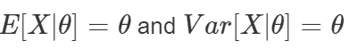

# 带 R 的贝叶斯统计速成班(第一部分)

> 原文：<https://medium.com/analytics-vidhya/crash-course-in-bayesian-statistics-with-r-part1-1bb7df092d93?source=collection_archive---------19----------------------->

# 贝叶斯推理基础

贝叶斯规则公式


这个经典公式是统计贝叶斯推理理论的基础


设 **f()** 表示概率或概率密度函数


根据这个公式，我们可以看到贝叶斯方法和频率主义方法之间的第一个基本区别，在贝叶斯推理中，我们将数据 **x** 视为固定的，将感兴趣的参数 **θ** 视为随机变量，这意味着 **θ** 具有分布

请记住，我们在统计和概率的初级课程中学到，在概率论的发展过程中，人们提出了不同的概率定义，其中两种定义被称为概率的相对频率定义和概率的主观定义。

因此，在贝叶斯推断中，将数据视为固定的，而将参数视为随机的，这将从根本上改变统计学中非常基本的概念的解释，例如 **p** 值、假设检验或置信区间..等等。

回到公式

**f(θ)** 是先验分布

**f(θ|x)** 是后验分布

**L(θ；x)** 是可能性

**f(x)** 是数据 xx 或归一化常数的边缘分布，它在贝叶斯推断中不太重要，因为它是固定的 **x** 的函数， 去掉这个归一化常数会导致后验密度 **f(θ|x)** 在 **θ** 的域上失去一些性质，如积分为 1(不适当的密度),但这不是什么大问题，因为我们通常对积分函数不感兴趣，而是最大化它，所以将这个函数乘以常数不会改变对应于最大点(MAP)的 **θ** ,在这种情况下，我们可以说后验密度与先前乘以似然性成比例(不相等),即 x)

# 共轭先验，以泊松模型为例

假设我们有一个随机变量 **X** 具有均值为 **θ** 的泊松分布，即


我们知道这种随机变量的矩是



现在假设有一个样本 **x1，x2…，xn** 的 **n** 个独立同分布(iid)的观测值或随机变量**X∞pois(θ)X∞pois(θ)**的实现，那么联合密度函数 pdf 或似然函数为


现在我们将研究一类共轭先验分布，它将使后验计算变得简单。

通常，如果后验分布也在一类先验密度中，则该类先验密度对于采样模型 **p(x1，x2，…，xn|θ)** 是共轭的。对于泊松采样模型，我们的 **θ** 的后验分布具有以下形式:


这意味着无论我们的密度共轭类是什么，它都必须包括像这样的术语


最简单的一类密度只包括这些项，它们相应的概率分布称为伽玛分布族。

再一次，我们想要推断关于 Posisson pdf 参数，即 **θ** 给定手边的数据，这个不确定的正量 **θ** 具有两个参数 **α** 和 **β** 的伽马分布，即


无论如何，这是反映我们关于 **θ** 的先验信息或信念的先验分布，这种分布可以基于两个参数 **α** 和 **β** 采取不同的形状，如下所示


现在我们完成了，我们只需要分析计算 **θ** 的后验分布


这显然是一种伽玛分布，即


**θ** 的后验期望是先验期望和样本均值的凸组合:


现在让我们举一个例子来加深理解。

假设我们有某个民族 A 的妇女的孩子数量的数据

```
*# data* 
x <- c(2, 2, 1, 1, 2, 2, 1, 2, 1, 0, 2, 1, 1, 2, 0, 2, 2, 0, 2, 1,     0, 0, 3, 6, 
       1, 6, 4, 0, 3, 2, 0, 1, 0, 0, 0, 3, 0, 0, 0, 0, 0, 1, 0, 4, 2, 1, 0, 0, 
       1, 0, 3, 2, 5, 0, 1, 1, 2, 1, 2, 1, 2, 0, 0, 0, 2, 1, 0, 2, 0, 2, 4, 1, 
       1, 1, 2, 0, 1, 1, 1, 1, 0, 2, 3, 2, 0, 2, 1, 3, 1, 3, 2, 2, 3, 2, 0, 0, 
       0, 1, 0, 0, 0, 1, 2, 0, 3, 3, 0, 1, 2, 2, 2, 0, 6, 0, 0, 0, 2, 0, 1, 1, 
       1, 3, 3, 2, 1, 1, 0, 1, 0, 0, 2, 0, 2, 0, 1, 0, 2, 0, 0, 2, 2, 4, 1, 2, 
       3, 2, 0, 0, 0, 1, 0, 0, 1, 5, 2, 1, 3, 2, 0, 2, 1, 1, 3, 0, 5, 0, 0, 2, 
       4, 3, 4, 0, 0, 0, 0, 0, 0, 2, 2, 0, 0, 2, 0, 0, 1, 1, 0, 2, 1, 3, 3, 2, 
       2, 0, 0, 2, 3, 2, 4, 3, 3, 4, 0, 3, 0, 1, 0, 1, 2, 3, 4, 1, 2, 6, 2, 1, 
       2, 2)n <- length(x) *# sample size* 
s <- sum(x)    *# sum of x_i*

*# plot the data* 
plot(table(x), type="h",
     xlab=expression(italic(x)),
     ylab=expression(italic(n(x))),col=gray(.5) ,lwd=3)
mtext("Number of children in group A",side=3) 
```


该数据的合适模型是参数为 **θ** 的泊松模型。如果我们假设我们对出生率的先验信念遵循γ分布，其中 **α=2** 和 **β=1** ，那么


既然我们现在知道后验分布，那么我们可以得到关于 **θ** 的推断，即后验均值、模式和 **95%** 基于分位数的置信区间、贝叶斯 HDI 和后验预测分布(我们将在后面介绍)。现在让我们继续写代码

```
*# prior parameter*
a <-  2 ; b <-  1
(a+s)/(b+n)   *# posterior mean (our estimation of theta)**# parameter space* xtheta<-seq(0,5,length=1000) plot(xtheta,dgamma(xtheta,a+s,b+n),type="l", lwd = 2, col= "black",xlab=expression(theta),
     ylab=expression(paste(italic("p("),theta,"|",x[1],"...",x[n],")",sep="")))
lines(xtheta,dgamma(xtheta,a,b),type="l",lwd=2, col = "grey")
legend("topright",legend=c("prior","posterior"),
       lwd = 2,col=c("grey","black"))
```


你可以从我的 bayesstat repo:
[https://github.com/BahgatN/bayesstat](https://github.com/BahgatN/bayesstat/blob/master/code.R)下载用过的 R 代码

# 参考

[https://www . Amazon . de/Mathematical-Statistics-Economics-Business-Mittelhammer/DP/0387945873](https://www.amazon.de/Mathematical-Statistics-Economics-Business-Mittelhammer/dp/0387945873)
https://cran . r-project . org/web/packages/BEST/vignettes/BEST . pdf
[https://stat . duke . edu/books/first-course-Bayesian-statistical-methods](https://stat.duke.edu/books/first-course-bayesian-statistical-methods)