# 流行病速成班

> 原文：<https://medium.com/analytics-vidhya/crash-course-in-epidemics-15ee5d6eb307?source=collection_archive---------16----------------------->

专家如何预测病毒如何在社会中传播？

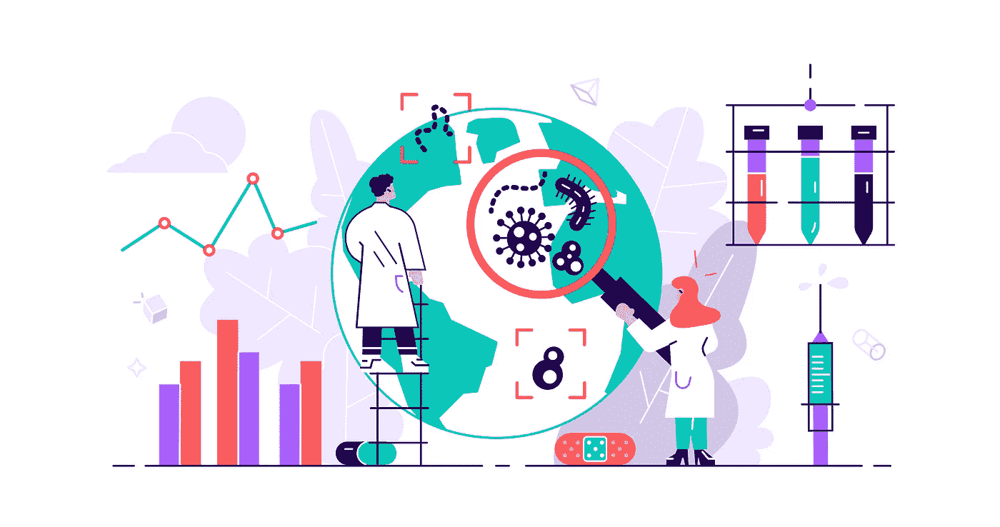

你可能已经看到了许多关于冠状病毒将如何发展的不同预测。从数百万人死亡和现代社会崩溃的场景，到几个月后一切恢复正常，预测似乎无处不在。

这些预测中有许多来自著名的大学和政府机构，其方法要么保密，要么以复杂的方式表达。

实际上，这些预测是由一些简单而直观的观察得出的。模拟病毒的传播很容易，而且任何人都可以理解。

了解病毒如何传播的第一个基础是知道病毒的***是什么*。**

> *****生殖数*** 是一个感染者在患病过程中会感染的平均个体数。**

**如果 ***繁殖数*** 是 ***2.0*** ，我们可以这样预测病毒的增长:**

**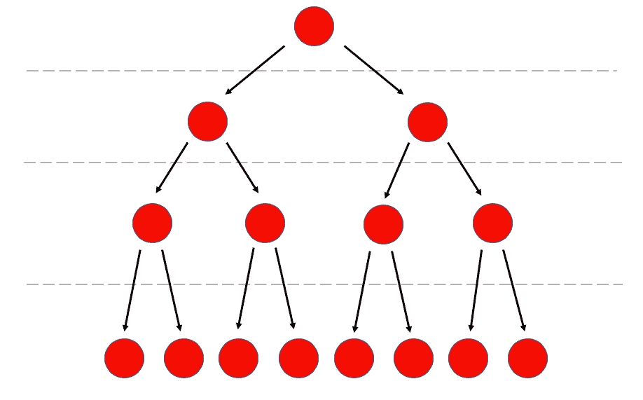**

**这就是所谓的指数增长。用于模拟在每个**日(t)** 感染的**数量(I)** 的等式是:**

**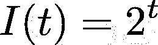**

**指数生长**

***第一天:* **1** 人被感染**

***第五天:* **第三十二天**人被感染了**

***第 10 天:* **第 1024 章**人被感染了**

**第 20 天:**1048576 人**被感染**

**我们可以使用这个等式开始建立一个 ***模型*** 来预测病毒将如何传播。**

**这种情况会很快升级。在第 30 天，有超过 10 亿人被感染。**

**下一个构件是病毒的 ***恢复时间*** 。**

> *****恢复时间*** 是个人从病毒中恢复的预期天数。**

**将*恢复时间包含到我们的模型中的一个结果是，它修改了*的生殖数量，使其在疾病过程中分散开来。****

***可以这样想:一个病人不会在一个下午完成所有的感染。它们在患病期间具有传染性，可以每天传播，直到痊愈。如果我们假设他们注定会将病毒传播给两个人，那么这些感染将会在康复所需的时间内平均分布。***

***假设病毒的恢复时间为 ***4 天*** ，繁殖数为 ***4.0。*** 利用病毒的这些特性，我们可以求出 ***的每日繁殖数。******

**在这种情况下，这将是每天 **1 例感染**。**

**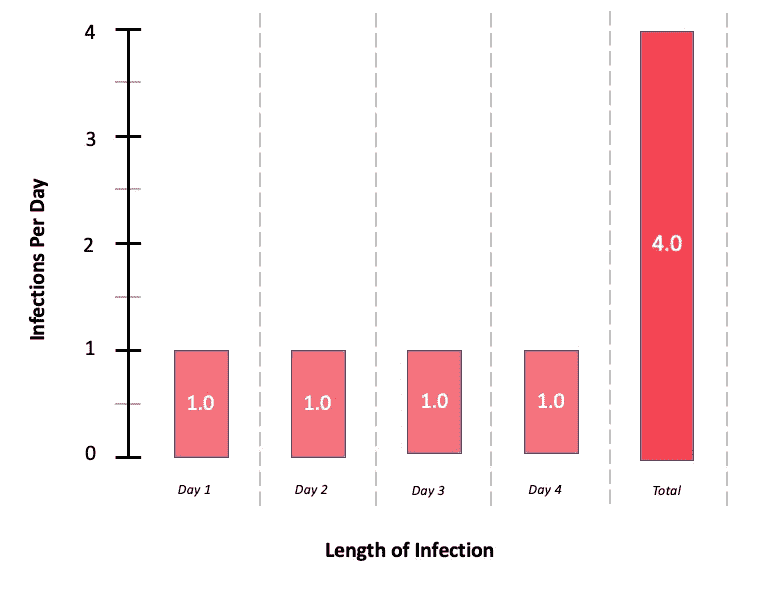**

**同样，一个病毒也有一个 ***的每日恢复号。*****

**在个人层面，这更容易理解为你的身体每天愈合的百分比。如果恢复时间是 ***4* 天**，你的身体每天恢复 **25%** 。**

**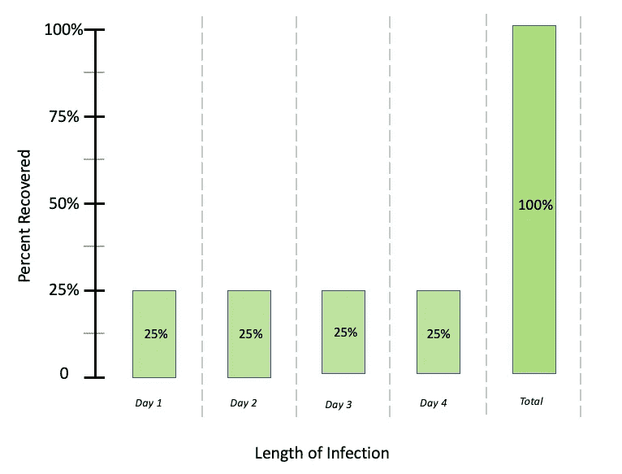**

**如果把 ***恢复时间*** 包括在内，我们预计恢复人数的增长将相当于感染人数延迟恢复所需的时间**

**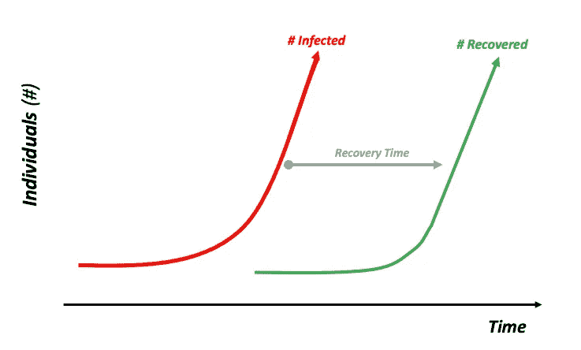**

**感染和康复**

**理解该模型如何工作的下一个组成部分是了解*和 ***日再生数*** 日复一日是如何工作的。***

**这是在很多人被感染的宏观层面上更直观的理解。在和很多感染者打交道的时候，把这些数字想成 ***百分比*** 。**

> *****日繁殖数*** 是每天成功感染一人的感染个体的百分比。**
> 
> *****日康复数*** 是每天从疾病中康复的感染者的百分比。**

**让我们来定义病毒的属性，然后看看它如何在几天内升级:**

*   *****繁殖数*** = **2.0****
*   *****恢复时间*** = **5 天****
*   ****= 2/5 =**40%****
*   ******= 1/5 =****20%********

****第一天:我们从 100 名感染者开始。****

****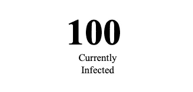****

****第二天:在被感染的 100 人中，我们预计 40%的人会感染一个新的人(感染人数+40)，20%的人会康复(感染人数-20)。****

****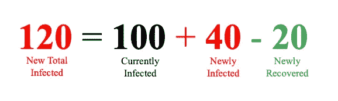****

****第二天:在被感染的 120 人中，我们预计 40%的人会感染一个新的人(感染人数+48)，20%的人会康复(感染人数-24)。****

****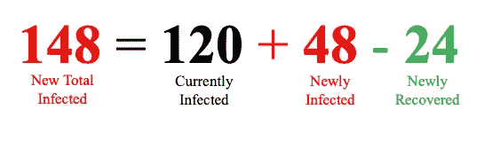****

****这个图像看起来是这样的:****

****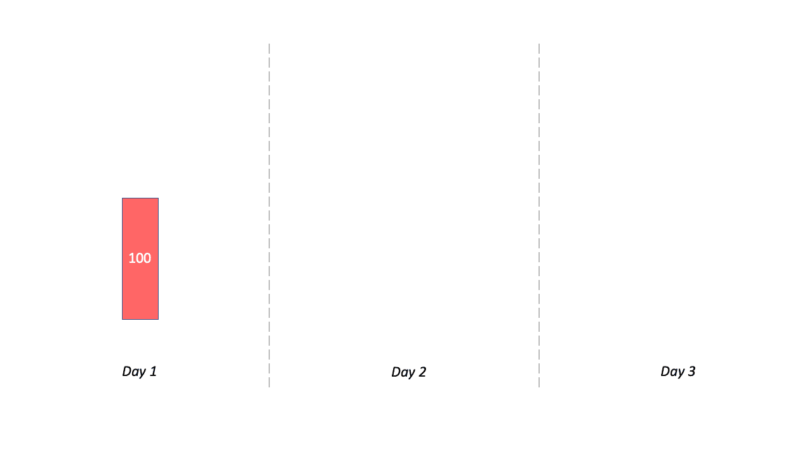****

****我们需要开始思考我们的身体如何从感染中恢复，以及社会中的人们如何互动。****

****这是 ***最*** 影响流行病学的重要事实:****

> ****当一个人从病毒中康复时，他们会产生抗体，这样他们就再也不会被感染了。****

****因此，病毒只有在感染者接触到尚未接触过病毒的人时才会传播。****

****出于建模的目的，我们将这些个体称为****

*****这有效地将我们的***【N】***人口分成了三类。*****

*   *****易感个体*****
*   ********【感染个体(一)】********
*   *******恢复个体*******

****在所有***(t)***的日子里，都是如此:****

****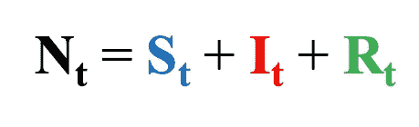****

****随着时间的推移，人们从**易感**到**染病**再到**痊愈**。****

****有了*的固定人群，这意味着随着时间的推移易受感染 ***的个体数量会减少。********

****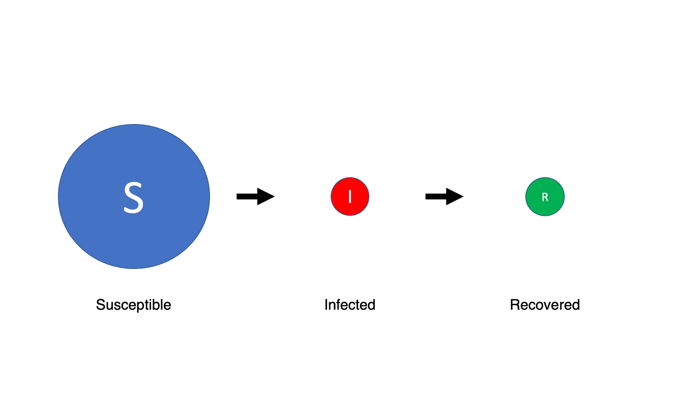****

****把病毒想象成 ***火*** ，把易感人群想象成 ***柴*******

****一旦柴火耗尽，火就熄灭了。如果没有人可以感染，病毒就不会传播。****

****回想一下我们的例子，我们有 40%的感染者每天成功地感染一个人。在我们 100 人的人口规模中，这基本上是 40 人感染了 40 人。****

****把这 40 种感染看作 ***相互作用*** 。****

******可能的相互作用:******

1.  ******感染者**与**康复者**互动:****

****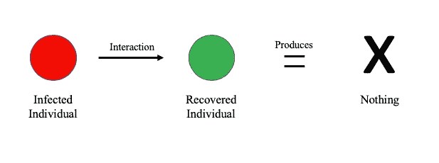****

****受感染的与恢复的相互作用****

******2。感染者**与**感染者:**交互****

****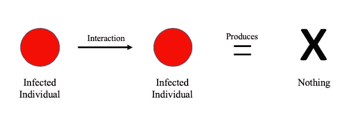****

****感染者与被感染者相互作用****

****3.**感染**与**易感**相互作用:****

****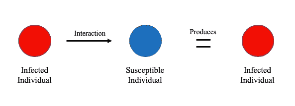****

****成功的互动****

****在这 40 个交互中，可能有一些会属于前两个不成功的类别。康复的人不能感染病毒，感染的人也不能再次感染病毒。****

****利用这一点，我们可以将每天的*传染性相互作用的百分比定义为人群中剩余易感人群的百分比。*****

*****把它想象成一个感染者每天和一个随机的人交谈。这个人易感的概率就是剩下易感人群的比例。*****

*****例如，如果只有 **10%** 的人群仍然易感，我们现在只能期望 **10%** 的交互成功。*****

*****现在我们的感染模式改变了。随着易感人群数量**减少**，每天新增感染率也将下降**。*******

*******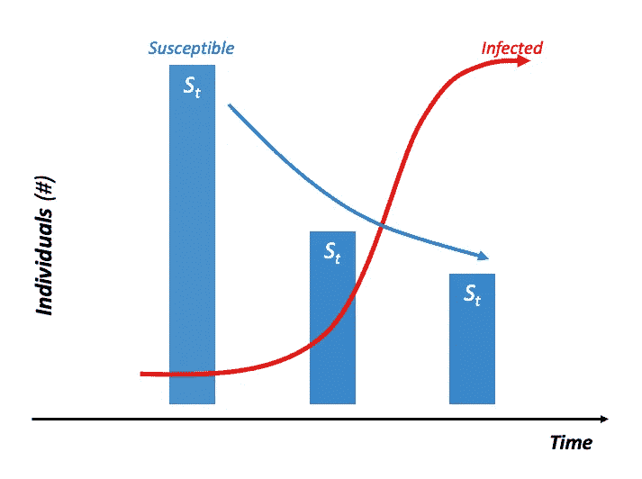*******

*******随着时间的推移感染*******

*******使用这些属性，让我们开始考虑一个 ***时间线*** :*******

******在流行病开始的时候，人群中易感个体的比例非常高。这将增加感染率，因为更多来自感染者的相互作用将与易感个体发生。此时，**恢复的个体数量**非常少**，因为没有多少被暴露。********

********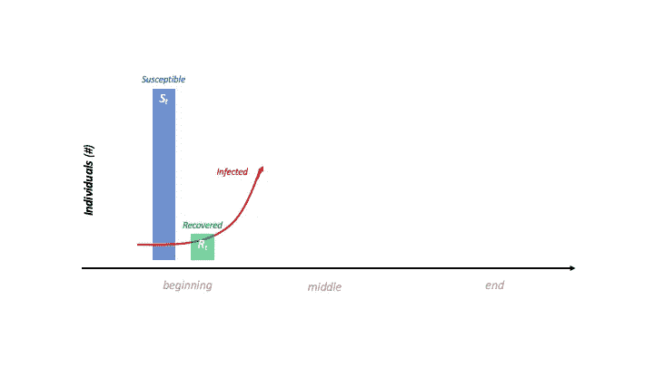********

********在疫情中期的 T21，易感人群的比例开始下降。很快**新恢复的**个体每天变得*多于***新感染的**个体，并且**感染**的数量开始减少。**********

*******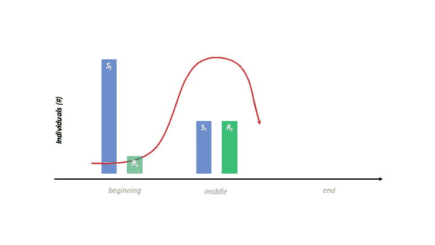*******

*******在一场疫情的**结束**时， ***痊愈人数【R】***在 ***人口规模【N】***附近开始趋于平稳，因为每个人都有过病毒，并痊愈 ***。******感染人数*** 和 ***易感人数******(S)***在接近 **0** 时开始趋于平稳，因为不再有更多的人易感。*******

******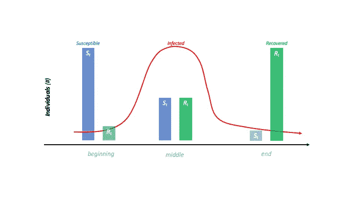******

*******如果你想了解这个模型背后更多的数学知识，请阅读我的另一篇文章* [***这里***](/@shmordan/understanding-the-sir-model-a63e7ea84209)******

******让我们定义一个群体和病毒，并运行一个真实的模拟:******

*   ******总人口**万人********
*   ********100** 一开始就被感染******
*   ********=****2.0**********
*   ********=****10 天**********

******完整 SIR 模型******

*******如果你想摆弄这些模型，你可以在我的*[***GitHub***](https://github.com/jordaniscrosby/InfectiousDiseaseModels)中找到必要的代码******

******这就是流行病学家所说的 **SIR 模型，**他们用它来预测一段时间内病毒的传播。******

******2003 年，世界看到了一种叫做 SARS 的新型冠状病毒的曙光。******

******事情是这样的:******

******眼熟吗？******

******预测病毒的传播很容易。只需要知道一种病毒的平均繁殖数、正常恢复时间和种群数量，我们就可以对病毒在社会中传播的情况做出详细的预测。******

******至于社会变化对 SIR 模型的影响，我写了第二篇文章，讨论个人卫生、强制隔离和治疗/疫苗如何影响 SIR 模型。这里 可以看******

********感谢阅读！********