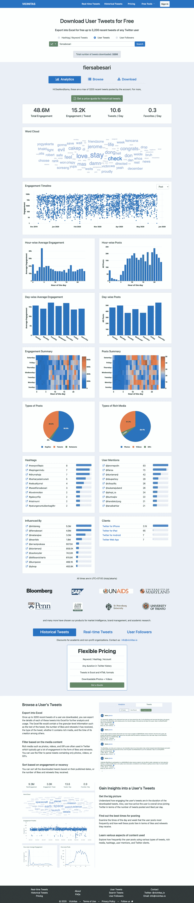

# 无需认证即可抓取 Twitter 数据

> 原文：<https://medium.com/analytics-vidhya/crawling-twitter-data-without-authentication-8269d1c5b261?source=collection_archive---------1----------------------->

## Twitter 为我们提供了获取 tweet 数据的 API，因此我们可以轻松地从官方来源检索 tweet。免费版 twitter API 给了我们很多限制；我们无法检索超过七天的推文。我试图找到一种方法，我们可以在没有官方 API 限制的情况下检索推文数据。此贴仅供教育之用，风险自担。


萨拉·库菲在 [Unsplash](https://unsplash.com?utm_source=medium&utm_medium=referral) 上拍摄的照片

对于一个科学家来说，Twitter 是一个极好的数据来源；它让我们可以自由地使用官方 API 传输和检索数据。使用免费的官方 API，我们可以检索七天前的推文。

但是，我们如何检索七天前的数据呢？

我们可以获得高级 API，但对我们这样的人来说太贵了，而不是一家公司。

因此，我尝试谷歌如何检索我们想要的数据，而不仅限于 7 天前的数据。

我从 git 找到了这个有用的 Python 库，它可以在没有官方 API 的情况下抓取 twitter 数据。

[](https://github.com/bisguzar/twitter-scraper) [## bisguzar/twitter-scraper

### Twitter 的 API 使用起来很烦人，而且有很多限制——幸运的是他们的前端(JavaScript)有自己的…

github.com](https://github.com/bisguzar/twitter-scraper) 

这个库的文档非常清楚。我们可以使用如下语法的 pip 来安装这个库。

```
pip3 install twitter_scraper
```

然后，我们可以从一个帐户导入和检索推文。

```
from twitter_scraper import get_tweetsfor tweet in get_tweets('twitter'):
     print(tweet['text'])
```

我试图从图书馆检索一个拥有 27k 条推文的人的推文数据。但它失败了，该图书馆仅从 27k 条可用推文中检索到约 800 条推文。

我尝试用自己的代码修改这个库，希望可以修复这个库的缺点。

但是，我失败了。

我试图通过修改搜索网址和标题来解决这个问题，但是仍然没有用。像以前的图书馆一样，我只从 27k 条推文中检索到大约 800 条推文。

这是我的代码；我正在使用不同的方法访问数据。我使用 BeautifulSoup 从请求中获取数据。我还添加了一个以 CSV 格式保存数据的功能。

然后我试着在网上找一些在线工具，有没有人能帮我检索一个人的所有推文。

然后我发现了这个网站

[](https://www.vicinitas.io/free-tools/download-user-tweets) [## 免费下载用户推文并将其导出到 Excel 中——Vicinitas:Twitter 分析工具，用于…

### 一旦用户最近的 3200 条推文被下载，你就可以将每条推文的细节导出到 Excel 中…

www.vicinitas.io](https://www.vicinitas.io/free-tools/download-user-tweets) 

这是我们试图检索推文时的结果。



它不仅能让我们下载 excel 或 CSV 格式的数据，还能让我们深入了解我们检索到的数据。

但是，同样，我们不能检索所有的推文。我们只能检索 3200 条推文，我们必须支付更多的费用来检索所有推文。

# 结论和未来工作

使用非官方的 API 不可能从一个人那里获取所有的 tweet 数据(如果你找到了方法，请纠正我)。

我们唯一能做到的方法是使用类似机器人的 Kapaw 或 Selenium。用硒之前做的。当我尝试这些代码时，它无法工作，因为 twitter 改变了它的界面。

我仍在开发一个基于 Selenium 的爬虫来检索所有数据。我现在面临的问题是 Twitter 类，XPath 看起来很随意，Twitter 页面都是用 AJAX 构建的。

这很难，但我认为从一个使用 Selenium 的人那里获取所有的 tweet 数据是可能的。

谢谢你