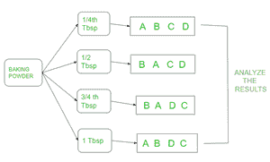
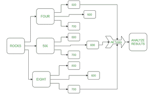

# R 中的 CRD

> 原文：<https://medium.com/analytics-vidhya/crd-in-r-b3a4cf52018e?source=collection_archive---------11----------------------->

实验设计是统计学中方差分析的一部分。它们是一种预定义的算法，帮助我们分析实验单元中组均值的差异。完全随机设计(CRD)是方差分析类型的一部分。

**完全随机设计-**

设计实验的三个基本原则是重复、分块和随机化。在这种类型的设计中，阻塞不是算法的一部分。实验的样本是随机的，重复被分配到不同的实验单元。让我们考虑一个例子

**实验**——在蛋糕中加入更多的发酵粉可以增加蛋糕的高度。

让我们看看 CRD 将如何分析这个实验。



如上图所示，将发酵粉分成 4 大汤匙(大汤匙),用每一大汤匙随机制作 4 个高度相同的蛋糕(分别为 A、B、C、D)。然后比较 tbsp 的结果，看是否实际上高度受发酵粉的影响。

复制只是分别对 A、B、C、d 的不同蛋糕高度的排列。

让我们看看上面的 R 语言例子——每个大汤匙蛋糕的高度是随机记录的

```
tbsp 0.25 0.5  0.75  1 
     1.4  7.8  7.6  1.6
  #(A,B,C,D)
     2.0  9.2  7.0  3.4
  #(A,B,D,C)
     2.3  6.8  7.3  3.0
  #(B,A,D,C)
     2.5  6.0  5.5  3.9  #(B,A,C,D)
##  the randomization is done directly by the program
```

蛋糕的复制是用下面的代码完成的

稀有

```
treat<- rep(c("A", "B", "C", "D"), each = 4)
fac <- factor(rep(c(0.25, 0.5, 0.75, 1), each = 4))
treat
```

**输出-**

```
[1] A A A A B B B B C C C C D D D D
Levels: A B C D
```

正在创建数据帧-

稀有

```
height <- c(1.4, 2.0, 2.3, 2.5,
          7.8,9.2, 6.8, 6.0, 
          7.6, 7.0, 7.3, 5.5,
          1.6, 3.4, 3.0, 3.9)exp <- data.frame(treat, treatment = fac, response = height)
mod <- aov(response ~ treatment, data = exp)
summary(mod)
```

**输出-**

```
Df Sum Sq Mean Sq F value   Pr(>F)    
treatment    3  88.46  29.486   29.64 7.85e-06 ***
Residuals   12  11.94   0.995                     
---
Signif. codes:  0 ‘***’ 0.001 ‘**’ 0.01 ‘*’ 0.05 ‘.’ 0.1 ‘ ’ 1
```

对于每个实验，显著性是 0.05 或 0.01，由进行实验的人给出。在这个例子中，让我们考虑显著性为 5%，即 0.05

我们应该看到 Pr(>F)的值是 7.85e-06，即< 0.05\. Thus reject the hypothesis . If the value is > 0.05，然后接受假设。

以我们的 Pr <0.05 reject the hypothesis.

Lets consider one more example-

**实验为例—** 向水中加入石头会增加容器中水的高度。

让我们看看这个实验，如下图所示



考虑如果将四块石头分别加入 500 毫升、600 毫升和 700 毫升，水的高度会相应增加。例如，在 500 米的水中加入 6 块石头，高度增加了 7 毫秒。

```
rocks four six eight
      5    5.3    6.2 [500 600 700]
      5.5    5    5.7   [600 500 700]
      4.8    4.3   3.4  [700 600 500]
```

让我们编码-

稀有

```
rocks<- rep(c("four", "six", "eight"), each = 3)
rocks
fac <- factor(rep(c(500,600,700), each = 3))
fac[1] "four"  "four"  "four"  "six"   "six"   "six"   "eight" "eight" "eight"[1] 500 500 500 600 600 600 700 700 700
Levels: 500 600 700
```

正在创建数据帧-

稀有

```
height <- c(5, 5.5, 4.8,

          5.3, 5 , 4.3,

            4.8 , 4.3 , 3.4)
exp1 <- data.frame(rocks, treatment = fac, response = height)
mod <- aov(response ~ treatment, data = exp1)
summary(mod)Df Sum Sq Mean Sq F value Pr(>F)
treatment    2  1.416  0.7078   2.368  0.175
Residuals    6  1.793  0.2989
```

这里 0.175>>0.05 这样假设就被接受了。

~~~~~~

也在 geeksforgeeks.org 出版

https://www . geeks forgeeks . org/completely-random-design-with-r-programming/