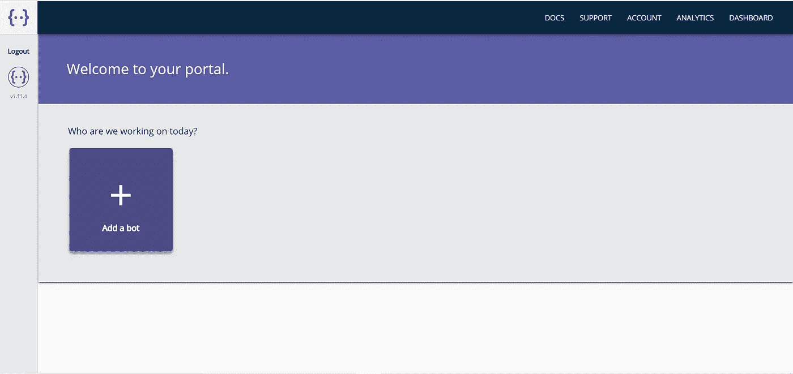

# 10 分钟内轻松创建聊天机器人，无需编码技能

> 原文：<https://medium.com/analytics-vidhya/create-a-chat-bot-in-10-minutes-easily-no-coding-skills-required-f68345c0f229?source=collection_archive---------19----------------------->

(使用对话流和僵尸复制)

# 介绍

在本教程中，你将学习创建一个聊天机器人，它可以被添加到你的任何网页中。

本文分为两部分:-
**第一部分:-** 向你解释如何使用 DialogFlow 创建聊天机器人。
**第二部分:-** 解释如何使用 BotCopy 将在 DialogFlow 中创建的聊天机器人添加到任何网页中。

# **第一部分**

## **步骤 1:-访问**[**https://dialogflow.cloud.google.com/**](https://dialogflow.cloud.google.com/)**使用您的谷歌账户登录**

## **第 2 步:-** 如果您首次登录，请允许对话流使用您在 google 帐户中的详细信息。成功登录后，点击“下一步”,您将看到下面的屏幕。

## 第三步:- 点击创建代理将打开。

> 1 .说出你的代理人的名字
> 
> 2.Google 项目>选择>创建新的 Google 项目。
> 
> 3.点击创建。

## **步骤 4:-** 成功创建代理后，您将看到如下屏幕。

## **第五步:-** 启用闲聊。

> 1.点击闲聊。
> 
> 2.点击启用切换。

## **第六步:** —根据你的需求定制闲聊。

## **第 7 步:-** 创建意图:-

> 1.单击意向选项卡右侧的“+”。
> 
> 2.将名称添加到意向中。
> 
> 3.添加培训阶段。
> 
> 4.点击保存。

# 什么是意图？

意图是用户可以通过使用 Dialogflow 控制台中定义的术语之一来调用的特定操作。例如，用户可以问“今天会下雨吗？”或者“最近的比萨饼餐馆在哪里”—如果这些是在控制台中定义的术语，那么它们将被 Dialogflow 检测到，并且在下定义的意图将被触发。

## 通过导航到控制台左侧菜单中的 intents 导航项目，可以找到为您的代理定义的 Intents 列表。

作为开发人员，意图允许我们定义用户可以调用的单个任务的选择。你应该把目标放在这些意图上，集中在它们被创建的功能上，这允许我们保持调用的长度较短，并且在较短的时间内给用户期望的响应。

# 第二部分

## 现在我们要知道，如何将我们的聊天机器人添加到您想要的网页上，使其发挥作用。

## **第八步:-** 访问[https://www.botcopy.com/](https://www.botcopy.com/)点击免费开始。

## **第 9 步:-** 使用您登录 Dialogflow 时使用的同一 google 帐户进行注册。

登录后，您将看到下面的门户网站。

*   **点击添加机器人**

*   **选择我们的对话流项目。**

如果您通过用于 DialogFlow 的同一个 google 帐户登录，您的项目应该会自动出现在这里。

**第 10 步:-如果所有的步骤都正确遵循，你应该能够看到如下页面**。

## 步骤 11:- 现在将上图所示的 Html **嵌入片段**复制到你的任何网页中。

我正在把这个机器人添加到我的博客中。

**通过访问体验真人 BOT 我的博客**[**https://just-python.blogspot.com**](https://just-python.blogspot.com/)