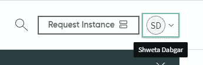
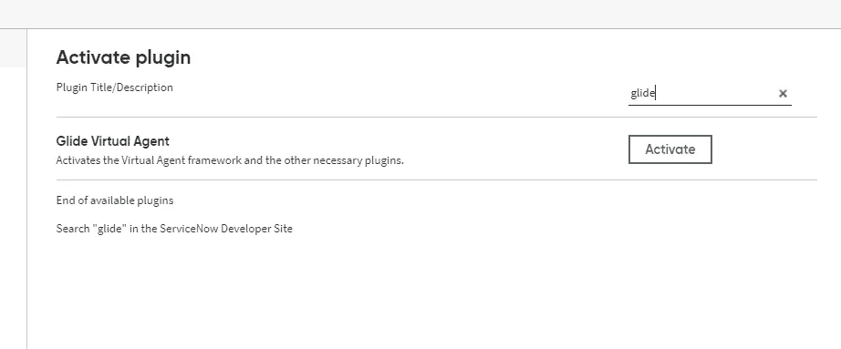

# 使用 ServiceNow 创建聊天机器人

> 原文：<https://medium.com/analytics-vidhya/create-a-chatbot-using-service-now-e9da0c9682c7?source=collection_archive---------8----------------------->

1.  使用以下链接登录 ServiceNow 开发人员帐户。[https://developer.servicenow.com/dev.do](https://developer.servicenow.com/dev.do)
2.  登录后，请求一个新实例。

3.对于所有最新的更新，选择巴黎版本的实例。

4.使用生成的密码和用户 id 登录到实例。

5.现在，您需要激活在虚拟代理中执行不同操作所需的插件。点击右上方你的名字就可以找到激活插件。

6.在过滤器中搜索 glide 并激活 Glide 虚拟代理。

7.一旦插件被激活(你会收到一封电子邮件通知，或者可能需要一些时间)。您可以在过滤器中搜索虚拟代理。(需要刷新页面)

8.现在要启用 nlu，在过滤器中搜索插件。

9.在插件中搜索模型构建器并激活它。

10.还要确保在左上角的设置中启用了应用程序选择器。

11.导航到工作室创建 NLU 模型。

12.在工作室中创建应用程序。

13.创建应用程序时选择 NLU 模型。

14.继续前进，用话语创造一个意图，训练并发布它。这些相同的意图将在设计器中用来创建主题。(创建的应用程序的范围)。

15.在你开始创建主题之前，你需要在常规设置中启用 NLU 设置并保存它。

16.在设计器中创建一个主题，并发布它。

17.您可以通过在屏幕上添加一个小部件来测试下面链接中创建的主题。 [https:// <你的实例 url > /sp](https://dev56853.service-now.com/sp)

在页面上单击(Ctrl+右键)后，在设计器中选择页面。

18.从小部件中拖动虚拟代理。继续测试 NLU 模型中配置的话语，并将其显示在屏幕上。(请记住在添加之前将虚拟代理保留在全局范围内)。

在本文中，我们已经介绍了聊天机器人的基本设置。使用 api 训练和发布模型。脚本、品牌和高级配置将在下一篇文章中讨论。