# 使用 Python 构建深度神经网络

> 原文：<https://medium.com/analytics-vidhya/create-a-deep-neural-network-from-scratch-15c9b07c1388?source=collection_archive---------13----------------------->

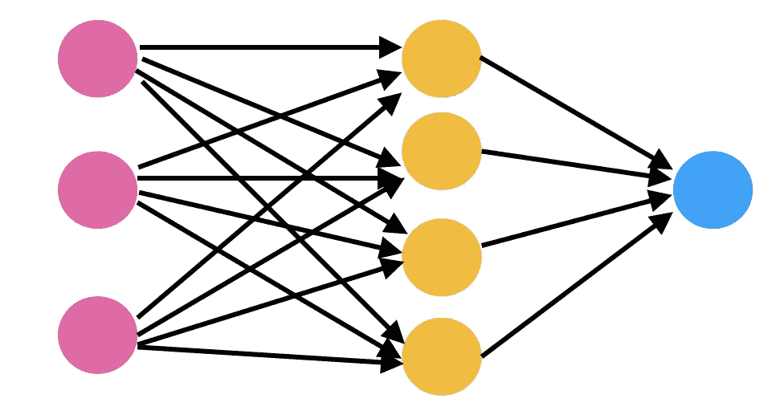

神经网络的例子

深度学习和神经网络是数据科学中非常流行的概念，它利用大量数据来训练可以进行非常准确分类的模型。神经网络广泛用于图像和语音识别以及自然语言处理。

我做了一些关于神经网络的基础研究(现在网上有很多资源可以学习任何东西)，结果证明，这个概念相当容易理解。了解一点线性代数和微积分知识就足以理解神经网络的基础。

有许多框架可用于建模和训练神经网络，如 Tensorflow 和 Keras。使用这些框架将使实现变得如此容易，但为什么不尝试困难的方式，从头实现一个神经网络。

所以让我们用 python 建立一个模型，来训练和测试一个神经网络，这个神经网络有任意数量的层，由任意数量的隐藏单元(神经元)组成。

在开始实施之前，首先，让我们看看需要做些什么。我们可以把这个过程分成几个步骤。

1.  初始化参数
2.  正向传播
3.  计算成本
4.  反向传播
5.  更新参数

现在让我们看看如何实现这些步骤。

重要的事情先来。我们需要一个数据集。我用来训练和测试模型的数据集是来自 sklearn 数据集的 make_moons。你可以在这里看到数据集[的文档。](https://scikit-learn.org/stable/modules/generated/sklearn.datasets.make_moons.html#sklearn.datasets.make_moons)

您还可以从 sklearn 探索许多其他[数据集。(make_moons 数据集位于“生成的数据集”部分)](https://scikit-learn.org/stable/datasets/)

首先，安装 sklearn 数据集并导入数据集。

```
from sklearn.datasets import make_moons
```

现在，让我们加载数据集，并为训练和测试进行设置。

```
X,Y = make_moons(n_samples=2000, shuffle=True, noise=None, random_state=None) X = X.T
m = X.shape[1]
Y = Y.reshape(1,m)
```

在这个实现中，

x 是 n*m 矩阵，其中 n 是特征的数量，m 是示例的数量。

y 是一个 1 *m 向量

您可以切换 X 和 Y 的维度，但是您应该相应地切换权重的维度。

我们将使用 80%的数据集来训练模型，20%用于测试。

```
margin = m//10*8 
X_train, X_test = X[:, :margin], X[:, margin:]
Y_train, Y_test = Y[:, :margin], Y[:, margin:]
```

现在我们已经准备好了数据集，是时候实现模型了。我们将一步一步地实现这个模型。

**初始化参数**

这是我们初始化每一层的权重和偏差的地方。为了初始化参数，我们将一个包含每层中单元(神经元)数量的数组作为输入。例如,[n，4，1]将意味着具有 n 个输入特征的 3 个层，以及分别在隐藏层中的 4 个和 1 个神经元。

然后，我们遍历这些层，初始化权重和偏差，并将它们存储在一个字典中({W1: _，b1: _，W2: _，b2: _，……})

在这个实现中，

特定层 l (W[l])的权重矩阵的维数是(层 l 中的神经元数目，层 l-1 中的神经元数目)

特定层 l (b[l])的偏置向量的维数是(层 l 中神经元的数量，1)

这些尺寸取决于 X 和 Y 的尺寸。如果您交换 X 和 Y 的尺寸，W 和 b 的尺寸也应该交换。

总是用随机值初始化权重来打破对称性。如果所有的权重和偏置被初始化为零，则单层的所有神经元中的激活将是相同的。

**正向传播**

在该步骤中，通过将前一层的激活作为输入来计算每一层的激活。

正向传播可以分为两个子步骤:

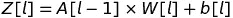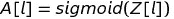

虽然我使用 sigmoid 激活函数来计算所有层的激活，但这不是最好的选择。对于隐藏层，还有其他比 sigmoid 更好的激活函数，如 tanh 和 ReLU。

为了实现前向传播，我们需要实现 sigmoid 函数。

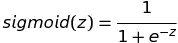

现在让我们来计算单层的激活。

您可能已经注意到，除了激活该层之外，我们还返回了一个缓存，用于存储该层的一些值。当我们到达反向传播部分时，你就会明白为什么了。

现在我们有了计算单层激活的函数，我们可以用它来进行正向传播。我们需要做的是使用前一层直到最后一层的激活来计算每一层的激活。

从这个函数，我们返回 AL，最后一层的激活(或者 y hat)。我们还返回缓存，一个包含我们在每一层收集的所有缓存的数组。稍后您将看到缓存的用途。

**计算成本**

现在，我们计算成本，看看我们通过正向 prop 计算的 AL 与 y 有多大差异。为此，我们将使用交叉熵成本。

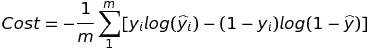

交叉熵成本

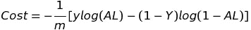

交叉熵成本矢量化

您也可以使用均方差来计算成本。

**反向传播**

现在到了棘手的部分，backprop！我们的最终目标是通过调整参数使成本最小化。为此，我们使用梯度下降。为了使用梯度下降来调整参数，我们需要找到成本相对于每个参数的偏导数。(dW1、db1、dW2、DB2……)

如果你懂微积分的基础，backprop 也没那么难。通过使用链式法则，我们可以找到成本相对于每个参数的偏导数。

为了帮助反向推进，下面是我们用于正向推进的方程式:

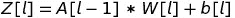

现在让我们用链式法则推导出 dWL(成本相对于 WL 的导数)，其中 L 是最后一层。

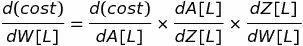

现在让我们看看是否能推导出这些项中的每一项。

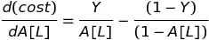

成本的导数 w.r.t AL(如果您使用成本的均方误差，这一项会有所不同)

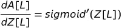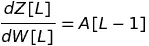

我们把前两个导数的乘积取为 dZ[L](成本相对于 Z[L]的导数)。我们以后会需要它。

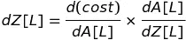

因此，如果我们有 Z[L]和前一层的激活(A[L-1])，我们将能够计算 dW[L]。还记得我们在正向推进期间在每层的缓存中存储了一些值吗？如果您不记得我们存储了什么，请向上滚动查看。我们存储了 A_prev 和 Z！因此，如果我们访问最后一层的缓存，我们将能够轻松地计算 dW[L]。

现在让我们再返回一层，看看我们是否能为每个 dW[l]导出一个模式。

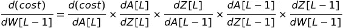

回想一下，


然后我们可以把链条简化到，

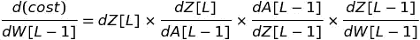

现在让我们看看能否推导出其余的项。

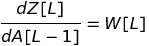

(从 Z[l] = A[l-1] * W[l] + b[l])

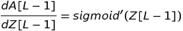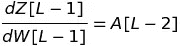

因此，如果我们有 W[L]，Z[L-1]，和 A[L-2]，我们可以计算 dW[L-1]。如果你回头看看，我们已经在缓存中存储了我们需要的值。

如果我们对 A[L-1]的成本求导，

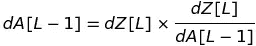

然后我们可以推广一个等式来得到成本相对于单层中的权重的导数，

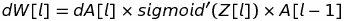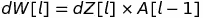

成本相对于层的偏差的导数可以使用相同的链式法则来表示，

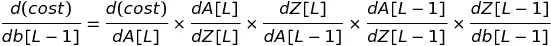

在这种情况下，最后一项将是 1。所以，

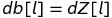

唷！既然推导已经完成，让我们来实现 backprop。

首先，我们需要一个函数来计算 sigmoid 导数。

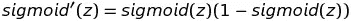

现在，让我们将推导出的方程应用于一个单层。

现在让我们使用该函数，并将其应用于从最后一层到第一层的所有层。

我们使用在正向推进期间存储的缓存来计算每一层中的导数，并将它们存储在字典中。({dW1: _，db1: _，dW2: _，db2: _，……})

**更新参数**

最后，我们可以使用我们计算的导数并更新参数。

所以我们已经完成了所有的步骤。现在是时候把它们放在一起了。我们初始化参数一次，然后循环执行剩余的步骤，直到成本最小化。(我们可以决定需要多少次迭代)

这就是我们的模型。您还可以将每次迭代的成本存储在一个数组中，并根据迭代次数绘制它，以查看成本的降低。

现在，我们要做的就是，对我们之前加载的数据集运行这个函数。我们将训练一个具有 3 个层的模型，每个层有 5、3 和 1 个单元，学习率为 0.005，迭代 10，000 次。

```
layer_units = [X_train.shape[0], 5, 3, 1]
parameters = neural_network(X_train, Y_train, layer_units, 0.005, 10000)
```

就是这样！

现在，您可以实现预测器函数来预测训练集和测试集的值，并计算准确性。您可以使用不同的数据集和激活函数，还可以调整学习率、隐藏层和隐藏单元，看看模型的表现如何。

希望你理解代码，最重要的是，概念。完整的代码可以在[我的 GitHub 库](https://github.com/JayaniH/Neural-Networks/blob/master/NeuralNetwork.py)中查看。