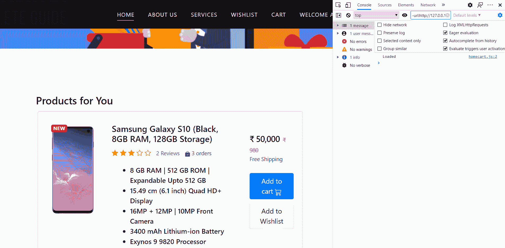

# 在这 5 个步骤中创建 Django API

> 原文：<https://medium.com/analytics-vidhya/create-a-django-api-in-these-5-steps-cbd00d43c7ce?source=collection_archive---------6----------------------->

## 更新网页元素而不刷新


也许你想对数据库进行修改，并通过点击按钮将修改反映到网页上；就像一个应用程序，对吗？你要找的是 **AJAX(异步 JavaScript 和 XML)** 。

基本上我们要做两件事:

1.  跟你的项目一起调用一个用 Django 写的 **API(应用编程接口)**(没错，你现在就要做 API！呀呀呀！).API 将对数据库执行一些操作。
2.  然后我们的 API，以**JSON(JavaScript Object Notation)**格式发回数据；表示存储在键-值对中的数据的好方法。然后使用这些数据更新 DOM 元素。

> 为什么不是 XML？

因为 JSON 在 JavaScript 中的表现方式，类似于 Python 数据结构“Dictionary”的创建方式；所以在编写 API 的时候会变得简单一点。

让我们开始吧。

# 第一步

我将给出一个例子。假设一个用户想在愿望列表中添加一个项目。现在我们需要知道两件事:

1.  什么是*产品 ID* ？
2.  什么是*行动*？

现在的行动将是*添加。*

> 我应该把这个值保存在哪里？

我们将在 HTML 中保存产品 ID 和动作，并使用自定义数据属性将它与特定按钮相关联，在我们的示例中是模板中的`*data-product*`和`*data-action*`。

还要添加一个类，以便我们可以在 JavaScript 中查找这个按钮。我用了`*update-wishlist*`。

# 第二步

> 好的，但是我们如何把这个值传递给服务器呢？

使用 JavaScript。

记得我们给按钮添加了一个类`*update-wishlist*` 。我们可以使用`getElementsByClassName`或`querySelectorAll`函数给我们的按钮添加一个事件监听器。

现在，一旦页面加载完毕，脚本就会运行，并使用类`*update-wishlist*`将事件监听器添加到我们所有的按钮中。

> 但是等等，我们还没写函数`updateUserWishlist`！

是的，这就是我们要调用我们的 API 并获取一些数据的地方。

索引. js

> 这是怎么回事？

基本上，我们使用[获取 API](https://developer.mozilla.org/en-US/docs/Web/API/Fetch_API) 从 URI 获取资源，这是我们 API 的端点。

**方法**(第 5 行)为你从 API 发出的请求提供信息。根据使用情况，它可以是其中之一。

*   **GET** :执行“读取”操作
*   **POST** :执行“创建”操作
*   **放** & **补丁**:执行“更新”操作
*   **删除**:执行“删除”操作

**但是要记住每个方法都指定了一个只能在数据库上执行的特定操作。如果 API 不接受您指定的方法，您将在控制台中得到类似这样的错误。**

```
405 (Method Not Allowed)
```

**Headers** (第 6 行)代表响应/请求头，允许您查询它们并根据结果采取不同的行动。

**主体**(第 7 行)代表对请求的响应。

这个 fetch 方法返回一个包含响应的承诺(一个`Response`对象)。目前，我们将发送产品 ID 和操作。

然后，必须将响应读取为 JSON，并将其传递给另一个函数`updateNavbar`，我们将在那里更新 navbar。用你自己的更新 DOM 元素的函数替换它。

将该文件与其他 JavaScript 文件一起添加到 index.html 的末尾。

# 第三步

现在我们需要处理我们的数据，但首先我们需要设置一些东西。在您最喜欢的 IDE/文本编辑器中打开您的项目，然后跟着做。

## 第一步:安装 [Django Rest 框架](https://www.django-rest-framework.org/)。

从您的项目根目录运行一个终端，并编写以下命令来安装 pip 包

```
pip install djangorestframework
```

## 第二步:让我们从创建一个新的应用程序开始。

我们首先需要创建一个新的应用程序，我将命名为`serverapi`。因此，我们将在终端中再次运行一个命令。

```
python manage.py startapp serverapi
```

## 步骤 3:将 app 和 rest_framework 添加到您的 Django settings.py 文件 INSTALLED_APPS 列表中

与其他应用程序一起，以这种方式添加服务器 API 应用程序，

`appname.apps.AppnameConfig`

settings.py

## 步骤 4:将 URL 添加到项目的主 urls.py 和新应用程序的 urls.py 文件中。

在您的主 urls.py 文件中，添加您新创建的应用程序的 URL 文件的路径以及其他 URL。

主 urls.py 文件

现在，我们将在您新创建的应用程序中添加路径查看功能。

创建的应用程序的 urls.py 文件

# 第四步

现在，我们已经设置好了一切，我们现在可以编写我们的视图了。

serverapi/views.py

`api_view`装饰器接受一个你的视图应该响应的 HTTP 方法列表。然后我们继续访问来自 request 的数据，这样我们就可以看到传递给服务器的内容。这是您需要确保只允许那些为其编写视图的方法的地方。

现在，就像普通视图一样，我们继续基于动作处理数据库，一旦完成，我们返回一个`JsonResponse`，然后可以在我们的 JavaScript 中接收到它。

# 第五步

> 好的，但是我们什么时候更新了 DOM 元素？

还记得我们在步骤 2 中将`Response`传递给了`updateNavbar`吗。您可以随意使用传递的数据。现在我将更新导航条。

索引. js

还有，我们还没有添加[**【CSRF】(跨站点请求防伪)**](https://docs.djangoproject.com/en/3.1/ref/csrf/) 令牌。通俗地说，我们希望只接受来自原始应用程序的请求，而不是假装来自原始应用程序的外部站点的请求；以避免攻击者执行恶意动作。

所以，要么直接在你的 index.html 里面添加下面的线，要么创建一个新的。js 文件并将其添加到 head 标签中。

csrf.js



结果

这是我最近参与的一个项目的一部分。 [Shopiva](https://github.com/Anurag-117/Shopiva) 。

关注我，分享我的**旅程**，你也可以在**[**LinkedIn**](https://www.linkedin.com/in/anuragdhadse/)|[**Github**](https://github.com/adhadse)**上联系我。****