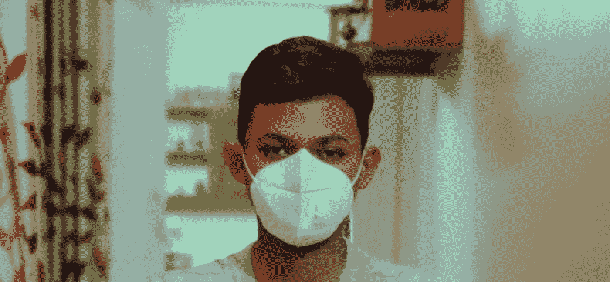
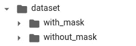
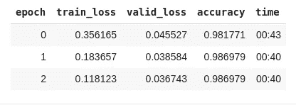
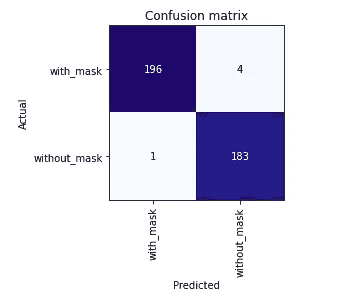
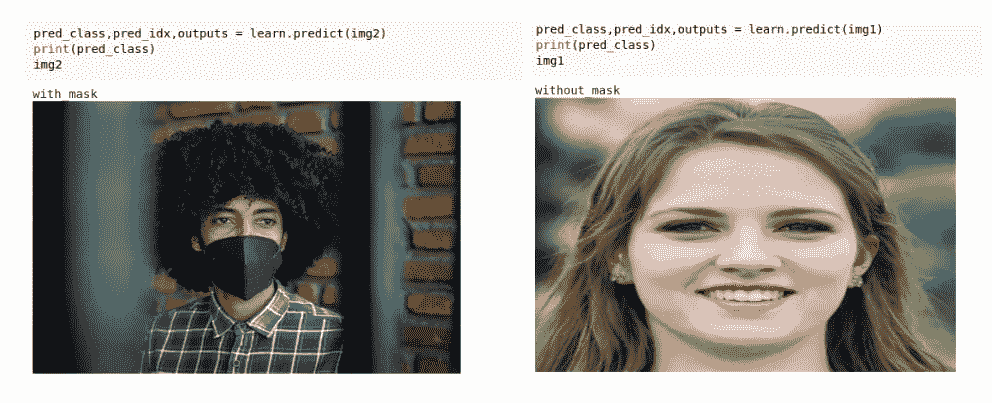

# 用 5 行代码创建一个面具检测器

> 原文：<https://medium.com/analytics-vidhya/create-a-face-mask-detector-in-5-lines-of-code-42e840424239?source=collection_archive---------19----------------------->



在这个疫情的时代，面具已经成为我们服饰中至关重要的一部分。戴口罩不仅是你照顾自己的一种姿态，也是为了社区。一些人使用外科口罩，一些人使用 N95 呼吸器。很少有人选择用布做的面具，有创意的人使用自制的花式面具。买不起口罩的人会用围巾包住脸，或者用 t 恤捂住嘴。无论如何，每个人都在尽力保护自己，防止病毒传播。在一些研究中，人们发现那些新冠肺炎病毒感染者曲线变平的国家非常重视口罩的使用。

我们将创建一个简单的面具检测器模型来检测一个人是否戴着面具。我们将使用 **Fast.ai** 库来构建模型。我们将使用 Google Colab，这样我就可以使用他们的 GPU。

# **收集数据**

第一步是获取数据。因为我们正在制作面罩检测器，所以我们必须拍摄戴面罩和不戴面罩的人的脸部图像。我们将使用 **Fatkun 批量下载**从 Google images 中收集数据，然后我们将它存储在两个不同的文件夹中，分别命名为 **with_mask** 和 **without_mask** 。我们总共有 1921 张照片。我的数据集结构如下:



# 模型结构

一旦我们的数据准备好了，现在我们可以开始构建我们的模型。

我们将导入所有必要的库。

```
from fastai import *                **# line_1**
from fastai.vision import *         **# line_2**
```

这里我们不必分配类，因为 ImageDataBunch 将从文件夹名中获取类名。

```
data =ImageDataBunch.from_folder(’dataset/’,train=".",valid_pct=0.2,
                                 ds_tfms=get_transforms(), size=224,
                                  num_workers=4)
                                 .normalize(imagenet_stats)  **#line_3**
```

**ImageDataBunch** 安排所有的数据——一个训练集，一个带有图像和标签的验证集。它将从路径`**'dataset/'**` 获取图像。它将为训练集找到我们将使用`**'.’**`指定的默认文件夹。由于我们没有单独的验证集，我们将创建自己的验证集，`**valid_pct=0.2**`将自动随机分离 20%的数据进行验证。因此，我们有 1537 幅图像用于训练，384 幅图像用于验证。使用`**get_transforms()**` 我们可以扩充数据，但仅出于演示目的，我们将尽量保持模型简单。我们喂的是`**size**` (224，224，3)的形象。`**num_workers**`是要使用的 CPU 数量，我们使用 4 个。最后，我们将数据标准化。

```
learn = create_cnn(data, models.vgg16_bn, metrics=accuracy) **# line_4**
```

现在，我们正在创建 CNN 模型，在该模型中，我们将数据拟合到训练前的 VGG16 模型中。

```
learn.fit_one_cycle(3)   **# line_5**
```

上面的代码将为 3 个时期训练模型。仅用三个时期，我们就获得了大约 98%准确度的相当好的结果。



我们用 5 行代码构建了一个掩蔽检测 CNN 模型。

# 试验

让我们看看我们的模型在验证数据集上的表现

```
interp = ClassificationInterpretation.from_learner(learn)
interp.plot_confusion_matrix()
```



在这种情况下，我们的模型是好的，因为它降低了假阳性率，即当某人没有戴面具时，我们的模型预测戴面具的次数，因为我们不想错过没有戴面具的人。



我们的模型在如此简单的代码中表现很好，如果我们稍微调整一下，我们可以使我们的模型更加准确，并应用于实时视频。