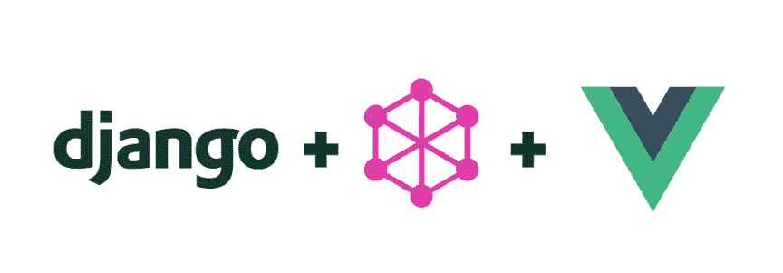

# 用 Django、GraphQL 和 VueJS 创建一个全栈应用

> 原文：<https://medium.com/analytics-vidhya/create-a-fullstack-app-with-django-graphql-and-vuejs-727a0cf41820?source=collection_archive---------0----------------------->

作为一名数据工程师，我的大部分经验和知识主要集中在构建数据库、构建数据平台以及最重要的构建容错数据管道(无论是在 Hadoop 集群内还是在单个 Linux 实例上)。我最初开始学习 Django 是在 4 年前，因为我需要将我在网页中处理的大量数据可视化…