# 用 Django、GraphQL 和 VueJS 创建一个 Fullstack 应用程序(第 2 部分)

> 原文：<https://medium.com/analytics-vidhya/create-a-fullstack-app-with-django-graphql-and-vuejs-part-2-682c2c30a93b?source=collection_archive---------2----------------------->

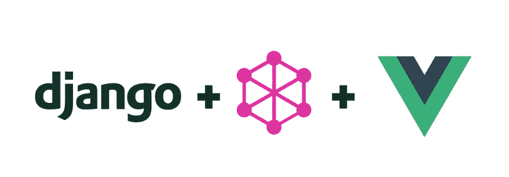

在本教程的第一部分中，我们使用 Django 和 Graphene 创建了一个虚拟的员工管理系统，允许我们查看所有员工、创建新条目以及更新和删除现有条目。

在第二部分中，我们将从上次停止的地方继续，构建一个简单的 VueJS 应用程序，我们可以用它来查看我们的员工并按城市进行过滤。

**先决条件**

为了开始使用 vueJS 和其他前端工具，我们首先需要的是一个[运行时](/@olinations/the-javascript-runtime-environment-d58fa2e60dd0)。最流行的 javascript 运行时是我们这个项目需要的 NodeJS。

因此，请前往 [NodeJS 网站](https://nodejs.org/en/)下载适合您机器的版本。安装完成后，打开您的终端并确认它存在。键入 node -v，您应该会得到一个带有版本号的响应

```
$ node -v
v11.10.0
```

NodeJS 附带了 [npm](https://www.npmjs.com/) ，这是一个 javascript 包管理器，本质上使开发人员可以轻松下载和安装所需的包(类似于 python 中的 pip)。您也可以通过键入以下命令来确认它已安装

```
$ npm -v
6.7.0
```

最后，我们想安装 [vueJS](https://github.com/vuejs/vue) 和 [vue-cli](https://github.com/vuejs/vue-cli) 。这就是 npm 的优势所在

```
sudo npm install -g @vue/cli
```

将 sudo 添加到 vueJS install 语句中并不是强制性的，但是在某些情况下您可能会得到一个错误，特别是如果您没有以管理员身份登录到您的计算机上。下载完成后，您只需在终端中键入“Vue”即可确认安装

```
$ vue
Usage: vue <command> [options]Options:
 -V, — version output the version number
 -h, — help output usage informationCommands:
 create [options] <app-name> create a new project powered by vue-cli-service
 add [options] <plugin> [pluginOptions] install a plugin and invoke its generator in an already created project
 invoke [options] <plugin> [pluginOptions] invoke the generator of a plugin in an already created project
 inspect [options] [paths…] inspect the webpack config in a project with vue-cli-service
 serve [options] [entry] serve a .js or .vue file in development mode with zero config
 build [options] [entry] build a .js or .vue file in production mode with zero config
 ui [options] start and open the vue-cli ui
 init [options] <template> <app-name> generate a project from a remote template (legacy API, requires @vue/cli-init)
 config [options] [value] inspect and modify the config
 upgrade [semverLevel] upgrade vue cli service / plugins (default semverLevel: minor)
 info print debugging information about your environment Run vue <command> — help for detailed usage of given command.
```

现在我们准备开始了

1).导航到本地驱动器上要创建项目的位置，并为应用程序创建一个文件夹。在我的例子中，我将在我的桌面上创建一个名为“vueapps”的目录，然后切换到该目录

```
$ cd ~/Desktop
$ mkdir vueapps && cd vueapps
```

我现在将创建一个名为“公司”的新 vueJS 应用程序

```
$ sudo vue init webpack company
```

您将经历一系列类似下图的提示。根据需要选择您的偏好。

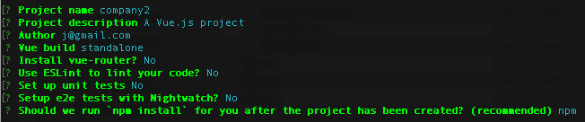

安装完成后，您应该会看到一个与项目同名的目录。当您切换到目录时，您应该看到以下文件和目录

```
$ cd company
```

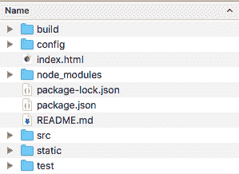

2).下一步是安装 vueJS 和 vue-cli 捆绑的所有插件。如果您打开“package.json”文件，您将看到所有插件和依赖项的列表

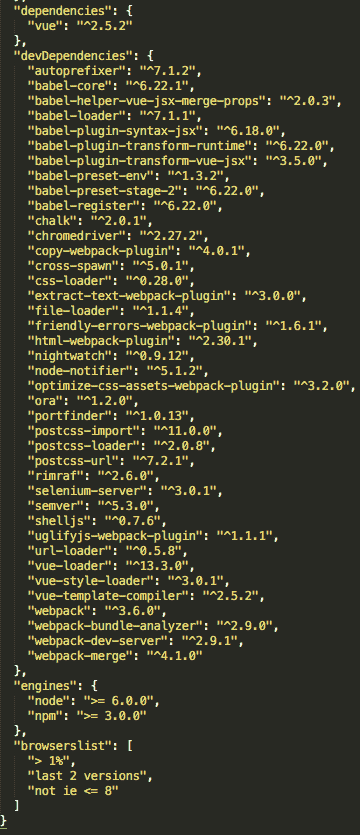

要安装所有这些依赖项，请运行“npm 安装”。确保您在公司应用程序目录中

```
$ sudo npm install
```

顺便说一下，所有插件都将安装在 node_modules 子目录中。如果一切运行正常，您应该会看到类似下面的消息(根据您的系统，可能会有更多或更少的包)

```
audited 11689 packages in 5.466s
found 0 vulnerabilities
```

现在我们可以创建一个开发服务器，开始在本地计算机上运行我们的应用程序

```
$ npm run devI Your application is running here: [http://localhost:8080](http://localhost:8080)
```

现在，您可以导航到提供的本地主机 IP，您应该会看到类似下图的屏幕

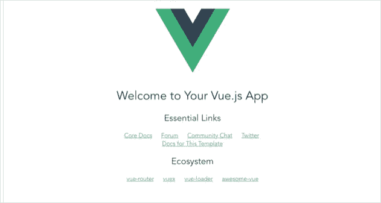

现在，我们准备开始构建我们的应用程序

3).如果你熟悉 Vue，你会知道 Vue 类似于由多个组件和路由组成的单页面应用程序(SPA)。

我们的大部分代码将存在于“src”目录中，应用程序的所有组件都将驻留在“components”子目录中。

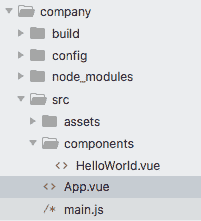

安装后我们导航到的演示页面(http://localhost:8080)是 HelloWorld.vue 文件(组件)的产品。每个组件由一个模板标签、一个脚本标签和一个样式标签组成。

但是，App.vue 文件是应用程序的父 SPA 文件，其中所有组件和路由器都需要注册，以便在浏览器中显示。尽管浏览器中显示的所有数据都是在 HelloWorld.vue 文件中创建和存在的，但仍需要在应用程序中注册。Vue 文件，否则不会显示

现在我们需要创建一个新的组件来可视化我们的公司数据。确保您位于 src/components 目录中，并创建一个新组件

```
$ cd src/components
$ sudo touch Comp.vue
```

4).打开新的 Comp.vue 文件，从一个简单的组件开始，模板中的根 div 简单地输出“Hello World”，这是一个空函数，没有样式。

我们还需要在脚本标记中添加一个选择器(CompanyData ),并在 App.vue 文件中注册它，以便组件能够工作。

5).现在，我们必须进入应用程序。Vue 文件来注册这个新组件。注意新增加的行(第 5、11 和 17 行)

让我们通过再次运行开发服务器并导航到浏览器来查看我们的更改

```
$ npm run dev
```

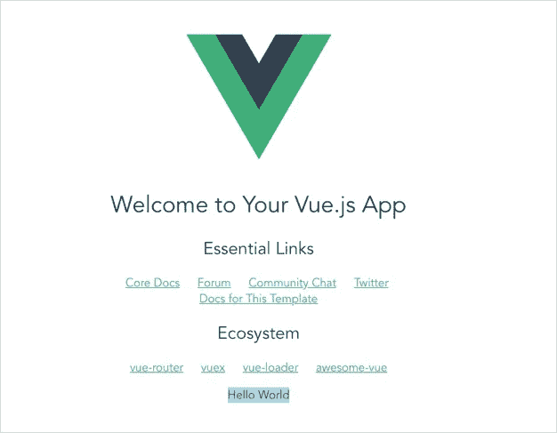

现在，您应该会在页面底部看到您的“Hello World”组件。成功！

现在我们可以开始组织和可视化来自 django 应用程序的数据了。

6).对于我们的公司应用程序，我们希望能够列出公司内的所有当前员工，并能够按城市进行筛选。为了使这在视觉上吸引人并易于阅读，我们将使用一个引导表来显示所有相关的数据。

首先，我们将安装引导程序

```
$ npm install bootstrap
```

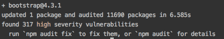

7).由于这不是一个网页设计教程，我不会过多地探究样式方面，我假设如果你正在阅读这篇文章，你已经很好地掌握了 CSS。

对于我的页面:

*   我将引导样式表从 node_modules 目录导入到 App.vue 文件底部的 style 块中(第 57 行)
*   注释掉 App.vue 默认样式(第 59–64 行)
*   添加了一个我从[引导站点](https://getbootstrap.com/docs/4.3/components/navbar/)复制的导航条(第 3-37 行)
*   注释掉默认的 HelloWorld 组件(第 38 行)

你现在可以看到，页面上只剩下新的导航栏和我们的“Hello World”评论

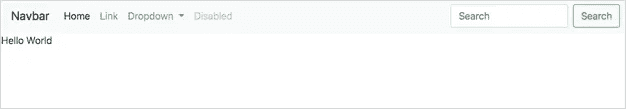

希望你的网页看起来和我的相似。

我们终于开始有趣的事情了！我们将 Vue 应用程序连接到 GraphQL API。

8).我们需要安装 [axios](https://github.com/axios/axios) ，以便从我们的应用程序发出 HTTP 请求。

```
npm install axios
```

**为了继续，您必须确保本教程第 1 部分中的 django 应用程序正在运行。如果没有，导航到目录并运行***python manage . py runserver***。导航到**[**http://127 . 0 . 0 . 1:8000/graph QL**](http://127.0.0.1:8000/graphql)**以确认 Django 应用程序正在运行**

9).让我们对 Comp.vue 文件进行一些编辑，以便能够从 API 获取数据。

*   将 axios 导入脚本标记内的 Comp.vue 文件(第 13 行)
*   添加一个异步安装的生命周期挂钩(第 21 行)
*   添加一个数据函数来收集数据(第 16-20 行)
*   创建一个 POST 方法来查询 GraphQL API(第 24 行)
*   使用一个简单的 GraphQL 查询返回数据(AllTitles)(第 27–39 行)
*   在模板标签中添加一个目录容器，将结果/数据返回给页面(第 18 行)

立即保存并刷新您的 Vue 应用。

10).让我们看看现在是否能在浏览器控制台中看到返回的数据。在浏览器上打开“检查元素”并转到控制台选项卡。

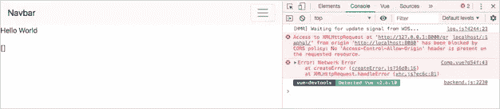

如果您看到一个错误，提到您的请求被 CORS 策略阻止，不要惊慌。我实际上是故意那样做的。

如果您曾经开发过任何需要发出 HTTP 请求的应用程序，那么您一生中很可能至少遇到过一次 CORS 错误。当 web 应用程序从与自己的来源(域、协议、端口)不同的[资源发出请求时，通常会出现这种情况。在我们的例子中，即使两个应用程序都运行在 localhost 上，它们也运行在两个不同的端口上。](https://developer.mozilla.org/en-US/docs/Web/HTTP/CORS)

11).为了解决这个问题，我们必须对 django 应用程序做一些小小的修改。首先，我们需要安装 [django-cors-headers](https://github.com/adamchainz/django-cors-headers)

```
pipenv install django-cors-headers
```

将“corsheaders”添加到 settings.py 文件中已安装应用程序的列表中

```
INSTALLED_APPS = [
 ‘django.contrib.admin’,
 ‘django.contrib.auth’,
 ‘django.contrib.contenttypes’,
 ‘django.contrib.sessions’,
 ‘django.contrib.messages’,
 ‘django.contrib.staticfiles’,
 ‘graphene_django’,
 ‘company’,
 ‘corsheaders’, #added for cors
]
```

将“CORS headers . middleware . CORS middleware”添加到 settings.py 文件的中间件列表中

```
MIDDLEWARE = [
 ‘corsheaders.middleware.CorsMiddleware’, #added for cors
 ‘django.middleware.security.SecurityMiddleware’,
 ‘django.contrib.sessions.middleware.SessionMiddleware’,
 ‘django.middleware.common.CommonMiddleware’,
 ‘django.middleware.csrf.CsrfViewMiddleware’,
 ‘django.contrib.auth.middleware.AuthenticationMiddleware’,
 ‘django.contrib.messages.middleware.MessageMiddleware’,
 ‘django.middleware.clickjacking.XFrameOptionsMiddleware’,
]
```

最后，在 settings.py 文件的底部添加一个白名单，列出所有将向 GraphQL 服务器发出请求的入站 URL

```
CORS_ORIGIN_WHITELIST = (
 ‘localhost:8080/’
 )
```

现在，让我们重启你的 Django 应用&&重启你的 Vue 应用，然后再试一次。

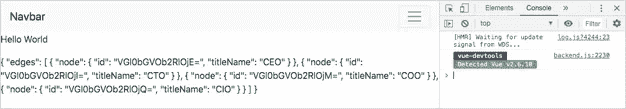

错误现在应该消失了，现在我们可以看到返回的数据(尽管它看起来并不漂亮)。

12).为了让数据看起来更像样，我将添加一个引导表来显示数据。我还将利用这个机会更改 GraphQL 查询，以返回公司中的所有雇员(所有雇员)

*   我将查询从 AllTitles 改为 AllEmployees(第 40–55 行)
*   添加了一个引导表，并在 table 标记中创建了一个 for 循环来返回行中的数据(第 4–19 行)

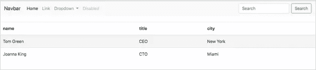

现在这看起来好多了，也更像样了！！

虽然这看起来很棒。这只是返回数据，并没有充分利用我们的 GraphQL 服务器。

13).让我们为我们的应用程序添加一个搜索功能，让用户能够使用城市搜索员工。

*   我添加了一个带有“城市” [v-model](https://vuejs.org/v2/guide/forms.html) 的搜索表单(第 4-9 行)
*   在数据函数中添加了一个城市变量来保存输入到表单中的值(第 36 行)
*   用一个方法包装异步安装的函数(第 40 行)
*   向 GraphQL 查询添加了查询过滤器和城市变量(第 49 行)

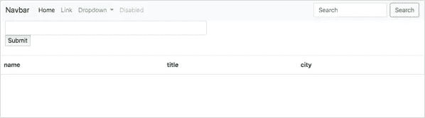

您现在应该能够在页面顶部看到一个搜索框，但是您还会注意到该表不再返回任何数据。这是因为它现在需要您输入一个城市名称来返回结果。

我将在搜索框中输入“纽约”,然后点击回车

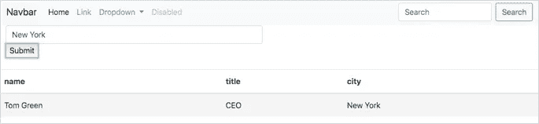

“迈阿密”也一样

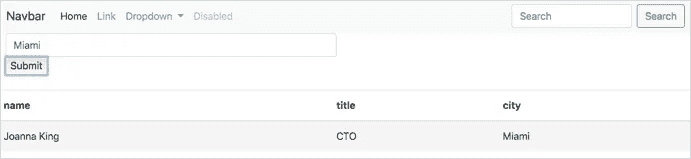

现在看起来棒极了！！

现在，您应该能够向 django 服务器添加更多数据，并从 VueJS 前端检索这些数据。

感谢您花时间通读本教程的两个部分，并为完成本系列的漫长等待表示歉意。如果你想看这个项目的回购，你可以点击[这里](https://github.com/jogunjobi/startupql_vuejs)

祝你好运！