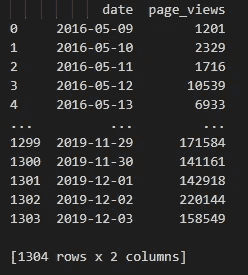
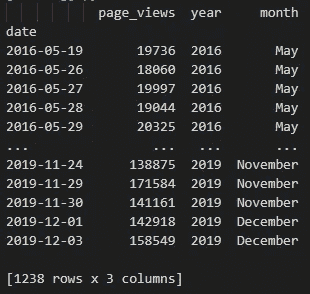
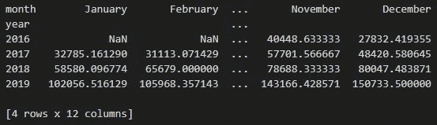
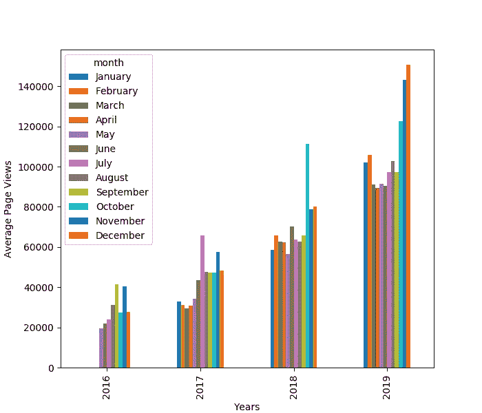

# 用 Matplotlib 和 pandas 创建分组条形图

> 原文：<https://medium.com/analytics-vidhya/create-a-grouped-bar-chart-with-matplotlib-and-pandas-9b021c97e0a?source=collection_archive---------0----------------------->

当我在使用 Python 认证进行 freeCodeCamp 的[数据分析时，我遇到了一个棘手的 Matplotlib 可视化:分组条形图。我一直在项目中摸索，但是指导很少。这很好，因为它使您投入工作以达到期望的解决方案，但是如果您没有太多使用 Matplotlib、pandas 和 Numpy 的经验，或者即使您只是对当前的练习有困难，这也是很糟糕的。](https://www.freecodecamp.org/learn)

因此，我写这篇文章来分享我的解决方案，如何从"[页面视图时间序列可视化器](https://www.freecodecamp.org/learn/data-analysis-with-python/data-analysis-with-python-projects/page-view-time-series-visualizer)"项目中创建分组条形图。我很难理解如何在 Matplotlib 中创建这种可视化，所以我希望这篇文章对您的数据分析项目有所启发。

# 数据

因为我正在分享认证练习的解决方案，所以本文中的演示将使用相同的数据。这些数据可以在 freeCodeCamp 为这个项目设置的[示例 repl.it 环境](https://repl.it/github/freeCodeCamp/boilerplate-page-view-time-series-visualizer)中获得。

这个页面视图数据集只包含两列:一列是录制日期，另一列是当天的页面视图。



加载熊猫后的数据预览

现在您已经知道我们正在处理什么数据，让我们继续数据加载和预处理代码。

# 数据加载和预处理

我将首先向您展示加载和预处理数据的所有代码，然后解释每个步骤。您可以在下面代码要点中找到代码。

数据预处理代码

前几行代码相当简单:使用`read_csv`函数加载一个 CSV 文件，然后改变列的数据类型。在这种情况下，我们希望将“日期”数据视为日期时间数据。然后，我们根据页面浏览记录的日期对数据进行排序，并将该列设置为数据帧的索引。这将有助于未来的转变。

在第 10 行，我们过滤了数据帧，排除了页面视图顶部和底部 2.5 个百分点的行，以消除可能的异常值(这实际上是认证练习中的一个步骤)。

在最后一个代码块中，我们通过为记录的年份和月份创建一个列来完成数据处理。因为我们将日期更改为 datetime 类型，所以我们可以通过访问 DataFrame 的索引来提取它们的年份和月份，然后提取各自的属性:`df.index.year`和`df.index.month`。

由于月份是整数(1 到 12)，我们还应用了一个转换，将这些整数映射到正确的月份名称，存储在`months`列表中。我们可以使用月份的整数表示通过索引从列表中检索名称，调整 Python 列表中基于 0 的索引。

在第一个代码要点的最后一行，我们将“month”列的数据类型改为 Categorical，使用`months`列表的元素作为类别。这很有用，因为现在“月”存储了类别，并且它们保持了`months`列表中月份的顺序。换句话说，我们可以在数据框架中对一月到十二月的月份进行适当的排序。然而，我们不需要使用另一个排序函数:Matplotlib 将在稍后创建条形图时自己完成这项工作。

# 数据可视化

现在是数据可视化的部分:将数据框做成有用的格式并绘制图表。

数据可视化代码

(请注意，这第二个要点仍然是前一个脚本的一部分，为了便于解释，我把它分成了两部分)

我们做的第一件事是将数据帧转换成数据透视表数据帧。在实践中，数据帧由此改变



透视转换前的数据帧

其中，我们将“日期”作为索引，将页面浏览量、录制的年份和月份列放入数据透视表:



生成的数据透视表数据框架

```
df_pivot = pd.pivot_table(
    df, 
    values="page_views",
    index="year",
    columns="month", 
    aggfunc=np.mean
)
```

回想一下创建数据透视表的函数，我们必须指定:

*   源数据帧
*   其值将放入单元格中的列
*   其值将用作新索引的列
*   其值将用作新列的列
*   应用于数据单元格中的`values`的聚合函数

最后，正如您在上面的截图中看到的，我们现在有了年份作为索引，每个月有一列，每个单元格中有每月和每年的平均页面浏览量。请注意，使用平均聚合函数是认证练习的另一个规范。可以使用任何聚合函数。

数据框现在可以绘图了。

在代码要点的第 17 行，我们为 DataFrame 绘制了一个条形图，它返回一个 Matplotlib Axes 对象。我们使用这个对象来获得一个 Matplotlib 图形对象，该对象允许我们更改绘图的维度。之后，我们还会更改轴标签。

在代码要点的最后，我们使用 Figure 对象将绘图导出为 PNG 文件。



生成的分组条形图

# 结论

总之，我们创建了一个每年平均页面浏览量的条形图。但是，由于这是一个分组的条形图，所以每年都被向下钻取到每个月的值。

这个解决方案确实有点神奇，因为我们只需在 DataFrame 上调用`plot(kind="bar")`方法。然而，技巧是旋转 DataFrame，使 X 轴数据在索引中，分组类别在列标题中。Y 轴值是数据框单元格中的值。pandas 和 Matplotlib 足够聪明，能够理解这一点，前提是数据符合所需的形状。

总而言之，用 Matplotlib 创建分组条形图并不容易。代码本身很难处理，因为您需要将数据帧转换成特定的形状，如果您不习惯操作数据，这并不简单。此外，没有太多的资源或例子，我找到的解决方案是通过这个 [StackOverflow 回复](https://stackoverflow.com/a/47797080/9263761)。

出于比较和好奇，看看如何在 [Plotly](https://plotly.com/python/bar-charts/) 中创建一个类似的分组条形图。绘图函数只需要两个额外的参数来实现这种可视化，并且不需要额外的数据透视步骤。

无论如何，我希望这个解决方案与您相关，并有助于未来 Matplolib 和 pandas 的工作！

最后，你可以在我的 [GitHub 库](https://github.com/Ze1598/medium-articles/tree/master/Create%20a%20grouped%20bar%20chart%20with%20Matplotlib%20and%20pandas)上找到所有的代码和资源。如果你不想访问 GitHub，你可以在下面找到完整的脚本。

完整脚本