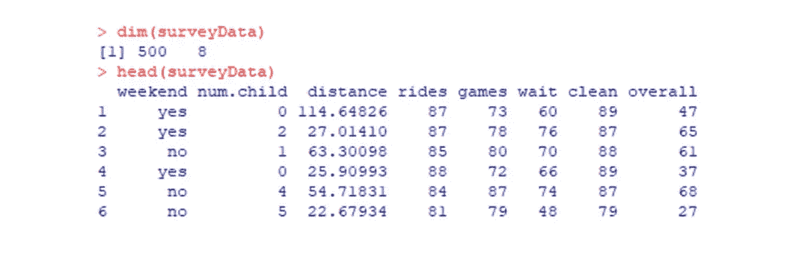
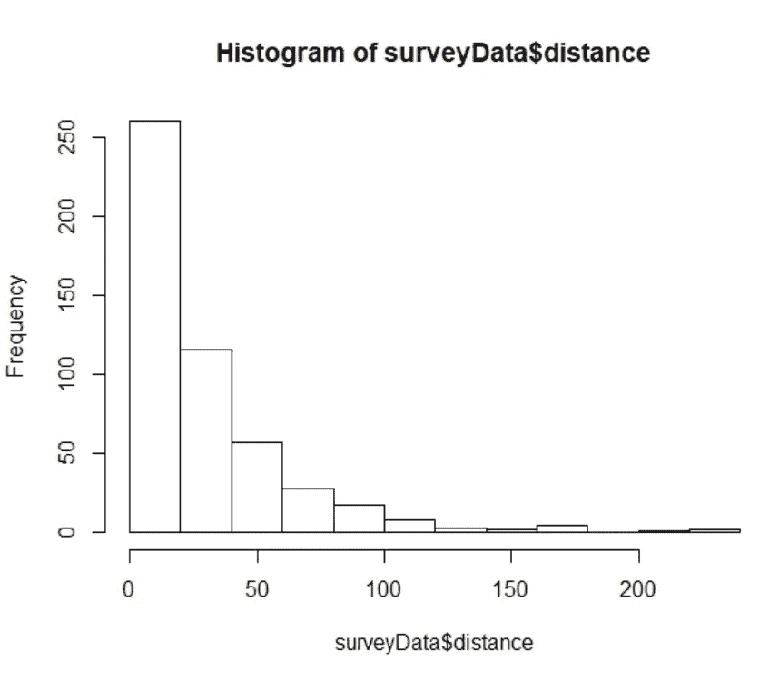

# 利用 R-游乐园调查案例(1)建立线性回归模型

> 原文：<https://medium.com/analytics-vidhya/create-a-linear-regression-model-by-using-r-amusement-park-survey-case-1-e6f6d974db79?source=collection_archive---------13----------------------->


奥尼莎·李在 [Unsplash](https://unsplash.com?utm_source=medium&utm_medium=referral) 上的照片

下面是我在 R 中学习回归时使用的与游乐园调查相关的案例(由*“R for Marketing Research and Analytics”作者 Christopher N. Chapman，Elea McDonnell Feit，Springer 提供)*

# 数据信息

在这项调查中，受访者报告了他们对各方面体验的满意度，如乘坐、游戏、等待和清洁。目标是看某个因素和整体满意度的关系。

# 理解数据

像往常一样，我们读取数据以查看其维度和前几行。

```
surveyData <- read.csv(“http://goo.gl/HKnl74")
dim(surveyData)
head(surveyData)
```



然后，我们通过绘制直方图来检查是否有扭曲的信息。

```
#check the distribution of distance
hist(surveyData$distance)
```



这个图表向我们展示了一个右偏的直方图。这不是我们所期望的，因为我们总是希望我们的数据接近正态分布。因此，我们通过对距离进行对数转换来创建一个新列。

```
#add new column
surveyData$logdist <- log(surveyData$distance)
head(surveyData)#check the distribution of log distance
hist(surveyData$logdist)
```


# 建立线性模型

为了建立多元回归模型，我们将总体设为因变量(y)，将乘车、游戏、等待、清洁、num.child 设为连续自变量(x1，x2，x3…)。

```
m1 <- lm(overall ~ rides + games + wait + clean + num.child + logdist, data=surveyData)#create the report
summary(m1)
```


# 解释报告

摘要中有几个关键部分需要解释:

## p 值:< 2.2e16

p 值的显著性取决于我们设定的置信区间(这里我设定为α = 0.05)。在这个模型中，p 值< 0.05，这意味着我们可以拒绝 DV 和 IVs 之间没有关系的无效假设。

## r 平方值:0.6781

然后我们检查 R 平方，看看模型有多好。这里的 r 平方是 0.6781，意味着 68%的数据可以用这个回归模型来解释。但是它有过度拟合的问题，当增加独立变量时，它不断增加，所以我们不能观察到我们的模型到底有多好。

## 调整后的 R 平方:0.6742

由于 R 平方的限制，检查调整后的 R 平方会更准确。此处调整后的 R 平方为 0.6742，请注意，它将始终小于 R 平方。

# 图形分析

## 散点图

我们也可以用散点图来看两件事的相关性。我选择一个我感兴趣的因素，看看它如何影响总体满意度。

```
plot(overall~wait, data=surveyData,
     xlab=”Satisfaction with Rides”, ylab=”Overall Satisfaction”)
```


从上面的图表可以明显看出，等待满意度和总体满意度之间存在正相关关系。

## 残差图

除了 p 值、R 平方和调整后的 R 平方，我们还需要检查残差的分布。我们期望的完美残差图是随机散点图(如下图所示)，这意味着误差不是独立的，因为我们不想看到任何内部模式。

```
plot(m1$fitted.values, m2$residuals)
```


# 预言；预测；预告

```
#find coefficients
betas = m1$coefficients
```


所以得到了我们的回归方程:**整体= -142.76 + 0.62 *乘车次数+ 0.14 *游戏次数+ 0.56 *等待次数+ 0.92 *清洁次数+ 3.61 * num.child + 1.08 * logdist。**然后，我们可以将值放入变量中进行预测。

# 结论

在这个线性回归模型中，R 平方在 67%左右，还不错，但是越高越好。所以接下来，我将在下一篇文章中解释如何使用 R 找到更好的模型。查看更多:“[利用 R-游乐园调查找到更好的线性回归模型(二)](/analytics-vidhya/find-a-better-linear-regression-model-by-using-r-amusement-park-survey-case-2-864cf6ae81df)

# 关于我

嗨，我是 Kelly，一名具有新闻和传播背景的商业分析研究生，喜欢分享探索数据和有趣发现的生活。如果您有任何问题，请随时联系我，k【elly.szutu@gmail.com】T5