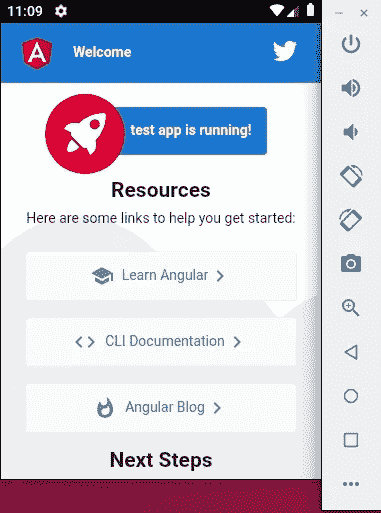

# 使用您现有的 Angular web 项目创建一个移动应用程序(使用 Cordova)

> 原文：<https://medium.com/analytics-vidhya/create-a-mobile-app-using-your-existing-angular-web-project-using-cordova-9c10d377d527?source=collection_archive---------1----------------------->

这将是使用 Cordova 将 angular 项目转换为 android 应用程序的一步一步的指南(这个过程与创建 IOS 应用程序非常相似)。


在开始转换我们的应用程序之前，我们需要安装 Cordova、Java SDK、Apache Ant、Gradle 和 Android SDK 来运行我们的 Android 应用程序。如果您已经完成了所有必需的设置，您可以跳过这一部分。

**注意:**你不需要在每个命令前都输入' $ '，它表示你必须在你的终端中输入命令。

**安装科尔多瓦:**

1.  你将需要 NPM(节点包管理器)来安装科尔多瓦包。

```
$ sudo apt-get update
$ sudo apt-get install curl
$ curl -sL https://deb.nodesource.com/setup_12.x | sudo -E bash -
$ sudo apt-get install nodejs
$ nodejs -v
$ sudo apt-get install npm
$ npm -v
```

2.您还需要 GIT，因为 Cordova 在幕后使用它。

```
$ sudo apt-get install git
$ git --version
```

3.安装 Cordova

```
$ sudo npm install -g cordova
$ cordova --version
```

**安装 Java SDK:**

你需要 Java 8(Java 的 LTS 版本)来运行最新版本的 Android SDK。

```
$ sudo apt-get install openjdk-8-jdk
$ java -version
```

**安装 Ant:**

从这里下载 Apache Ant zip 文件:[**ant.apache.org/bindownload.cgi**](http://ant.apache.org/bindownload.cgi)**然后在你的 home 目录下做一个“Ant”文件夹，把下载的 zip 文件解压到那里。**

****安装梯度:****

**科尔多瓦在幕后使用阿帕奇蚂蚁和格雷尔。您可以通过输入以下命令简单地安装 Gradle**

```
$ sudo apt-get install gradle
```

****安装 Android SDK:****

**进入 Android Studio 网站:[**https://developer.android.com/studio**](https://developer.android.com/studio)向下滚动直到你看到“命令行工具”，然后下载适合你的操作系统的 zip 文件。在您的主目录中创建一个文件夹“android ”,并在那里解压缩 zip 文件。**

****添加所有需要的环境路径:****

**安装完所有的东西后，你需要在。bashrc 文件，以便您的应用程序可以在整个系统中访问所需的文件。**

1.  **打开。bashrc 文件**

```
$ sudo gedit ~/.bashrc
```

**2.然后在您的。bashrc 文件。这些路径可能会有所不同，这取决于您在哪里安装了所需的东西以及您已经安装的版本。因此，请确保将正确的路径放入安装目录。**

```
export JAVA_HOME=/usr/lib/jvm/java-8-openjdk-amd64
export PATH=$PATH:/usr/lib/jvm/java-8-openjdk-amd64/binexport ANT_HOME=~/ant/apache-ant-1.10.7
export PATH=$PATH:~/ant/apache-ant-1.10.7/binexport ANDROID_SDK_ROOT=~/android/sdk-tools-linux
export PATH=$PATH:~/android/android-sdk-linux/tools/bin
```

**3.添加路径后，保存并退出。bashrc 文件。在您注销并重新登录到系统后，这些更改将会可见，或者您可以输入以下命令:**

```
$ source ~/.bashrc
```

****创建新的 AVD (Android 虚拟设备)来运行我们的应用:****

1.  **查看所有包**

```
$ sdkmanager --list
```

**2.更新已安装的软件包**

```
$ sdkmanager --update
```

**3.安装构建 Cordova 应用程序所需的构建工具**

```
$ sdkmanager "build-tools;29.0.0"
```

**4.从可用软件包列表中添加您选择的任何系统映像**

```
$ sdkmanager "system-images;android-28;google_apis_playstore;x86_64"
```

**5.创建 Android 模拟器**

```
$ avdmanager create avd -n test -k "system-images;android-28;google_apis_playstore;x86_64" -g "google_apis_playstore"
```

**6.列出创建的模拟器**

```
$ avdmanager list avd
```

**所有设置完成后，我们终于准备好开始将我们的角度应用程序转换为 Cordova 应用程序。如果你没有一个现有的 Angular 应用程序，去创建一个(你可以参考这个:[](https://angular.io/docs)**)****

1.  ****导航到您的 Angular 项目。例如，我将使用一个新创建的角度项目。****

********

****角度项目示例****

****2.使用创建一个新的 Cordova 项目****

```
**$ cordova create test com.example.test NewTest**
```

****3.向 Cordova 项目添加平台。你可以添加一个 IOS 平台，黑莓也一样。****

```
**$ cd test
$ cordova platform add android**
```

****4.现在我们需要将 Cordova 项目合并到 Angular 项目中，所以将 Cordova 项目中除了“package.json”和“package-lock.json”之外的所有文件夹和文件复制到 Angular 项目中。****

****5.然后还需要合并两个项目的 package.json，Angular 项目中最终的 package.json 应该是这样的。****

********

****Angular 项目:package.json****

********

****Angular 项目:package.json****

****6.然后打开“src/index.html”文件，将改为****

****7.然后打开“angular.json”文件，将“outputPath”改为“www”。因此，无论何时构建 Angular 应用程序，输出都将在“www”文件夹中生成。这是必要的，因为 Cordova 将使用“www”文件夹中的文件生成其输出。****

****8.然后打开“tsconfig.json”文件，将“target”改为“es5”。那么你的应用程序也可以在新版本的 Android 上运行。****

****9.最后，您可以构建您的 Angular 项目，然后使用 Cordova 将输出转换为移动应用程序。****

```
**$ ng build --prod --aot
$ cordova emulate android**
```

****10.当您输入上述命令时，会弹出一个模拟器，上面安装了您可以测试的应用程序。****

********

****抽样输出****

******恭喜**，您已经成功创建了您的第一个 Cordova 应用程序。既然你已经完成了这个长教程，我写了一个额外的部分，将帮助你调试一些常见的问题，并用 Cordova 插件定制你的应用程序。如果你有任何疑问，可以在评论区提问。****

******向您的 Cordova 应用添加插件******

1.  ****使用 Cordova 插件，您可以访问移动设备的原生功能，如手机摄像头、地理定位等。你可以在这里 **查看 Cordova 文档 [**上的各种可用插件。**](https://cordova.apache.org/docs/en/latest/reference/cordova-plugin-device/index.html)******
2.  **要在 Cordova 应用程序中添加插件，您需要在“src/index.html”中 body 的结束标记之前添加以下代码行**

```
<script type="text/javascript" src="cordova.js"></script>
```

**3.如果你想添加设备插件，那么你将首先安装它**

```
$ cordova plugin add cordova-plugin-device
```

**4.然后你声明它并使用文档中提到的插件**

```
declare var device;
...
ngOnInit() {
    document.addEventListener(“deviceready”, function() {
        alert(device.platform);
    }, false);
}
```

****通过 Chrome DevTools 调试 Cordova 应用****

**如果你在某个地方卡住了，你不知道为什么这个程序不能在模拟器上运行。你可以打开 chrome 并在地址栏中输入“chrome://inspect ”,这将打开一个页面，然后在“Devices”部分你可以看到你的模拟器被列出。你可以点击“inspect ”,像使用 web 应用程序一样正常调试。**

****

**Chrome 开发工具**

****移动应用无法连接到本地服务器****

**如果你的机器上有一个本地服务器运行在“本地主机”上，并且你试图从你的应用程序连接到它，那么你将无法连接。当你点击应用程序中的“本地主机”时，它会尝试连接到自己的“本地主机”,但找不到任何在那里运行的服务器。因此，要解决这个问题，您需要在您的私有 IP 地址上运行服务器，您可以在您的终端中键入“ifconfig”(windows 的“ipconfig”)找到该地址。然后，当你从你的应用程序点击私有 IP 地址，它将能够连接到服务器。**

****手机应用无法连接到远程服务器****

**如果你试图连接到某个地方的远程服务器，而你的应用程序给出了“ERR_CLEARTEXT_NOT_PERMITTED”错误，那么把下面的内容放到你的“config.xml”文件中。**

1.  **在小部件标记内，添加以下内容**

```
 xmlns:android="http://schemas.android.com/apk/res/android" xmlns:cdv="http://cordova.apache.org/ns/1.0"
```

**2.(Android 的)平台标签内**

```
<platform name="android">
  <edit-config file="app/src/main/AndroidManifest.xml" mode="merge" target="/manifest/application">
    <application android:usesCleartextTraffic="true" />
  </edit-config>
</platform>
```

****由于最小 SDK 版本**出现错误**

**将它添加到您的“config.xml”文件中，并将该值更改为所需的最小值。**

```
<preference name="android-minSdkVersion" value="19" />
```