# 创建网络拓扑设置，使系统 A 可以 ping 通两个系统系统 B 和系统 C，但这两个系统在不使用任何安全规则(如防火墙等)的情况下不应 ping 通彼此！！

> 原文：<https://medium.com/analytics-vidhya/create-a-network-topology-setup-in-such-a-way-so-that-system-a-can-ping-to-two-systems-system-b-b9b73765ad07?source=collection_archive---------20----------------------->

***机器 A、B、C*** 所有这些都借助于**开关** ( *在 VirtualBox 的情况下，我们只能在网络设置*中使用主机，该设置声明所有它们的 ***网络名称都是相同的*** ，您可以通过下面给出的图片中的 IP 细节来证明这一点，其中提到了 **IP v4、IP v6、网络掩码和广播 IP。**

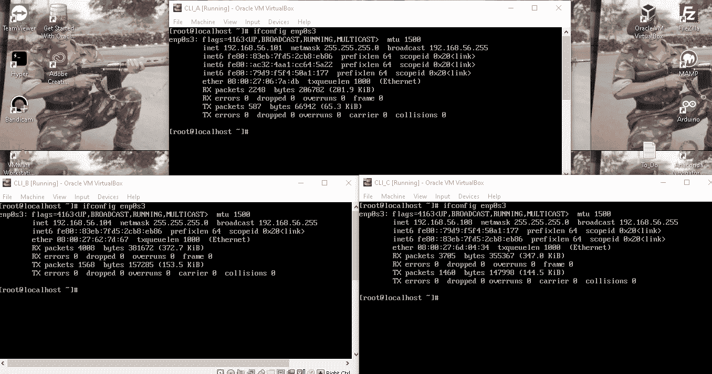

网络细节

现在，我将向您展示一个演示，以证明机器 A、机器 B 和机器 C 最初是相互 ping 通的…

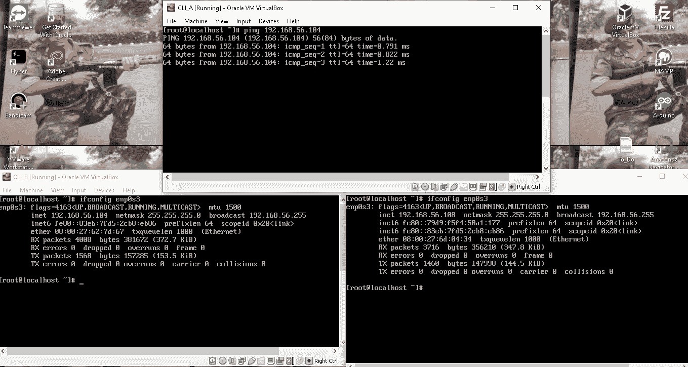

ping A 到 B

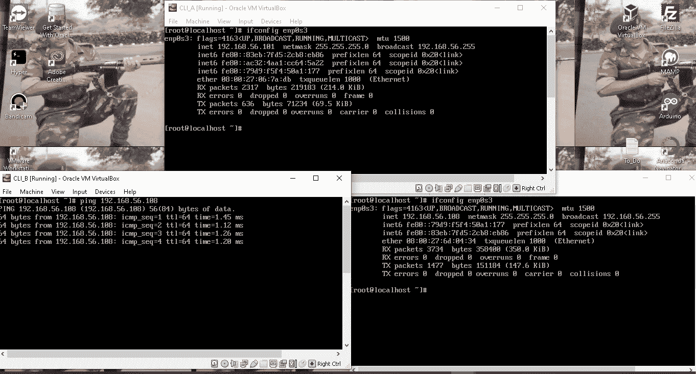

ping B 到 C

现在，我将根据给定的问题陈述设置网络拓扑。

根据问题陈述，我们将不使用防火墙，因此我们将使用**路由表**。

现在我要改变*B 机和 C 机*的路由表规则。

现在让我们以这样一种方式来进行机器 B 的配置，我将给出 **netmask /30(这意味着 255.255.255.252 ),目的地是 192.168.56.100(这是一个起始 IP ),网络接口卡是 enp0s3。**

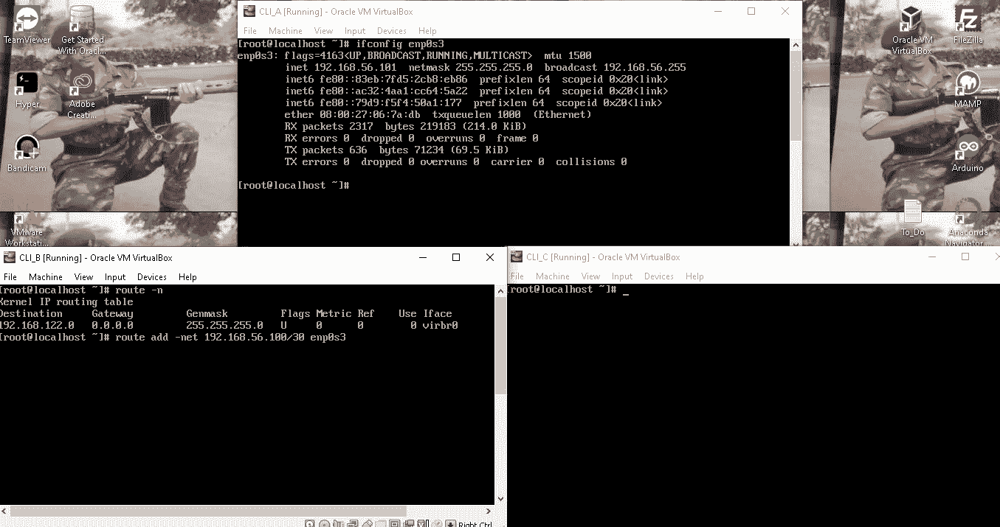

通过命令更改 CLI-B 中的路由规则

现在，我将让您了解我在路由表中所做的更改。可以看出**目的 IP(起始 IP)是 192.168.56.100，网络掩码是 30(即 255.255.255.252**

→在此范围内，只有四个 IP 会出现

1>.192.168.56.100 是一个**起始 IP**

2>.192.168.56.104 是一个**广播 IP** ，从 **192.168.56.101 到 192.168.56.103** 我们将能够 **ping** 。

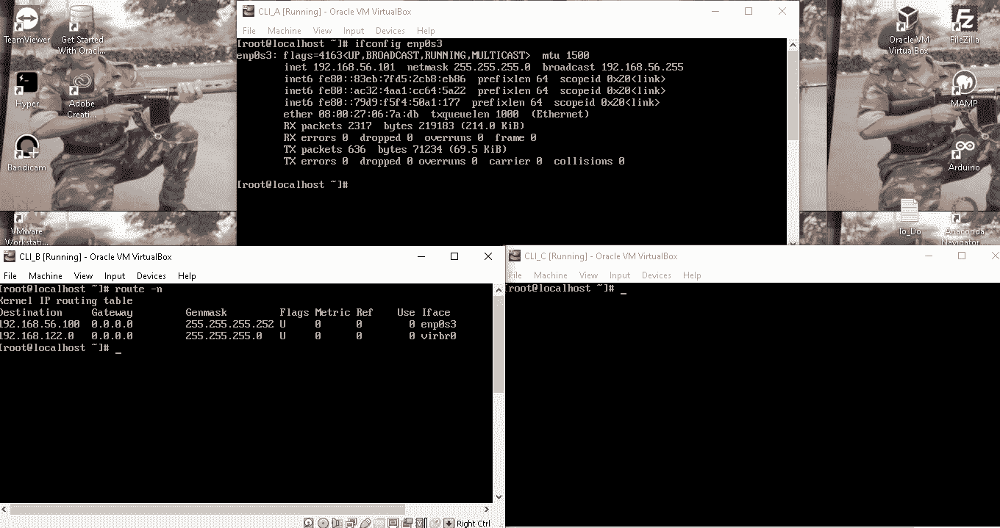

新路由表

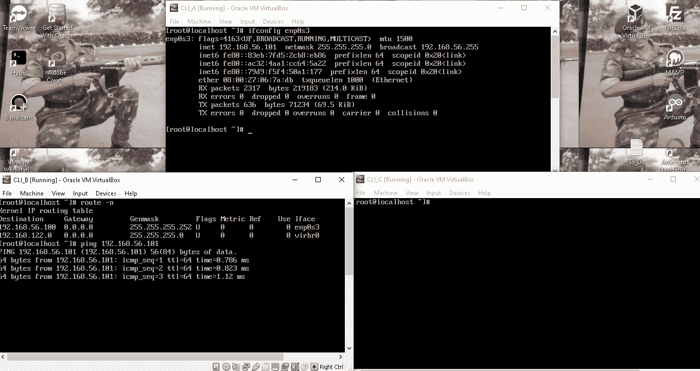

从 B ping A(属于路由表的范围)

我在机器 B 的设置中所做的上述更改，同样我将在**机器 C** 中进行。

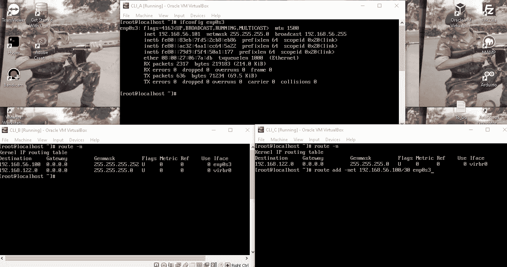

在 C 中更改路由表规则

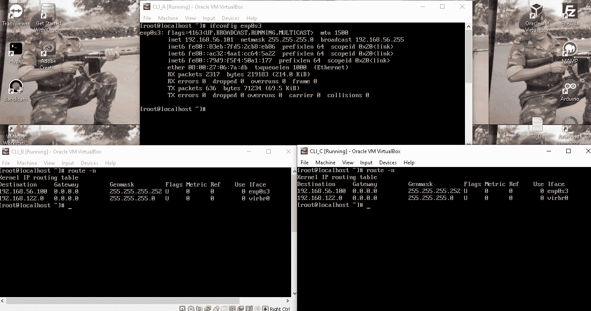

C 语言的新路由表规则

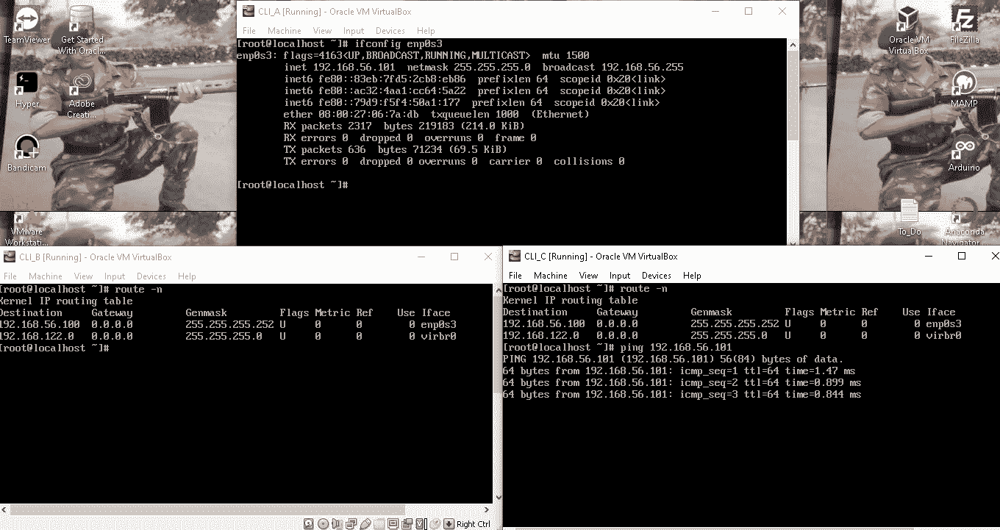

从 C ping 到 A

我们知道**机 A 192.168.56.100** 的 IP 属于这个**新路由表规则范围只有**但是**机 B** 的 IP( **192.168.56.104** )和**机 C** 的 IP( **192.168.56.108** )是哪个**出来的**

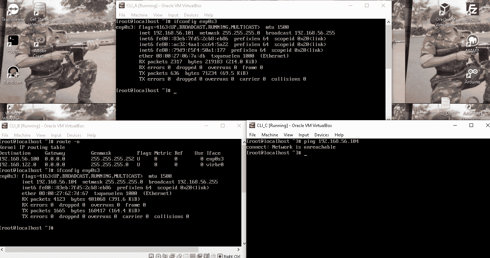

甚至不能创建针对 B 的 IP 的分组

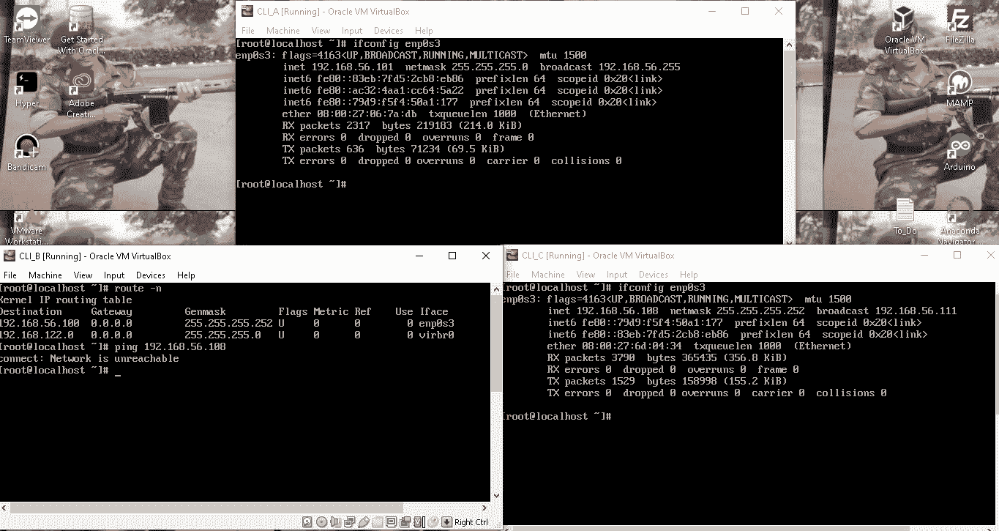

无法创建从 IP B 到 IP C 的数据包

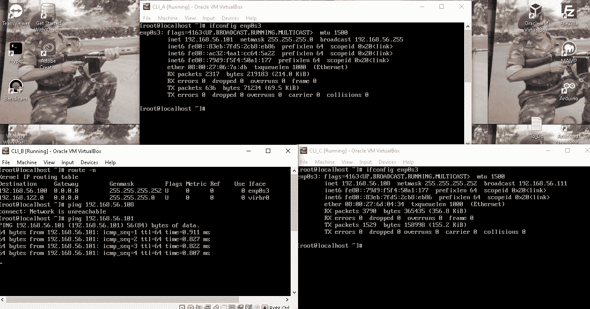

但是能够 ping 通 IP C