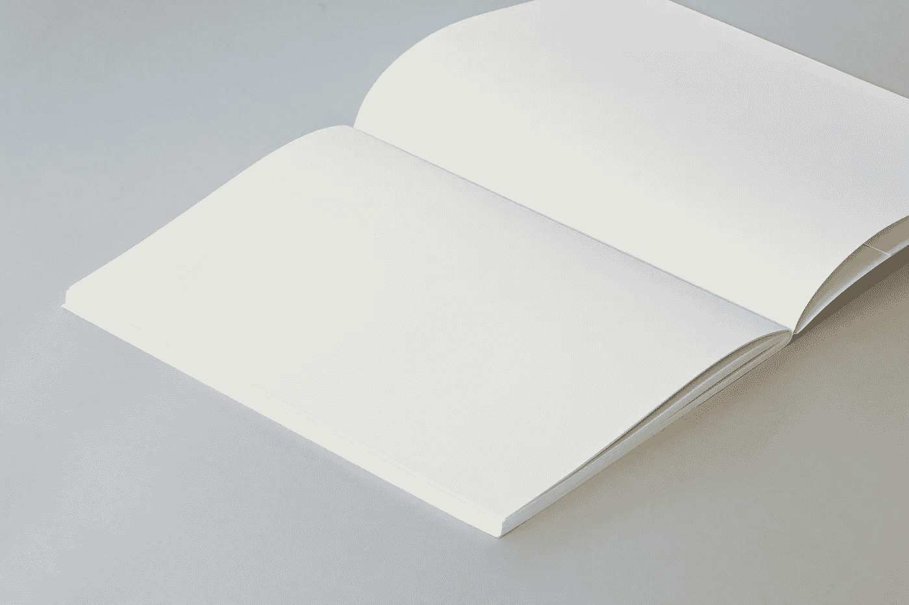

# 用 Python 创建记事本

> 原文：<https://medium.com/analytics-vidhya/create-a-notepad-with-python-d16098dc2de9?source=collection_archive---------7----------------------->

## 只用了 3 行代码

Brando 在 [Unsplash](https://unsplash.com/s/photos/notebook?utm_source=unsplash&utm_medium=referral&utm_content=creditCopyText) 上制作品牌

你怀疑自己用 Python 构建现实世界项目的能力吗？

以下是你不应该这样做的原因，即使是初学者。

Python 是一种语言，当你以正确的方式使用你的语言知识来构建项目时，你很快就会得到你投入的努力的结果。这种语言的美妙之处在于你不需要…