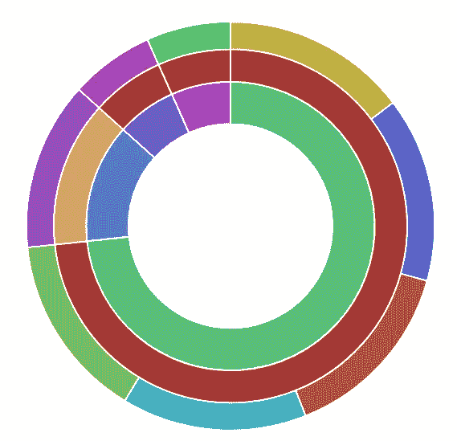

# 在基巴纳创建饼图

> 原文：<https://medium.com/analytics-vidhya/create-a-pie-chart-in-kibana-2a8e7092f800?source=collection_archive---------20----------------------->


在这篇博客中，我将解释如何在 Kibana 中创建一个饼图来显示通过 Filebeat 捕获的 Apache2 日志数据。因此，基本上我将绘制饼图来显示多个字段值，如响应代码、HTTP 方法和发送的总字节数。

我们将创建一个简单的饼图，显示多维数据，并为每个字段创建存储桶。我们将使用以下 Filebeat 数据结构来创建饼图:

```
{
  "_index": "filebeat-6.5.2-2018.12.13",
  "_type": "doc",
  "_id": "-Z9Ap2cBI_XuAVP8QgYj",
  "_version": 1,
  "_score": null,
  "_source": {
    "offset": 2508,
    "apache2": {
      "access": {
        "referrer": "http://localhost/test/admin.php?username=root&db=mysite",
        "response_code": "200",
        "remote_ip": "127.0.0.1",
        "method": "GET",
        "user_name": "-",
        "http_version": "1.1",
        "body_sent": {
          "bytes": "4180"
        },
        "url": "/test/admin.php?username=root&db=mysite&script=db",
        "user_agent": {
          "original": "Mozilla/5.0 (X11; Ubuntu; Linux x86_64; rv:63.0) Gecko/20100101 Firefox/63.0",
          "major": "63",
          "minor": "0",
          "os": "Ubuntu",
          "name": "Firefox",
          "os_name": "Ubuntu",
          "device": "Other"
        }
      }
    },
    "prospector": {
      "type": "log"
    },
    "read_timestamp": "2018-12-13T10:56:32.756Z",
    "source": "/var/log/apache2/access.log",
    "fileset": {
      "module": "apache2",
      "name": "access"
    },
    "input": {
      "type": "log"
    },
    "@timestamp": "2018-12-13T08:03:29.000Z",
    "beat": {
      "hostname": "DLILPTP0305",
      "name": "DLILPTP0305",
      "version": "6.5.2"
    },
    "host": {
      "name": "DLILPTP0305"
    }
  },
  "fields": {
    "@timestamp": [
      "2018-12-13T08:03:29.000Z"
    ]
  },
  "highlight": {
    "apache2.access.method": [
      "@kibana-highlighted-field@GET@/kibana-highlighted-field@"
    ]
  },
  "sort": [
    1544688209000
  ]
}
```

filebeat 索引的上述文档显示了 Apache 日志数据的指标。因此，我将使用该文档中的字段来创建饼图。我们需要执行以下操作来创建图表:

*   点击左侧菜单中的可视化链接。这将打开保存可视化链接。
*   单击加号图标创建新的可视化效果。
*   从选择可视化类型屏幕中，单击饼图框。这将打开一个屏幕来选择索引或保存的搜索对象。
*   如果您有 Filebeat 索引，请单击 Filebeat，或者选择您自己的索引模式。
*   选择“度量”选项下的计数。
*   在桶选项下，选择聚合术语，并在字段选项下选择 Apache 的 response_code 字段。
*   根据字段名添加自定义标签。
*   现在，单击“添加子桶”按钮，添加更多要聚合的字段。
*   为聚合添加 HTTP 方法和发送的总字节数字段。
*   添加完所有这些字段后，单击配置面板上的“应用更改”按钮图标。

这将加载可视化，如下面的屏幕截图所示。



我们可以单击可视化的任何部分来深入查看图表，这样我们就可以使用可视化获得所需的数据集。例如，如果我们只想查看响应代码为 302 的 POST 请求，我们可以直接点击这些部分来过滤图表。

*如果你觉得这篇文章很有趣，那么你可以探索一下“* [***【掌握基巴纳 6.0***](https://www.amazon.com/Mastering-Kibana-6-x-Visualize-histograms/dp/1788831039/ref=olp_product_details?_encoding=UTF8&me=) *”、* [***基巴纳 7 快速入门指南***](https://www.amazon.com/Kibana-Quick-Start-Guide-Elasticsearch/dp/1789804035) *”、* [***学习基巴纳 7***](https://www.amazon.com/Learning-Kibana-dashboards-visualization-capabilities-ebook/dp/B07V4SQR6T) *”和* [***弹性搜索***](https://www.amazon.com/gp/product/1789803322?pf_rd_p=2d1ab404-3b11-4c97-b3db-48081e145e35)

如果您有任何疑问，请留下您的评论。如果你喜欢这个博客，请鼓掌并分享。你也可以在推特上关注我:[https://twitter.com/anu4udilse](https://twitter.com/anu4udilse)

BookAuthority 6 有史以来最好的弹性堆栈书籍
1- [***掌握基巴纳 6.0***](https://www.amazon.com/Mastering-Kibana-6-x-Visualize-histograms/dp/1788831039/ref=olp_product_details?_encoding=UTF8&me=) 【阿努拉格·斯里瓦斯塔瓦】
3- [***基巴纳 7 快速入门指南***](https://www.amazon.com/Kibana-Quick-Start-Guide-Elasticsearch/dp/1789804035) 【阿努拉格·斯里瓦斯塔瓦】
5- [***学习基巴纳 7***](https://www.amazon.com/Learning-Kibana-dashboards-visualization-capabilities-ebook/dp/B07V4SQR6T) (阿努拉格·斯里瓦斯塔瓦

*原载于*[*https://bqstack.com*](https://bqstack.com/b/detail/93/Create-a-Pie-Chart-in-Kibana)*。*